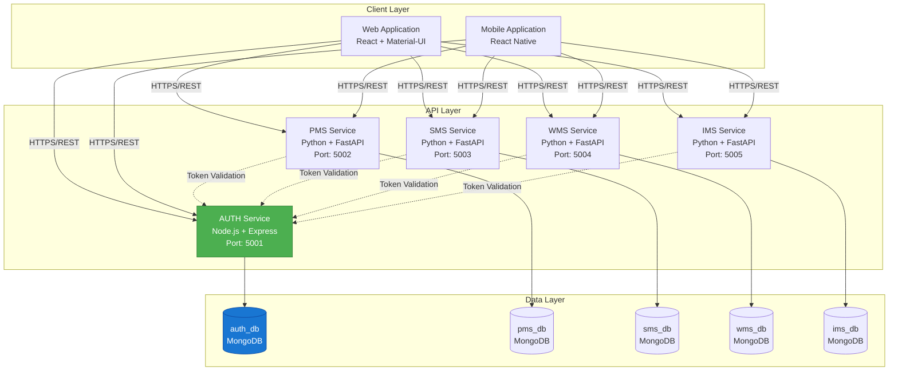
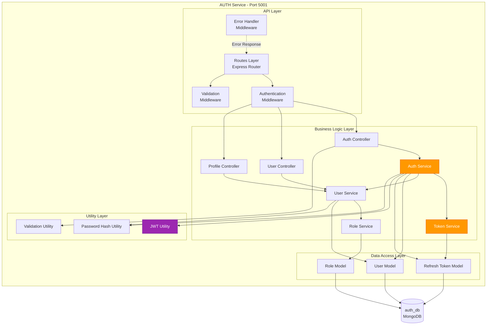
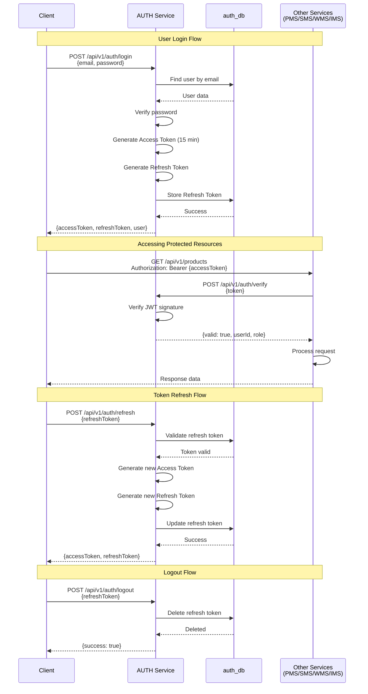
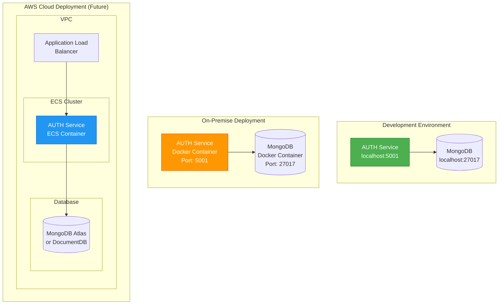
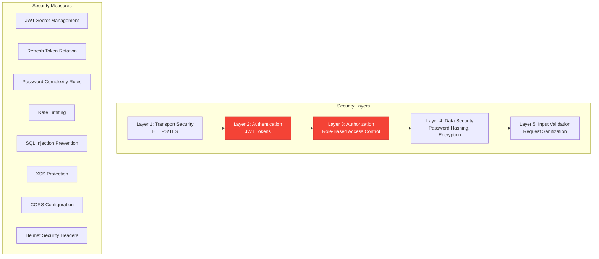
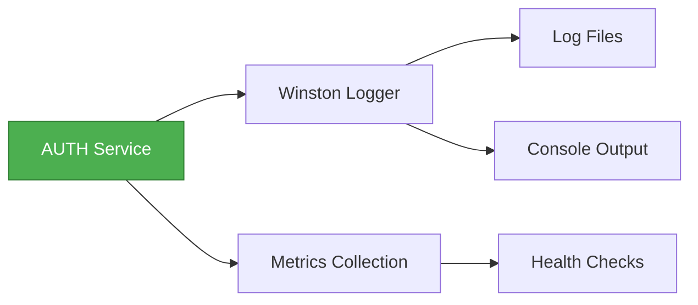
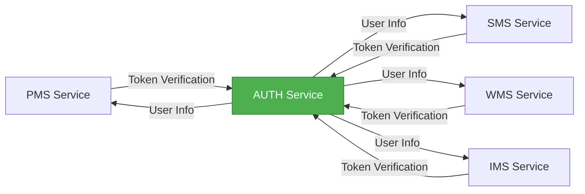

# AUTH Service - Architecture Diagram

## Document Information
- **Project**: WLAN Corporation - Warehouse & Inventory Management System
- **Module**: Authentication & User Profile Management (AUTH)
- **Version**: 1.0
- **Date**: January 7, 2026
- **Prepared For**: WLAN Corporation, Bengaluru

---

## 1. Overview

The AUTH service is a Node.js-based microservice responsible for user authentication, authorization, and profile management. It implements JWT-based authentication with access and refresh token mechanisms, providing secure access control for all other microservices in the system.

---

## 2. High-Level System Architecture



---

## 3. AUTH Service Architecture



---

## 4. Component Responsibilities

### 4.1 API Layer

| Component | Responsibility |
|-----------|---------------|
| **Routes Layer** | Define API endpoints and map to controllers |
| **Authentication Middleware** | Verify JWT tokens, extract user info, protect routes |
| **Validation Middleware** | Validate request body/params using schemas |
| **Error Handler Middleware** | Centralized error handling and response formatting |

### 4.2 Business Logic Layer

| Component | Responsibility |
|-----------|---------------|
| **Auth Controller** | Handle authentication requests (login, logout, refresh, verify) |
| **User Controller** | Handle user CRUD operations |
| **Profile Controller** | Handle user profile operations |
| **Auth Service** | Core authentication logic, token generation, password verification |
| **User Service** | User management business logic |
| **Token Service** | Refresh token management (create, validate, revoke) |
| **Role Service** | Role and permission management |

### 4.3 Data Access Layer

| Component | Responsibility |
|-----------|---------------|
| **User Model** | User schema and database operations |
| **Refresh Token Model** | Refresh token schema and operations |
| **Role Model** | Role schema and operations |

### 4.4 Utility Layer

| Component | Responsibility |
|-----------|---------------|
| **JWT Utility** | Generate, verify, decode JWT tokens |
| **Password Hash Utility** | Hash passwords using bcrypt, compare hashes |
| **Validation Utility** | Reusable validation functions |

---

## 5. Authentication Flow Architecture



---

## 6. Deployment Architecture



---

## 7. Technology Stack

| Layer | Technology | Version | Purpose |
|-------|-----------|---------|---------|
| **Runtime** | Node.js | 18+ LTS | JavaScript runtime |
| **Framework** | Express.js | 4.x | Web framework |
| **Database** | MongoDB | 6.x | NoSQL database |
| **ODM** | Mongoose | 8.x | MongoDB object modeling |
| **Authentication** | jsonwebtoken | 9.x | JWT generation/verification |
| **Password Hashing** | bcryptjs | 2.x | Password encryption |
| **Validation** | Joi | 17.x | Request validation |
| **Environment** | dotenv | 16.x | Environment variables |
| **CORS** | cors | 2.x | Cross-origin resource sharing |
| **Logging** | winston | 3.x | Application logging |
| **API Documentation** | swagger-ui-express | 5.x | OpenAPI documentation |

---

## 8. Security Architecture



---

## 9. Scalability Considerations

### 9.1 Horizontal Scaling
- Stateless service design allows multiple instances
- JWT tokens eliminate server-side session storage
- Load balancer distributes requests across instances

### 9.2 Database Scaling
- MongoDB replica sets for high availability
- Read replicas for read-heavy operations
- Indexing on frequently queried fields (email, userId)

### 9.3 Caching Strategy
- Redis cache for frequently accessed user profiles (future enhancement)
- Token blacklist for logout functionality (if needed)

---

## 10. Monitoring & Logging



### Key Metrics to Monitor
- Request rate and response time
- Authentication success/failure rate
- Token generation/validation rate
- Database query performance
- Error rates by endpoint

---

## 11. API Versioning Strategy

All AUTH endpoints follow the pattern: `/api/v1/auth/*` and `/api/v1/users/*`

Future versions will use `/api/v2/...` while maintaining backward compatibility.

---

## 12. Environment Configuration

The service uses environment variables for configuration:

```
NODE_ENV=development
PORT=5001
MONGODB_URI=mongodb://localhost:27017/auth_db
JWT_ACCESS_SECRET=<secure-random-string>
JWT_REFRESH_SECRET=<secure-random-string>
JWT_ACCESS_EXPIRY=15m
JWT_REFRESH_EXPIRY=7d
CORS_ORIGIN=http://localhost:3000
```

---

## 13. Inter-Service Communication



**Token Verification Endpoint**: `POST /api/v1/auth/verify`

Other services call this endpoint to validate JWT tokens before processing requests.

---

## Document End
**Next Document**: [2-ER-Diagram.md](./2-ER-Diagram.md)  
**Module Progress**: AUTH Documentation (1/6 documents)  
**Overall Progress**: 1/30 documents (3.3%)
