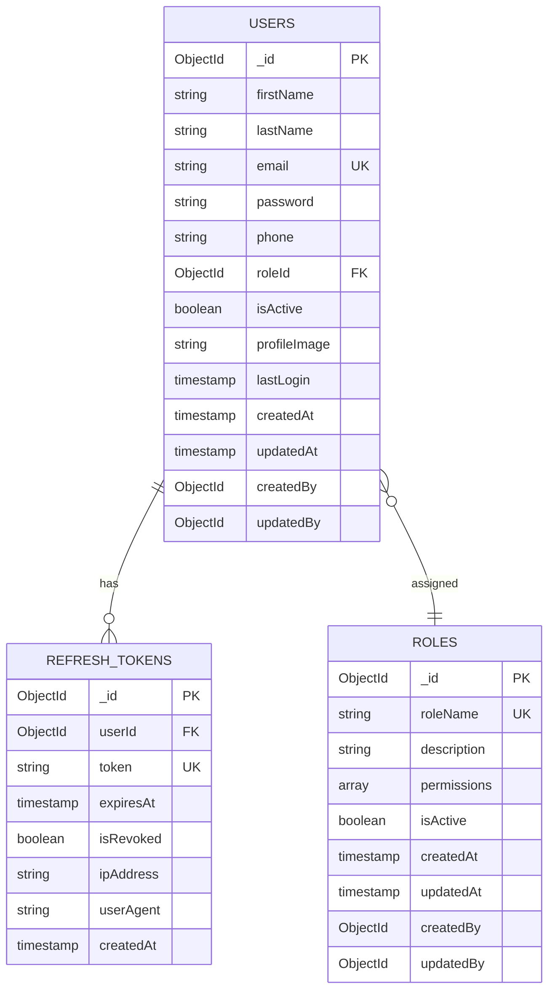
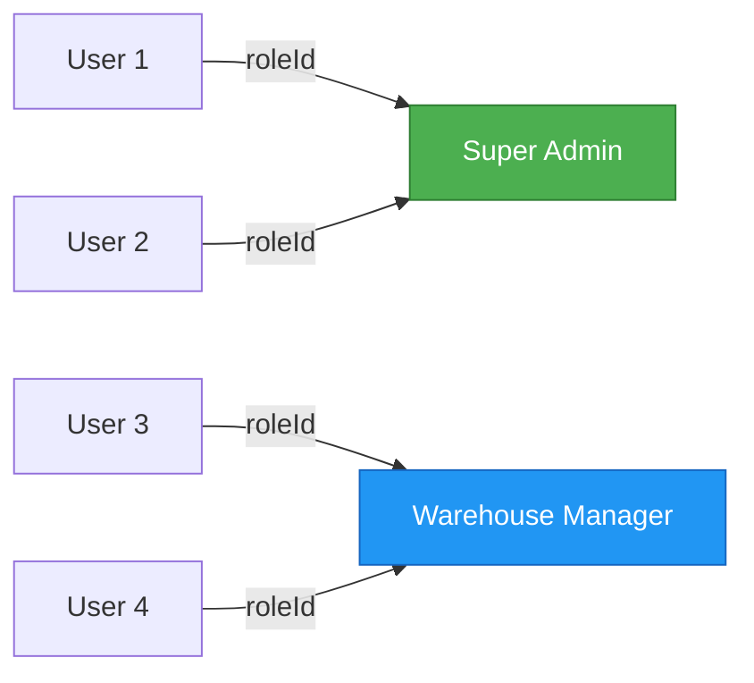
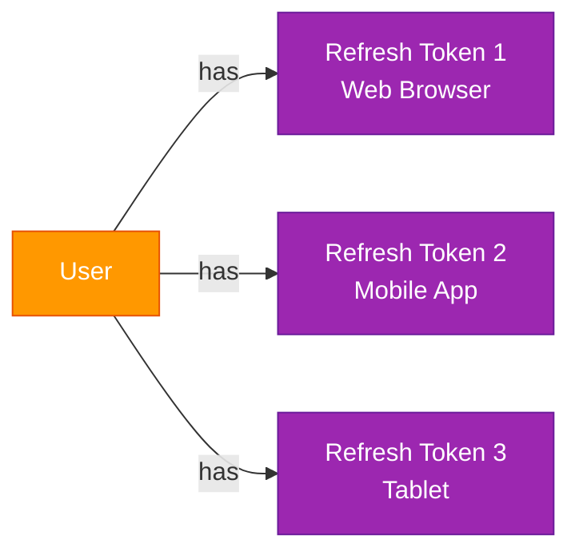
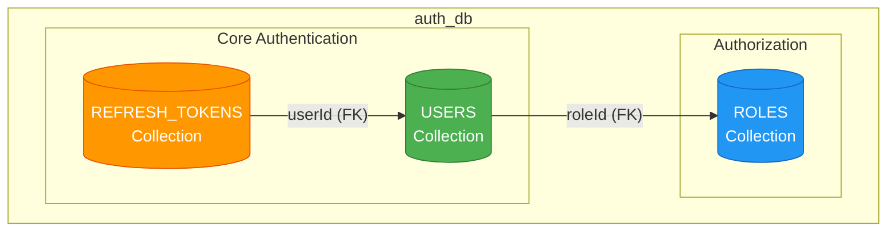
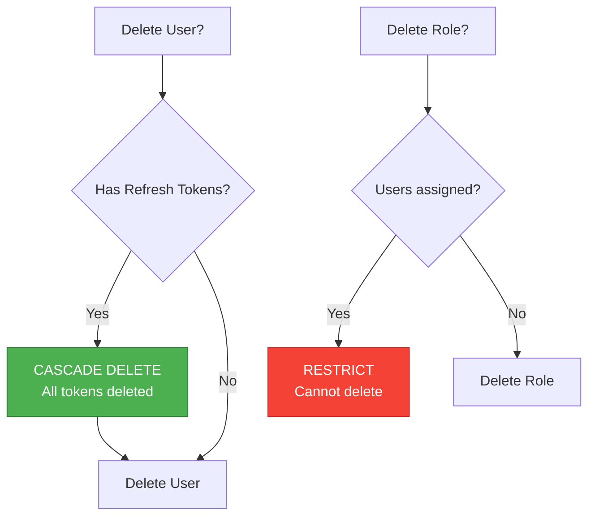
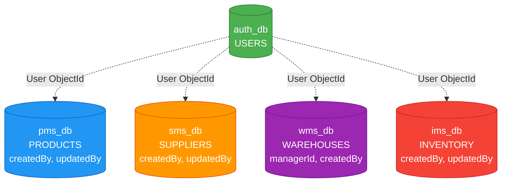

# AUTH Service - ER Diagram

## Document Information
- **Project**: WLAN Corporation - Warehouse & Inventory Management System
- **Module**: Authentication & User Profile Management (AUTH)
- **Version**: 1.0
- **Date**: January 7, 2026
- **Prepared For**: WLAN Corporation, Bengaluru

---

## 1. Overview

This document describes the Entity-Relationship (ER) model for the AUTH service database. The auth_db contains three primary collections: Users, Refresh Tokens, and Roles.

---

## 2. Entity-Relationship Diagram



---

## 3. Detailed Entity Descriptions

### 3.1 USERS Collection

**Purpose**: Store user account information and authentication credentials.

| Field | Type | Constraints | Description |
|-------|------|-------------|-------------|
| `_id` | ObjectId | Primary Key, Auto-generated | Unique user identifier |
| `firstName` | String | Required, Min: 2, Max: 50 | User's first name |
| `lastName` | String | Required, Min: 2, Max: 50 | User's last name |
| `email` | String | Required, Unique, Email format | User's email address (used for login) |
| `password` | String | Required, Hashed (bcrypt) | Encrypted password |
| `phone` | String | Optional, Pattern: /^\+?[1-9]\d{9,14}$/ | Contact phone number |
| `roleId` | ObjectId | Required, Foreign Key → ROLES._id | User's assigned role |
| `isActive` | Boolean | Required, Default: true | Account active status |
| `profileImage` | String | Optional, URL format | Profile picture URL |
| `lastLogin` | Timestamp | Optional | Last successful login timestamp |
| `createdAt` | Timestamp | Auto-generated | Record creation timestamp |
| `updatedAt` | Timestamp | Auto-updated | Last modification timestamp |
| `createdBy` | ObjectId | Optional, Foreign Key → USERS._id | User who created this record |
| `updatedBy` | ObjectId | Optional, Foreign Key → USERS._id | User who last updated this record |

**Indexes**:
- `email`: Unique index for fast lookup during login
- `roleId`: Index for filtering users by role
- `isActive`: Index for filtering active users

---

### 3.2 ROLES Collection

**Purpose**: Define user roles and their associated permissions.

| Field | Type | Constraints | Description |
|-------|------|-------------|-------------|
| `_id` | ObjectId | Primary Key, Auto-generated | Unique role identifier |
| `roleName` | String | Required, Unique, Enum | Role name (Super Admin, Warehouse Manager, etc.) |
| `description` | String | Optional, Max: 500 | Role description |
| `permissions` | Array[String] | Required, Default: [] | List of permission codes |
| `isActive` | Boolean | Required, Default: true | Role active status |
| `createdAt` | Timestamp | Auto-generated | Record creation timestamp |
| `updatedAt` | Timestamp | Auto-updated | Last modification timestamp |
| `createdBy` | ObjectId | Optional, Foreign Key → USERS._id | User who created this role |
| `updatedBy` | ObjectId | Optional, Foreign Key → USERS._id | User who last updated this role |

**Role Name Enum Values**:
- `Super Admin`
- `Warehouse Manager`
- `Inventory Manager`
- `Procurement Officer`
- `Warehouse Staff`
- `Product Manager`
- `Auditor/Viewer`

**Sample Permissions Array**:
```json
[
  "users.read",
  "users.create",
  "users.update",
  "users.delete",
  "products.read",
  "products.create",
  "inventory.read",
  "inventory.update"
]
```

**Indexes**:
- `roleName`: Unique index
- `isActive`: Index for filtering active roles

---

### 3.3 REFRESH_TOKENS Collection

**Purpose**: Store refresh tokens for JWT authentication.

| Field | Type | Constraints | Description |
|-------|------|-------------|-------------|
| `_id` | ObjectId | Primary Key, Auto-generated | Unique token identifier |
| `userId` | ObjectId | Required, Foreign Key → USERS._id | Associated user |
| `token` | String | Required, Unique | Refresh token string (hashed) |
| `expiresAt` | Timestamp | Required | Token expiration timestamp |
| `isRevoked` | Boolean | Required, Default: false | Token revocation status |
| `ipAddress` | String | Optional | IP address from which token was issued |
| `userAgent` | String | Optional, Max: 500 | Browser/device user agent |
| `createdAt` | Timestamp | Auto-generated | Token creation timestamp |

**Indexes**:
- `token`: Unique index for fast token lookup
- `userId`: Index for finding all tokens by user
- `expiresAt`: TTL index for auto-deletion of expired tokens
- `isRevoked`: Index for filtering active tokens

**TTL Index Configuration**:
```javascript
db.refresh_tokens.createIndex({ "expiresAt": 1 }, { expireAfterSeconds: 0 })
```
This automatically deletes expired tokens from the database.

---

## 4. Relationship Details

### 4.1 USERS ↔ ROLES (Many-to-One)



- **Cardinality**: Many Users → One Role
- **Foreign Key**: `USERS.roleId` references `ROLES._id`
- **Constraint**: roleId is required; users must have a role
- **On Delete**: Restrict (cannot delete role if users are assigned)

---

### 4.2 USERS ↔ REFRESH_TOKENS (One-to-Many)



- **Cardinality**: One User → Many Refresh Tokens
- **Foreign Key**: `REFRESH_TOKENS.userId` references `USERS._id`
- **Constraint**: userId is required
- **Use Case**: Users can have multiple active sessions (web, mobile, etc.)
- **On Delete**: Cascade (delete all tokens when user is deleted)

---

## 5. Database Schema Visualization



---

## 6. Sample Data Models

### 6.1 Sample User Document

```json
{
  "_id": "65a1b2c3d4e5f6g7h8i9j0k1",
  "firstName": "Ramkumar",
  "lastName": "Singh",
  "email": "ramkumar@vlancorp.com",
  "password": "$2a$10$N9qo8uLOickgx2ZMRZoMye.IjzKq1z6V1n7QHQF9QY5qk8Zc8gJ4S",
  "phone": "+919876543210",
  "roleId": "65a1b2c3d4e5f6g7h8i9j0k2",
  "isActive": true,
  "profileImage": "https://storage.example.com/profiles/ramkumar.jpg",
  "lastLogin": "2026-01-07T10:30:00.000Z",
  "createdAt": "2026-01-01T00:00:00.000Z",
  "updatedAt": "2026-01-07T10:30:00.000Z",
  "createdBy": null,
  "updatedBy": "65a1b2c3d4e5f6g7h8i9j0k1"
}
```

---

### 6.2 Sample Role Document

```json
{
  "_id": "65a1b2c3d4e5f6g7h8i9j0k2",
  "roleName": "Super Admin",
  "description": "Full system access with all permissions",
  "permissions": [
    "users.read",
    "users.create",
    "users.update",
    "users.delete",
    "roles.read",
    "roles.create",
    "roles.update",
    "roles.delete",
    "products.read",
    "products.create",
    "products.update",
    "products.delete",
    "suppliers.read",
    "suppliers.create",
    "suppliers.update",
    "suppliers.delete",
    "warehouses.read",
    "warehouses.create",
    "warehouses.update",
    "warehouses.delete",
    "inventory.read",
    "inventory.create",
    "inventory.update",
    "inventory.delete",
    "reports.read",
    "reports.export"
  ],
  "isActive": true,
  "createdAt": "2026-01-01T00:00:00.000Z",
  "updatedAt": "2026-01-01T00:00:00.000Z",
  "createdBy": null,
  "updatedBy": null
}
```

---

### 6.3 Sample Refresh Token Document

```json
{
  "_id": "65a1b2c3d4e5f6g7h8i9j0k3",
  "userId": "65a1b2c3d4e5f6g7h8i9j0k1",
  "token": "$2a$10$hKkLXwJKJH.kJHKJhkjhKJHkjhKJHKJhkjhKJHKJhkjhKJHKJhkj",
  "expiresAt": "2026-01-14T10:30:00.000Z",
  "isRevoked": false,
  "ipAddress": "192.168.1.100",
  "userAgent": "Mozilla/5.0 (Windows NT 10.0; Win64; x64) AppleWebKit/537.36",
  "createdAt": "2026-01-07T10:30:00.000Z"
}
```

---

## 7. Data Integrity Rules

### 7.1 Validation Rules

| Collection | Field | Validation |
|------------|-------|------------|
| USERS | email | Must be unique, valid email format |
| USERS | password | Minimum 8 characters, must contain uppercase, lowercase, number, special char |
| USERS | phone | Optional but must match international format if provided |
| USERS | roleId | Must reference existing role |
| ROLES | roleName | Must be unique, one of predefined enum values |
| REFRESH_TOKENS | token | Must be unique, hashed before storage |
| REFRESH_TOKENS | expiresAt | Must be future date |

---

### 7.2 Referential Integrity



---

## 8. Default Roles Seed Data

The system should be seeded with the following default roles:

| Role Name | Description | Default Permissions |
|-----------|-------------|---------------------|
| **Super Admin** | Full system access | All permissions (*.read, *.create, *.update, *.delete) |
| **Warehouse Manager** | Manage specific warehouse | warehouses.read, inventory.read, inventory.update, reports.read |
| **Inventory Manager** | Manage stock across warehouses | inventory.*, products.read, warehouses.read, reports.read |
| **Procurement Officer** | Manage suppliers and orders | suppliers.*, products.read, inventory.read, reports.read |
| **Warehouse Staff** | Basic warehouse operations | inventory.read, inventory.update, products.read |
| **Product Manager** | Manage product catalog | products.*, categories.*, reports.read |
| **Auditor/Viewer** | Read-only access | *.read, reports.read, reports.export |

---

## 9. Compound Indexes

For optimized query performance:

```javascript
// Users collection
db.users.createIndex({ email: 1 }, { unique: true })
db.users.createIndex({ roleId: 1 })
db.users.createIndex({ isActive: 1, roleId: 1 })

// Roles collection
db.roles.createIndex({ roleName: 1 }, { unique: true })
db.roles.createIndex({ isActive: 1 })

// Refresh Tokens collection
db.refresh_tokens.createIndex({ token: 1 }, { unique: true })
db.refresh_tokens.createIndex({ userId: 1 })
db.refresh_tokens.createIndex({ userId: 1, isRevoked: 1 })
db.refresh_tokens.createIndex({ expiresAt: 1 }, { expireAfterSeconds: 0 })
```

---

## 10. Cross-Service References



**Note**: Other services store User ObjectIds for audit trail (createdBy, updatedBy, managerId), but these are **not enforced foreign keys** due to microservice independence. Validation happens at application level.

---

## Document End
**Previous Document**: [1-Architecture-Diagram.md](./1-Architecture-Diagram.md)  
**Next Document**: [3-User-Stories-Use-Cases.md](./3-User-Stories-Use-Cases.md)  
**Module Progress**: AUTH Documentation (2/6 documents)  
**Overall Progress**: 2/30 documents (6.7%)
