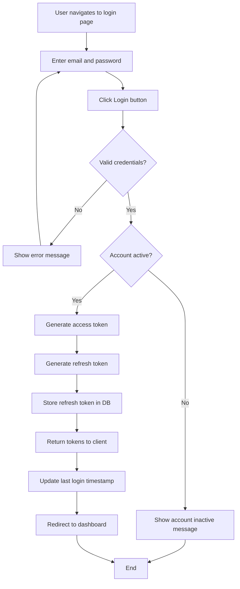
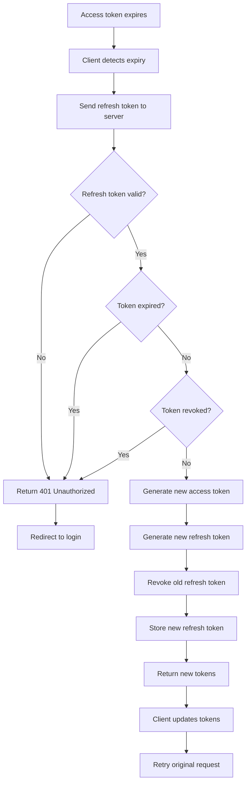
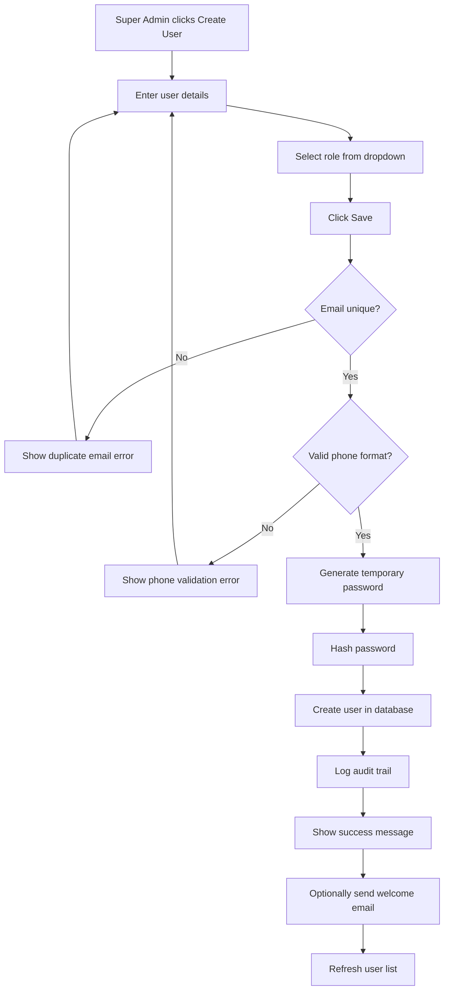
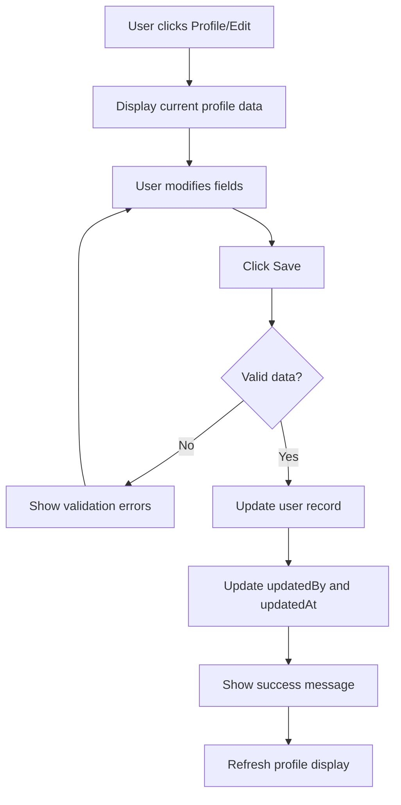
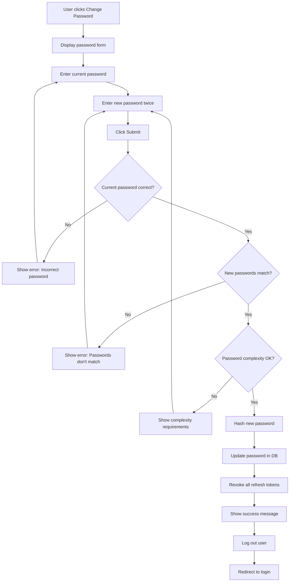
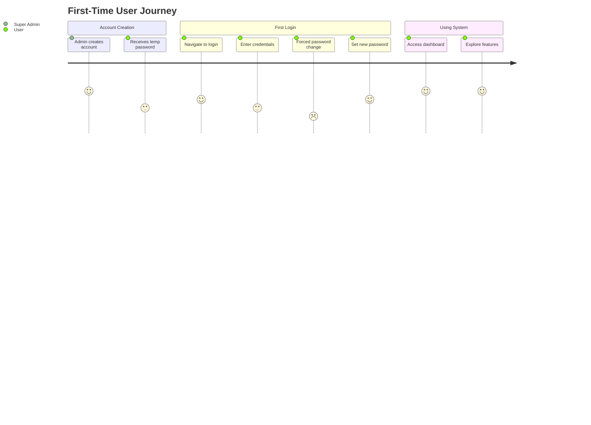
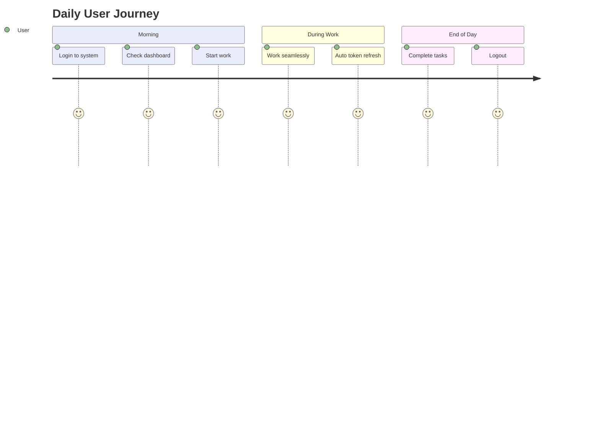

# AUTH Service - User Stories & Use Cases

## Document Information
- **Project**: WLAN Corporation - Warehouse & Inventory Management System
- **Module**: Authentication & User Profile Management (AUTH)
- **Version**: 1.0
- **Date**: January 7, 2026
- **Prepared For**: WLAN Corporation, Bengaluru

---

## 1. Overview

This document outlines user stories and detailed use cases for the Authentication and User Profile Management (AUTH) service. It covers authentication workflows, user management, role management, and profile operations.

---

## 2. User Roles

| Role | Abbreviation | Primary Responsibilities |
|------|--------------|-------------------------|
| Super Admin | SA | Complete system administration and configuration |
| Warehouse Manager | WM | Warehouse-specific operations and staff management |
| Inventory Manager | IM | Stock management across all warehouses |
| Procurement Officer | PO | Supplier and procurement management |
| Warehouse Staff | WS | Day-to-day warehouse operations |
| Product Manager | PM | Product catalog management |
| Auditor/Viewer | AV | Read-only access for auditing and reporting |

---

## 3. Epic 1: Authentication

### 3.1 User Story: User Login

**As a** registered user  
**I want to** log in with my email and password  
**So that** I can access the system securely

**Acceptance Criteria**:
- User can enter email and password
- System validates credentials
- On success, user receives access token and refresh token
- User is redirected to dashboard based on role
- Invalid credentials show appropriate error message
- Account locked message shown for inactive accounts

**Priority**: HIGH  
**Story Points**: 5

---

### 3.2 User Story: User Logout

**As a** logged-in user  
**I want to** log out of the system  
**So that** my session is terminated securely

**Acceptance Criteria**:
- User can click logout button
- System invalidates refresh token
- Access token is cleared from client
- User is redirected to login page
- Session cannot be resumed with old tokens

**Priority**: HIGH  
**Story Points**: 2

---

### 3.3 User Story: Token Refresh

**As a** logged-in user  
**I want to** my session to be automatically refreshed  
**So that** I don't get logged out during active usage

**Acceptance Criteria**:
- System automatically refreshes access token before expiry
- New access token issued using valid refresh token
- Old refresh token is rotated with new one
- User experience is seamless without re-login
- Expired refresh token requires re-login

**Priority**: HIGH  
**Story Points**: 5

---

### 3.4 User Story: Token Verification

**As a** system service  
**I want to** verify user tokens  
**So that** I can authenticate API requests

**Acceptance Criteria**:
- Services can validate JWT tokens via API
- System returns user ID, role, and permissions
- Invalid tokens return appropriate error
- Expired tokens are rejected
- Token signature is verified

**Priority**: HIGH  
**Story Points**: 3

---

### 3.5 User Story: Password Reset Request

**As a** user who forgot password  
**I want to** request a password reset  
**So that** I can regain access to my account

**Acceptance Criteria**:
- User can enter email address
- System sends reset link via email (future: email service)
- Link is valid for limited time (1 hour)
- Invalid email shows generic message (security)
- Multiple requests don't spam user

**Priority**: MEDIUM  
**Story Points**: 5

---

### 3.6 User Story: Password Reset

**As a** user with reset link  
**I want to** set a new password  
**So that** I can access my account

**Acceptance Criteria**:
- User can enter new password via reset link
- Password meets complexity requirements
- Old password cannot be reused immediately
- Reset link becomes invalid after use
- Expired links show appropriate message
- All existing sessions are terminated

**Priority**: MEDIUM  
**Story Points**: 5

---

## 4. Epic 2: User Management

### 4.1 User Story: Create User Account

**As a** Super Admin  
**I want to** create new user accounts  
**So that** new employees can access the system

**Acceptance Criteria**:
- Super Admin can enter user details (name, email, phone, role)
- System generates temporary password
- Email must be unique
- Role must be selected from available roles
- User account is created as active by default
- Temporary password is sent to user (future: email service)
- Audit trail captures who created the user

**Priority**: HIGH  
**Story Points**: 5

---

### 4.2 User Story: View All Users

**As a** Super Admin  
**I want to** view list of all users  
**So that** I can manage user accounts

**Acceptance Criteria**:
- Super Admin can see paginated list of users
- List shows name, email, role, status
- Can filter by role and status (active/inactive)
- Can search by name or email
- Can sort by name, email, creation date

**Priority**: HIGH  
**Story Points**: 3

---

### 4.3 User Story: Update User Details

**As a** Super Admin  
**I want to** update user information  
**So that** I can keep user records current

**Acceptance Criteria**:
- Super Admin can edit user details (name, phone, role)
- Email cannot be changed (security)
- Role changes are reflected immediately
- Audit trail captures who updated the user
- User is notified of role changes (future: notification)

**Priority**: HIGH  
**Story Points**: 3

---

### 4.4 User Story: Deactivate User Account

**As a** Super Admin  
**I want to** deactivate user accounts  
**So that** former employees cannot access the system

**Acceptance Criteria**:
- Super Admin can deactivate user account
- Deactivated users cannot log in
- Existing sessions are terminated
- All refresh tokens are revoked
- User can be reactivated later
- Audit trail captures deactivation

**Priority**: HIGH  
**Story Points**: 3

---

### 4.5 User Story: Delete User Account

**As a** Super Admin  
**I want to** permanently delete user accounts  
**So that** I can remove unnecessary data

**Acceptance Criteria**:
- Super Admin can delete user account
- Confirmation required before deletion
- Cannot delete if user has created critical records
- All refresh tokens are deleted
- Audit records in other services retain user ID (soft reference)
- Action is logged in system audit log

**Priority**: LOW  
**Story Points**: 5

---

## 5. Epic 3: Profile Management

### 5.1 User Story: View My Profile

**As a** logged-in user  
**I want to** view my profile information  
**So that** I can verify my details

**Acceptance Criteria**:
- User can view their name, email, phone, role
- Profile shows last login timestamp
- Profile shows account creation date
- Role and permissions are displayed

**Priority**: MEDIUM  
**Story Points**: 2

---

### 5.2 User Story: Update My Profile

**As a** logged-in user  
**I want to** update my profile information  
**So that** I can keep my details current

**Acceptance Criteria**:
- User can update first name, last name, phone
- User can upload profile image
- Email cannot be changed
- Phone number is validated
- Changes are saved immediately
- Success message is shown

**Priority**: MEDIUM  
**Story Points**: 3

---

### 5.3 User Story: Change Password

**As a** logged-in user  
**I want to** change my password  
**So that** I can maintain account security

**Acceptance Criteria**:
- User must enter current password
- User enters new password twice (confirmation)
- New password meets complexity requirements
- Current password must be correct
- All other sessions are logged out
- Success message is shown

**Priority**: MEDIUM  
**Story Points**: 3

---

### 5.4 User Story: Upload Profile Picture

**As a** logged-in user  
**I want to** upload a profile picture  
**So that** my account is personalized

**Acceptance Criteria**:
- User can upload image file (JPG, PNG)
- Image size limited to 2MB
- Image is resized to standard dimensions
- Old image is replaced
- Image is stored securely
- Profile picture appears in navigation

**Priority**: LOW  
**Story Points**: 5

---

## 6. Epic 4: Role Management

### 6.1 User Story: Create Role

**As a** Super Admin  
**I want to** create new roles  
**So that** I can define custom access levels

**Acceptance Criteria**:
- Super Admin can enter role name and description
- Can select permissions from available list
- Role name must be unique
- Role is created as active
- Audit trail captures creation

**Priority**: MEDIUM  
**Story Points**: 5

---

### 6.2 User Story: View All Roles

**As a** Super Admin  
**I want to** view all available roles  
**So that** I can manage role definitions

**Acceptance Criteria**:
- Super Admin can see list of all roles
- List shows role name, description, status
- Can view assigned permissions
- Can filter by status (active/inactive)

**Priority**: MEDIUM  
**Story Points**: 2

---

### 6.3 User Story: Update Role Permissions

**As a** Super Admin  
**I want to** modify role permissions  
**So that** I can adjust access levels as needed

**Acceptance Criteria**:
- Super Admin can add/remove permissions
- Changes apply to all users with that role
- Cannot modify default system roles (protection)
- Audit trail captures changes
- Users are notified of permission changes (future)

**Priority**: MEDIUM  
**Story Points**: 3

---

### 6.4 User Story: Deactivate Role

**As a** Super Admin  
**I want to** deactivate roles  
**So that** they cannot be assigned to new users

**Acceptance Criteria**:
- Super Admin can deactivate role
- Cannot deactivate if users are currently assigned
- Inactive roles don't appear in user creation dropdown
- Can be reactivated later
- System default roles cannot be deactivated

**Priority**: LOW  
**Story Points**: 3

---

## 7. Detailed Use Cases

### 7.1 Use Case: UC-AUTH-001 - User Login

**Actors**: User (any role)

**Preconditions**:
- User has valid account
- User is not already logged in

**Main Flow**:
1. User navigates to login page
2. System displays login form
3. User enters email and password
4. User clicks "Login" button
5. System validates email format
6. System retrieves user by email
7. System verifies password hash
8. System checks if account is active
9. System generates JWT access token (15 min expiry)
10. System generates refresh token (7 day expiry)
11. System stores refresh token in database
12. System updates last login timestamp
13. System returns tokens and user info to client
14. Client stores tokens
15. Client redirects user to dashboard

**Alternate Flows**:

**A1: Invalid Email Format**
- At step 5, if email format is invalid
- System shows validation error
- Returns to step 3

**A2: User Not Found**
- At step 6, if email doesn't exist
- System shows "Invalid credentials" error (security: don't reveal if email exists)
- Returns to step 3

**A3: Invalid Password**
- At step 7, if password doesn't match
- System shows "Invalid credentials" error
- Returns to step 3

**A4: Account Inactive**
- At step 8, if account is inactive
- System shows "Account is inactive. Contact administrator"
- End use case

**Postconditions**:
- User is authenticated
- Tokens are issued and stored
- Last login timestamp is updated
- User is on dashboard

---

### 7.2 Use Case: UC-AUTH-002 - Token Refresh

**Actors**: System (automated), User (passive)

**Preconditions**:
- User was previously logged in
- Access token has expired or is about to expire
- Refresh token is stored in client

**Main Flow**:
1. Client detects access token expiry (or proactively before expiry)
2. Client sends refresh token to `/api/v1/auth/refresh` endpoint
3. System retrieves refresh token from database
4. System validates token signature
5. System checks token expiry
6. System checks if token is revoked
7. System retrieves associated user
8. System generates new access token
9. System generates new refresh token
10. System revokes old refresh token in database
11. System stores new refresh token
12. System returns new tokens to client
13. Client updates stored tokens
14. Client retries original API request with new access token

**Alternate Flows**:

**A1: Refresh Token Not Found**
- At step 3, token not found in database
- System returns 401 Unauthorized
- Client redirects to login page

**A2: Refresh Token Expired**
- At step 5, token is past expiry date
- System returns 401 Unauthorized
- Client redirects to login page

**A3: Refresh Token Revoked**
- At step 6, token is marked as revoked
- System returns 401 Unauthorized
- Client redirects to login page

**A4: User Account Inactive**
- After step 7, if user account is inactive
- System returns 403 Forbidden
- Client redirects to login page

**Postconditions**:
- New access token and refresh token are issued
- Old refresh token is invalidated
- User session continues seamlessly

---

### 7.3 Use Case: UC-AUTH-003 - Create User

**Actors**: Super Admin

**Preconditions**:
- User is logged in as Super Admin
- At least one role exists in system

**Main Flow**:
1. Super Admin navigates to Users page
2. Super Admin clicks "Create User" button
3. System displays user creation form
4. Super Admin enters:
   - First Name
   - Last Name
   - Email
   - Phone (optional)
   - Selects Role from dropdown
5. Super Admin clicks "Save" button
6. System validates all required fields
7. System checks email uniqueness
8. System validates phone format (if provided)
9. System generates temporary password (random 12 characters)
10. System hashes password using bcrypt
11. System creates user record in database
12. System sets isActive = true
13. System records createdBy = current admin's ID
14. System logs creation in audit trail
15. System shows success message
16. System displays temporary password to admin (to share with user)
17. System refreshes user list
18. (Future) System sends welcome email to user

**Alternate Flows**:

**A1: Email Already Exists**
- At step 7, email is not unique
- System shows "Email already in use" error
- Returns to step 4

**A2: Invalid Phone Format**
- At step 8, phone doesn't match pattern
- System shows "Invalid phone number format" error
- Returns to step 4

**A3: Role Not Found**
- At step 11, selected role doesn't exist
- System shows "Invalid role selected" error
- Returns to step 4

**Postconditions**:
- New user account is created
- User can log in with temporary password
- Audit trail records creation
- Admin receives temporary password

---

### 7.4 Use Case: UC-AUTH-004 - Update User Profile

**Actors**: Any logged-in user

**Preconditions**:
- User is logged in

**Main Flow**:
1. User clicks on profile icon/name
2. User selects "Edit Profile"
3. System displays profile form with current data:
   - First Name (editable)
   - Last Name (editable)
   - Email (read-only)
   - Phone (editable)
   - Profile Picture (editable)
4. User modifies desired fields
5. User clicks "Save" button
6. System validates input data
7. System updates user record in database
8. System sets updatedBy = user's own ID
9. System sets updatedAt = current timestamp
10. System shows success message
11. System refreshes profile display with updated data

**Alternate Flows**:

**A1: Invalid Phone Number**
- At step 6, phone format is invalid
- System shows validation error
- Returns to step 4

**A2: No Changes Made**
- At step 6, no fields were modified
- System shows "No changes to save" message
- Returns to step 3

**Postconditions**:
- User profile is updated
- Changes are immediately visible
- Audit trail records update

---

### 7.5 Use Case: UC-AUTH-005 - Change Password

**Actors**: Any logged-in user

**Preconditions**:
- User is logged in
- User knows current password

**Main Flow**:
1. User navigates to profile settings
2. User clicks "Change Password"
3. System displays password change form
4. User enters current password
5. User enters new password
6. User re-enters new password (confirmation)
7. User clicks "Submit" button
8. System verifies current password
9. System validates new password matches confirmation
10. System checks password complexity:
    - Minimum 8 characters
    - At least one uppercase letter
    - At least one lowercase letter
    - At least one number
    - At least one special character
11. System hashes new password using bcrypt
12. System updates password in user record
13. System revokes all existing refresh tokens for user
14. System shows success message
15. System logs out user from current session
16. System redirects to login page

**Alternate Flows**:

**A1: Current Password Incorrect**
- At step 8, password verification fails
- System shows "Current password is incorrect"
- Returns to step 4

**A2: New Passwords Don't Match**
- At step 9, passwords don't match
- System shows "Passwords do not match"
- Returns to step 5

**A3: Weak Password**
- At step 10, complexity check fails
- System shows specific requirements not met
- Returns to step 5

**Postconditions**:
- User password is changed
- All sessions are terminated
- User must log in again with new password

---

## 8. Non-Functional Requirements

### 8.1 Security Requirements

| ID | Requirement | Priority |
|----|-------------|----------|
| NFR-SEC-001 | Passwords must be hashed using bcrypt with salt rounds ≥ 10 | HIGH |
| NFR-SEC-002 | JWT tokens must use RS256 or HS256 algorithm | HIGH |
| NFR-SEC-003 | Access tokens expire in 15 minutes | HIGH |
| NFR-SEC-004 | Refresh tokens expire in 7 days | HIGH |
| NFR-SEC-005 | All API calls must use HTTPS in production | HIGH |
| NFR-SEC-006 | Rate limiting: max 5 login attempts per minute per IP | MEDIUM |
| NFR-SEC-007 | Account locked for 15 minutes after 5 failed login attempts | MEDIUM |

---

### 8.2 Performance Requirements

| ID | Requirement | Priority |
|----|-------------|----------|
| NFR-PERF-001 | Login API response time < 500ms | HIGH |
| NFR-PERF-002 | Token verification response time < 100ms | HIGH |
| NFR-PERF-003 | Support 100 concurrent login requests | MEDIUM |
| NFR-PERF-004 | Database queries should use indexed fields | HIGH |

---

### 8.3 Usability Requirements

| ID | Requirement | Priority |
|----|-------------|----------|
| NFR-USE-001 | Clear error messages for authentication failures | HIGH |
| NFR-USE-002 | Password strength indicator in UI | MEDIUM |
| NFR-USE-003 | Auto-focus on email field on login page | LOW |
| NFR-USE-004 | Remember me functionality (30-day session) | LOW |

---

## 9. User Journey Maps

### 9.1 First-Time User Journey

---

### 9.2 Daily User Journey

---

## Document End
**Previous Document**: [2-ER-Diagram.md](./2-ER-Diagram.md)  
**Next Document**: [4-API-Endpoint-Specifications.md](./4-API-Endpoint-Specifications.md)  
**Module Progress**: AUTH Documentation (3/6 documents)  
**Overall Progress**: 3/30 documents (10.0%)
