# AUTH Service - Authentication Flow Diagrams

## Document Information
- **Project**: WLAN Corporation - Warehouse & Inventory Management System
- **Module**: Authentication & User Profile Management (AUTH)
- **Version**: 1.0
- **Date**: January 7, 2026
- **Prepared For**: WLAN Corporation, Bengaluru

---

## 1. Overview

This document provides detailed flow diagrams for all authentication and authorization processes in the AUTH service. These diagrams illustrate the complete request-response lifecycle, decision points, and error handling paths.

---

## 2. User Login Flow

### 2.1 Complete Login Process

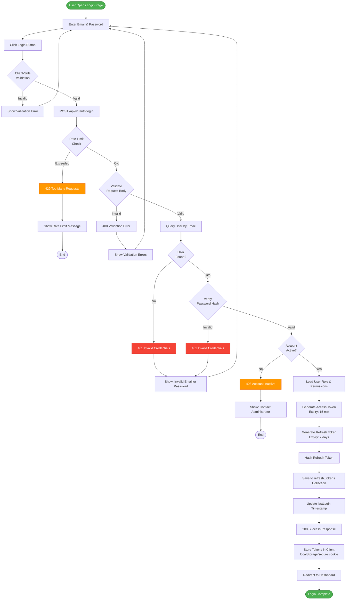

### 2.2 Login Sequence Diagram

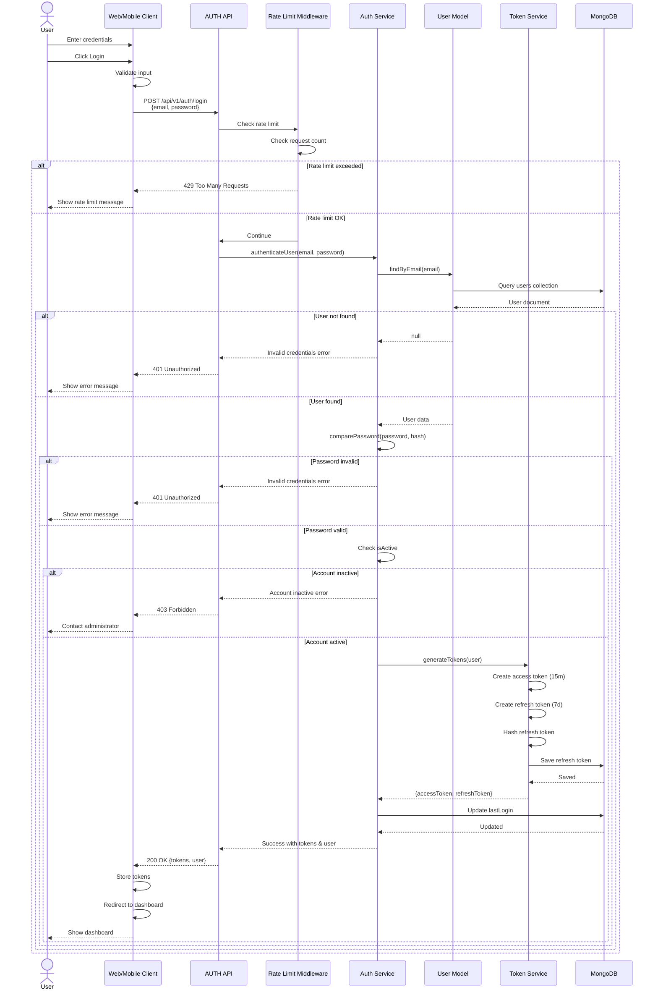

---

## 3. Token Refresh Flow

### 3.1 Token Refresh Process

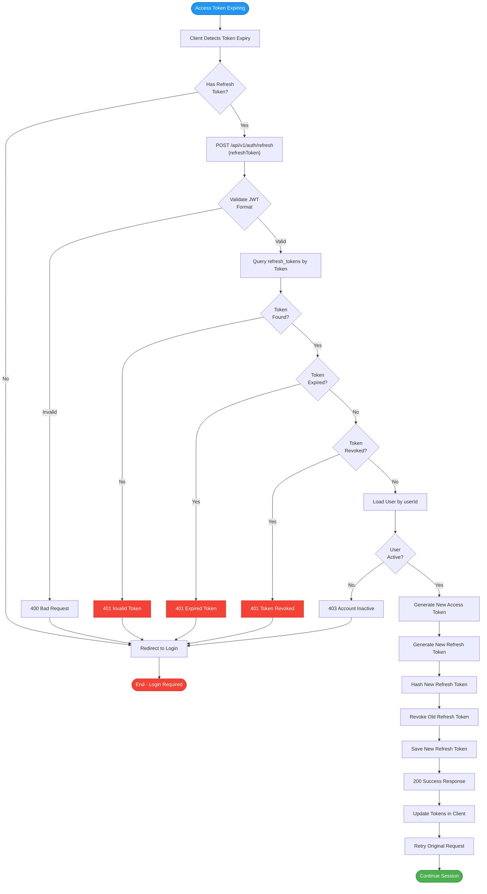

### 3.2 Token Refresh Sequence

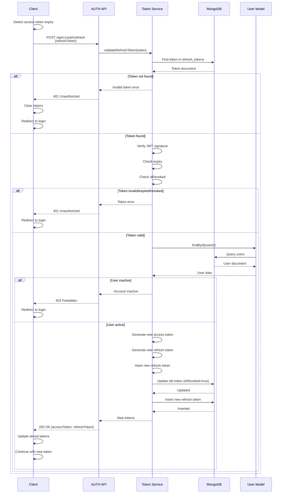

---

## 4. User Logout Flow

### 4.1 Logout Process

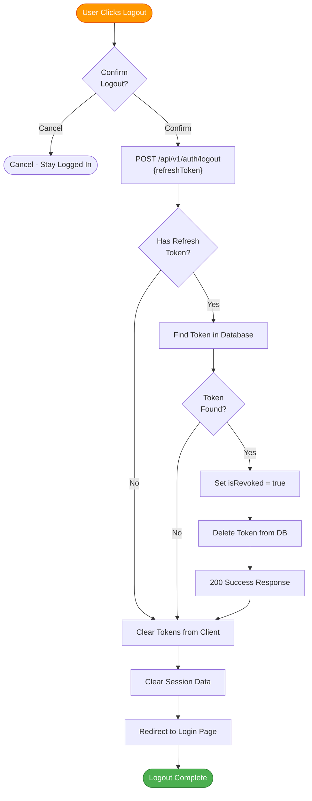

### 4.2 Logout Sequence

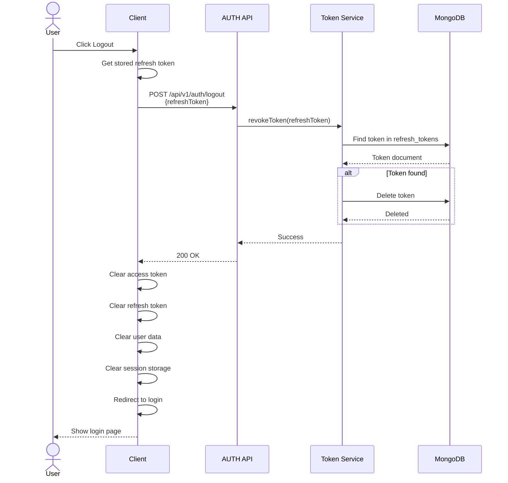

---

## 5. Token Verification Flow (Inter-Service)

### 5.1 Token Verification for Other Services

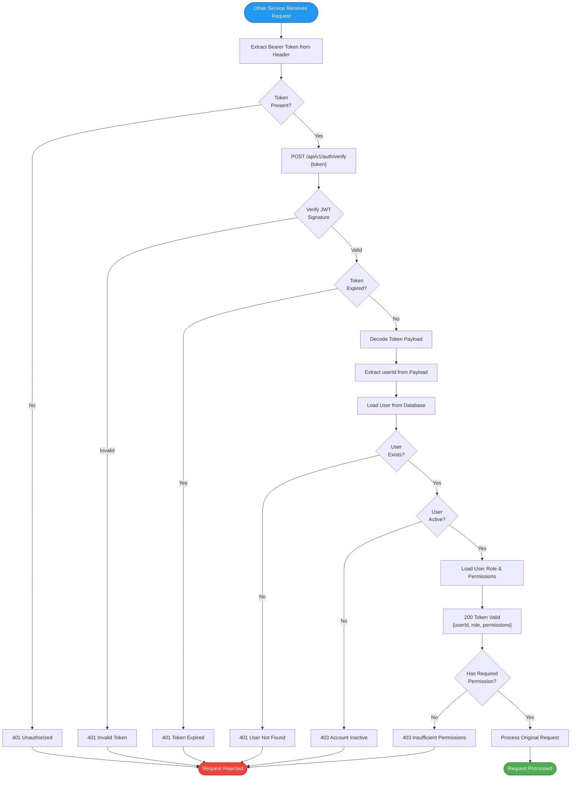

### 5.2 Inter-Service Token Verification Sequence

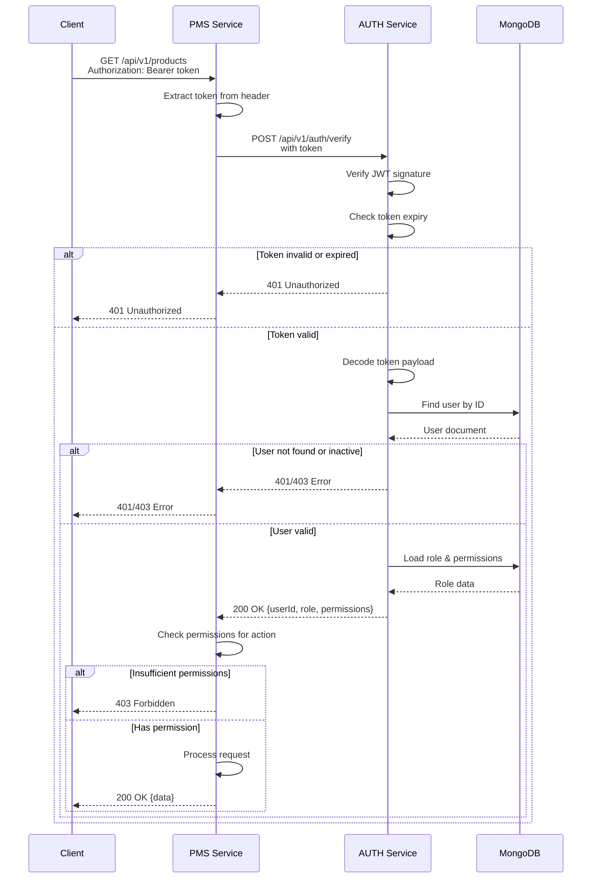

---

## 6. Password Reset Flow

### 6.1 Forgot Password Flow

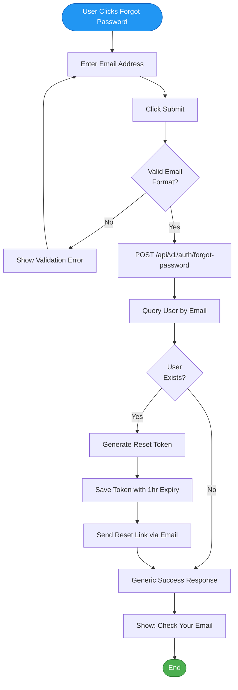

### 6.2 Reset Password Flow

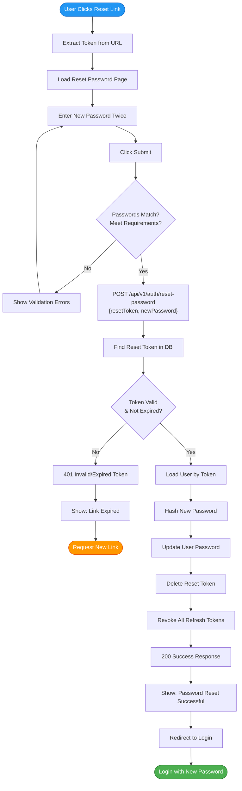

---

## 7. Change Password Flow (Authenticated)

### 7.1 Change Password Process

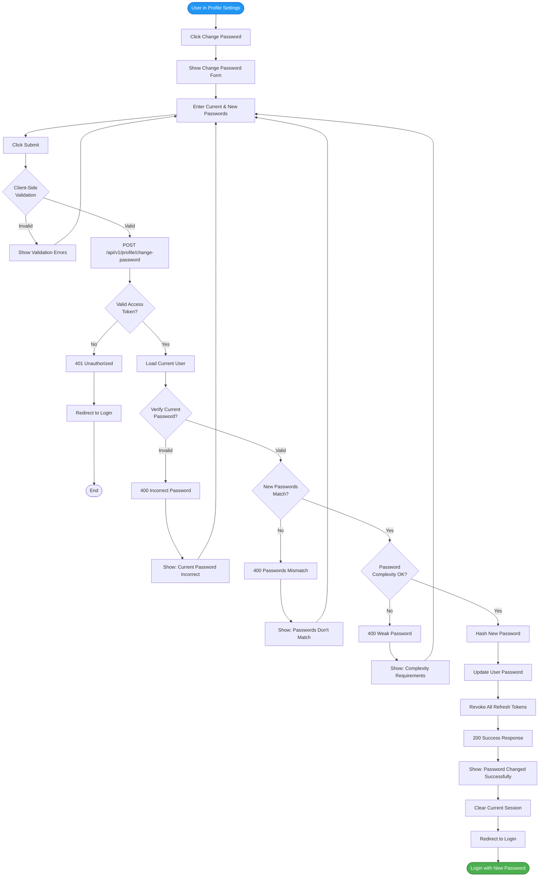

---

## 8. User Creation Flow (Admin)

### 8.1 Create User Process

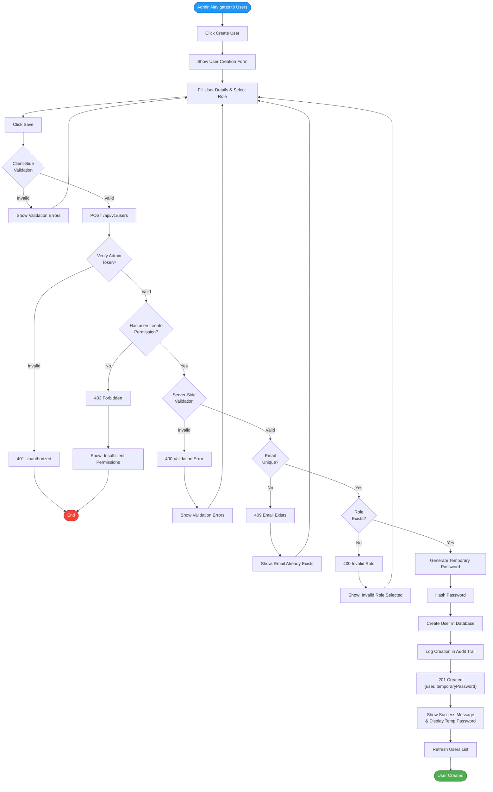

---

## 9. Role-Based Access Control (RBAC) Flow

### 9.1 Permission Check Flow

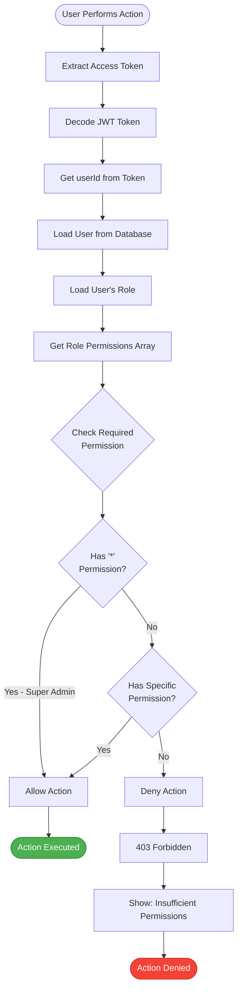

### 9.2 Permission Matrix Flow

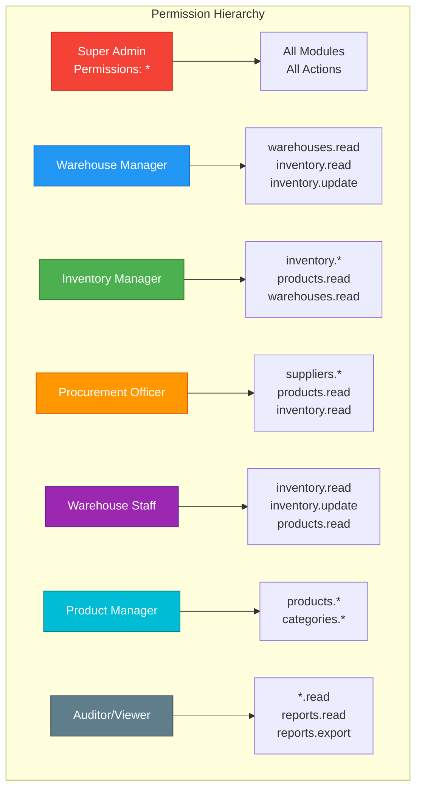

---

## 10. Session Management Flow

### 10.1 Multi-Device Session Handling

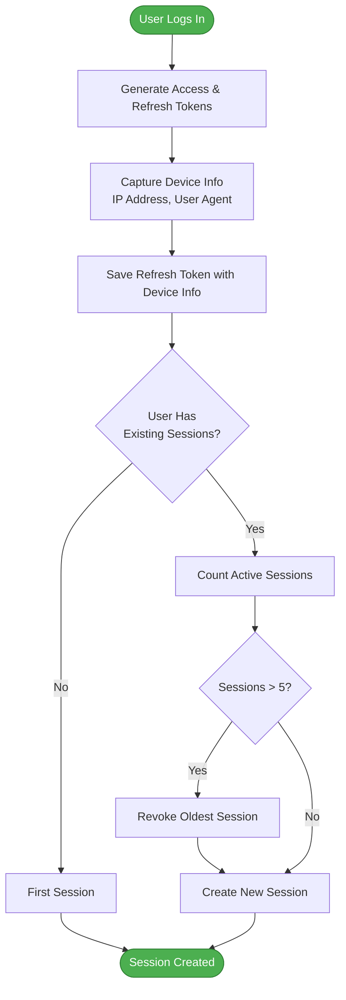

### 10.2 Session Timeline

```mermaid
gantt
    title User Session Lifecycle
    dateFormat HH:mm
    axisFormat %H:%M
    
    section Session
    User Login              :milestone, m1, 10:00, 0m
    Access Token Valid      :active, a1, 10:00, 15m
    Access Token Expires    :milestone, m2, 10:15, 0m
    Token Auto-Refresh      :crit, r1, 10:15, 1m
    New Access Token Valid  :active, a2, 10:16, 15m
    User Logout             :milestone, m3, 10:31, 0m
    
    section Token Lifecycle
    Refresh Token Valid     :done, rt1, 10:00, 31m
    Refresh Token Rotated   :crit, rt2, 10:15, 1m
    New Refresh Token Valid :done, rt3, 10:16, 15m
    All Tokens Revoked      :milestone, m4, 10:31, 0m
```

---

## 11. Error Handling Flow

### 11.1 Centralized Error Handling

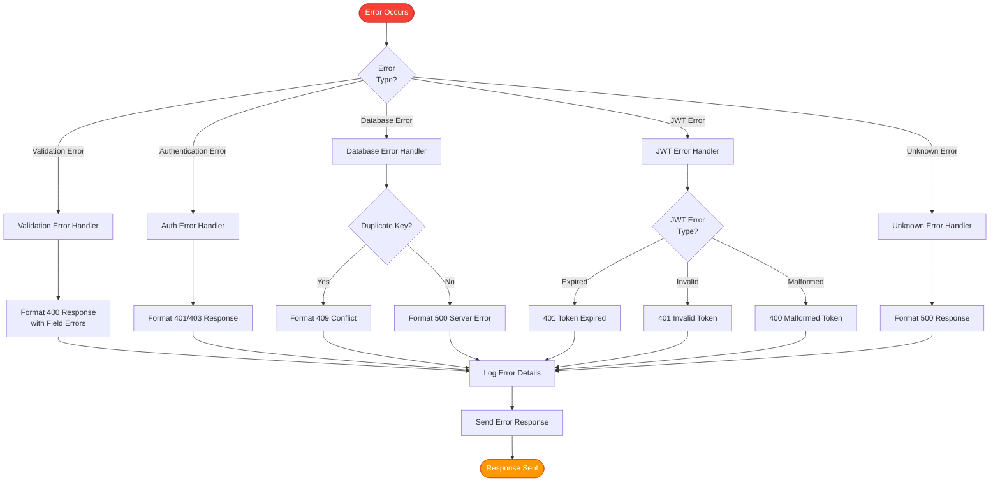

---

## 12. Audit Trail Flow

### 12.1 Audit Logging Process

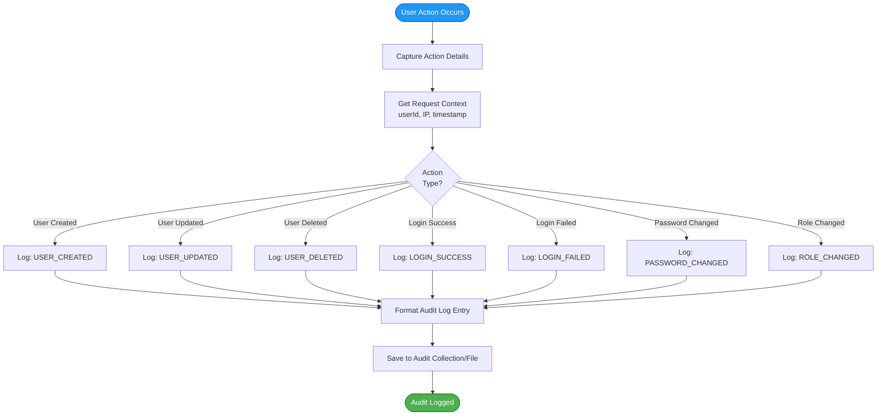

---

## 13. Complete Authentication Architecture

### 13.1 End-to-End System Flow

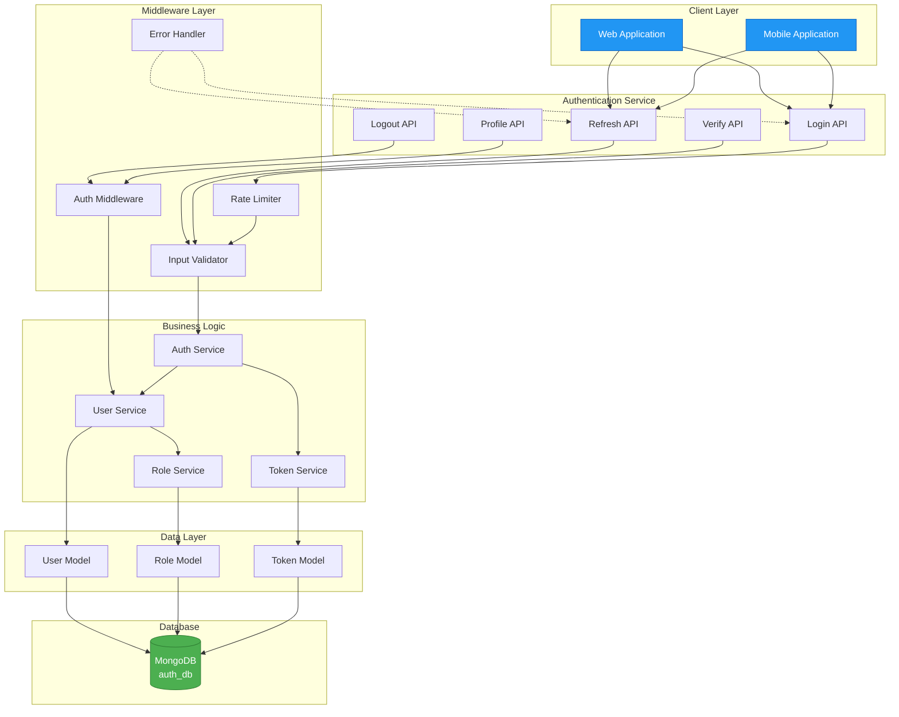

---

## Document End
**Previous Document**: [5-DB-Schema-Collections.md](./5-DB-Schema-Collections.md)  
**Module Progress**: AUTH Documentation (6/6 documents)  
**Overall Progress**: 6/30 documents (20.0%)

---

## Summary

This completes the comprehensive documentation for the **AUTH Service**. All 6 documents have been created:

1. ✅ Architecture Diagram
2. ✅ ER Diagram
3. ✅ User Stories & Use Cases
4. ✅ API Endpoint Specifications
5. ✅ Database Schema & Collections
6. ✅ Authentication Flow Diagrams

The AUTH module documentation is now complete and ready for development team implementation.
