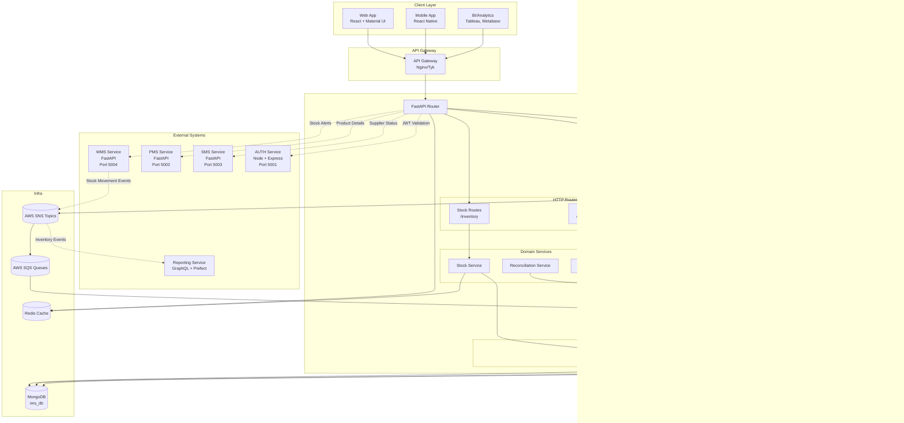
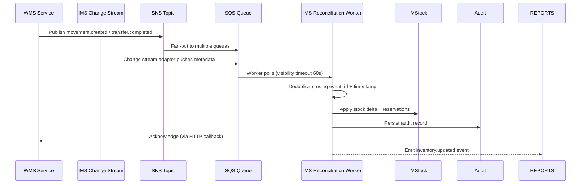
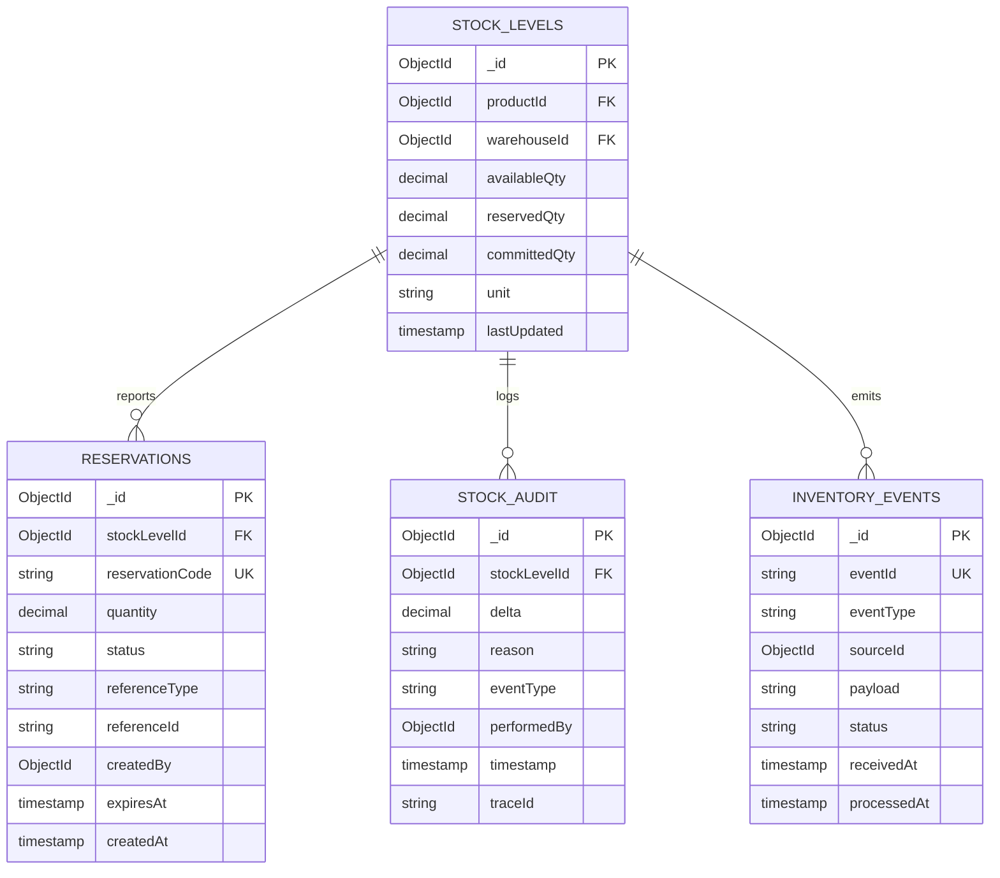

# IMS Service - Architecture Diagram

## Document Information
- **Project**: WLAN Corporation - Warehouse & Inventory Management System
- **Module**: Inventory Management System (IMS)
- **Version**: 1.0
- **Date**: January 7, 2026
- **Prepared For**: WLAN Corporation, Bengaluru

---

## 1. Overview

The Inventory Management System (IMS) is the central ledger for stock levels, reservations, adjustments, and audit trails spanning all warehouses and channels. It absorbs movement events from WMS, exposes consolidated inventory views to PMS/SMS, and feeds downstream reporting/BI consumers.

### Purpose
- Maintain authoritative stock counts across warehouses and products
- Provide real-time availability, reservations, and allocation APIs
- Reconcile inbound/outbound events from WMS and external fulfillment partners
- Emit inventory events for analytics, reporting, and capacity alerts
- Audit every stock change for traceability and regulatory compliance

### Technology Stack
- **Runtime**: Python 3.10+ (shared with other services for uniformity)
- **Framework**: FastAPI 0.104+ delivering async REST endpoints
- **ASGI Server**: Uvicorn 0.24+ with Gunicorn for production workers
- **Database**: MongoDB 6.x (ims_db) accessed via Motor 3.3+ for async queries
- **Cache**: Redis 7+ for hot product availability and rate limiting
- **Event Bus**: AWS SNS/SQS + DynamoDB stream adapters capture change events
- **Messaging**: Celery 5+ (with Redis broker) for background reconciliation jobs
- **Infra**: Docker Compose locally, AWS ECS + DocumentDB/MongoDB Atlas in production
- **Port**: 5005

---

## 2. System Architecture

### 2.1 High-Level Architecture



### 2.2 Event Stream Architecture



---

## 3. Application Structure

```
IMS/
├── app/
│   ├── __init__.py
│   ├── main.py                      # FastAPI entry point
│   ├── config.py                    # Environment and secrets
│   │
│   ├── routes/                      # REST routers
│   │   ├── __init__.py
│   │   ├── stock_routes.py          # Stock availability APIs
│   │   ├── reservation_routes.py    # Reservation lifecycle
│   │   ├── audit_routes.py          # Audit trail queries
│   │   └── health_routes.py         # Health, metrics
│   │
│   ├── services/                    # Business logic
│   │   ├── stock_service.py         # Stock reconciliation logic
│   │   ├── reservation_service.py   # Reservation orchestration
│   │   ├── event_service.py         # Event ingestion / deduplication
│   │   └── audit_service.py         # Audit persistence
│   │
│   ├── repositories/                # MongoDB access
│   │   ├── __init__.py
│   │   ├── stock_repository.py
│   │   ├── reservation_repository.py
│   │   └── audit_repository.py
│   │
│   ├── workers/                     # Background processing
│   │   ├── __init__.py
│   │   ├── change_stream_listener.py# MongoDB change stream -> SNS
│   │   ├── reconciliation_worker.py  # Polls SQS + applies updates
│   │   └── exporter.py              # Periodic exports to S3/BI
│   │
│   ├── models/                      # Pydantic + helper models
│   │   ├── __init__.py
│   │   ├── stock_models.py
│   │   ├── reservation_models.py
│   │   └── audit_models.py
│   │
│   ├── utils/                       # Shared utilities
│   │   ├── __init__.py
│   │   ├── dedupe.py                # Idempotency helpers
│   │   ├── cache.py                 # Redis helpers
│   │   ├── event_serializer.py      # Normalizes SNS payloads
│   │   └── validation.py            # Request validators
│   │
│   └── database/
│       ├── __init__.py
│       ├── connection.py            # Motor client
│       ├── indexes.py               # Index definitions and TTL rules
│       └── migrations.py            # Schema guard scripts
│
├── workers/                         # Celery periodic/long-running tasks
├── tests/                           # Test suite (unit, integration)
├── scripts/                         # Dev helpers (seed data, reload)
├── .env.example
├── requirements.txt
├── docker-compose.yml
└── README.md
```

---

## 4. Data Model Overview

### 4.1 ER Diagram



### 4.2 Collections Summary

| Collection | Purpose | Key Fields |
|------------|---------|------------|
| **stock_levels** | Current stock per warehouse/product | productId, warehouseId, availableQty, reservedQty, committedQty |
| **reservations** | Hold/reserve stock for orders/transfers | reservationCode, referenceType, quantity, status, expiresAt |
| **stock_audit** | Immutable audit trail for every stock change | stockLevelId, delta, reason, eventType, traceId |
| **inventory_events** | Inbox for deduplicated events | eventId, eventType, payload, status, processedAt |

---

## 5. API Endpoint Categories

| Category | Sample Endpoints | Description |
|----------|------------------|-------------|
| **Stock Visibility** | `GET /api/v1/inventory/stock`, `GET /api/v1/inventory/stock/{warehouseId}` | Provide real-time stock and availability per warehouse or SKU, include pagination and filters |
| **Reservations** | `POST /api/v1/inventory/reservations`, `PATCH /api/v1/inventory/reservations/{id}/cancel`, `GET /api/v1/inventory/reservations/{id}` | Reserve stock for transfers, sales, or repair jobs with automatic expiry, cancellation, and reconciliation hooks |
| **Adjustments & Transfers** | `POST /api/v1/inventory/adjsut`, `POST /api/v1/inventory/allocations` | Manual adjustments, transfer acceptance reconciling with WMS movements |
| **Audit & History** | `GET /api/v1/inventory/audit`, `GET /api/v1/inventory/history/{productId}` | Trace stock deltas with traceId, user context, eventType filters |
| **Events & Health** | `POST /api/v1/inventory/events/ack`, `GET /api/v1/health` | Accept external event acknowledgements and expose service health/metrics |

---

## 6. Integration Points

- **WMS** pushes movement/transfer events via MongoDB change streams → SNS → SQS. IMS workers acknowledge updates and notify WMS when reconciled.
- **PMS** provides product metadata (dimensions, SKU, status) during reservation validation and stock allocation.
- **SMS** shares supplier/lead time data for stock aging calculations that feed IMS alerts.
- **AUTH** supplies JWT verification (via `/auth/verify`) plus role claims used for admin actions.
- **Reporting Service** consumes `inventory.updated` events for capacity forecasting, BI dashboards, and SLA monitoring.
- **External BI** (Tableau/Metabase) queries IMS snapshots exported nightly to S3.

---

## 7. Observability & Reliability

| Concern | Tooling | Notes |
|---------|--------|-------|
| Logs | Datadog + Winston | JSON logs include `traceId`, `eventId`, and `userId` fields to correlate with WMS orders |
| Metrics | Prometheus + Grafana | Exporters track queue depth (SQS), reconciliation latency, reservation expiry rates |
| Tracing | AWS X-Ray | Instrument HTTP, MongoDB, and SNS/SQS interactions with shared trace IDs |
| Alerts | PagerDuty | Alerts fire for stale queues (>5m), reconciliation errors, or Redis cache misses |
| Health | `/api/v1/health` | Checks MongoDB, Redis, and SNS/SQS connectivity; synthetic canaries run via CloudWatch Synthetics |

---

## Document End
**Previous Document**: [Back-End/Docs/WMS/6-Integration-Flow-Diagrams.md](Back-End/Docs/WMS/6-Integration-Flow-Diagrams.md)  
**Next Document**: [Back-End/Docs/IMS/2-ER-Diagram.md](Back-End/Docs/IMS/2-ER-Diagram.md)  
**Module Progress**: IMS Documentation (1/6 documents)  
**Overall Progress**: 25/30 documents (83.3%)
