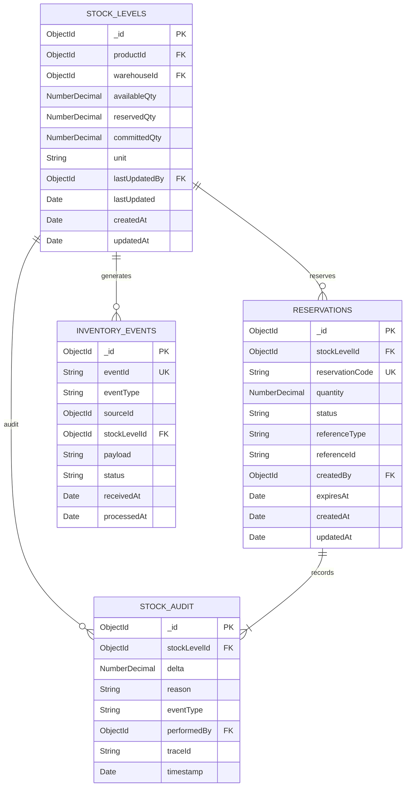

# IMS Service - ER Diagram & Database Schema

## Document Information
- **Project**: WLAN Corporation - Warehouse & Inventory Management System
- **Module**: Inventory Management System (IMS)
- **Version**: 1.0
- **Date**: January 7, 2026
- **Prepared For**: WLAN Corporation, Bengaluru

---

## 1. Overview

This document captures the entity relationship diagrams and schema design for IMS. The service maintains a change-data-driven stock ledger, reservation tables, immutable audit trail, and inbox for external events.

### Database Name
```
ims_db
```

### Primary Collections
1. **stock_levels** – Current stock per warehouse and product
2. **reservations** – Holds reserved quantities for transfers/orders
3. **stock_audit** – Immutable history of every stock delta
4. **inventory_events** – Inbox of external change stream events for deduplication

---

## 2. ER Diagram



---

## 3. Collection: stock_levels

### 3.1 Purpose
Maintain the canonical available/committed/reserved quantities for each product in every warehouse.

### 3.2 Schema
```json
{
  "_id": ObjectId,
  "productId": ObjectId,
  "warehouseId": ObjectId,
  "availableQty": NumberDecimal,
  "reservedQty": NumberDecimal,
  "committedQty": NumberDecimal,
  "unit": "pcs" | "kg" | "box",
  "lastUpdatedBy": ObjectId,
  "lastUpdated": ISODate,
  "createdAt": ISODate,
  "updatedAt": ISODate
}
```

### 3.3 Indexes
```javascript
db.stock_levels.createIndex({ productId: 1, warehouseId: 1 }, { unique: true, name: "idx_stock_unique" })
db.stock_levels.createIndex({ warehouseId: 1 }, { name: "idx_stock_warehouse" })
db.stock_levels.createIndex({ productId: 1 }, { name: "idx_stock_product" })
db.stock_levels.createIndex({ updatedAt: -1 }, { name: "idx_stock_updated" })
```

### 3.4 Sample Document
```json
{
  "_id": ObjectId("6789abcd1234ims00010001"),
  "productId": ObjectId("6789abcd1234pms00020001"),
  "warehouseId": ObjectId("6789abcd1234wms00030001"),
  "availableQty": NumberDecimal("1200"),
  "reservedQty": NumberDecimal("150"),
  "committedQty": NumberDecimal("200"),
  "unit": "pcs",
  "lastUpdatedBy": ObjectId("6789abcd1234auth00040001"),
  "lastUpdated": ISODate("2026-01-07T12:15:00Z"),
  "createdAt": ISODate("2026-01-01T08:00:00Z"),
  "updatedAt": ISODate("2026-01-07T12:15:00Z")
}
```

### 3.5 Validation Rules
- `productId`, `warehouseId`, `availableQty`, `unit` required.
- `availableQty`, `reservedQty`, `committedQty` must be ≥ 0.
- `reservedQty + committedQty` must not exceed `availableQty + reservedQty + committedQty` logic enforced at application level.

---

## 4. Collection: reservations

### 4.1 Purpose
Track provisional allocations for transfers, manual holds, and pending orders until confirmed or released.

### 4.2 Schema
```json
{
  "_id": ObjectId,
  "stockLevelId": ObjectId,
  "reservationCode": "RES-20260107-001",
  "quantity": NumberDecimal,
  "status": "Pending" | "Confirmed" | "Cancelled" | "Expired",
  "referenceType": "Transfer" | "Order" | "Adjustment",
  "referenceId": "TRF-20260107-001",
  "createdBy": ObjectId,
  "expiresAt": ISODate,
  "createdAt": ISODate,
  "updatedAt": ISODate
}
```

### 4.3 Indexes
```javascript
db.reservations.createIndex({ reservationCode: 1 }, { unique: true, name: "idx_reservation_code" })
db.reservations.createIndex({ stockLevelId: 1 }, { name: "idx_reservation_stock" })
db.reservations.createIndex({ status: 1, expiresAt: 1 }, { name: "idx_reservation_status" })
db.reservations.createIndex({ createdAt: -1 }, { name: "idx_reservation_created" })
```

### 4.4 Sample Document
```json
{
  "_id": ObjectId("6789abcd1234ims00020001"),
  "stockLevelId": ObjectId("6789abcd1234ims00010001"),
  "reservationCode": "RES-20260107-001",
  "quantity": NumberDecimal("50"),
  "status": "Pending",
  "referenceType": "Transfer",
  "referenceId": "TRF-20260107-001",
  "createdBy": ObjectId("6789abcd1234auth00040002"),
  "expiresAt": ISODate("2026-01-07T12:45:00Z"),
  "createdAt": ISODate("2026-01-07T12:15:00Z"),
  "updatedAt": ISODate("2026-01-07T12:15:00Z")
}
```

### 4.5 Business Rules
1. Expiry TTL job removes reservations older than 15 minutes; expired reservations trigger free-up events.
2. State machine restricts transitions (Pending → Confirmed/Cancelled/Expired).
3. Reservation quantity cannot exceed stock level’s available quantity.

---

## 5. Collection: stock_audit

### 5.1 Purpose
Immutable trail recording delta events from movements, adjustments, reservations, and reconciliations.

### 5.2 Schema
```json
{
  "_id": ObjectId,
  "stockLevelId": ObjectId,
  "delta": NumberDecimal,
  "reason": "MovementInbound" | "MovementOutbound" | "Adjustment" | "Reconciliation",
  "eventType": String,
  "performedBy": ObjectId,
  "traceId": String,
  "timestamp": ISODate
}
```

### 5.3 Indexes
```javascript
db.stock_audit.createIndex({ stockLevelId: 1 }, { name: "idx_audit_stock" })
db.stock_audit.createIndex({ performedBy: 1 }, { name: "idx_audit_user" })
db.stock_audit.createIndex({ timestamp: -1 }, { name: "idx_audit_recent" })
```

### 5.4 Sample Document
```json
{
  "_id": ObjectId("6789abcd1234ims00030001"),
  "stockLevelId": ObjectId("6789abcd1234ims00010001"),
  "delta": NumberDecimal("25"),
  "reason": "MovementInbound",
  "eventType": "movement.created",
  "performedBy": ObjectId("6789abcd1234auth00040003"),
  "traceId": "trace-abc-123",
  "timestamp": ISODate("2026-01-07T12:16:00Z")
}
```

---

## 6. Collection: inventory_events

### 6.1 Purpose
Queue receiving change events from WMS and external partners before deduplication.

### 6.2 Schema
```json
{
  "_id": ObjectId,
  "eventId": "evt-789",
  "eventType": "movement.created" | "transfer.completed",
  "sourceId": ObjectId,
  "stockLevelId": ObjectId,
  "payload": String,
  "status": "Pending" | "Processed" | "Failed",
  "receivedAt": ISODate,
  "processedAt": ISODate
}
```

### 6.3 Indexes
```javascript
db.inventory_events.createIndex({ eventId: 1 }, { unique: true, name: "idx_event_id" })
db.inventory_events.createIndex({ status: 1 }, { name: "idx_event_status" })
db.inventory_events.createIndex({ receivedAt: 1 }, { name: "idx_event_received" })
```

### 6.4 Notes
- Event processor keeps idempotency via `eventId + traceId` combination.
- Failed events retried 3 times with exponential backoff before moving to DLQ collection.

---

## 7. Cross-Collection Constraints
1. `stock_levels` row must exist before reservations are created (foreign key enforced in app layer).
2. Reservation deletes/updates cascade to audit entries via event-driven workers.
3. Inventory events referencing `stockLevelId` must deduplicate before affecting ledger.

---

## Document End
**Previous Document**: [Back-End/Docs/IMS/1-Architecture-Diagram.md](Back-End/Docs/IMS/1-Architecture-Diagram.md)  
**Next Document**: [Back-End/Docs/IMS/3-User-Stories-Use-Cases.md](Back-End/Docs/IMS/3-User-Stories-Use-Cases.md)  
**Module Progress**: IMS Documentation (2/6 documents)  
**Overall Progress**: 26/30 documents (86.7%)
