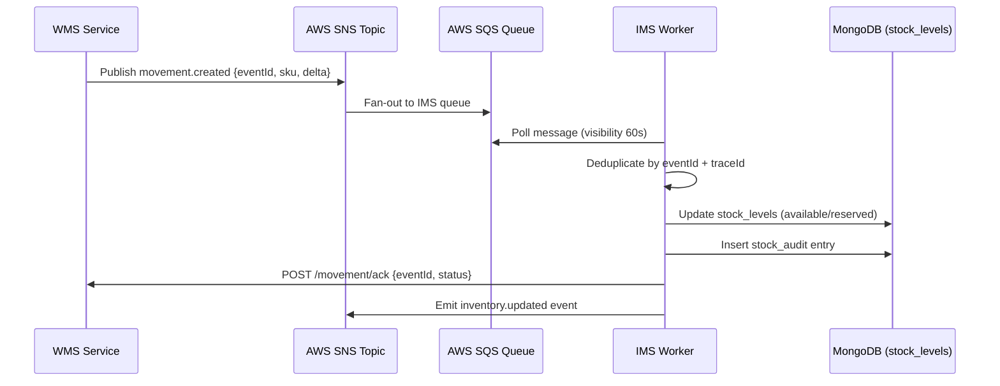
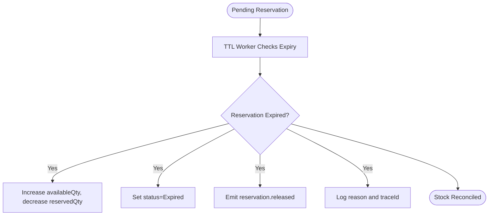

# IMS Service - User Stories & Use Cases

## Document Information
- **Project**: WLAN Corporation - Warehouse & Inventory Management System
- **Module**: Inventory Management System (IMS)
- **Version**: 1.0
- **Date**: January 7, 2026
- **Prepared For**: WLAN Corporation, Bengaluru

---

## 1. Overview

This document captures the user stories, acceptance criteria, and key use cases for the Inventory Management System (IMS). The IMS keeps the authoritative global stock ledger, orchestrates reservations, reconciles events from WMS/PMS/SMS, and surfaces inventory intelligence to reporting and operational teams.

---

## 2. User Roles

| Role | Abbreviation | Primary Responsibilities |
|------|--------------|--------------------------|
| Super Admin | SA | Full system control and configuration |
| Inventory Manager | IM | Maintain stock visibility, approve reconciliations |
| Stock Controller | SC | Review reservations, handle adjustments |
| Warehouse Staff | WS | Trigger inbound/outbound movements, respond to alerts |
| Procurement Officer | PO | Monitor availability for purchasing decisions |
| Auditor/Viewer | AV | Read-only compliance and audit reviews |

---

## 3. Epic 1: Stock Visibility & Query

### 3.1 User Story: View Global Stock

**As an** Inventory Manager  
**I want to** see real-time stock across warehouses  
**So that** I can plan sourcing and identify shortages

**Acceptance Criteria**:
- Dashboard shows available, reserved, and committed quantities per SKU/warehouse
- Filters by warehouse, category, product, and status
- Shows trending delta (last 24h/7d) with sparklines
- Supports pagination and export to Excel/PDF
- Indicates last reconciliation timestamp per record

**Priority**: Critical  
**Story Points**: 5

---

### 3.2 User Story: Query Stock for Product

**As a** Warehouse Staff  
**I want to** query stock by product SKU/location  
**So that** I can confirm availability before picking/receiving

**Acceptance Criteria**:
- Search by SKU, barcode, or product name
- Results include warehouse, zone, available qty, reserved qty
- Shows related reservations and pending adjustments
- Indicates product dimension/weight metadata (from PMS)
- Response time under 300ms with Redis caching

**Priority**: High  
**Story Points**: 3

---

## 4. Epic 2: Reservation Lifecycle

### 4.1 User Story: Create Reservation for Transfer

**As a** Stock Controller  
**I want to** reserve stock for approved transfers  
**So that** outbound movement does not overcommit inventory

**Acceptance Criteria**:
- Accepts transferCode, productId, warehouseId, quantity
- Validates requested qty <= availableQty
- Marks reservation as Pending and emits `reservation.created`
- Automatically expires after TTL (15 minutes)
- Notifies WMS if reservation fails

**Priority**: High  
**Story Points**: 5

---

### 4.2 User Story: Confirm Reservation

**As a** Inventory Manager  
**I want to** confirm reservations once transfers ship  
**So that** the reserved qty becomes committed

**Acceptance Criteria**:
- Triggered when WMS publishes `transfer.shipped`
- Moves reservation from Pending → Confirmed
- Decrements availableQty and increases committedQty atomically
- Audit log records transition with `traceId`
- Failure triggers alert and rollback via compensated event

**Priority**: Medium  
**Story Points**: 3

---

### 4.3 User Story: Cancel or Expire Reservation

**As a** Stock Controller  
**I want to** release reservations when transfers cancel or expire  
**So that** stock returns to availability

**Acceptance Criteria**:
- Can cancel manually via API (reason, referenceId)
- TTL job automatically expires `Pending` reservations
- AvailableQty increases, reservedQty decreases accordingly
- Emits `reservation.released` event for reporting
- Documented reason stored for audit

**Priority**: Medium  
**Story Points**: 3

---

## 5. Epic 3: Stock Reconciliation & Audit

### 5.1 User Story: Reconcile Stock After Adjustment

**As an** Inventory Manager  
**I want to** reconcile stock when adjustments occur  
**So that** ledger always matches physical counts

**Acceptance Criteria**:
- Accepts physical count payload (productId, warehouseId, actualQty)
- Computes delta vs current availableQty
- Applies delta via `stock_audit` entry with reason and traceId
- Emits `stock.adjusted` event and notifies WMS/PMS if needed
- Requires approval if delta > 5% of total stock

**Priority**: High  
**Story Points**: 5

---

### 5.2 User Story: Review Audit Trail

**As an** Auditor/Viewer  
**I want to** view all stock deltas with trace IDs  
**So that** I can trace compliance and discrepancies

**Acceptance Criteria**:
- Filter audit entries by product, warehouse, user, date range
- Each entry shows delta, before/after values, reason, traceId
- Link back to originating event (movement.created, reservation, manual)
- Supports pagination and export
- Protected by RBAC (read-only roles)

**Priority**: Medium  
**Story Points**: 2

---

## 6. Epic 4: Event Processing & Integration

### 6.1 User Story: Ingest Movement Events from WMS

**As an** IMS Worker  
**I want to** consume WMS movement events reliably  
**So that** inventory keeps up-to-date with physical operations

**Acceptance Criteria**:
- Change stream listener pushes events into SNS/SQS
- Deduplication by `eventId + traceId`
- Supports retries (3x) and DLQ for poison messages
- Applies deltas to `stock_levels` and writes to `stock_audit`
- Acknowledges WMS via HTTP callback with status

**Priority**: Critical  
**Story Points**: 8

---

### 6.2 User Story: Sync with PMS/SMS for Product Status

**As an** Inventory Manager  
**I want to** know if a product is active/deprecated  
**So that** I can exclude obsolete SKUs from availability tables

**Acceptance Criteria**:
- Periodic sync job queries PMS/SMS for product status
- Deactivates stock records for discontinued products
- Emits `inventory.status.updated` event for reporting
- Logs mismatches for analyst review
- Cache TTL matches sync cadence (5 minutes)

**Priority**: Medium  
**Story Points**: 3

---

## 7. Epic 5: Reporting & Alerts

### 7.1 User Story: Trigger Capacity Alerts

**As a** Inventory Manager  
**I want to** be alerted when availability falls below thresholds  
**So that** I can trigger purchasing or transfer plans

**Acceptance Criteria**:
- Alerts based on `availableQty` ratio per warehouse/product
- Sends alerts via Slack/email and PagerDuty for critical thresholds
- Thresholds configurable per product family
- Alert includes current reservations and last movement timestamp
- Alerts feed into Grafana for visualization

**Priority**: High  
**Story Points**: 5

---

### 7.2 User Story: Export Inventory Snapshots

**As a** Procurement Officer  
**I want to** download end-of-day snapshots  
**So that** finance can reconcile with cost centers

**Acceptance Criteria**:
- Scheduled job exports `stock_levels`, `reservations`, `stock_audit` to S3
- Supports CSV/Parquet formats
- Includes metadata (runId, timestamp, warehouse, traceId)
- Notifies reporting service via webhook when file is ready
- Files retained per compliance policy (7 years)

**Priority**: Medium  
**Story Points**: 3

---

## 8. Detailed Use Cases

### 8.1 Use Case: UC-IMS-001 - Movement Event Processing

**Preconditions**:
- WMS movement recorded in `movements` collection
- Event broker (SNS/SQS) healthy and accessible
- Trace ID available for correlation

**Postconditions**:
- Stock ledger reflects movement delta
- Audit trail entry created
- WMS receives confirmation for retry logic

---

### 8.2 Use Case: UC-IMS-002 - Reservation Expiry

**Preconditions**:
- Reservation in Pending state
- TTL job configured with 15-minute window

**Postconditions**:
- Stock returns to availability for other operations
- Downstream services notified of release
- Audit trail demonstrates reason/time

---

## Document End
**Previous Document**: [Back-End/Docs/IMS/2-ER-Diagram.md](Back-End/Docs/IMS/2-ER-Diagram.md)  
**Next Document**: [Back-End/Docs/IMS/4-API-Endpoint-Specifications.md](Back-End/Docs/IMS/4-API-Endpoint-Specifications.md)  
**Module Progress**: IMS Documentation (3/6 documents)  
**Overall Progress**: 27/30 documents (90.0%)
