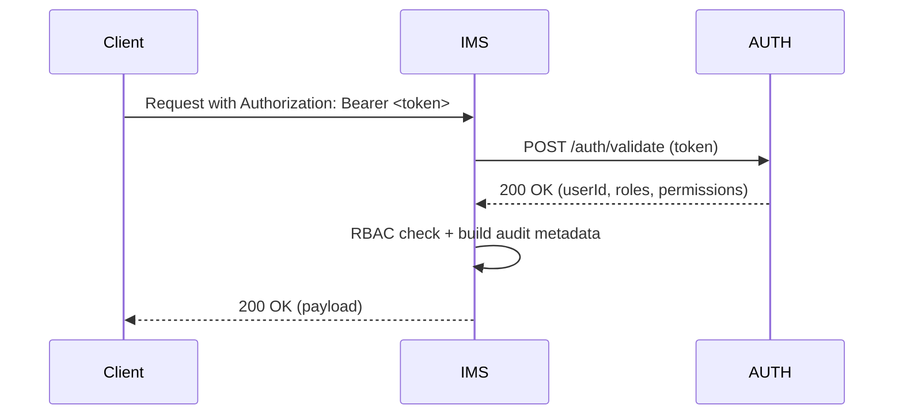
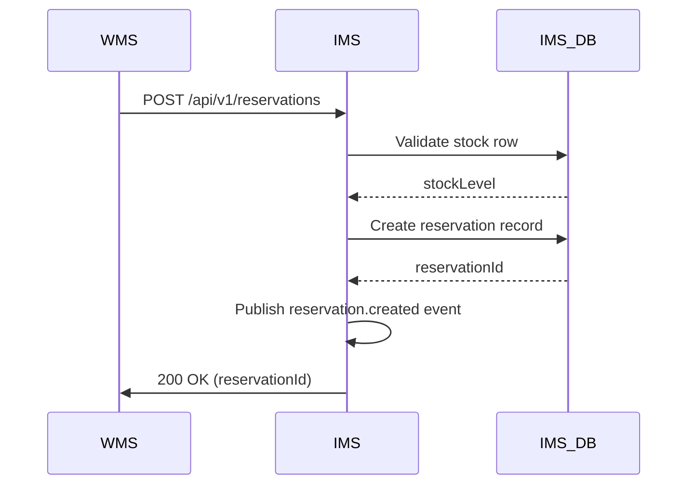
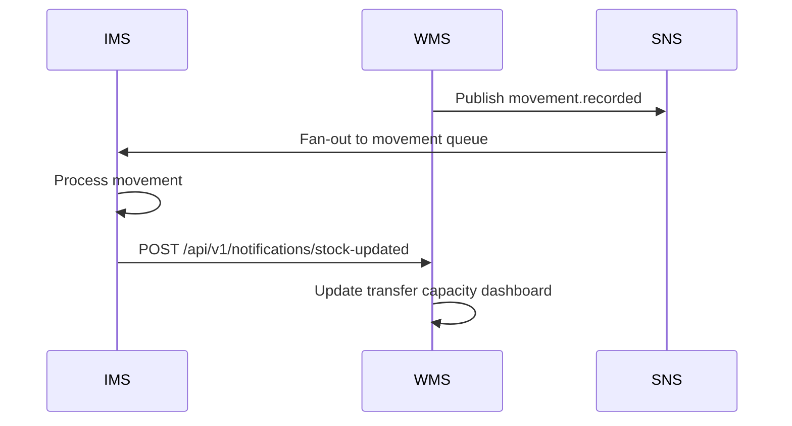
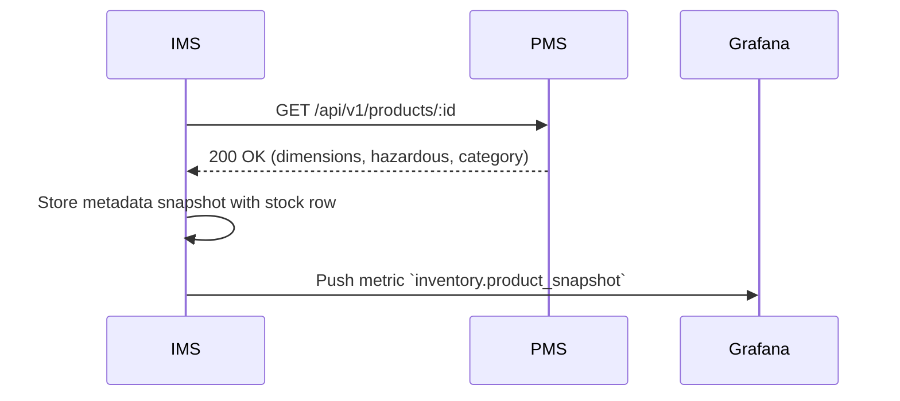
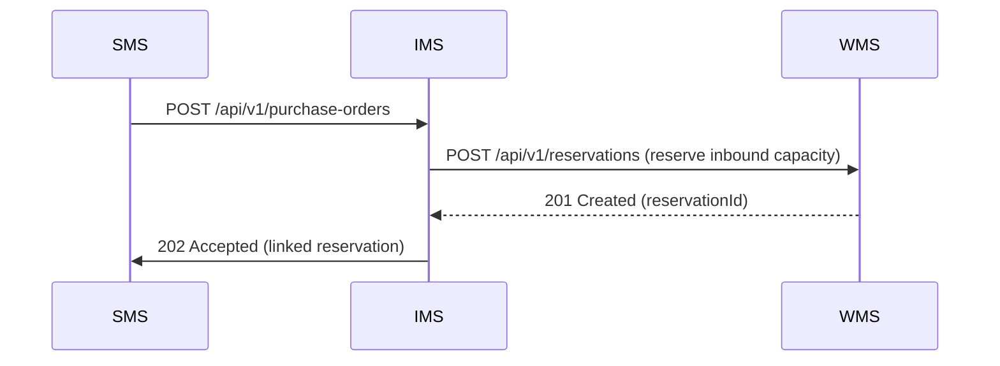

# IMS Service - Integration Flow Diagrams

## Document Information
- **Project**: WLAN Corporation - Warehouse & Inventory Management System
- **Module**: Inventory Management System (IMS)
- **Version**: 1.0
- **Date**: January 7, 2026
- **Prepared For**: WLAN Corporation, Bengaluru

---

## 1. Overview

This document captures how IMS integrates with the rest of the WLAN microservices suite (AUTH, WMS, PMS, SMS) plus infra components (MongoDB, Redis, AWS SNS/SQS, Prometheus, Grafana). Focus areas are authentication, synchronous stock queries, asynchronous event handling, and monitoring/alerting surfaces.

### Key External Systems
1. **AUTH** – JWT validation, RBAC context, and audit trail enrichment.
2. **WMS** – Movement ingestion, transfer state propagation, and inbound reservation requests.
3. **PMS** – Product metadata, compliance flags, and reporting data for reconciliation.
4. **SMS** – Supplier-driven adjustments, future purchase order orchestration, and price feeds.
5. **Infrastructure** – MongoDB (`ims_db`), Redis cache, AWS SNS/SQS, Grafana dashboards, and Prometheus metrics.

---

## 2. High-Level Integration Architecture

```mermaid
flowchart LR
    subgraph "Clients"
        WarehouseApp[WMS UI]
        OpsConsole[IMS Console]
    end

    subgraph "API Layer"
        IMS_API[IMS FastAPI
        Port: 5005]
        AUTH[AUTH Service]
    end

    subgraph "Integrations"
        WMS[WMS Service]
        PMS[PMS Service]
        SMS[SMS Service (future PO)]
    end

    subgraph "Event & Queue"
        SNS[AWS SNS Topics]
        SQS[AWS SQS Queues]
        Processor[IMS Worker Pool]
    end

    subgraph "Data & Observability"
        IMS_DB[(ims_db
        MongoDB)]
        Redis[Redis Cache]
        Grafana[Grafana + Prometheus]
    end

    WarehouseApp --> IMS_API
    OpsConsole --> IMS_API
    IMS_API --> AUTH
    IMS_API --> WMS
    IMS_API --> PMS
    IMS_API --> SMS
    WMS --> SNS
    SNS --> SQS
    SQS --> Processor
    Processor --> IMS_DB
    Processor --> Grafana
    IMS_DB --> Redis
    Redis --> IMS_API
    IMS_API --> Grafana
```

- Deploys inside the WLAN private VPC with TLS 1.3 enforced between services.
- Redis caches frequently accessed stock records for 30s to reduce MongoDB lookups.
- Event processors run in Kubernetes with horizontal autoscaling triggered by queue depth metrics.

---

## 3. Authentication Flow



- FastAPI middleware caches validated tokens (Redis) for 45 seconds with TTL refresh on reuse.
- Every incoming request logs `traceId` to `audit_logs` collection for correlation.
- Permissions defined per endpoint (`inventory.read`, `reservation.manage`, `audit.query`).

---

## 4. Core Event Flows

### 4.1 Movement Streaming (WMS → IMS)

```mermaid
flowchart LR
    WMS_MOVEMENTS[WMS Movements Collection]
    CHANGE_STREAM[Change Stream]
    EVENT_PUBLISHER[Movement Publisher Service]
    SNS[ATS SNS Topic: movement.recorded]
    SQS[SQS Queue: ims-movements]
    IMS_PROCESSOR[IMS Movement Processor]
    IMS_DB[Stock Levels + Inventory Events]

    WMS_MOVEMENTS --> CHANGE_STREAM
    CHANGE_STREAM --> EVENT_PUBLISHER
    EVENT_PUBLISHER --> SNS
    SNS --> SQS
    SQS --> IMS_PROCESSOR
    IMS_PROCESSOR --> IMS_DB
```



- Publisher batches events to SNS with deduplication keys built from MongoDB `movementId`.
- IMS worker leases messages with visibility timeout 60s and 3 retry attempts before DLQ.
- Processor translates deltas into `stock_levels`, appends to `stock_audit`, and updates `inventory_events` status.

### 4.2 Reservation Lifecycle (WMS ↔ IMS)



- IMS enforces optimistic concurrency by checking `updatedAt` timestamps before reserving quantities.
- Reservation TTL job (Quartz) transitions `Pending` → `Expired` via `/tasks/cleanup` endpoint; publishes `reservation.expired` event.

---

## 5. Inter-Service Sequences

### 5.1 IMS ↔ WMS Synchronization



- IMS acknowledges each event by updating `inventory_events` to `Processed`.
- WMS uses acknowledgement as part of SLA to show stock availability to planners.

### 5.2 IMS ↔ PMS Reporting



- Cached snapshots expire after 24h; PMS is queried when metadata missing or stale.
- Metadata informs reconciliation jobs that match physical audits to product safety levels.

### 5.3 IMS ↔ SMS Purchase Orders (Future)



- IMS exposes read-only supplier data for historical PO reconciliation.
- Webhook `supplier.price-changed` will eventually trigger IMS revaluation workflows.

---

## 6. Event & Queue Topology

| Topic / Queue | Consumers | Delivery Guarantees | Alerts |
|---------------|-----------|----------------------|--------|
| `movement.recorded` | IMS, BI Data Lake, Forecasting Service | At-least-once with dedup on `eventId` | CloudWatch alarm when DLQ > 10 |
| `reservation.expired` | WMS (UI refresh), Reporting, SLA Monitor | At-most-once | SNS topic flagged if delivery latency > 1 minute |
| `inventory.reconciled` | Grafana (dashboards), BI Export | Exactly-once (idempotent worker) | Prometheus alerts if worker fail ratio > 5% |

- AWS Lambda function monitors SQS metrics and writes to OpsBridge.
- Dead-letter queue dirties flagged for manual review through Splunk alert (traceId included).

---

## 7. Observability & Alerts

- **Metrics**: Prometheus exporter captures API latency, queue backlog, reservation count, reconciliation duration.
- **Dashboards**: Grafana panels for stock health per warehouse and reservation TTL distribution.
- **Tracing**: OpenTelemetry (OTLP) spans stitched across WMS, IMS, and queues using shared `traceId`.
- **Logs**: Structured JSON via `loguru`, shipped to Datadog; 5xx spikes trigger PagerDuty.
- **Health**: `/health/live` checks MongoDB, Redis, AWS SQS access; `/health/ready` includes SNS topic permissions.

---

## Document End
**Previous Document**: [Back-End/Docs/IMS/5-DB-Schema-Collections.md](Back-End/Docs/IMS/5-DB-Schema-Collections.md)  
**Module Progress**: IMS Documentation (6/6 documents)  
**Overall Progress**: 30/30 documents (100%)
