# PMS Service - Architecture Diagram

## Document Information
- **Project**: WLAN Corporation - Warehouse & Inventory Management System
- **Module**: Product Management System (PMS)
- **Version**: 1.0
- **Date**: January 7, 2026
- **Prepared For**: WLAN Corporation, Bengaluru

---

## 1. Overview

The PMS (Product Management System) is a Python-based microservice built with FastAPI that manages the complete product catalog including categories, sub-categories, products, and SKUs. It handles electronic and networking products sold by WLAN Corporation, supporting barcode/QR code generation and product lifecycle management.

---

## 2. High-Level System Architecture

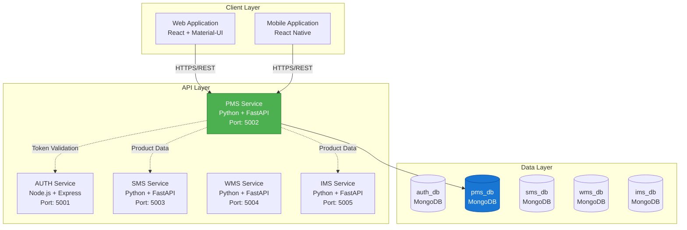

---

## 3. PMS Service Architecture

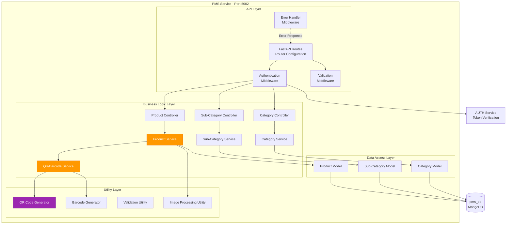

---

## 4. Component Responsibilities

### 4.1 API Layer

| Component | Responsibility |
|-----------|---------------|
| **FastAPI Routes** | Define API endpoints and route to controllers |
| **Authentication Middleware** | Verify JWT tokens via AUTH service |
| **Validation Middleware** | Validate request body/params using Pydantic models |
| **Error Handler Middleware** | Centralized error handling and response formatting |

### 4.2 Business Logic Layer

| Component | Responsibility |
|-----------|---------------|
| **Category Controller** | Handle category CRUD requests |
| **Sub-Category Controller** | Handle sub-category CRUD requests |
| **Product Controller** | Handle product CRUD requests |
| **Category Service** | Category business logic and validations |
| **Sub-Category Service** | Sub-category business logic and parent validation |
| **Product Service** | Product management, SKU generation, lifecycle |
| **QR/Barcode Service** | Generate and manage QR codes and barcodes |

### 4.3 Data Access Layer

| Component | Responsibility |
|-----------|---------------|
| **Category Model** | Category schema and database operations |
| **Sub-Category Model** | Sub-category schema and operations |
| **Product Model** | Product schema and operations |

### 4.4 Utility Layer

| Component | Responsibility |
|-----------|---------------|
| **QR Code Generator** | Generate QR codes for products |
| **Barcode Generator** | Generate barcodes for products |
| **Validation Utility** | Reusable validation functions |
| **Image Processing Utility** | Handle product image uploads and optimization |

---

## 5. Product Management Flow Architecture

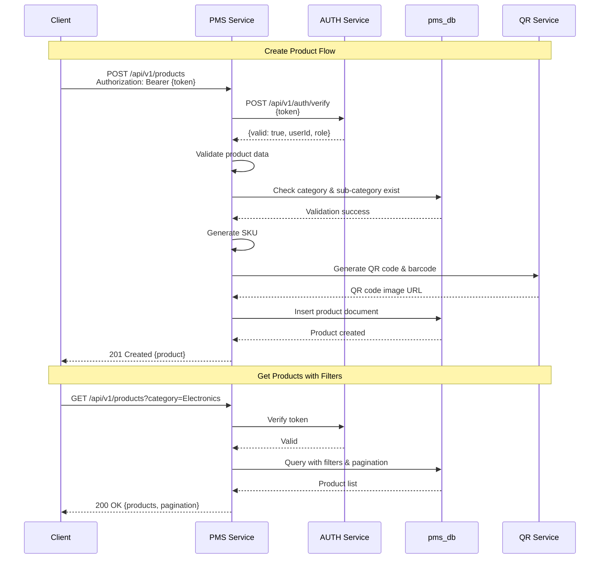

---

## 6. Data Hierarchy Architecture

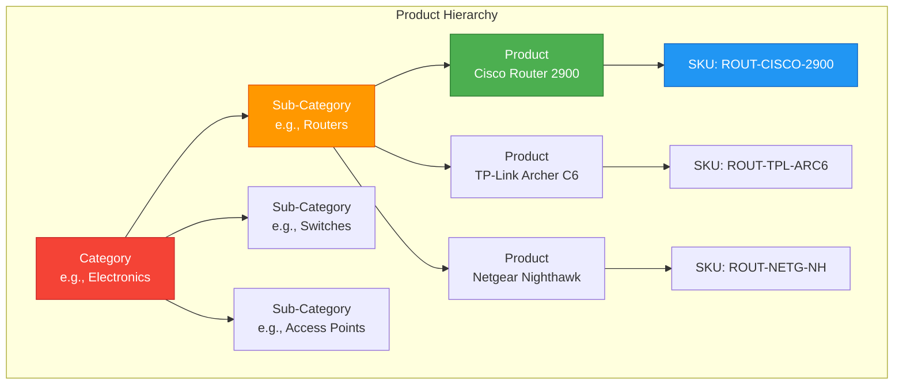

---

## 7. Deployment Architecture

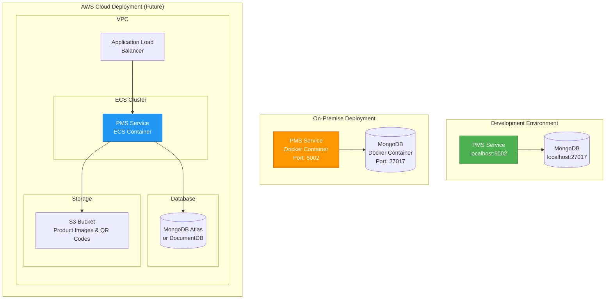

---

## 8. Technology Stack

| Layer | Technology | Version | Purpose |
|-------|-----------|---------|---------|
| **Runtime** | Python | 3.10+ | Programming language |
| **Framework** | FastAPI | 0.104+ | Web framework |
| **Server** | Uvicorn | 0.24+ | ASGI server |
| **Database** | MongoDB | 6.x | NoSQL database |
| **ODM** | Motor | 3.3+ | Async MongoDB driver |
| **Validation** | Pydantic | 2.5+ | Data validation |
| **QR Code** | qrcode | 7.4+ | QR code generation |
| **Barcode** | python-barcode | 0.15+ | Barcode generation |
| **Image Processing** | Pillow | 10.1+ | Image manipulation |
| **HTTP Client** | httpx | 0.25+ | Async HTTP requests (AUTH verification) |
| **Environment** | python-dotenv | 1.0+ | Environment variables |
| **CORS** | fastapi.middleware.cors | Built-in | Cross-origin resource sharing |
| **API Documentation** | FastAPI Swagger | Built-in | OpenAPI documentation |

---

## 9. Security Architecture

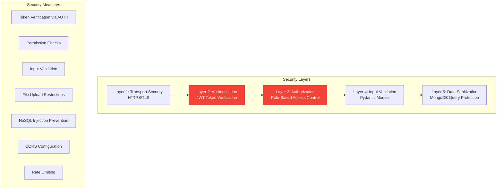

---

## 10. SKU Generation Strategy

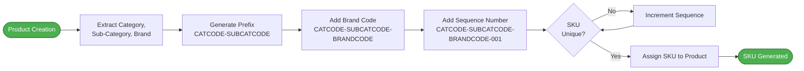

**Example SKU**: `ROUT-CISCO-2900-001`
- **ROUT**: Router sub-category code
- **CISCO**: Brand code
- **2900**: Model code
- **001**: Sequence number

---

## 11. QR Code & Barcode Architecture

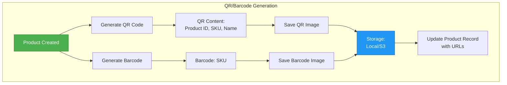

**QR Code Data Structure**:
```json
{
  "productId": "65a1b2c3d4e5f6g7h8i9j0k1",
  "sku": "ROUT-CISCO-2900-001",
  "name": "Cisco Router 2900 Series",
  "category": "Electronics",
  "subCategory": "Routers"
}
```

---

## 12. Scalability Considerations

### 12.1 Horizontal Scaling
- Stateless service design allows multiple instances
- Load balancer distributes requests across instances
- No in-memory session storage

### 12.2 Database Scaling
- MongoDB replica sets for high availability
- Read replicas for read-heavy operations
- Indexing on frequently queried fields (SKU, category, name)

### 12.3 Caching Strategy
- Redis cache for frequently accessed categories (future enhancement)
- CDN for product images and QR codes
- API response caching for product lists

### 12.4 Performance Optimization
- Async database operations with Motor
- Connection pooling
- Pagination for large datasets
- Lazy loading of product images

---

## 13. Monitoring & Logging

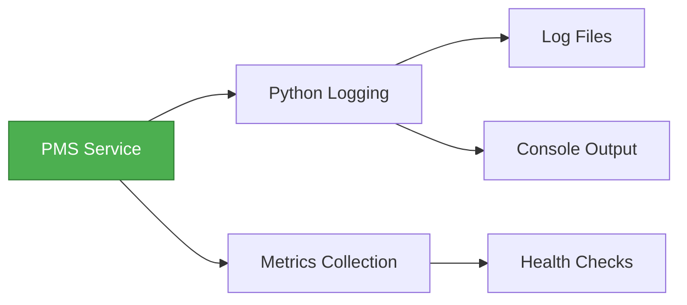

### Key Metrics to Monitor
- Request rate and response time
- Product creation/update rate
- Database query performance
- QR code generation time
- Error rates by endpoint
- Cache hit/miss ratio

---

## 14. API Versioning Strategy

All PMS endpoints follow the pattern: `/api/v1/categories/*`, `/api/v1/products/*`

Future versions will use `/api/v2/...` while maintaining backward compatibility.

---

## 15. Environment Configuration

The service uses environment variables for configuration:

```
# Service Configuration
SERVICE_NAME=PMS
PORT=5002
HOST=0.0.0.0
ENVIRONMENT=development

# Database Configuration
MONGODB_URI=mongodb://localhost:27017/pms_db
DB_NAME=pms_db

# AUTH Service
AUTH_SERVICE_URL=http://localhost:5001/api/v1/auth/verify

# Storage Configuration
STORAGE_TYPE=local  # local or s3
STORAGE_PATH=./storage/products
S3_BUCKET=wlan-product-images
S3_REGION=ap-south-1

# QR Code Configuration
QR_CODE_SIZE=300
BARCODE_FORMAT=code128

# CORS Configuration
CORS_ORIGINS=http://localhost:3000,http://localhost:3001

# API Configuration
API_PREFIX=/api/v1
DOCS_URL=/docs
```

---

## 16. Inter-Service Communication

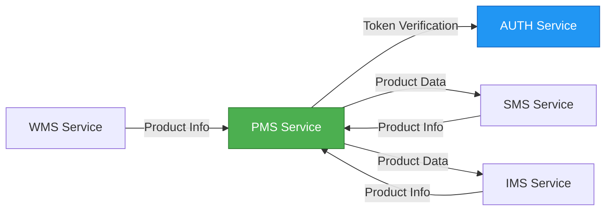

### Communication Patterns
- **Synchronous**: REST API calls for token verification
- **Data Sharing**: Other services query PMS for product information
- **Future Enhancement**: Message queue for async product updates

---

## 17. File Storage Architecture

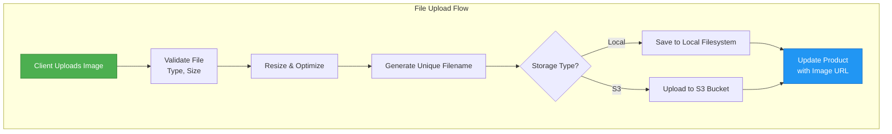

**File Naming Convention**: `{productId}_{timestamp}_{original_name}.{ext}`  
**Supported Formats**: JPG, PNG, WebP  
**Max File Size**: 5MB  
**Image Optimization**: Resize to max 1920x1080, compress quality 85%

---

## 18. Project Structure

```
pms-service/
├── app/
│   ├── __init__.py
│   ├── main.py                 # FastAPI application entry point
│   ├── config.py              # Configuration settings
│   ├── dependencies.py        # Dependency injection
│   │
│   ├── api/
│   │   ├── __init__.py
│   │   ├── v1/
│   │   │   ├── __init__.py
│   │   │   ├── routes/
│   │   │   │   ├── __init__.py
│   │   │   │   ├── categories.py
│   │   │   │   ├── subcategories.py
│   │   │   │   └── products.py
│   │   │   └── endpoints.py   # Route aggregator
│   │
│   ├── models/
│   │   ├── __init__.py
│   │   ├── category.py
│   │   ├── subcategory.py
│   │   └── product.py
│   │
│   ├── schemas/
│   │   ├── __init__.py
│   │   ├── category.py        # Pydantic schemas
│   │   ├── subcategory.py
│   │   └── product.py
│   │
│   ├── services/
│   │   ├── __init__.py
│   │   ├── category_service.py
│   │   ├── subcategory_service.py
│   │   ├── product_service.py
│   │   └── qr_service.py
│   │
│   ├── middleware/
│   │   ├── __init__.py
│   │   ├── auth.py            # JWT verification
│   │   ├── error_handler.py
│   │   └── logging.py
│   │
│   ├── utils/
│   │   ├── __init__.py
│   │   ├── qr_generator.py
│   │   ├── barcode_generator.py
│   │   ├── image_processor.py
│   │   └── validators.py
│   │
│   └── database/
│       ├── __init__.py
│       ├── connection.py      # MongoDB connection
│       └── seed.py            # Seed data
│
├── storage/                   # Local file storage
│   └── products/
│       ├── images/
│       ├── qrcodes/
│       └── barcodes/
│
├── tests/
│   ├── __init__.py
│   ├── test_categories.py
│   ├── test_products.py
│   └── test_qr_generation.py
│
├── .env
├── .env.example
├── .dockerignore
├── Dockerfile
├── docker-compose.yml
├── requirements.txt
└── README.md
```

---

## Document End
**Next Document**: [2-ER-Diagram.md](./2-ER-Diagram.md)  
**Module Progress**: PMS Documentation (1/6 documents)  
**Overall Progress**: 7/30 documents (23.3%)
