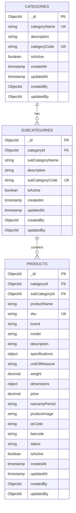
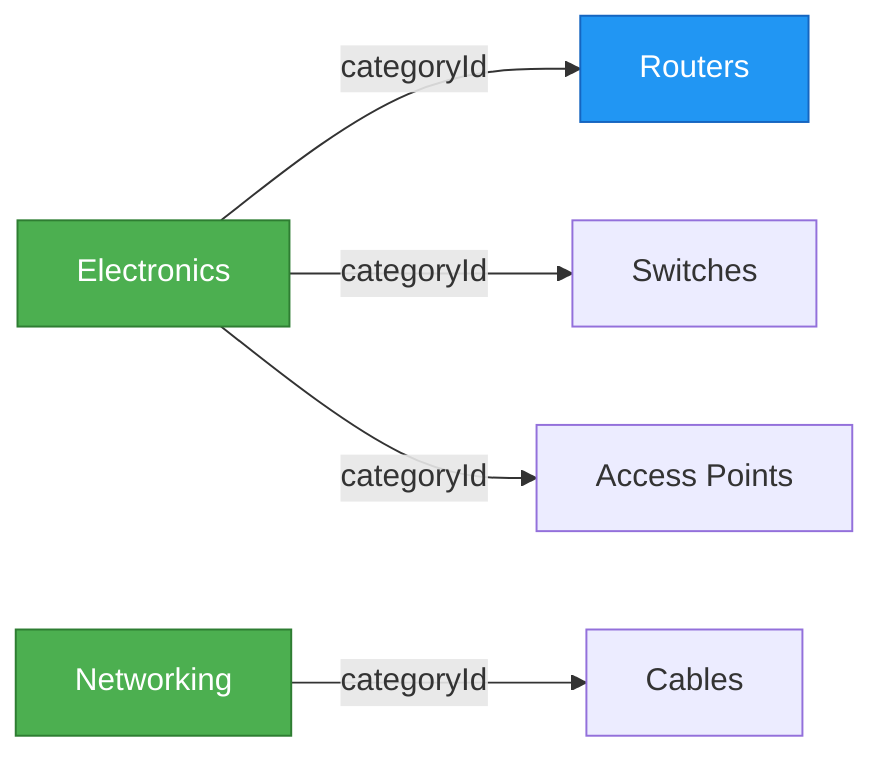
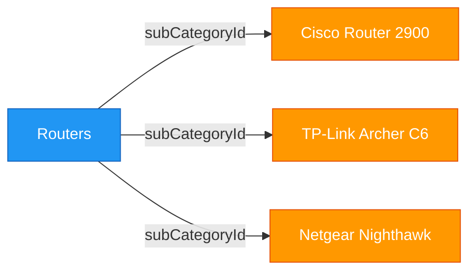
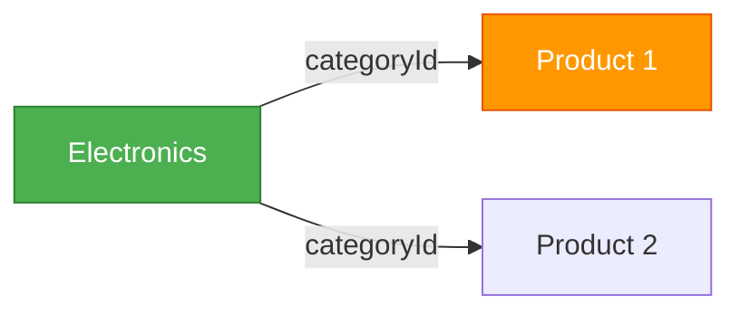
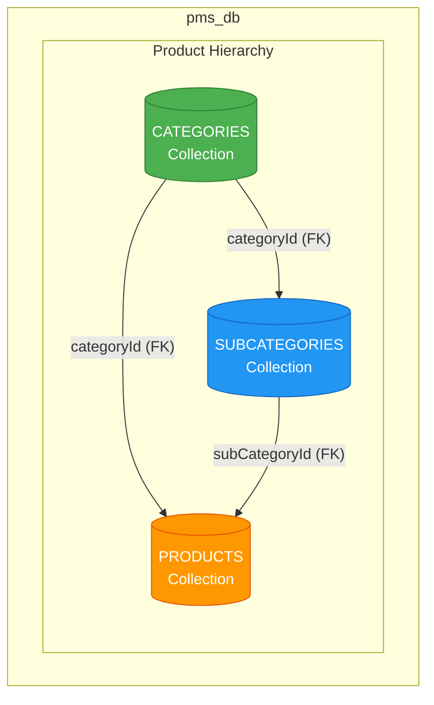
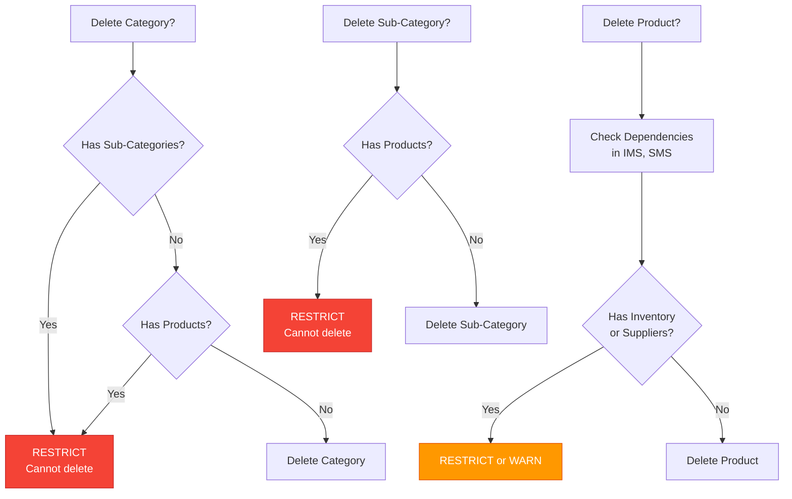
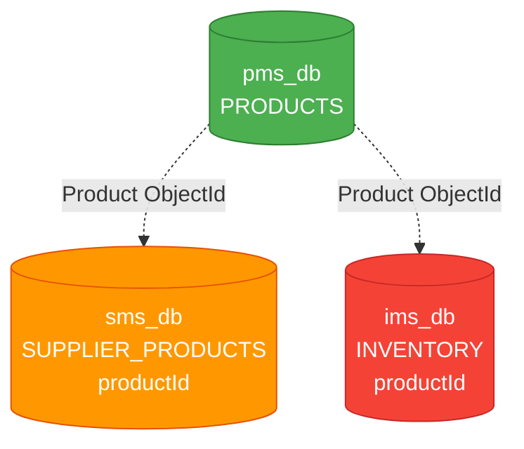

# PMS Service - ER Diagram

## Document Information
- **Project**: WLAN Corporation - Warehouse & Inventory Management System
- **Module**: Product Management System (PMS)
- **Version**: 1.0
- **Date**: January 7, 2026
- **Prepared For**: WLAN Corporation, Bengaluru

---

## 1. Overview

This document describes the Entity-Relationship (ER) model for the PMS service database. The pms_db contains three primary collections: Categories, Sub-Categories, and Products.

---

## 2. Entity-Relationship Diagram



---

## 3. Detailed Entity Descriptions

### 3.1 CATEGORIES Collection

**Purpose**: Store product category information (top-level classification).

| Field | Type | Constraints | Description |
|-------|------|-------------|-------------|
| `_id` | ObjectId | Primary Key, Auto-generated | Unique category identifier |
| `categoryName` | String | Required, Unique, Max: 100 | Category name (e.g., "Electronics", "Networking") |
| `description` | String | Optional, Max: 500 | Category description |
| `categoryCode` | String | Required, Unique, Max: 10 | Short code (e.g., "ELEC", "NET") |
| `isActive` | Boolean | Required, Default: true | Category active status |
| `createdAt` | Timestamp | Auto-generated | Record creation timestamp |
| `updatedAt` | Timestamp | Auto-updated | Last modification timestamp |
| `createdBy` | ObjectId | Optional, Foreign Key → AUTH.users._id | User who created this record |
| `updatedBy` | ObjectId | Optional, Foreign Key → AUTH.users._id | User who last updated this record |

**Indexes**:
- `categoryName`: Unique index for fast lookup
- `categoryCode`: Unique index
- `isActive`: Index for filtering active categories

---

### 3.2 SUBCATEGORIES Collection

**Purpose**: Store product sub-category information (second-level classification).

| Field | Type | Constraints | Description |
|-------|------|-------------|-------------|
| `_id` | ObjectId | Primary Key, Auto-generated | Unique sub-category identifier |
| `categoryId` | ObjectId | Required, Foreign Key → CATEGORIES._id | Parent category reference |
| `subCategoryName` | String | Required, Max: 100 | Sub-category name (e.g., "Routers", "Switches") |
| `description` | String | Optional, Max: 500 | Sub-category description |
| `subCategoryCode` | String | Required, Unique, Max: 10 | Short code (e.g., "ROUT", "SWIT") |
| `isActive` | Boolean | Required, Default: true | Sub-category active status |
| `createdAt` | Timestamp | Auto-generated | Record creation timestamp |
| `updatedAt` | Timestamp | Auto-updated | Last modification timestamp |
| `createdBy` | ObjectId | Optional, Foreign Key → AUTH.users._id | User who created this record |
| `updatedBy` | ObjectId | Optional, Foreign Key → AUTH.users._id | User who last updated this record |

**Indexes**:
- `categoryId`: Index for finding sub-categories by category
- `subCategoryCode`: Unique index
- `categoryId + subCategoryName`: Compound unique index
- `isActive`: Index for filtering active sub-categories

---

### 3.3 PRODUCTS Collection

**Purpose**: Store detailed product information with SKU and associated metadata.

| Field | Type | Constraints | Description |
|-------|------|-------------|-------------|
| `_id` | ObjectId | Primary Key, Auto-generated | Unique product identifier |
| `categoryId` | ObjectId | Required, Foreign Key → CATEGORIES._id | Product category |
| `subCategoryId` | ObjectId | Required, Foreign Key → SUBCATEGORIES._id | Product sub-category |
| `productName` | String | Required, Max: 200 | Product name |
| `sku` | String | Required, Unique, Max: 50 | Stock Keeping Unit code |
| `brand` | String | Required, Max: 100 | Product brand/manufacturer |
| `model` | String | Required, Max: 100 | Product model number |
| `description` | String | Optional, Max: 2000 | Detailed product description |
| `specifications` | Object | Optional | Technical specifications (JSON object) |
| `unitOfMeasure` | String | Required, Enum | Unit (e.g., "piece", "box", "set") |
| `weight` | Decimal | Optional | Product weight in kg |
| `dimensions` | Object | Optional | Dimensions: {length, width, height, unit} |
| `price` | Decimal | Required, Min: 0 | Product price (common across suppliers) |
| `warrantyPeriod` | String | Optional | Warranty period (e.g., "1 year", "2 years") |
| `productImage` | String | Optional, URL format | Product image URL |
| `qrCode` | String | Optional, URL format | QR code image URL |
| `barcode` | String | Optional, URL format | Barcode image URL |
| `status` | String | Required, Enum | Product status (Active, Discontinued, Out of Stock, Coming Soon) |
| `isActive` | Boolean | Required, Default: true | Product active status |
| `createdAt` | Timestamp | Auto-generated | Record creation timestamp |
| `updatedAt` | Timestamp | Auto-updated | Last modification timestamp |
| `createdBy` | ObjectId | Optional, Foreign Key → AUTH.users._id | User who created this record |
| `updatedBy` | ObjectId | Optional, Foreign Key → AUTH.users._id | User who last updated this record |

**Indexes**:
- `sku`: Unique index for fast SKU lookup
- `categoryId`: Index for filtering by category
- `subCategoryId`: Index for filtering by sub-category
- `brand`: Index for filtering by brand
- `status`: Index for filtering by status
- `productName`: Text index for search
- `categoryId + subCategoryId`: Compound index
- `isActive + status`: Compound index

---

## 4. Relationship Details

### 4.1 CATEGORIES ↔ SUBCATEGORIES (One-to-Many)



- **Cardinality**: One Category → Many Sub-Categories
- **Foreign Key**: `SUBCATEGORIES.categoryId` references `CATEGORIES._id`
- **Constraint**: categoryId is required
- **On Delete**: Restrict (cannot delete category if sub-categories exist)

---

### 4.2 SUBCATEGORIES ↔ PRODUCTS (One-to-Many)



- **Cardinality**: One Sub-Category → Many Products
- **Foreign Key**: `PRODUCTS.subCategoryId` references `SUBCATEGORIES._id`
- **Constraint**: subCategoryId is required
- **On Delete**: Restrict (cannot delete sub-category if products exist)

---

### 4.3 CATEGORIES ↔ PRODUCTS (One-to-Many - Direct)



- **Cardinality**: One Category → Many Products
- **Foreign Key**: `PRODUCTS.categoryId` references `CATEGORIES._id`
- **Constraint**: categoryId is required
- **Purpose**: Allows direct category filtering without joining sub-categories
- **Validation**: Product's categoryId must match its subCategory's parent categoryId

---

## 5. Database Schema Visualization



---

## 6. Sample Data Models

### 6.1 Sample Category Document

```json
{
  "_id": "65a1b2c3d4e5f6g7h8i9j0k1",
  "categoryName": "Electronics",
  "description": "Electronic devices and components",
  "categoryCode": "ELEC",
  "isActive": true,
  "createdAt": "2026-01-01T00:00:00.000Z",
  "updatedAt": "2026-01-01T00:00:00.000Z",
  "createdBy": "65a1b2c3d4e5f6g7h8i9j0k9",
  "updatedBy": null
}
```

---

### 6.2 Sample Sub-Category Document

```json
{
  "_id": "65a1b2c3d4e5f6g7h8i9j0k2",
  "categoryId": "65a1b2c3d4e5f6g7h8i9j0k1",
  "subCategoryName": "Routers",
  "description": "Network routers for home and enterprise use",
  "subCategoryCode": "ROUT",
  "isActive": true,
  "createdAt": "2026-01-01T00:00:00.000Z",
  "updatedAt": "2026-01-01T00:00:00.000Z",
  "createdBy": "65a1b2c3d4e5f6g7h8i9j0k9",
  "updatedBy": null
}
```

---

### 6.3 Sample Product Document

```json
{
  "_id": "65a1b2c3d4e5f6g7h8i9j0k3",
  "categoryId": "65a1b2c3d4e5f6g7h8i9j0k1",
  "subCategoryId": "65a1b2c3d4e5f6g7h8i9j0k2",
  "productName": "Cisco 2900 Series Integrated Services Router",
  "sku": "ROUT-CISCO-2900-001",
  "brand": "Cisco",
  "model": "2900",
  "description": "High-performance router with advanced security features",
  "specifications": {
    "ports": "4 Gigabit Ethernet",
    "throughput": "100 Mbps",
    "memory": "512 MB DRAM",
    "flash": "256 MB",
    "security": "Firewall, VPN, IPS"
  },
  "unitOfMeasure": "piece",
  "weight": 5.2,
  "dimensions": {
    "length": 44.3,
    "width": 17.5,
    "height": 4.4,
    "unit": "cm"
  },
  "price": 45000.00,
  "warrantyPeriod": "1 year",
  "productImage": "https://storage.example.com/products/65a1b2c3d4e5f6g7h8i9j0k3.jpg",
  "qrCode": "https://storage.example.com/qrcodes/65a1b2c3d4e5f6g7h8i9j0k3.png",
  "barcode": "https://storage.example.com/barcodes/ROUT-CISCO-2900-001.png",
  "status": "Active",
  "isActive": true,
  "createdAt": "2026-01-05T10:30:00.000Z",
  "updatedAt": "2026-01-05T10:30:00.000Z",
  "createdBy": "65a1b2c3d4e5f6g7h8i9j0k9",
  "updatedBy": null
}
```

---

## 7. Data Integrity Rules

### 7.1 Validation Rules

| Collection | Field | Validation |
|------------|-------|------------|
| CATEGORIES | categoryName | Must be unique, 3-100 characters |
| CATEGORIES | categoryCode | Must be unique, uppercase, 2-10 characters |
| SUBCATEGORIES | subCategoryName | Must be unique within category |
| SUBCATEGORIES | subCategoryCode | Must be unique, uppercase, 2-10 characters |
| SUBCATEGORIES | categoryId | Must reference existing category |
| PRODUCTS | sku | Must be unique, follows pattern |
| PRODUCTS | categoryId | Must reference existing category |
| PRODUCTS | subCategoryId | Must reference existing sub-category |
| PRODUCTS | price | Must be >= 0 |
| PRODUCTS | status | Must be one of: Active, Discontinued, Out of Stock, Coming Soon |

---

### 7.2 Referential Integrity



---

## 8. Enumerations

### 8.1 Unit of Measure

```python
UNIT_OF_MEASURE = [
    "piece",
    "box",
    "set",
    "pair",
    "pack",
    "meter",
    "kilogram"
]
```

### 8.2 Product Status

```python
PRODUCT_STATUS = [
    "Active",          # Available for sale
    "Discontinued",    # No longer produced
    "Out of Stock",    # Temporarily unavailable
    "Coming Soon"      # Future product
]
```

---

## 9. Default Seed Data

### 9.1 Seed Categories

```javascript
const categories = [
  {
    categoryName: "Electronics",
    description: "Electronic devices and components",
    categoryCode: "ELEC",
    isActive: true
  },
  {
    categoryName: "Networking",
    description: "Networking equipment and accessories",
    categoryCode: "NET",
    isActive: true
  }
];
```

### 9.2 Seed Sub-Categories

```javascript
const subCategories = [
  {
    categoryId: "<Electronics_ID>",
    subCategoryName: "Routers",
    description: "Network routers",
    subCategoryCode: "ROUT",
    isActive: true
  },
  {
    categoryId: "<Electronics_ID>",
    subCategoryName: "Switches",
    description: "Network switches",
    subCategoryCode: "SWIT",
    isActive: true
  },
  {
    categoryId: "<Electronics_ID>",
    subCategoryName: "Access Points",
    description: "Wireless access points",
    subCategoryCode: "AP",
    isActive: true
  },
  {
    categoryId: "<Networking_ID>",
    subCategoryName: "Cables",
    description: "Network cables",
    subCategoryCode: "CABL",
    isActive: true
  }
];
```

---

## 10. Compound Indexes

For optimized query performance:

```javascript
// Categories collection
db.categories.createIndex({ categoryName: 1 }, { unique: true });
db.categories.createIndex({ categoryCode: 1 }, { unique: true });
db.categories.createIndex({ isActive: 1 });

// Sub-Categories collection
db.subcategories.createIndex({ subCategoryCode: 1 }, { unique: true });
db.subcategories.createIndex({ categoryId: 1 });
db.subcategories.createIndex({ categoryId: 1, subCategoryName: 1 }, { unique: true });
db.subcategories.createIndex({ isActive: 1 });

// Products collection
db.products.createIndex({ sku: 1 }, { unique: true });
db.products.createIndex({ categoryId: 1 });
db.products.createIndex({ subCategoryId: 1 });
db.products.createIndex({ categoryId: 1, subCategoryId: 1 });
db.products.createIndex({ brand: 1 });
db.products.createIndex({ status: 1 });
db.products.createIndex({ isActive: 1, status: 1 });
db.products.createIndex({ productName: "text", brand: "text", model: "text" });
```

---

## 11. Cross-Service References



**Note**: Other services store Product ObjectIds for reference, but these are **not enforced foreign keys** due to microservice independence. Validation happens at application level.

---

## 12. Specifications Object Structure

The `specifications` field in PRODUCTS is a flexible JSON object that can store various product-specific attributes:

```json
{
  "specifications": {
    // For Routers
    "ports": "4 Gigabit Ethernet",
    "throughput": "100 Mbps",
    "memory": "512 MB DRAM",
    "flash": "256 MB",
    "security": "Firewall, VPN, IPS",
    "wifiStandard": "802.11ac",
    "antennas": "4 external",
    
    // For Switches
    "portCount": 24,
    "portSpeed": "10/100/1000 Mbps",
    "powerOverEthernet": "Yes",
    "manageable": true,
    
    // For Cables
    "cableType": "Cat6",
    "length": "10 meters",
    "shielding": "UTP",
    "connector": "RJ45"
  }
}
```

---

## 13. Dimensions Object Structure

```json
{
  "dimensions": {
    "length": 44.3,
    "width": 17.5,
    "height": 4.4,
    "unit": "cm"
  }
}
```

**Supported Units**: `cm`, `m`, `inch`, `ft`

---

## 14. Data Migration Scripts

### 14.1 Update Product Category

```javascript
// migrations/update-product-category.js
async function updateProductCategory(productId, newCategoryId, newSubCategoryId) {
  // Validate category hierarchy
  const subCategory = await db.subcategories.findOne({ _id: newSubCategoryId });
  if (!subCategory || subCategory.categoryId.toString() !== newCategoryId.toString()) {
    throw new Error('Sub-category does not belong to specified category');
  }
  
  // Update product
  await db.products.updateOne(
    { _id: productId },
    { 
      $set: { 
        categoryId: newCategoryId,
        subCategoryId: newSubCategoryId,
        updatedAt: new Date()
      } 
    }
  );
}
```

### 14.2 Bulk Update Product Status

```javascript
// migrations/bulk-update-product-status.js
async function discontinueProducts(productIds) {
  const result = await db.products.updateMany(
    { _id: { $in: productIds } },
    { 
      $set: { 
        status: 'Discontinued',
        updatedAt: new Date()
      } 
    }
  );
  
  console.log(`Discontinued ${result.modifiedCount} products`);
}
```

---

## 15. Data Validation Example (Pydantic)

```python
from pydantic import BaseModel, Field, validator
from typing import Optional, Dict
from datetime import datetime

class ProductSpecifications(BaseModel):
    ports: Optional[str] = None
    throughput: Optional[str] = None
    memory: Optional[str] = None
    # ... other fields as needed

class ProductDimensions(BaseModel):
    length: float = Field(gt=0)
    width: float = Field(gt=0)
    height: float = Field(gt=0)
    unit: str = Field(regex='^(cm|m|inch|ft)$')

class ProductCreate(BaseModel):
    categoryId: str
    subCategoryId: str
    productName: str = Field(min_length=3, max_length=200)
    sku: str = Field(min_length=5, max_length=50)
    brand: str = Field(min_length=2, max_length=100)
    model: str = Field(min_length=1, max_length=100)
    description: Optional[str] = Field(max_length=2000)
    specifications: Optional[ProductSpecifications] = None
    unitOfMeasure: str
    weight: Optional[float] = Field(gt=0)
    dimensions: Optional[ProductDimensions] = None
    price: float = Field(ge=0)
    warrantyPeriod: Optional[str] = None
    status: str = Field(default="Active")
    
    @validator('sku')
    def validate_sku_format(cls, v):
        if not v.isupper():
            raise ValueError('SKU must be uppercase')
        return v
```

---

## Document End
**Previous Document**: [1-Architecture-Diagram.md](./1-Architecture-Diagram.md)  
**Next Document**: [3-User-Stories-Use-Cases.md](./3-User-Stories-Use-Cases.md)  
**Module Progress**: PMS Documentation (2/6 documents)  
**Overall Progress**: 8/30 documents (26.7%)
