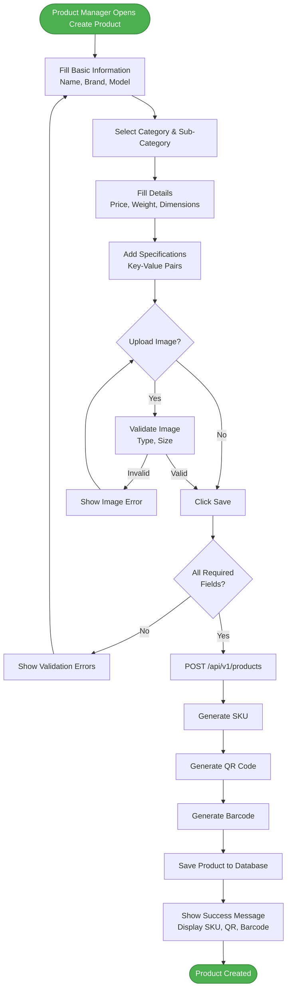
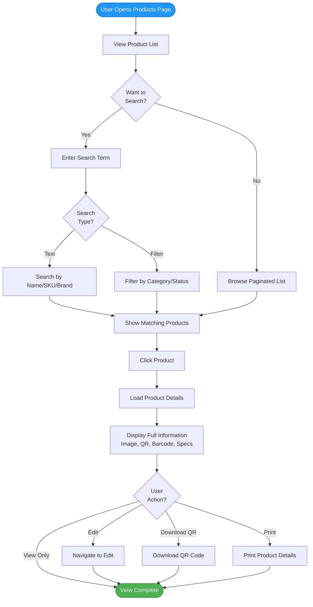
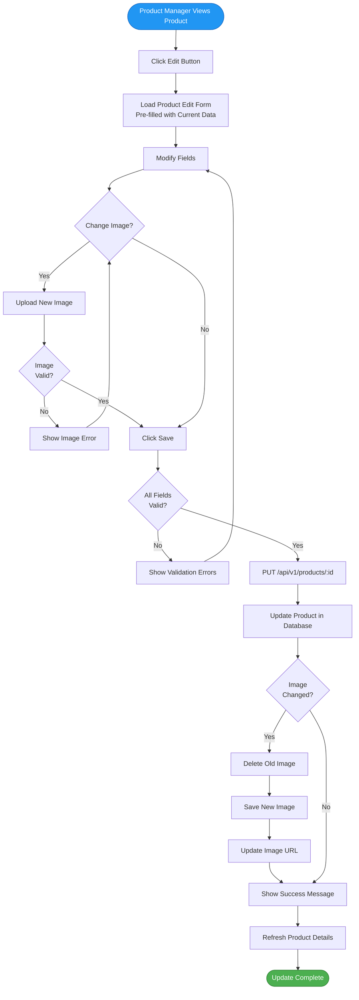
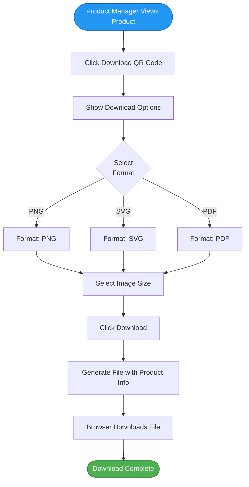
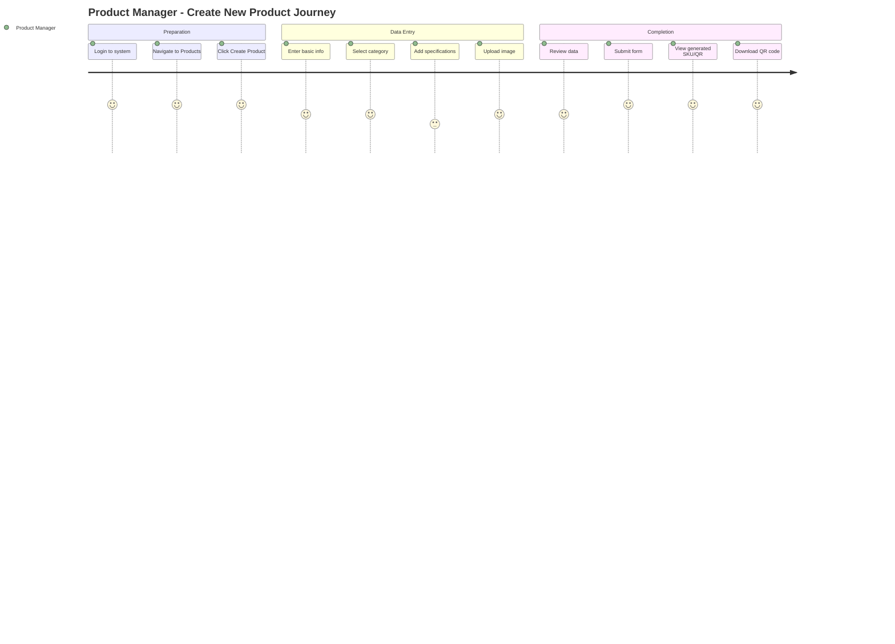
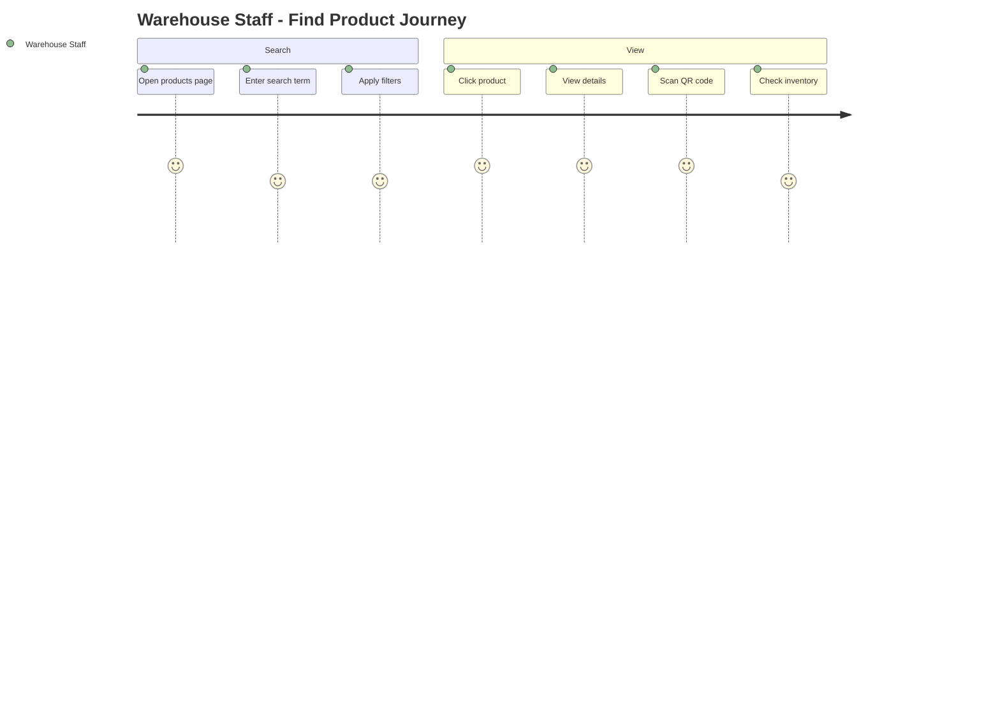

# PMS Service - User Stories & Use Cases

## Document Information
- **Project**: WLAN Corporation - Warehouse & Inventory Management System
- **Module**: Product Management System (PMS)
- **Version**: 1.0
- **Date**: January 7, 2026
- **Prepared For**: WLAN Corporation, Bengaluru

---

## 1. Overview

This document outlines user stories and detailed use cases for the Product Management System (PMS) service. It covers category management, sub-category management, and product lifecycle operations including QR code/barcode generation.

---

## 2. User Roles

| Role | Abbreviation | Primary Responsibilities |
|------|--------------|-------------------------|
| Super Admin | SA | Complete system administration |
| Product Manager | PM | Product catalog management |
| Warehouse Manager | WM | View product information |
| Inventory Manager | IM | View product information |
| Procurement Officer | PO | View product and supplier information |
| Warehouse Staff | WS | View product information |
| Auditor/Viewer | AV | Read-only access |

---

## 3. Epic 1: Category Management

### 3.1 User Story: Create Category

**As a** Product Manager  
**I want to** create new product categories  
**So that** I can organize products into logical groups

**Acceptance Criteria**:
- Product Manager can enter category name and description
- Category code is auto-generated or manually entered
- Category name must be unique
- Category code must be unique and uppercase
- Success message shown after creation
- Category appears in category list immediately

**Priority**: HIGH  
**Story Points**: 3

---

### 3.2 User Story: View All Categories

**As a** Product Manager  
**I want to** view list of all categories  
**So that** I can manage the category hierarchy

**Acceptance Criteria**:
- Can see paginated list of categories
- List shows category name, code, description, status
- Can filter by active/inactive status
- Can search by category name or code
- Can sort by name or creation date

**Priority**: HIGH  
**Story Points**: 3

---

### 3.3 User Story: Update Category

**As a** Product Manager  
**I want to** update category information  
**So that** I can keep category details current

**Acceptance Criteria**:
- Can edit category name and description
- Cannot edit category code (read-only after creation)
- Changes are saved immediately
- Audit trail records who updated
- Success message is shown

**Priority**: MEDIUM  
**Story Points**: 2

---

### 3.4 User Story: Deactivate Category

**As a** Product Manager  
**I want to** deactivate categories  
**So that** unused categories don't appear in product creation

**Acceptance Criteria**:
- Can deactivate category
- Cannot deactivate if sub-categories or products exist
- Warning message if dependencies exist
- Inactive categories don't appear in dropdown lists
- Can reactivate later

**Priority**: MEDIUM  
**Story Points**: 3

---

## 4. Epic 2: Sub-Category Management

### 4.1 User Story: Create Sub-Category

**As a** Product Manager  
**I want to** create sub-categories under categories  
**So that** I can further organize products

**Acceptance Criteria**:
- Must select parent category
- Enter sub-category name and description
- Sub-category code is auto-generated or manual
- Sub-category name must be unique within category
- Sub-category code must be globally unique
- Success message shown

**Priority**: HIGH  
**Story Points**: 3

---

### 4.2 User Story: View Sub-Categories by Category

**As a** Product Manager  
**I want to** view sub-categories for a specific category  
**So that** I can see the category hierarchy

**Acceptance Criteria**:
- Can filter sub-categories by parent category
- List shows sub-category name, code, parent category
- Can filter by active/inactive status
- Can search by sub-category name or code
- Can sort by name or creation date

**Priority**: HIGH  
**Story Points**: 3

---

### 4.3 User Story: Update Sub-Category

**As a** Product Manager  
**I want to** update sub-category information  
**So that** I can maintain accurate classifications

**Acceptance Criteria**:
- Can edit sub-category name and description
- Cannot change parent category if products exist
- Cannot edit sub-category code
- Changes are saved immediately
- Success message is shown

**Priority**: MEDIUM  
**Story Points**: 2

---

### 4.4 User Story: Deactivate Sub-Category

**As a** Product Manager  
**I want to** deactivate sub-categories  
**So that** they don't appear in product creation

**Acceptance Criteria**:
- Can deactivate sub-category
- Cannot deactivate if products exist
- Warning message if dependencies exist
- Inactive sub-categories hidden in dropdowns
- Can reactivate later

**Priority**: MEDIUM  
**Story Points**: 3

---

## 5. Epic 3: Product Management

### 5.1 User Story: Create Product

**As a** Product Manager  
**I want to** create new products  
**So that** they can be sold and tracked in inventory

**Acceptance Criteria**:
- Must select category and sub-category
- Enter product name, brand, model, description
- SKU is auto-generated based on category/brand
- Can enter specifications as key-value pairs
- Enter price, weight, dimensions
- Can upload product image
- QR code and barcode are auto-generated
- Product status defaults to "Active"
- Success message shown with SKU

**Priority**: HIGH  
**Story Points**: 8

---

### 5.2 User Story: View All Products

**As a** Product Manager  
**I want to** view list of all products  
**So that** I can manage the product catalog

**Acceptance Criteria**:
- Can see paginated list of products
- List shows SKU, name, brand, category, price, status
- Can filter by category, sub-category, brand, status
- Can search by product name, SKU, brand, model
- Can sort by name, SKU, price, creation date
- Can export list to CSV/Excel

**Priority**: HIGH  
**Story Points**: 5

---

### 5.3 User Story: View Product Details

**As a** Product Manager  
**I want to** view complete product information  
**So that** I can verify all details

**Acceptance Criteria**:
- View all product fields including specifications
- See product image
- See QR code and barcode images
- View category and sub-category hierarchy
- View creation and update history
- Can print product details

**Priority**: HIGH  
**Story Points**: 3

---

### 5.4 User Story: Update Product

**As a** Product Manager  
**I want to** update product information  
**So that** I can keep product data accurate

**Acceptance Criteria**:
- Can edit all product fields except SKU
- Can update product image (old image replaced)
- Can regenerate QR code and barcode if needed
- Changes are saved immediately
- Audit trail records who updated
- Success message is shown

**Priority**: HIGH  
**Story Points**: 5

---

### 5.5 User Story: Change Product Status

**As a** Product Manager  
**I want to** change product status  
**So that** I can manage product lifecycle

**Acceptance Criteria**:
- Can change status: Active, Discontinued, Out of Stock, Coming Soon
- Status change is immediate
- Discontinued products can't be added to new inventory
- Status is visible in product lists
- Can filter products by status

**Priority**: MEDIUM  
**Story Points**: 2

---

### 5.6 User Story: Delete Product

**As a** Product Manager  
**I want to** delete products  
**So that** I can remove incorrect or duplicate entries

**Acceptance Criteria**:
- Can delete product only if no inventory exists
- Cannot delete if product has suppliers
- Confirmation required before deletion
- Warning shown if dependencies exist
- Soft delete option (mark as deleted but keep data)
- Audit log records deletion

**Priority**: LOW  
**Story Points**: 5

---

### 5.7 User Story: Search Products

**As a** Warehouse Staff  
**I want to** search products by various criteria  
**So that** I can quickly find specific products

**Acceptance Criteria**:
- Can search by product name, SKU, brand, model
- Search is case-insensitive
- Results show in real-time as typing
- Can search within filtered results
- Search highlights matching text

**Priority**: HIGH  
**Story Points**: 3

---

### 5.8 User Story: Scan Product QR Code

**As a** Warehouse Staff  
**I want to** scan product QR code  
**So that** I can quickly view product details

**Acceptance Criteria**:
- Mobile app can scan QR code using camera
- QR code lookup is instant
- Shows complete product information
- Shows current stock levels (from IMS)
- Shows product location in warehouse (from WMS)

**Priority**: HIGH  
**Story Points**: 5

---

## 6. Epic 4: QR Code & Barcode Management

### 6.1 User Story: Auto-Generate QR Code

**As a** Product Manager  
**I want to** QR codes to be automatically generated  
**So that** products can be tracked easily

**Acceptance Criteria**:
- QR code generated when product is created
- QR code contains product ID, SKU, name, category
- QR code image is stored and URL saved to product
- Can download QR code image
- Can regenerate if needed

**Priority**: HIGH  
**Story Points**: 5

---

### 6.2 User Story: Auto-Generate Barcode

**As a** Product Manager  
**I want to** barcodes to be automatically generated  
**So that** products can be scanned with standard scanners

**Acceptance Criteria**:
- Barcode generated from SKU when product is created
- Barcode uses standard format (Code128)
- Barcode image is stored and URL saved to product
- Can download barcode image
- Can print barcode labels

**Priority**: HIGH  
**Story Points**: 5

---

### 6.3 User Story: Download QR/Barcode

**As a** Product Manager  
**I want to** download QR codes and barcodes  
**So that** I can print labels for products

**Acceptance Criteria**:
- Can download individual QR code/barcode
- Can bulk download for multiple products
- Download format options: PNG, SVG, PDF
- Can specify image size/resolution
- Includes product name and SKU in download

**Priority**: MEDIUM  
**Story Points**: 3

---

### 6.4 User Story: Regenerate QR/Barcode

**As a** Product Manager  
**I want to** regenerate QR codes and barcodes  
**So that** I can fix corrupted or incorrect codes

**Acceptance Criteria**:
- Can regenerate for individual product
- Old QR/barcode images are archived
- New QR/barcode URLs updated in product
- Confirmation required before regeneration
- Success message shown

**Priority**: LOW  
**Story Points**: 3

---

## 7. Detailed Use Cases

### 7.1 Use Case: UC-PMS-001 - Create Product

**Actors**: Product Manager

**Preconditions**:
- User is logged in as Product Manager
- At least one category and sub-category exist

**Main Flow**:
1. Product Manager navigates to Products page
2. Product Manager clicks "Create Product" button
3. System displays product creation form
4. Product Manager enters:
   - Product Name
   - Brand
   - Model
   - Description
   - Selects Category from dropdown
   - Selects Sub-Category from dropdown (filtered by category)
   - Unit of Measure
   - Price
   - Weight (optional)
   - Dimensions (optional)
   - Warranty Period (optional)
5. Product Manager adds specifications as key-value pairs
6. Product Manager uploads product image (optional)
7. Product Manager clicks "Save" button
8. System validates all required fields
9. System validates image (if uploaded): type, size
10. System generates SKU based on category code, sub-category code, brand
11. System generates QR code containing product details
12. System generates barcode from SKU
13. System saves product image to storage
14. System saves QR code and barcode images
15. System creates product record in database with image URLs
16. System shows success message with product details
17. System displays generated SKU, QR code, and barcode
18. Product Manager can download QR/barcode or continue

**Alternate Flows**:

**A1: Validation Error**
- At step 8, if required fields are missing
- System shows validation errors
- Returns to step 4

**A2: Invalid Image**
- At step 9, if image is wrong format or too large
- System shows "Invalid image format or size exceeds 5MB"
- Returns to step 6

**A3: Category/Sub-Category Mismatch**
- At step 8, if sub-category doesn't belong to selected category
- System shows "Invalid category/sub-category combination"
- Returns to step 4

**A4: Duplicate SKU**
- At step 10, if generated SKU already exists
- System increments sequence number and retries
- Continues to step 11

**Postconditions**:
- Product is created in database
- SKU is assigned
- QR code and barcode are generated
- Product appears in product list

---

### 7.2 Use Case: UC-PMS-002 - Search and View Product

**Actors**: Product Manager, Warehouse Staff, Inventory Manager

**Preconditions**:
- User is logged in
- Products exist in database

**Main Flow**:
1. User navigates to Products page
2. System displays paginated list of products (10 per page)
3. User can see: SKU, Name, Brand, Category, Price, Status
4. User enters search term in search box
5. System searches across: Product Name, SKU, Brand, Model
6. System displays matching results in real-time
7. User can apply additional filters:
   - Category
   - Sub-Category
   - Brand
   - Status
8. User clicks on a product from the list
9. System loads complete product details
10. System displays:
    - All product information
    - Product image
    - QR code image
    - Barcode image
    - Specifications table
    - Creation and update timestamps
11. User can perform actions:
    - Download QR code
    - Download barcode
    - Print product details
    - Edit product (if Product Manager)

**Alternate Flows**:

**A1: No Search Results**
- At step 6, if no products match search
- System shows "No products found"
- Shows option to clear search

**A2: Empty Product List**
- At step 2, if no products exist
- System shows "No products available. Create your first product"
- Shows "Create Product" button

**Postconditions**:
- User has viewed product information
- User may have downloaded QR/barcode

---

### 7.3 Use Case: UC-PMS-003 - Update Product

**Actors**: Product Manager

**Preconditions**:
- User is logged in as Product Manager
- Product exists

**Main Flow**:
1. Product Manager views product details
2. Product Manager clicks "Edit" button
3. System displays edit form pre-filled with current data
4. Product Manager modifies desired fields:
   - Product Name
   - Brand
   - Model
   - Description
   - Price
   - Specifications
   - Weight
   - Dimensions
   - Warranty Period
   - Status
5. Product Manager can upload new product image
6. Product Manager clicks "Save" button
7. System validates all fields
8. System updates product record in database
9. If image changed, system deletes old image and saves new one
10. System records updatedBy and updatedAt
11. System shows success message
12. System refreshes product details view

**Alternate Flows**:

**A1: Cannot Edit SKU**
- SKU field is read-only
- Cannot be modified after creation

**A2: Cannot Change Category if Inventory Exists**
- At step 7, if product has inventory records
- System shows "Cannot change category. Product has inventory."
- Returns to step 4

**A3: Validation Error**
- At step 7, if fields are invalid
- System shows validation errors
- Returns to step 4

**Postconditions**:
- Product is updated
- Audit trail records change
- Updated data is visible immediately

---

### 7.4 Use Case: UC-PMS-004 - Generate and Download QR Code

**Actors**: Product Manager

**Preconditions**:
- User is logged in as Product Manager
- Product has QR code generated

**Main Flow**:
1. Product Manager views product details
2. Product Manager clicks "Download QR Code" button
3. System displays download options modal
4. Product Manager selects format: PNG, SVG, or PDF
5. Product Manager selects image size: Small (300x300), Medium (500x500), Large (800x800)
6. Product Manager clicks "Download" button
7. System generates QR code file in selected format
8. System includes product name and SKU in filename
9. System triggers browser download
10. File is saved to user's device

**Alternate Flows**:

**A1: Bulk Download**
- From product list, user selects multiple products
- User clicks "Bulk Download QR Codes"
- System generates ZIP file with all QR codes
- ZIP file is downloaded

**A2: Regenerate QR Code**
- User clicks "Regenerate QR Code"
- System generates new QR code
- Old QR code is archived
- New QR code URL updated in product record

**Postconditions**:
- QR code file is downloaded
- User can print or use QR code

---

## 8. Non-Functional Requirements

### 8.1 Performance Requirements

| ID | Requirement | Priority |
|----|-------------|----------|
| NFR-PERF-001 | Product list API response time < 500ms | HIGH |
| NFR-PERF-002 | Product search response time < 300ms | HIGH |
| NFR-PERF-003 | QR code generation time < 2 seconds | HIGH |
| NFR-PERF-004 | Product image upload < 10 seconds for 5MB | MEDIUM |
| NFR-PERF-005 | Support 50 concurrent product operations | MEDIUM |

---

### 8.2 Usability Requirements

| ID | Requirement | Priority |
|----|-------------|----------|
| NFR-USE-001 | Product creation form should be single page | HIGH |
| NFR-USE-002 | Auto-save draft products every 30 seconds | LOW |
| NFR-USE-003 | Sub-category dropdown filtered by selected category | HIGH |
| NFR-USE-004 | Image preview before upload | MEDIUM |
| NFR-USE-005 | Inline editing for simple fields | LOW |

---

### 8.3 Data Requirements

| ID | Requirement | Priority |
|----|-------------|----------|
| NFR-DATA-001 | Support minimum 10,000 products | HIGH |
| NFR-DATA-002 | SKU must be unique globally | HIGH |
| NFR-DATA-003 | Product images max 5MB | HIGH |
| NFR-DATA-004 | Specifications support unlimited key-value pairs | MEDIUM |
| NFR-DATA-005 | Audit trail for all product changes | MEDIUM |

---

## 9. User Journey Maps

### 9.1 Product Creation Journey

---

### 9.2 Product Search Journey

---

## Document End
**Previous Document**: [2-ER-Diagram.md](./2-ER-Diagram.md)  
**Next Document**: [4-API-Endpoint-Specifications.md](./4-API-Endpoint-Specifications.md)  
**Module Progress**: PMS Documentation (3/6 documents)  
**Overall Progress**: 9/30 documents (30.0%)
