# PMS Service - Integration & Flow Diagrams

## Document Information
- **Project**: WLAN Corporation - Warehouse & Inventory Management System
- **Module**: Product Management System (PMS)
- **Version**: 1.0
- **Date**: January 7, 2026
- **Prepared For**: WLAN Corporation, Bengaluru

---

## 1. Overview

This document illustrates the integration flows and process diagrams for the Product Management System (PMS). It shows how PMS integrates with other microservices and the detailed flow of key operations.

---

## 2. Service Integration Architecture

### 2.1 PMS Integration Map

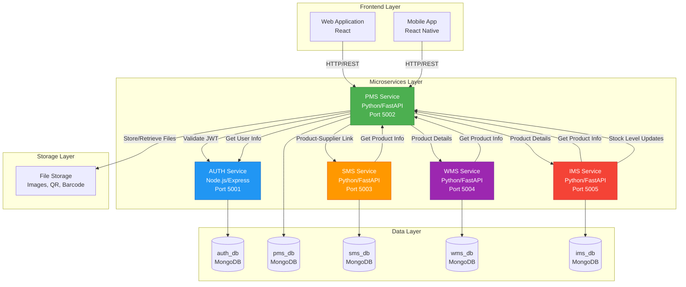

---

## 3. Authentication Flow

### 3.1 JWT Token Validation

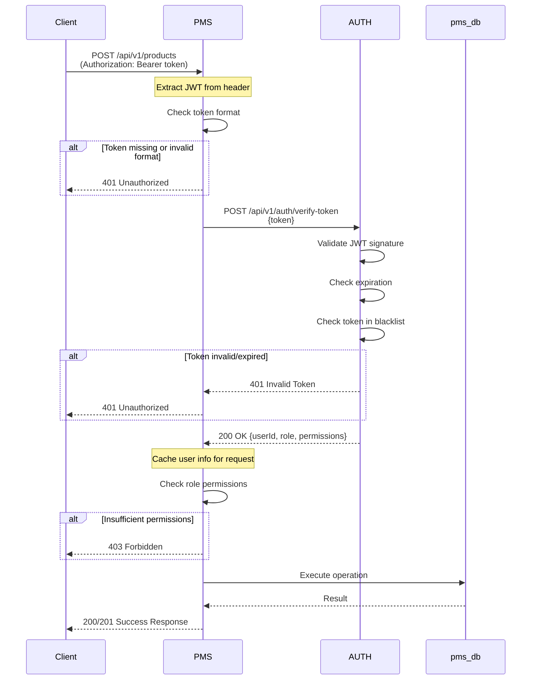

---

## 4. Product Management Flows

### 4.1 Create Product Flow

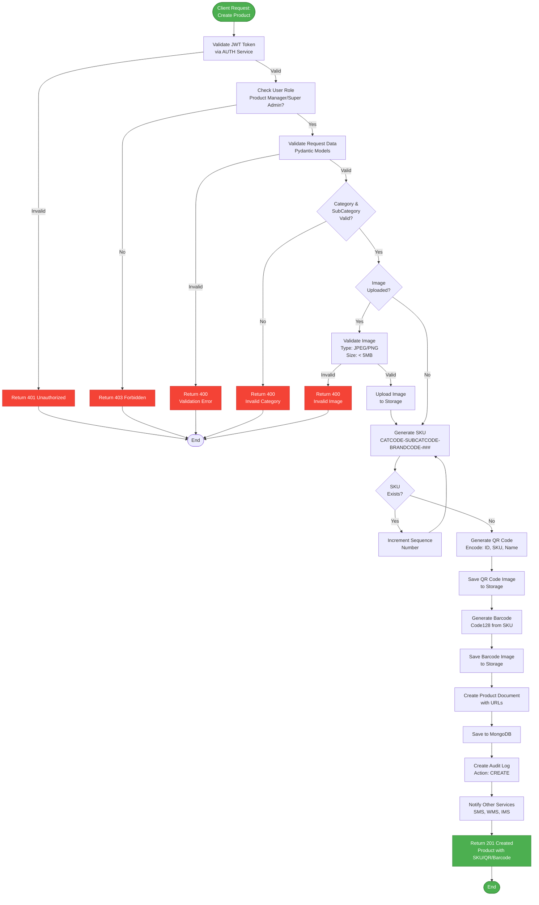

### 4.2 Update Product Flow

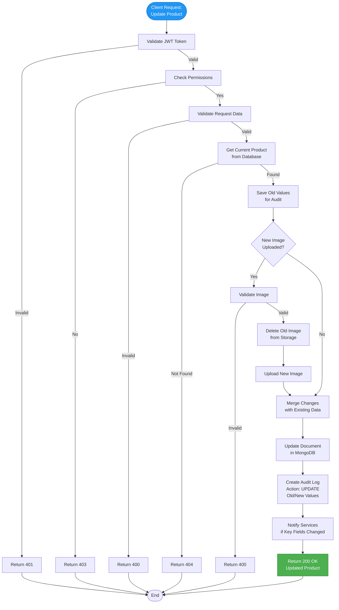

### 4.3 Delete Product Flow

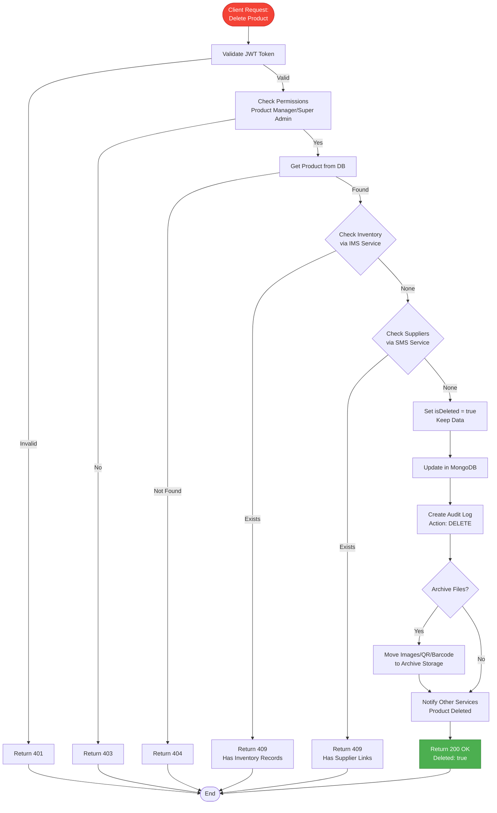

---

## 5. QR Code & Barcode Flows

### 5.1 QR Code Generation Flow

```mermaid
flowchart TD
    Start([QR Code Generation<br/>Triggered]) --> PrepareData[Prepare QR Data<br/>JSON Object]
    
    PrepareData --> EncodeData{Data<br/>Structure}
    
    EncodeData --> CreateJSON["JSON Structure:<br/>{
        id: productId,
        sku: sku,
        name: name,
        categoryId: categoryId,
        price: price,
        timestamp: now
    }"]
    
    CreateJSON --> Base64Encode[Base64 Encode<br/>JSON String]
    Base64Encode --> GenQR[Generate QR Code<br/>Using qrcode Library]
    
    GenQR --> SetParams["Set Parameters:<br/>- Version: Auto<br/>- Error Correction: H<br/>- Box Size: 10<br/>- Border: 4"]
    
    SetParams --> CreateImage[Create QR Image<br/>PIL Image Object]
    CreateImage --> SaveBuffer[Save to BytesIO<br/>Buffer]
    
    SaveBuffer --> UploadStorage[Upload to Storage<br/>Path: /qrcodes/{productId}.png]
    UploadStorage --> GetURL[Get Public URL]
    
    GetURL --> UpdateProduct[Update Product Document<br/>qrCodeUrl Field]
    UpdateProduct --> ReturnURL[Return QR Code URL]
    
    ReturnURL --> End([QR Code Ready])
    
    style Start fill:#9C27B0,stroke:#6A1B9A,color:#fff
    style End fill:#4CAF50,stroke:#2E7D32,color:#fff
```

### 5.2 Barcode Generation Flow

```mermaid
flowchart TD
    Start([Barcode Generation<br/>Triggered]) --> GetSKU[Get Product SKU]
    
    GetSKU --> ValidateSKU{SKU<br/>Valid?}
    ValidateSKU -->|No| Error[Return Error]
    
    ValidateSKU -->|Yes| SelectFormat[Select Barcode Format<br/>Code128]
    
    SelectFormat --> GenBarcode[Generate Barcode<br/>Using python-barcode]
    
    GenBarcode --> SetOptions["Set Options:<br/>- Format: Code128<br/>- Add Checksum: True<br/>- Show Text: True<br/>- Font Size: 10"]
    
    SetOptions --> CreateImage[Create Barcode Image<br/>SVG/PNG]
    CreateImage --> AddText[Add SKU Text Below<br/>Barcode]
    
    AddText --> SaveBuffer[Save to BytesIO<br/>Buffer]
    SaveBuffer --> UploadStorage[Upload to Storage<br/>Path: /barcodes/{productId}.png]
    
    UploadStorage --> GetURL[Get Public URL]
    GetURL --> UpdateProduct[Update Product Document<br/>barcodeUrl Field]
    
    UpdateProduct --> ReturnURL[Return Barcode URL]
    ReturnURL --> End([Barcode Ready])
    
    Error --> End
    
    style Start fill:#9C27B0,stroke:#6A1B9A,color:#fff
    style End fill:#4CAF50,stroke:#2E7D32,color:#fff
```

### 5.3 QR Code Scan Flow (Mobile)

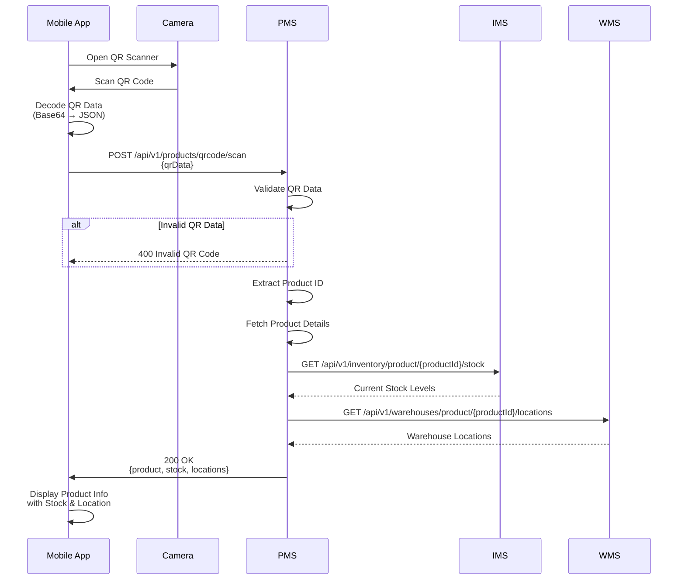

---

## 6. Inter-Service Communication

### 6.1 PMS ↔ SMS Integration

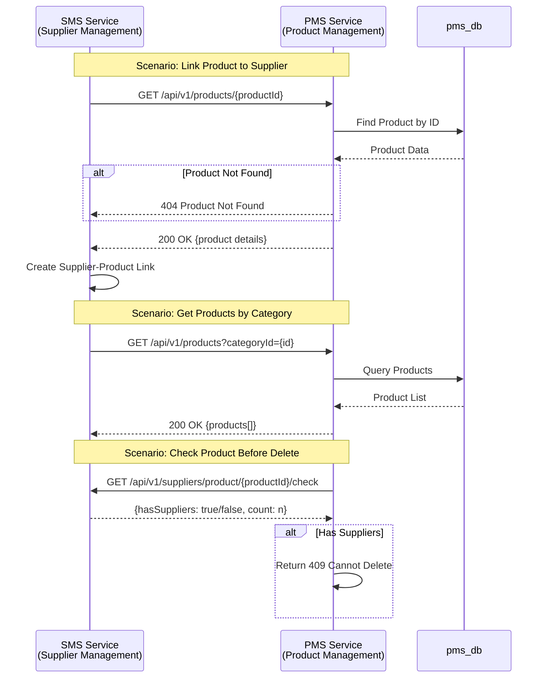

### 6.2 PMS ↔ WMS Integration

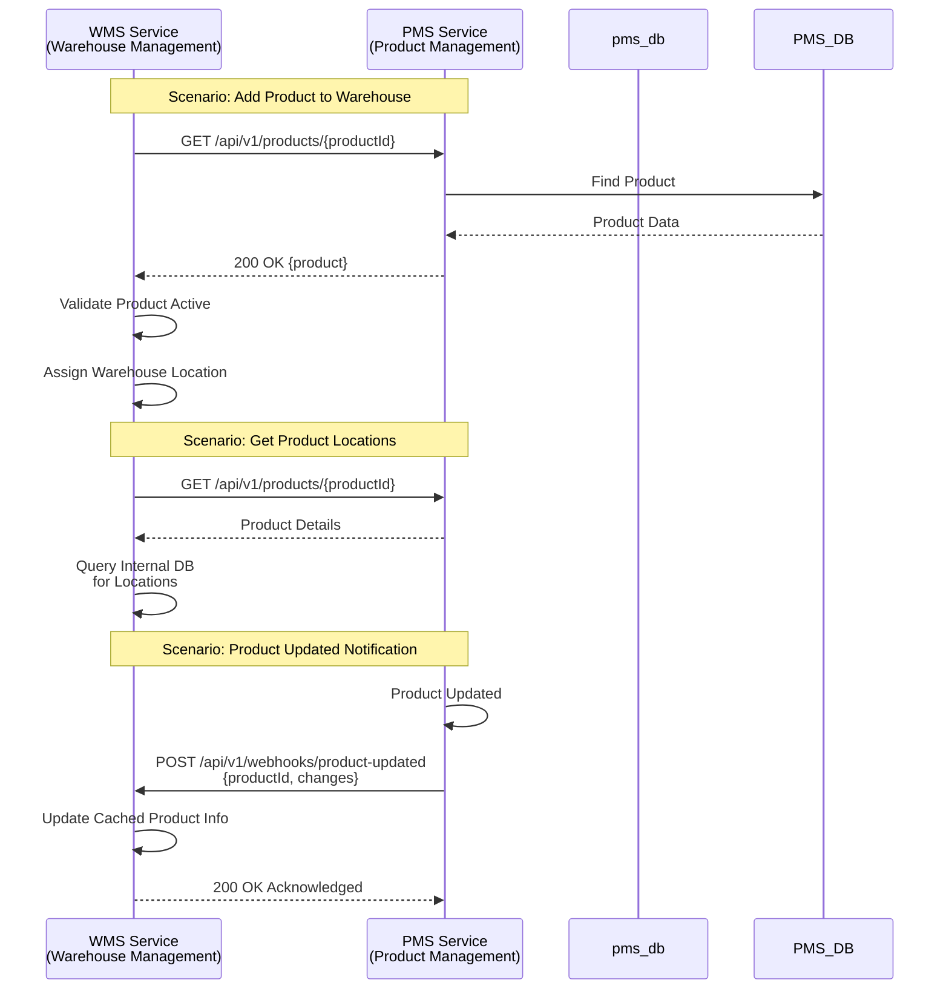

### 6.3 PMS ↔ IMS Integration

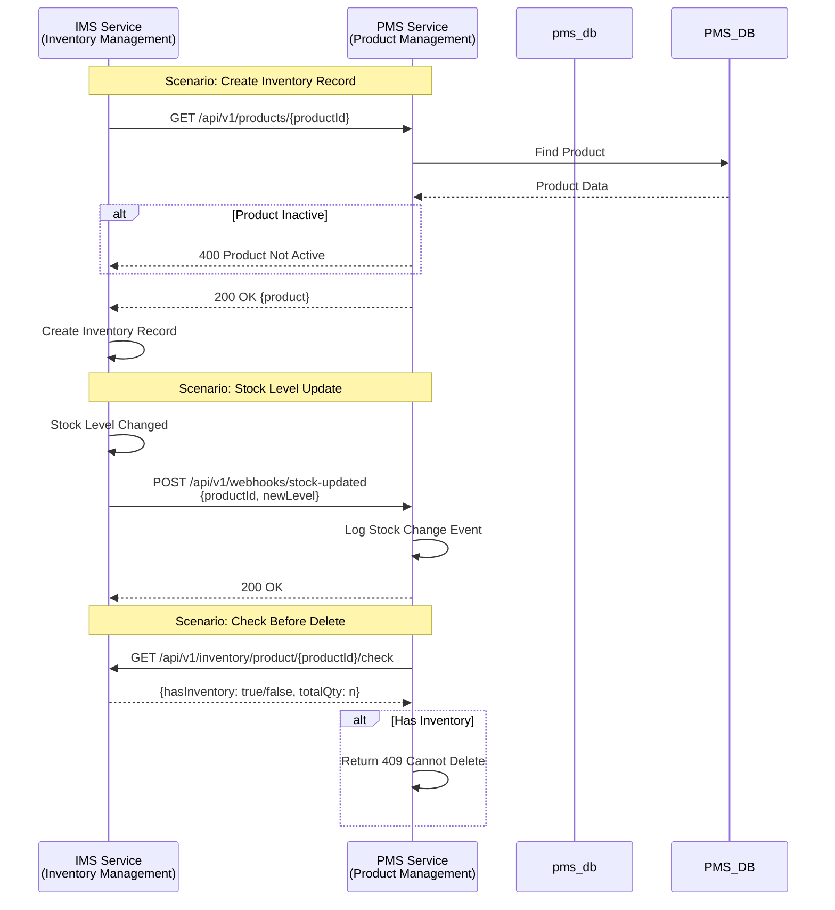

---

## 7. Error Handling Flows

### 7.1 Global Error Handling

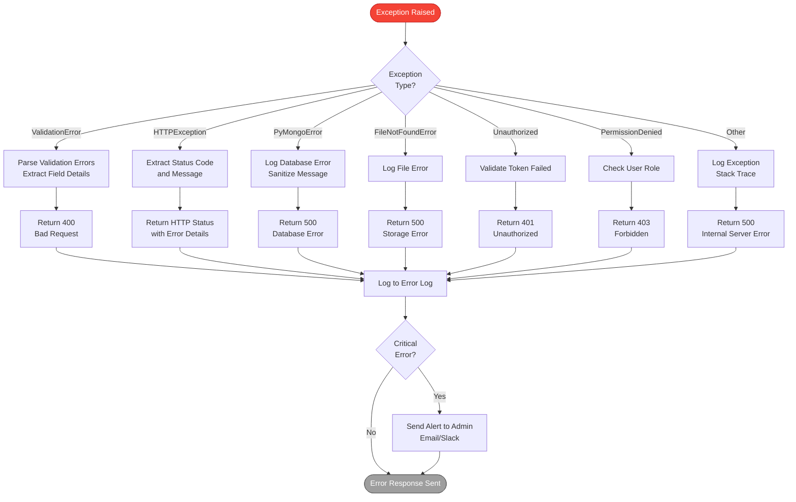

### 7.2 Retry Mechanism for External Calls

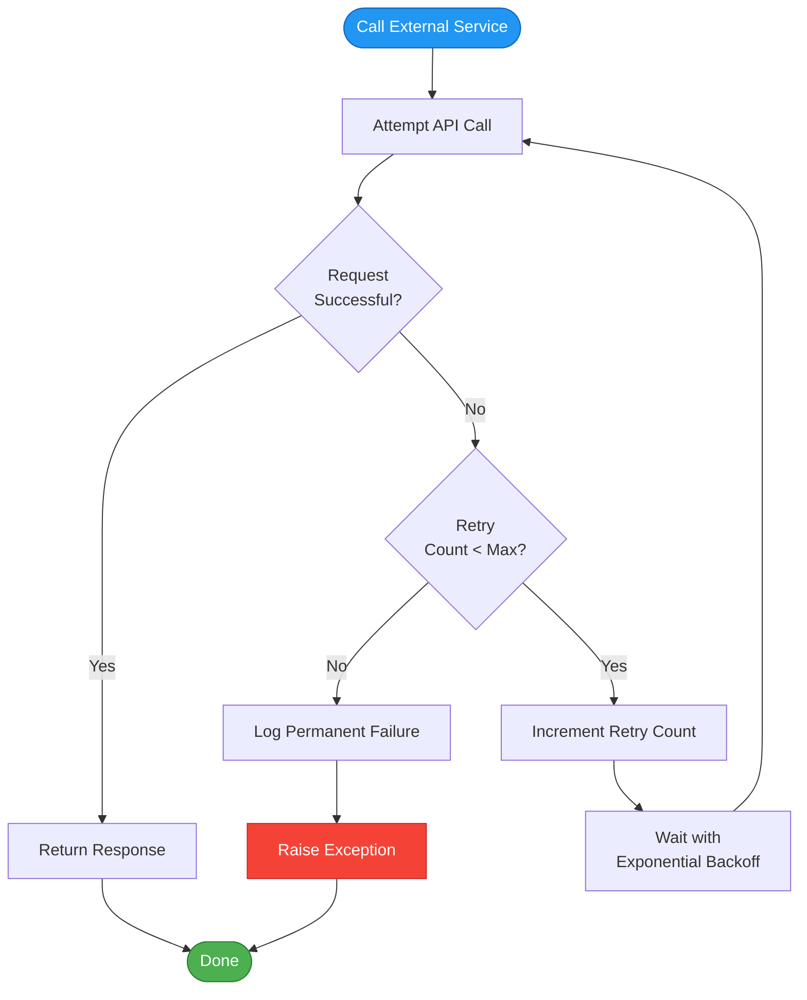

---

## 8. Data Flow Diagrams

### 8.1 Product Search Data Flow

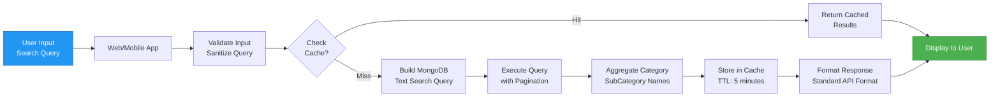

### 8.2 Bulk QR Code Download Flow

```mermaid
flowchart TD
    Start([Client Request:<br/>Bulk Download QR]) --> ValidateAuth[Validate JWT]
    
    ValidateAuth --> CheckPerms[Check Permissions]
    CheckPerms --> ValidateInput[Validate Product IDs<br/>Max: 100 per request]
    
    ValidateInput --> FetchProducts[Fetch Products<br/>from Database]
    
    FetchProducts --> CheckExists{All Products<br/>Exist?}
    
    CheckExists -->|No| Return404[Return 404<br/>Some Products Not Found]
    CheckExists -->|Yes| CreateTemp[Create Temp Directory]
    
    CreateTemp --> LoopProducts[Loop Through Products]
    
    LoopProducts --> GenQR[Generate QR Code<br/>for Each Product]
    GenQR --> SaveFile[Save to Temp Dir<br/>Filename: SKU-QR.png]
    
    SaveFile --> NextProduct{More<br/>Products?}
    NextProduct -->|Yes| LoopProducts
    
    NextProduct -->|No| CreateZip[Create ZIP Archive<br/>QRCodes-{date}.zip]
    
    CreateZip --> StreamZip[Stream ZIP to Client<br/>Content-Type: application/zip]
    
    StreamZip --> Cleanup[Delete Temp Directory]
    Cleanup --> End([Download Complete])
    
    Return404 --> End
    
    style Start fill:#9C27B0,stroke:#6A1B9A,color:#fff
    style End fill:#4CAF50,stroke:#2E7D32,color:#fff
```

---

## 9. File Upload & Storage Flow

### 9.1 Product Image Upload

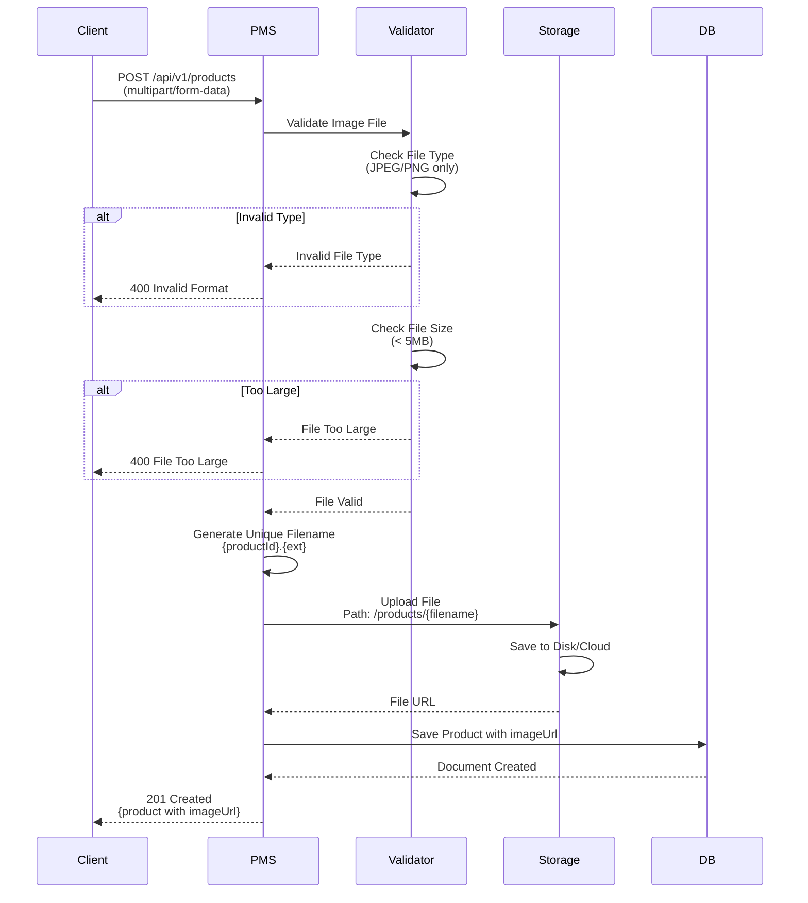

### 9.2 File Storage Structure

```
file_storage/
├── products/
│   ├── {productId1}.jpg
│   ├── {productId2}.png
│   └── ...
├── qrcodes/
│   ├── {productId1}.png
│   ├── {productId2}.png
│   └── ...
├── barcodes/
│   ├── {productId1}.png
│   ├── {productId2}.png
│   └── ...
└── archive/
    ├── products/
    ├── qrcodes/
    └── barcodes/
```

---

## 10. Webhook & Event Notifications

### 10.1 Product Update Event Flow

```mermaid
flowchart TD
    Start([Product Updated<br/>in PMS]) --> DetermineChange{What<br/>Changed?}
    
    DetermineChange -->|Price| PriceEvent[Create Price Update Event]
    DetermineChange -->|Status| StatusEvent[Create Status Update Event]
    DetermineChange -->|Basic Info| InfoEvent[Create Info Update Event]
    DetermineChange -->|Category| CategoryEvent[Create Category Update Event]
    
    PriceEvent --> BuildPayload1[Build Event Payload<br/>productId, oldPrice, newPrice]
    StatusEvent --> BuildPayload2[Build Event Payload<br/>productId, oldStatus, newStatus]
    InfoEvent --> BuildPayload3[Build Event Payload<br/>productId, changes{}]
    CategoryEvent --> BuildPayload4[Build Event Payload<br/>productId, oldCategory, newCategory]
    
    BuildPayload1 --> PublishEvent
    BuildPayload2 --> PublishEvent
    BuildPayload3 --> PublishEvent
    BuildPayload4 --> PublishEvent
    
    PublishEvent[Publish to Event Queue] --> NotifySMS[Notify SMS Service<br/>POST /webhooks/product-updated]
    
    NotifySMS --> NotifyWMS[Notify WMS Service<br/>POST /webhooks/product-updated]
    
    NotifyWMS --> NotifyIMS[Notify IMS Service<br/>POST /webhooks/product-updated]
    
    NotifyIMS --> LogEvent[Log Event<br/>in product_audit]
    
    LogEvent --> End([Event Published])
    
    style Start fill:#FF9800,stroke:#E65100,color:#fff
    style End fill:#4CAF50,stroke:#2E7D32,color:#fff
```

### 10.2 Webhook Payload Structure

```json
{
  "eventType": "product.updated",
  "eventId": "evt_6789abcd1234567890123460",
  "timestamp": "2026-01-07T12:00:00Z",
  "source": "PMS",
  "data": {
    "productId": "6789abcd1234567890123458",
    "sku": "ELEC-SMART-APL-001",
    "changes": {
      "price": {
        "old": 129900.00,
        "new": 124900.00
      },
      "status": {
        "old": "Active",
        "new": "Discontinued"
      }
    },
    "updatedBy": "6789abcd1234567890123451",
    "updatedAt": "2026-01-07T12:00:00Z"
  }
}
```

---

## 11. Performance Optimization Flows

### 11.1 Database Query Optimization

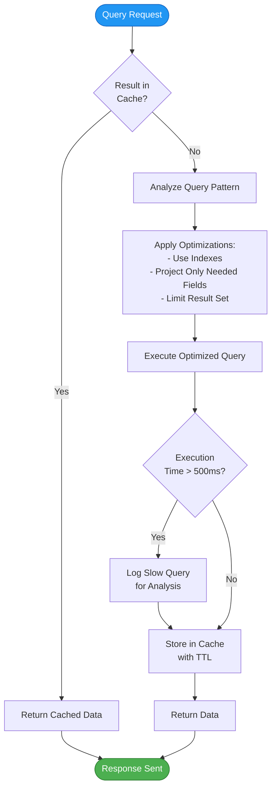

### 11.2 Image Processing Pipeline

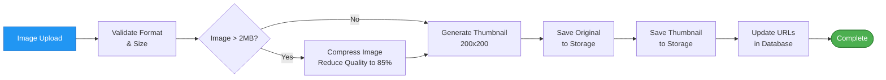

---

## 12. Monitoring & Logging

### 12.1 Request Logging Flow

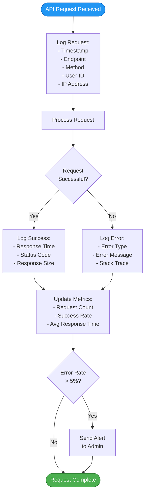

### 12.2 Health Check Flow

```mermaid
sequenceDiagram
    participant Monitor as Monitoring System
    participant PMS
    participant pms_db
    participant Storage
    participant AUTH
    
    loop Every 30 seconds
        Monitor->>PMS: GET /api/v1/health
        
        PMS->>PMS: Check Service Status
        
        PMS->>pms_db: Ping Database
        pms_db-->>PMS: Pong (response time)
        
        alt DB Response > 100ms
            PMS->>PMS: Status: Degraded
        end
        
        PMS->>Storage: Check Storage Access
        Storage-->>PMS: Storage Available
        
        alt Storage Unreachable
            PMS->>PMS: Status: Degraded
        end
        
        PMS->>AUTH: GET /api/v1/health
        AUTH-->>PMS: Auth Service Status
        
        PMS->>Monitor: Health Status<br/>{status, db, storage, auth, uptime}
        
        alt Status != Healthy
            Monitor->>Monitor: Trigger Alert
            Monitor->>Monitor: Log Incident
        end
    end
```

---

## 13. Security Flows

### 13.1 Input Validation & Sanitization

```mermaid
flowchart TD
    Input([User Input Received]) --> CheckType[Check Data Type<br/>String/Number/Object]
    
    CheckType --> ValidateType{Type<br/>Matches<br/>Expected?}
    
    ValidateType -->|No| RejectType[Reject: Invalid Type]
    ValidateType -->|Yes| CheckLength[Check String Length<br/>Min/Max Constraints]
    
    CheckLength --> ValidateLength{Length<br/>Valid?}
    ValidateLength -->|No| RejectLength[Reject: Invalid Length]
    ValidateLength -->|Yes| SanitizeInput[Sanitize Input:<br/>- Remove HTML Tags<br/>- Escape Special Chars<br/>- Trim Whitespace]
    
    SanitizeInput --> ValidateFormat{Format<br/>Valid?}
    ValidateFormat -->|No| RejectFormat[Reject: Invalid Format]
    ValidateFormat -->|Yes| CheckInjection[Check for Injection:<br/>- SQL Injection<br/>- NoSQL Injection<br/>- XSS Patterns]
    
    CheckInjection --> InjectionFound{Injection<br/>Detected?}
    InjectionFound -->|Yes| RejectInjection[Reject: Security Threat<br/>Log Incident]
    InjectionFound -->|No| Accept[Accept Input]
    
    RejectType --> End([Validation Failed])
    RejectLength --> End
    RejectFormat --> End
    RejectInjection --> End
    Accept --> End2([Input Valid])
    
    style Input fill:#2196F3,stroke:#1565C0,color:#fff
    style Accept fill:#4CAF50,stroke:#2E7D32,color:#fff
    style RejectInjection fill:#F44336,stroke:#C62828,color:#fff
```

### 13.2 Rate Limiting Flow

```mermaid
flowchart TD
    Request([API Request]) --> GetKey[Get Rate Limit Key<br/>User ID or IP]
    
    GetKey --> CheckCache[Check Redis Cache<br/>for Request Count]
    
    CheckCache --> Exists{Key<br/>Exists?}
    
    Exists -->|No| CreateKey[Create Key<br/>Count = 1<br/>TTL = 60s]
    CreateKey --> AllowRequest
    
    Exists -->|Yes| GetCount[Get Current Count]
    GetCount --> CheckLimit{Count <<br/>Limit?}
    
    CheckLimit -->|No| RejectRequest[Reject: 429 Too Many Requests<br/>Set Retry-After Header]
    CheckLimit -->|Yes| IncrementCount[Increment Count]
    
    IncrementCount --> AllowRequest[Allow Request<br/>Set Rate Limit Headers]
    
    AllowRequest --> ProcessRequest[Process Request]
    ProcessRequest --> End1([Success])
    
    RejectRequest --> LogAttempt[Log Rate Limit Violation]
    LogAttempt --> End2([Request Blocked])
    
    style Request fill:#2196F3,stroke:#1565C0,color:#fff
    style ProcessRequest fill:#4CAF50,stroke:#2E7D32,color:#fff
    style RejectRequest fill:#F44336,stroke:#C62828,color:#fff
```

---

## 14. Deployment Flow

### 14.1 CI/CD Pipeline

```mermaid
flowchart TD
    Start([Code Pushed to Git]) --> Trigger[Trigger CI/CD Pipeline]
    
    Trigger --> Checkout[Checkout Code]
    Checkout --> InstallDeps[Install Dependencies<br/>pip install -r requirements.txt]
    
    InstallDeps --> Lint[Run Linter<br/>flake8, black]
    Lint --> LintPass{Lint<br/>Passed?}
    
    LintPass -->|No| FailLint[Pipeline Failed:<br/>Lint Errors]
    LintPass -->|Yes| RunTests[Run Unit Tests<br/>pytest]
    
    RunTests --> TestPass{Tests<br/>Passed?}
    TestPass -->|No| FailTests[Pipeline Failed:<br/>Test Failures]
    TestPass -->|Yes| BuildImage[Build Docker Image<br/>pms-service:latest]
    
    BuildImage --> TagImage[Tag Image<br/>pms-service:{version}]
    TagImage --> PushRegistry[Push to Container Registry]
    
    PushRegistry --> DeployEnv{Deploy to<br/>Environment?}
    
    DeployEnv -->|Dev| DeployDev[Deploy to Dev<br/>Update Container]
    DeployEnv -->|Staging| DeployStaging[Deploy to Staging<br/>Update Container]
    DeployEnv -->|Production| DeployProd[Deploy to Production<br/>Update Container]
    
    DeployDev --> HealthCheck
    DeployStaging --> HealthCheck
    DeployProd --> HealthCheck
    
    HealthCheck[Run Health Checks] --> HealthPass{Health<br/>OK?}
    
    HealthPass -->|No| Rollback[Rollback Deployment<br/>Restore Previous Version]
    HealthPass -->|Yes| Success[Deployment Successful<br/>Send Notification]
    
    Rollback --> End1([Deployment Failed])
    FailLint --> End1
    FailTests --> End1
    Success --> End2([Deployment Complete])
    
    style Start fill:#2196F3,stroke:#1565C0,color:#fff
    style Success fill:#4CAF50,stroke:#2E7D32,color:#fff
    style Rollback fill:#F44336,stroke:#C62828,color:#fff
```

---

## 15. Summary

This document covers:

1. **Service Integration**: How PMS integrates with AUTH, SMS, WMS, and IMS services
2. **Authentication**: JWT token validation flow across all endpoints
3. **Product Management**: Complete flows for create, update, delete operations
4. **QR/Barcode**: Generation, storage, and scanning flows
5. **Inter-Service Communication**: API calls and webhooks between services
6. **Error Handling**: Global error handling and retry mechanisms
7. **Data Flow**: Search, bulk operations, and file uploads
8. **Events & Webhooks**: Real-time notifications to other services
9. **Performance**: Query optimization and caching strategies
10. **Monitoring**: Request logging and health checks
11. **Security**: Input validation, sanitization, and rate limiting
12. **Deployment**: CI/CD pipeline for automated deployment

All flows are designed to be resilient, scalable, and maintainable for the POC and production deployment.

---

## Document End
**Previous Document**: [5-DB-Schema-Collections.md](./5-DB-Schema-Collections.md)  
**Module Progress**: PMS Documentation (6/6 documents)  
**Overall Progress**: 12/30 documents (40.0%)  
**Module Complete**: PMS Documentation (6/6 documents)  
**Next Module**: SMS (Supplier Management System)
