# SMS Service - Architecture Diagram

## Document Information
- **Project**: WLAN Corporation - Warehouse & Inventory Management System
- **Module**: Supplier Management System (SMS)
- **Version**: 1.0
- **Date**: January 7, 2026
- **Prepared For**: WLAN Corporation, Bengaluru

---

## 1. Overview

The Supplier Management System (SMS) is a microservice responsible for managing suppliers, supplier contacts, supplier-product relationships, and supplier performance tracking. It provides APIs for supplier CRUD operations, contact management, and integration with PMS for product-supplier linking.

### Key Responsibilities
- Supplier registration and management
- Supplier contact information management
- Supplier-product relationship tracking
- Supplier performance metrics
- Payment terms and conditions
- Supplier status management (Active, Inactive, Blacklisted)

---

## 2. System Architecture

### 2.1 High-Level Architecture

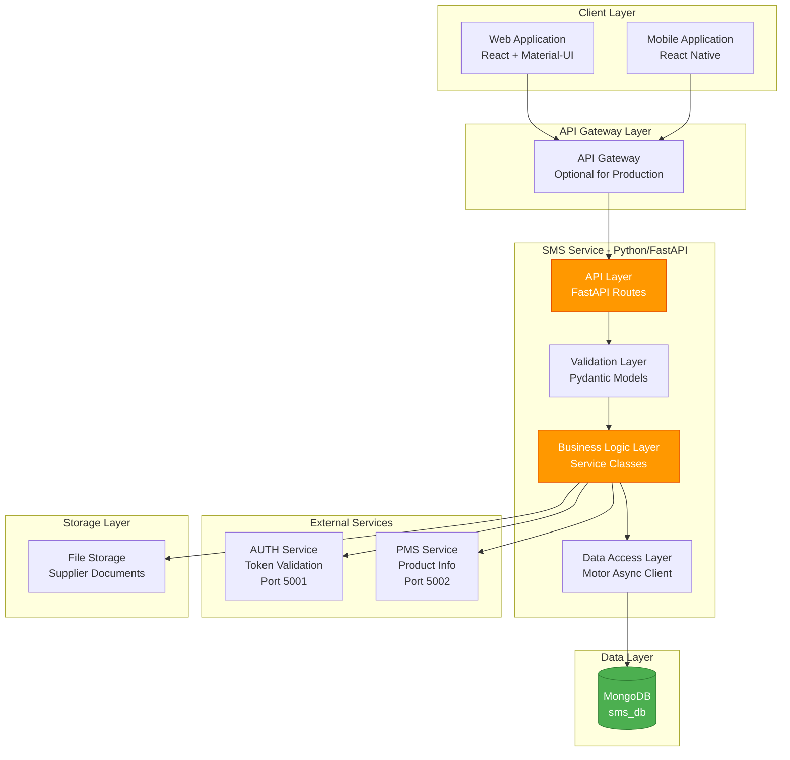

---

## 3. Detailed Component Architecture

### 3.1 FastAPI Application Structure

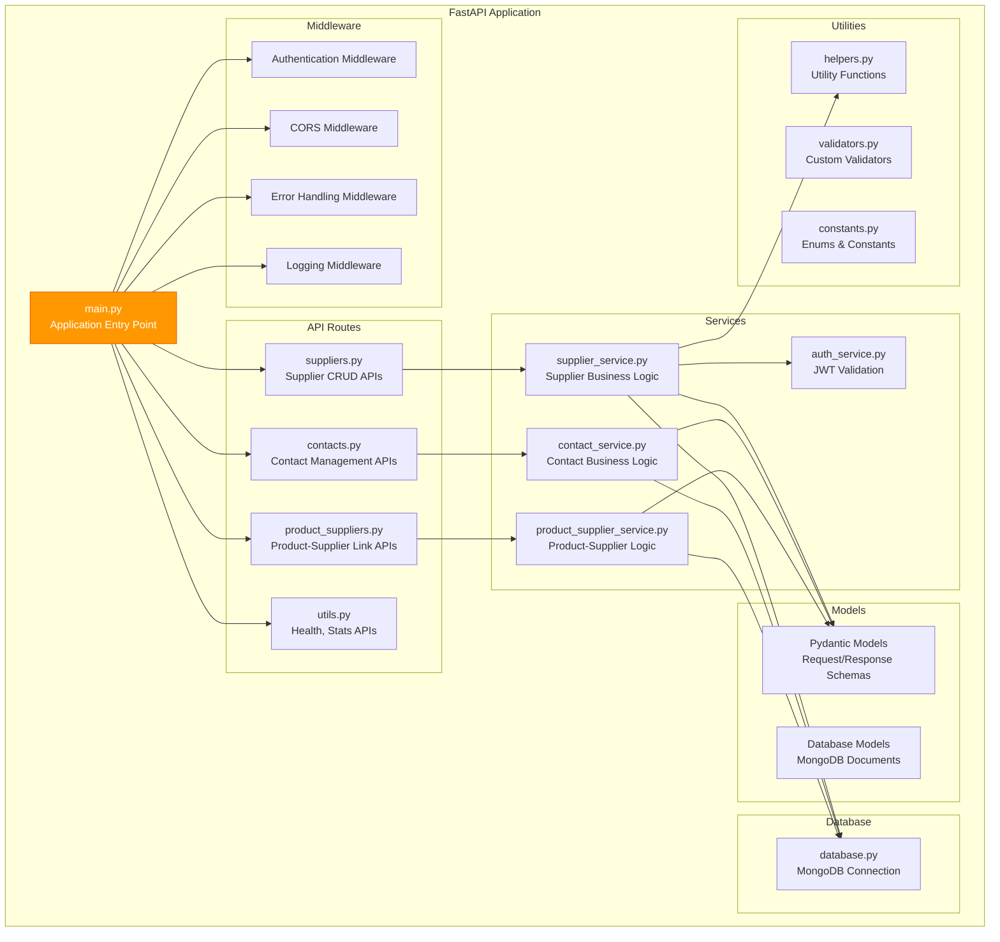

---

## 4. Technology Stack

### 4.1 Core Technologies

| Component | Technology | Version | Purpose |
|-----------|-----------|---------|---------|
| Runtime | Python | 3.10+ | Programming language |
| Framework | FastAPI | 0.104+ | Web framework |
| Server | Uvicorn | 0.24+ | ASGI server |
| Database | MongoDB | 6.x | Document database |
| DB Driver | Motor | 3.3+ | Async MongoDB driver |
| Validation | Pydantic | 2.5+ | Data validation |
| Authentication | JWT | - | Token validation via AUTH service |

### 4.2 Additional Libraries

| Library | Version | Purpose |
|---------|---------|---------|
| python-multipart | 0.0.6+ | File upload handling |
| python-dotenv | 1.0+ | Environment configuration |
| httpx | 0.25+ | Async HTTP client for service calls |
| aiofiles | 23.2+ | Async file operations |
| openpyxl | 3.1+ | Excel export for supplier lists |
| python-jose | 3.3+ | JWT token handling |

---

## 5. Project Structure

```
sms-service/
├── app/
│   ├── __init__.py
│   ├── main.py                      # FastAPI application entry point
│   ├── config.py                    # Configuration settings
│   ├── database.py                  # MongoDB connection setup
│   │
│   ├── api/
│   │   ├── __init__.py
│   │   ├── v1/
│   │   │   ├── __init__.py
│   │   │   ├── suppliers.py         # Supplier CRUD endpoints
│   │   │   ├── contacts.py          # Contact management endpoints
│   │   │   ├── product_suppliers.py # Product-Supplier link endpoints
│   │   │   └── utils.py             # Health check, statistics
│   │
│   ├── models/
│   │   ├── __init__.py
│   │   ├── supplier.py              # Supplier Pydantic models
│   │   ├── contact.py               # Contact Pydantic models
│   │   ├── product_supplier.py      # Product-Supplier Pydantic models
│   │   └── common.py                # Common models (pagination, response)
│   │
│   ├── services/
│   │   ├── __init__.py
│   │   ├── supplier_service.py      # Supplier business logic
│   │   ├── contact_service.py       # Contact business logic
│   │   ├── product_supplier_service.py # Product-Supplier logic
│   │   └── auth_service.py          # JWT validation logic
│   │
│   ├── utils/
│   │   ├── __init__.py
│   │   ├── helpers.py               # Utility functions
│   │   ├── validators.py            # Custom validators
│   │   ├── constants.py             # Enums and constants
│   │   └── exceptions.py            # Custom exceptions
│   │
│   └── middleware/
│       ├── __init__.py
│       ├── authentication.py        # Auth middleware
│       ├── error_handler.py         # Error handling middleware
│       └── logging.py               # Logging middleware
│
├── tests/
│   ├── __init__.py
│   ├── test_suppliers.py
│   ├── test_contacts.py
│   └── test_product_suppliers.py
│
├── alembic/                         # Database migrations (if needed)
├── storage/                         # Local file storage
│   └── supplier_documents/
│
├── .env                             # Environment variables
├── .env.example                     # Example environment file
├── requirements.txt                 # Python dependencies
├── Dockerfile                       # Docker configuration
├── docker-compose.yml               # Docker Compose setup
└── README.md                        # Service documentation
```

---

## 6. Data Flow Architecture

### 6.1 Request-Response Flow

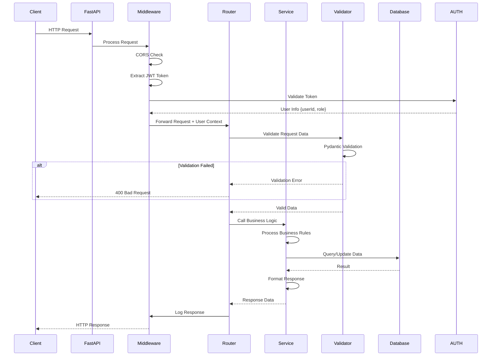

---

## 7. Database Architecture

### 7.1 Collections Overview

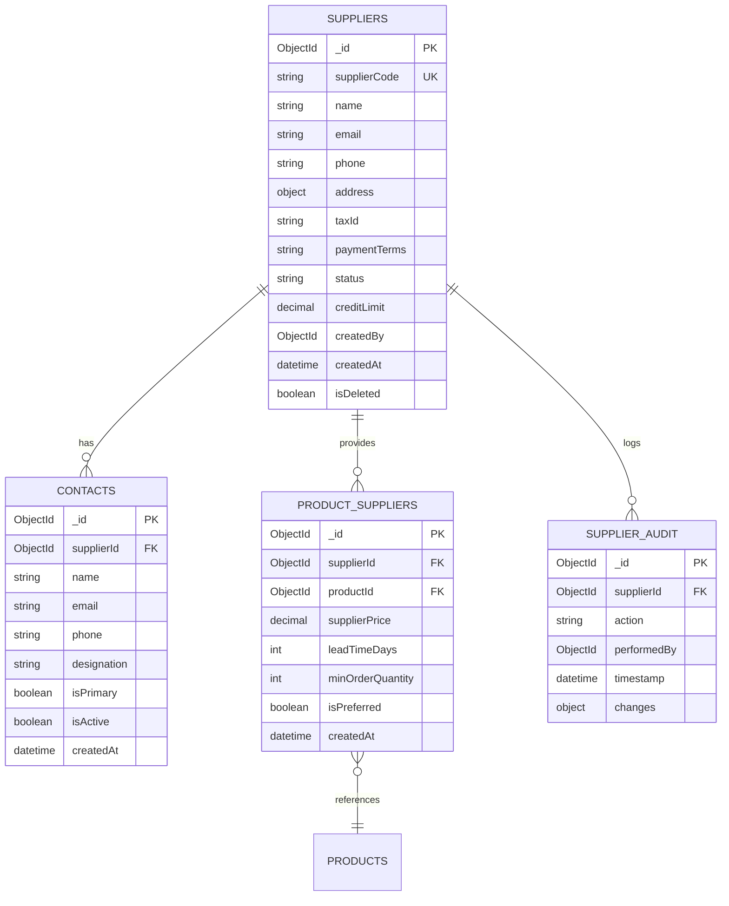

---

## 8. Authentication & Authorization Flow

### 8.1 JWT Token Validation

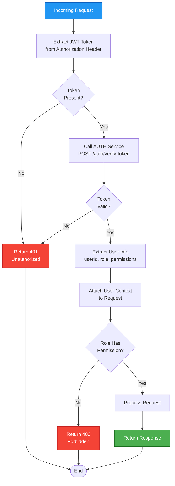

### 8.2 Role-Based Access Control

| Role | Suppliers | Contacts | Product-Supplier Links | Statistics |
|------|-----------|----------|------------------------|------------|
| Super Admin | Full Access | Full Access | Full Access | Full Access |
| Product Manager | Read, Create, Update | Read, Create, Update | Full Access | Read |
| Procurement Officer | Full Access | Full Access | Full Access | Read |
| Warehouse Manager | Read | Read | Read | Read |
| Inventory Manager | Read | Read | Read | Read |
| Warehouse Staff | Read | Read | Read | No Access |
| Auditor/Viewer | Read | Read | Read | Read |

---

## 9. Integration Points

### 9.1 SMS Integration with Other Services

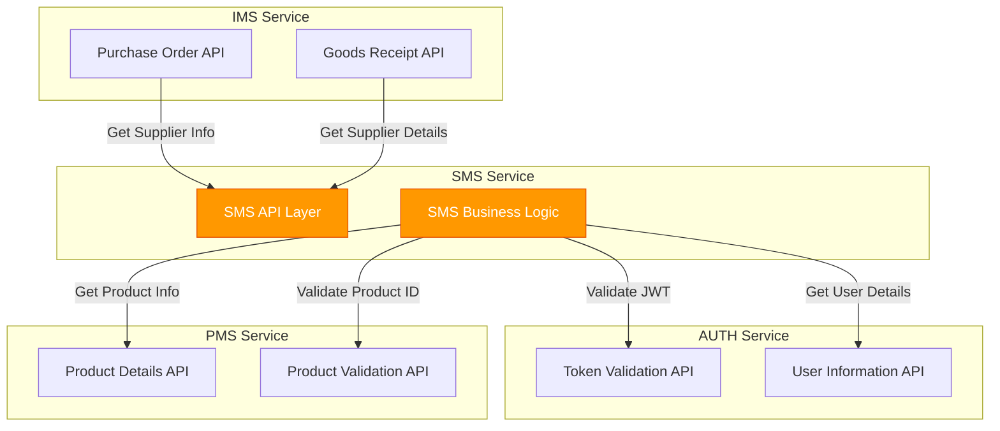

---

## 10. Deployment Architecture

### 10.1 Development Environment

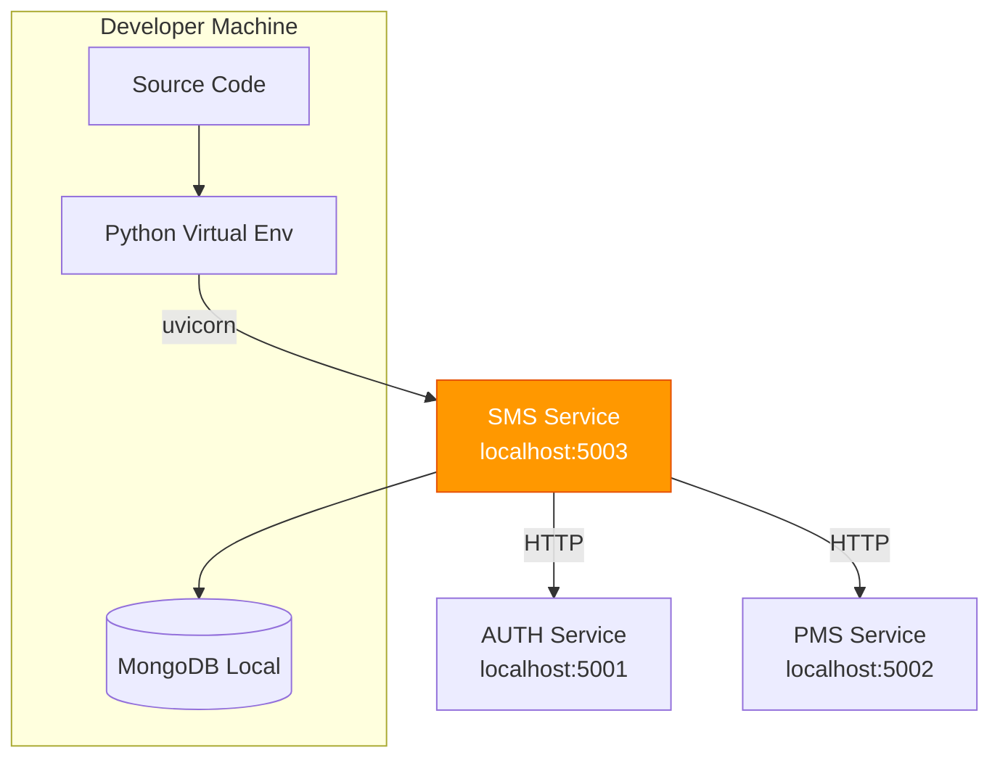

### 10.2 Docker Container Environment

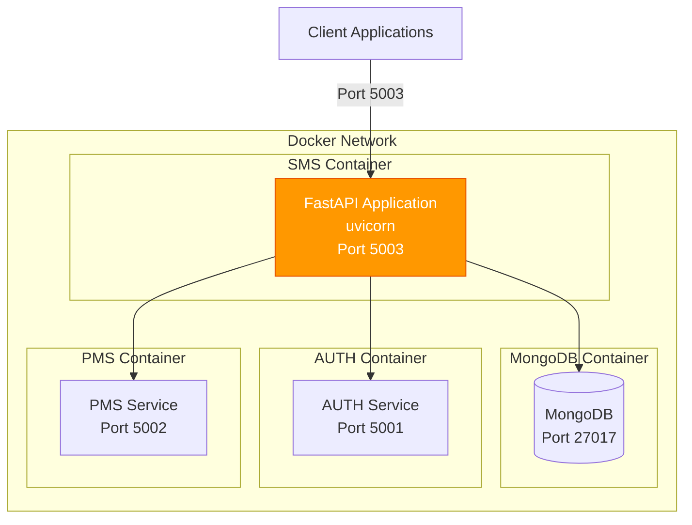

### 10.3 Production Environment (AWS)

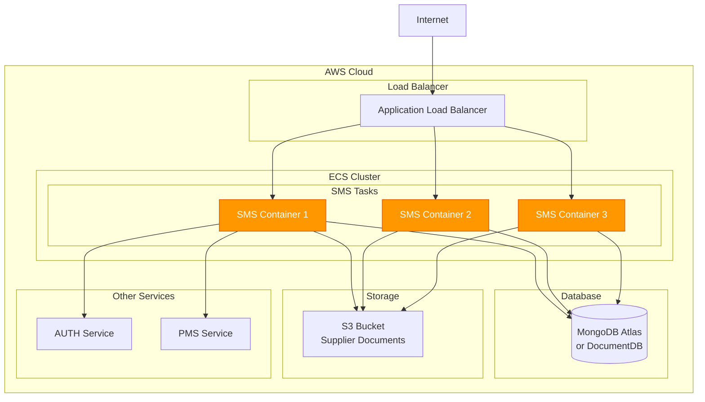

---

## 11. Configuration Management

### 11.1 Environment Variables

```python
# .env file structure
# Application Settings
APP_NAME=SMS-Service
APP_VERSION=1.0.0
ENVIRONMENT=development  # development, staging, production
DEBUG=True
PORT=5003

# MongoDB Configuration
MONGODB_URL=mongodb://localhost:27017
MONGODB_DATABASE=sms_db
MONGODB_MIN_POOL_SIZE=10
MONGODB_MAX_POOL_SIZE=50

# AUTH Service Configuration
AUTH_SERVICE_URL=http://localhost:5001
AUTH_VERIFY_TOKEN_ENDPOINT=/api/v1/auth/verify-token

# PMS Service Configuration
PMS_SERVICE_URL=http://localhost:5002
PMS_PRODUCT_ENDPOINT=/api/v1/products

# File Storage Configuration
STORAGE_TYPE=local  # local, s3
STORAGE_LOCAL_PATH=./storage/supplier_documents
AWS_S3_BUCKET=wlan-sms-documents
AWS_S3_REGION=ap-south-1

# API Configuration
API_PREFIX=/api/v1
CORS_ORIGINS=http://localhost:3000,http://localhost:3001
RATE_LIMIT_REQUESTS=100
RATE_LIMIT_PERIOD=60  # seconds

# Logging Configuration
LOG_LEVEL=INFO
LOG_FILE=./logs/sms.log
LOG_FORMAT=json

# Performance Settings
REQUEST_TIMEOUT=30  # seconds
MAX_UPLOAD_SIZE=10485760  # 10MB in bytes
```

---

## 12. API Versioning Strategy

### 12.1 URL Versioning

All SMS APIs follow versioned URL structure:

```
Base URL: http://localhost:5003
API Prefix: /api/v1/

Examples:
- GET /api/v1/suppliers
- POST /api/v1/suppliers
- GET /api/v1/suppliers/{id}
- GET /api/v1/contacts
- POST /api/v1/product-suppliers
```

### 12.2 Version Migration Path

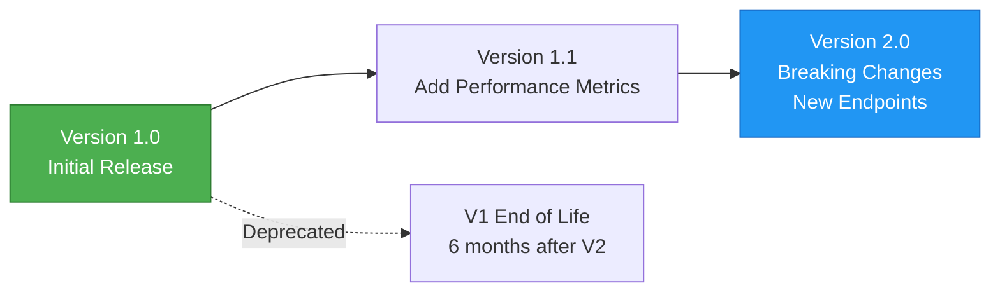

---

## 13. Error Handling Architecture

### 13.1 Error Flow

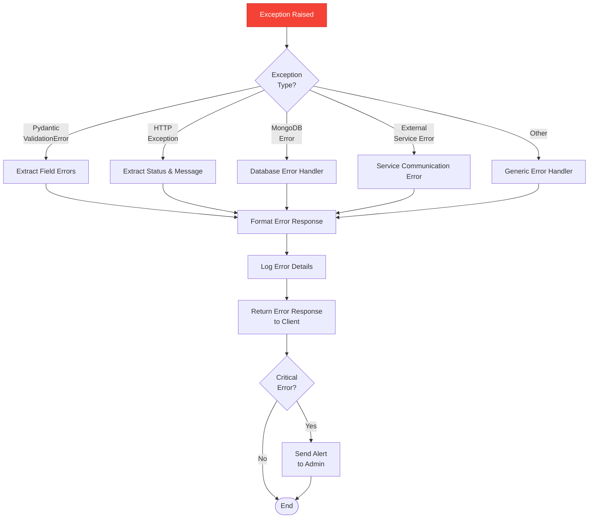

---

## 14. Performance Considerations

### 14.1 Optimization Strategies

| Strategy | Implementation | Benefit |
|----------|----------------|---------|
| Database Indexing | Indexes on supplierId, supplierCode, productId | Faster queries |
| Response Caching | Redis cache for frequently accessed suppliers | Reduced DB load |
| Pagination | Default limit of 10, max 100 | Controlled response size |
| Async Operations | Motor async driver for MongoDB | Non-blocking I/O |
| Connection Pooling | Min 10, Max 50 connections | Efficient resource usage |
| Query Projection | Fetch only required fields | Reduced data transfer |
| Batch Operations | Bulk insert/update for multiple records | Fewer DB roundtrips |

### 14.2 Monitoring Metrics

```mermaid
graph TB
    subgraph "Application Metrics"
        REQ_COUNT[Request Count]
        RESP_TIME[Response Time]
        ERROR_RATE[Error Rate]
    end
    
    subgraph "Database Metrics"
        QUERY_TIME[Query Execution Time]
        CONN_POOL[Connection Pool Usage]
        SLOW_QUERIES[Slow Query Count]
    end
    
    subgraph "External Service Metrics"
        AUTH_RESP[AUTH Service Response Time]
        PMS_RESP[PMS Service Response Time]
        SERVICE_ERRORS[External Service Errors]
    end
    
    subgraph "System Metrics"
        CPU[CPU Usage]
        MEMORY[Memory Usage]
        DISK[Disk I/O]
    end
    
    DASHBOARD[Monitoring Dashboard] --> REQ_COUNT
    DASHBOARD --> RESP_TIME
    DASHBOARD --> QUERY_TIME
    DASHBOARD --> AUTH_RESP
    DASHBOARD --> CPU
    
    style DASHBOARD fill:#FF9800,stroke:#E65100,color:#fff
```

---

## 15. Security Architecture

### 15.1 Security Layers

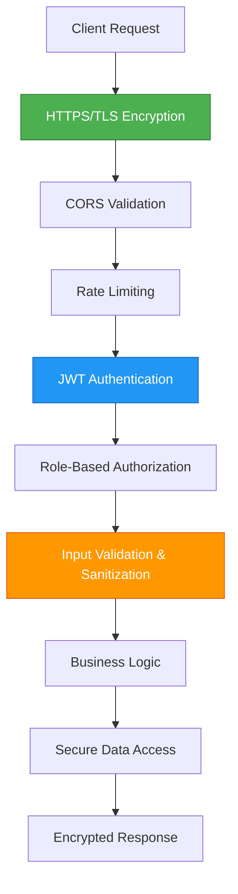

### 15.2 Security Best Practices

| Area | Practice | Implementation |
|------|----------|----------------|
| Authentication | JWT token validation | Via AUTH service for every request |
| Authorization | Role-based access control | Middleware checks user permissions |
| Input Validation | Pydantic models | Strict type checking and validation |
| SQL Injection | MongoDB driver escaping | Motor driver handles escaping |
| XSS Prevention | Output sanitization | HTML escape in responses |
| Rate Limiting | Per-user/IP limits | 100 requests per minute |
| Sensitive Data | Encryption at rest | MongoDB encryption (production) |
| Audit Logging | Track all changes | supplier_audit collection |

---

## Document End

**Next Document**: [2-ER-Diagram.md](./2-ER-Diagram.md)  
**Module Progress**: SMS Documentation (1/6 documents)  
**Overall Progress**: 13/30 documents (43.3%)
