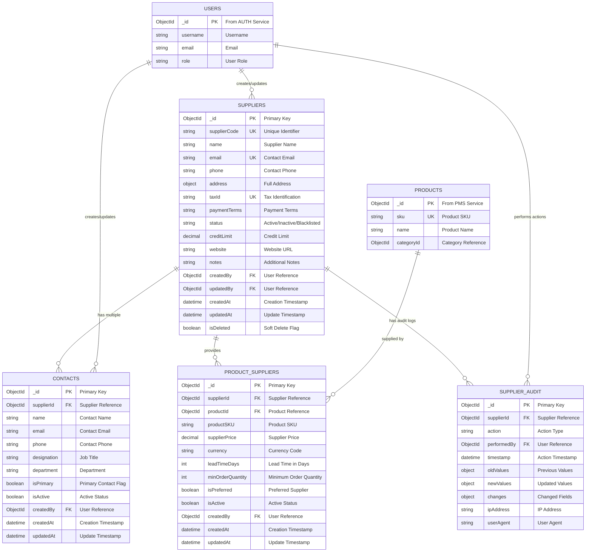
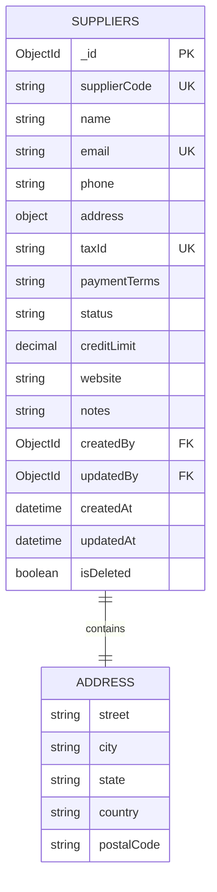
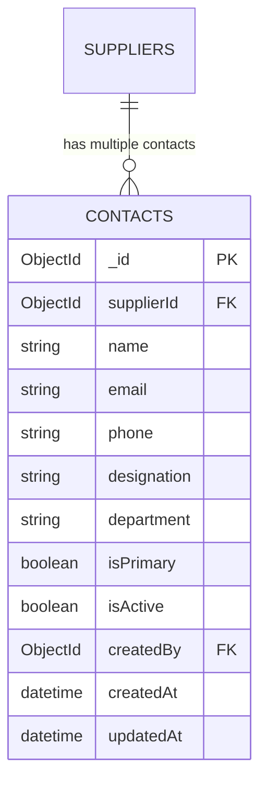
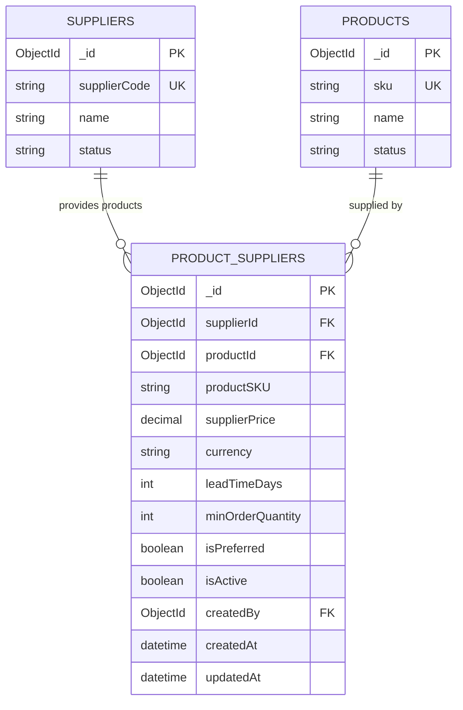
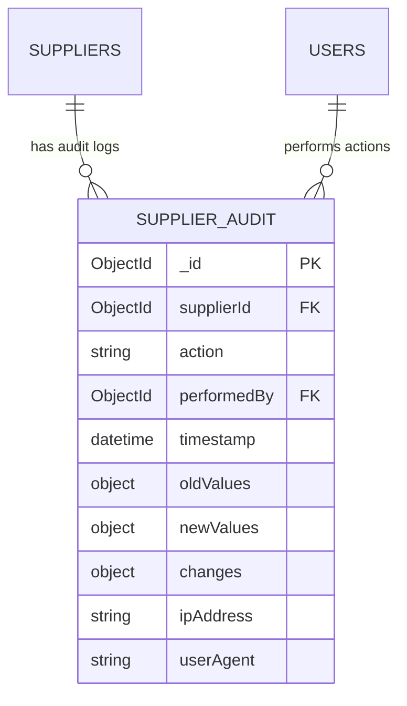
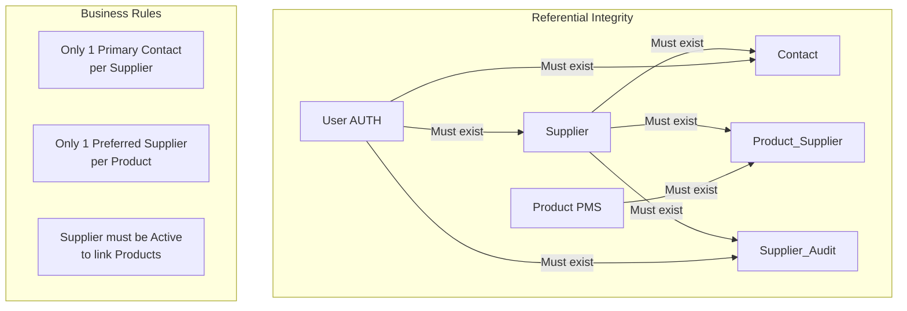
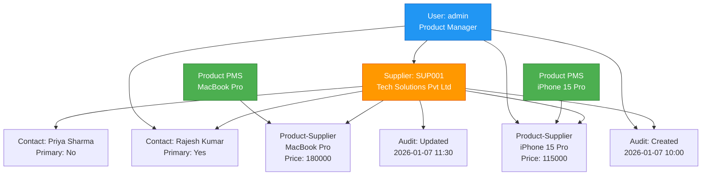

# SMS Service - ER Diagram

## Document Information
- **Project**: WLAN Corporation - Warehouse & Inventory Management System
- **Module**: Supplier Management System (SMS)
- **Version**: 1.0
- **Date**: January 7, 2026
- **Prepared For**: WLAN Corporation, Bengaluru

---

## 1. Overview

This document presents the Entity-Relationship diagrams for the Supplier Management System (SMS) database. It illustrates the structure of collections, their relationships, and data models used in MongoDB.

---

## 2. Complete ER Diagram

### 2.1 High-Level Entity Relationships



---

## 3. Suppliers Collection

### 3.1 Schema Definition

**Collection Name**: `suppliers`

**Description**: Stores supplier master data including company information, contact details, payment terms, and status.

### 3.2 Field Specifications

| Field Name | Data Type | Required | Unique | Default | Description |
|------------|-----------|----------|--------|---------|-------------|
| _id | ObjectId | Yes | Yes | Auto | Primary key |
| supplierCode | String | Yes | Yes | - | Unique supplier identifier (e.g., SUP001) |
| name | String | Yes | No | - | Supplier company name |
| email | String | Yes | Yes | - | Primary contact email |
| phone | String | Yes | No | - | Primary contact phone |
| address | Object | Yes | No | - | Complete address details |
| address.street | String | No | No | - | Street address |
| address.city | String | Yes | No | - | City |
| address.state | String | Yes | No | - | State/Province |
| address.country | String | Yes | No | - | Country |
| address.postalCode | String | No | No | - | Postal/ZIP code |
| taxId | String | Yes | Yes | - | Tax identification number (GST/VAT) |
| paymentTerms | String | No | No | "Net 30" | Payment terms (Net 30, Net 60, COD, etc.) |
| status | String | Yes | No | "Active" | Active, Inactive, Blacklisted |
| creditLimit | Decimal | No | No | 0.00 | Maximum credit allowed |
| website | String | No | No | - | Supplier website URL |
| notes | String | No | No | - | Additional notes/comments |
| createdBy | ObjectId | Yes | No | - | User who created record |
| updatedBy | ObjectId | No | No | - | User who last updated |
| createdAt | DateTime | Yes | No | Now | Creation timestamp |
| updatedAt | DateTime | Yes | No | Now | Last update timestamp |
| isDeleted | Boolean | Yes | No | false | Soft delete flag |

### 3.3 Detailed ER Diagram - Suppliers



### 3.4 Sample Document

```json
{
  "_id": ObjectId("6789abcd1234567890120001"),
  "supplierCode": "SUP001",
  "name": "Tech Solutions Pvt Ltd",
  "email": "contact@techsolutions.com",
  "phone": "+91-80-12345678",
  "address": {
    "street": "123 MG Road",
    "city": "Bengaluru",
    "state": "Karnataka",
    "country": "India",
    "postalCode": "560001"
  },
  "taxId": "29AABCT1234E1Z5",
  "paymentTerms": "Net 30",
  "status": "Active",
  "creditLimit": 500000.00,
  "website": "https://www.techsolutions.com",
  "notes": "Preferred supplier for electronics",
  "createdBy": ObjectId("6789abcd1234567890123450"),
  "updatedBy": ObjectId("6789abcd1234567890123450"),
  "createdAt": ISODate("2026-01-07T10:00:00Z"),
  "updatedAt": ISODate("2026-01-07T10:00:00Z"),
  "isDeleted": false
}
```

### 3.5 Indexes

```javascript
// Unique index on supplierCode
db.suppliers.createIndex(
  { supplierCode: 1 },
  { unique: true, name: "idx_supplier_code_unique" }
)

// Unique index on email
db.suppliers.createIndex(
  { email: 1 },
  { unique: true, name: "idx_supplier_email_unique" }
)

// Unique index on taxId
db.suppliers.createIndex(
  { taxId: 1 },
  { unique: true, name: "idx_supplier_tax_unique" }
)

// Index for status filtering
db.suppliers.createIndex(
  { status: 1, isDeleted: 1 },
  { name: "idx_supplier_status" }
)

// Text index for search
db.suppliers.createIndex(
  { name: "text", supplierCode: "text", email: "text" },
  { 
    name: "idx_supplier_search",
    weights: {
      name: 10,
      supplierCode: 8,
      email: 5
    }
  }
)

// Index for sorting by creation date
db.suppliers.createIndex(
  { createdAt: -1 },
  { name: "idx_supplier_created" }
)
```

---

## 4. Contacts Collection

### 4.1 Schema Definition

**Collection Name**: `contacts`

**Description**: Stores contact person details for each supplier. Multiple contacts can be associated with a single supplier.

### 4.2 Field Specifications

| Field Name | Data Type | Required | Unique | Default | Description |
|------------|-----------|----------|--------|---------|-------------|
| _id | ObjectId | Yes | Yes | Auto | Primary key |
| supplierId | ObjectId | Yes | No | - | Reference to suppliers collection |
| name | String | Yes | No | - | Contact person name |
| email | String | Yes | No | - | Contact email address |
| phone | String | Yes | No | - | Contact phone number |
| designation | String | No | No | - | Job title/designation |
| department | String | No | No | - | Department name |
| isPrimary | Boolean | Yes | No | false | Primary contact flag |
| isActive | Boolean | Yes | No | true | Active status |
| createdBy | ObjectId | Yes | No | - | User who created record |
| createdAt | DateTime | Yes | No | Now | Creation timestamp |
| updatedAt | DateTime | Yes | No | Now | Last update timestamp |

### 4.3 Detailed ER Diagram - Contacts



### 4.4 Sample Document

```json
{
  "_id": ObjectId("6789abcd1234567890120002"),
  "supplierId": ObjectId("6789abcd1234567890120001"),
  "name": "Rajesh Kumar",
  "email": "rajesh.kumar@techsolutions.com",
  "phone": "+91-98765-43210",
  "designation": "Sales Manager",
  "department": "Sales",
  "isPrimary": true,
  "isActive": true,
  "createdBy": ObjectId("6789abcd1234567890123450"),
  "createdAt": ISODate("2026-01-07T10:00:00Z"),
  "updatedAt": ISODate("2026-01-07T10:00:00Z")
}
```

### 4.5 Indexes

```javascript
// Compound index for supplier lookup
db.contacts.createIndex(
  { supplierId: 1, isActive: 1 },
  { name: "idx_contact_supplier_active" }
)

// Index for primary contact
db.contacts.createIndex(
  { supplierId: 1, isPrimary: 1 },
  { name: "idx_contact_primary" }
)

// Index for email search
db.contacts.createIndex(
  { email: 1 },
  { name: "idx_contact_email" }
)

// Text index for search
db.contacts.createIndex(
  { name: "text", email: "text" },
  { name: "idx_contact_search" }
)
```

### 4.6 Business Rules

1. **Primary Contact**: Only one contact per supplier can be marked as primary
2. **Email Validation**: Email must be in valid format
3. **Phone Validation**: Phone number should be in international format
4. **Active Status**: At least one contact must remain active per supplier
5. **Cascade Delete**: When supplier is deleted, associated contacts should be handled appropriately

---

## 5. Product_Suppliers Collection

### 5.1 Schema Definition

**Collection Name**: `product_suppliers`

**Description**: Junction table linking products (from PMS) with suppliers. Stores supplier-specific product information like pricing and lead time.

### 5.2 Field Specifications

| Field Name | Data Type | Required | Unique | Default | Description |
|------------|-----------|----------|--------|---------|-------------|
| _id | ObjectId | Yes | Yes | Auto | Primary key |
| supplierId | ObjectId | Yes | No | - | Reference to suppliers collection |
| productId | ObjectId | Yes | No | - | Reference to products (PMS) |
| productSKU | String | Yes | No | - | Product SKU from PMS |
| supplierPrice | Decimal | Yes | No | - | Price offered by supplier |
| currency | String | Yes | No | "INR" | Currency code (INR, USD, etc.) |
| leadTimeDays | Integer | Yes | No | - | Lead time in days |
| minOrderQuantity | Integer | Yes | No | 1 | Minimum order quantity |
| isPreferred | Boolean | Yes | No | false | Preferred supplier flag |
| isActive | Boolean | Yes | No | true | Active status |
| createdBy | ObjectId | Yes | No | - | User who created record |
| createdAt | DateTime | Yes | No | Now | Creation timestamp |
| updatedAt | DateTime | Yes | No | Now | Last update timestamp |

### 5.3 Detailed ER Diagram - Product_Suppliers



### 5.4 Sample Document

```json
{
  "_id": ObjectId("6789abcd1234567890120003"),
  "supplierId": ObjectId("6789abcd1234567890120001"),
  "productId": ObjectId("6789abcd1234567890123458"),
  "productSKU": "ELEC-SMART-APL-001",
  "supplierPrice": 115000.00,
  "currency": "INR",
  "leadTimeDays": 7,
  "minOrderQuantity": 10,
  "isPreferred": true,
  "isActive": true,
  "createdBy": ObjectId("6789abcd1234567890123450"),
  "createdAt": ISODate("2026-01-07T10:00:00Z"),
  "updatedAt": ISODate("2026-01-07T10:00:00Z")
}
```

### 5.5 Indexes

```javascript
// Compound unique index - one product can have only one active supplier link
db.product_suppliers.createIndex(
  { supplierId: 1, productId: 1 },
  { unique: true, name: "idx_supplier_product_unique" }
)

// Index for supplier lookup
db.product_suppliers.createIndex(
  { supplierId: 1, isActive: 1 },
  { name: "idx_product_supplier_supplier" }
)

// Index for product lookup
db.product_suppliers.createIndex(
  { productId: 1, isActive: 1 },
  { name: "idx_product_supplier_product" }
)

// Index for preferred suppliers
db.product_suppliers.createIndex(
  { productId: 1, isPreferred: 1, isActive: 1 },
  { name: "idx_product_supplier_preferred" }
)

// Index for SKU search
db.product_suppliers.createIndex(
  { productSKU: 1 },
  { name: "idx_product_supplier_sku" }
)

// Index for price sorting
db.product_suppliers.createIndex(
  { productId: 1, supplierPrice: 1 },
  { name: "idx_product_supplier_price" }
)
```

### 5.6 Business Rules

1. **Unique Mapping**: A supplier-product combination must be unique
2. **Price Validation**: Supplier price must be positive
3. **Lead Time**: Lead time must be positive integer
4. **MOQ**: Minimum order quantity must be at least 1
5. **Preferred Supplier**: Only one supplier can be marked as preferred per product
6. **Active Product**: Product must be active in PMS to create supplier link
7. **Active Supplier**: Supplier must be active to create product link

---

## 6. Supplier_Audit Collection

### 6.1 Schema Definition

**Collection Name**: `supplier_audit`

**Description**: Audit trail for all supplier-related changes. Tracks who made changes, when, and what was changed.

### 6.2 Field Specifications

| Field Name | Data Type | Required | Unique | Default | Description |
|------------|-----------|----------|--------|---------|-------------|
| _id | ObjectId | Yes | Yes | Auto | Primary key |
| supplierId | ObjectId | Yes | No | - | Reference to suppliers collection |
| action | String | Yes | No | - | Action type (create, update, delete, etc.) |
| performedBy | ObjectId | Yes | No | - | User who performed action |
| timestamp | DateTime | Yes | No | Now | Action timestamp |
| oldValues | Object | No | No | - | Previous field values |
| newValues | Object | No | No | - | Updated field values |
| changes | Object | No | No | - | Summary of changes |
| ipAddress | String | No | No | - | Client IP address |
| userAgent | String | No | No | - | Client user agent |

### 6.3 Detailed ER Diagram - Supplier_Audit



### 6.4 Sample Document

```json
{
  "_id": ObjectId("6789abcd1234567890120004"),
  "supplierId": ObjectId("6789abcd1234567890120001"),
  "action": "update",
  "performedBy": ObjectId("6789abcd1234567890123451"),
  "timestamp": ISODate("2026-01-07T11:30:00Z"),
  "oldValues": {
    "creditLimit": 500000.00,
    "paymentTerms": "Net 30"
  },
  "newValues": {
    "creditLimit": 750000.00,
    "paymentTerms": "Net 45"
  },
  "changes": {
    "fieldsModified": ["creditLimit", "paymentTerms"]
  },
  "ipAddress": "192.168.1.100",
  "userAgent": "Mozilla/5.0 (Windows NT 10.0; Win64; x64) AppleWebKit/537.36"
}
```

### 6.5 Indexes

```javascript
// Index for supplier audit history
db.supplier_audit.createIndex(
  { supplierId: 1, timestamp: -1 },
  { name: "idx_audit_supplier_timestamp" }
)

// Index for user activity
db.supplier_audit.createIndex(
  { performedBy: 1, timestamp: -1 },
  { name: "idx_audit_user_timestamp" }
)

// Index for action filtering
db.supplier_audit.createIndex(
  { action: 1, timestamp: -1 },
  { name: "idx_audit_action_timestamp" }
)

// TTL index - auto-delete audit logs older than 2 years
db.supplier_audit.createIndex(
  { timestamp: 1 },
  { 
    name: "idx_audit_ttl",
    expireAfterSeconds: 63072000  // 2 years
  }
)
```

### 6.6 Action Types

| Action | Description | Triggered When |
|--------|-------------|----------------|
| create | New supplier created | POST /suppliers |
| update | Supplier details updated | PUT /suppliers/:id |
| delete | Supplier deleted (soft) | DELETE /suppliers/:id |
| status_change | Status changed | Status field modified |
| contact_added | Contact added | POST /contacts |
| contact_updated | Contact updated | PUT /contacts/:id |
| contact_removed | Contact removed | DELETE /contacts/:id |
| product_linked | Product linked to supplier | POST /product-suppliers |
| product_unlinked | Product unlinked | DELETE /product-suppliers/:id |

---

## 7. Relationship Cardinality

### 7.1 Cardinality Matrix

| Relationship | Type | Description |
|--------------|------|-------------|
| Supplier → Contacts | 1:N | One supplier has multiple contacts |
| Supplier → Product_Suppliers | 1:N | One supplier provides multiple products |
| Product → Product_Suppliers | 1:N | One product supplied by multiple suppliers |
| Supplier → Supplier_Audit | 1:N | One supplier has multiple audit logs |
| User → Suppliers | 1:N | One user creates/updates multiple suppliers |
| User → Contacts | 1:N | One user creates multiple contacts |
| User → Supplier_Audit | 1:N | One user performs multiple actions |

### 7.2 Relationship Constraints



---

## 8. Data Validation Rules

### 8.1 Suppliers Validation

```javascript
{
  "supplierCode": {
    "pattern": "^SUP[0-9]{3,6}$",
    "example": "SUP001, SUP000123"
  },
  "email": {
    "pattern": "^[a-zA-Z0-9._%+-]+@[a-zA-Z0-9.-]+\\.[a-zA-Z]{2,}$"
  },
  "phone": {
    "pattern": "^\\+?[1-9]\\d{1,14}$",
    "description": "International format"
  },
  "taxId": {
    "pattern": "^[0-9]{2}[A-Z]{5}[0-9]{4}[A-Z]{1}[1-9A-Z]{1}[Z]{1}[0-9A-Z]{1}$",
    "description": "Indian GST format"
  },
  "status": {
    "enum": ["Active", "Inactive", "Blacklisted"]
  },
  "paymentTerms": {
    "enum": ["Net 15", "Net 30", "Net 45", "Net 60", "COD", "Advance"]
  },
  "creditLimit": {
    "type": "decimal",
    "minimum": 0
  }
}
```

### 8.2 Contacts Validation

```javascript
{
  "name": {
    "minLength": 2,
    "maxLength": 100
  },
  "email": {
    "pattern": "^[a-zA-Z0-9._%+-]+@[a-zA-Z0-9.-]+\\.[a-zA-Z]{2,}$"
  },
  "phone": {
    "pattern": "^\\+?[1-9]\\d{1,14}$"
  },
  "isPrimary": {
    "type": "boolean",
    "constraint": "Only one contact per supplier can be primary"
  }
}
```

### 8.3 Product_Suppliers Validation

```javascript
{
  "supplierPrice": {
    "type": "decimal",
    "minimum": 0,
    "exclusiveMinimum": true
  },
  "currency": {
    "pattern": "^[A-Z]{3}$",
    "example": "INR, USD, EUR"
  },
  "leadTimeDays": {
    "type": "integer",
    "minimum": 1,
    "maximum": 365
  },
  "minOrderQuantity": {
    "type": "integer",
    "minimum": 1
  },
  "isPreferred": {
    "type": "boolean",
    "constraint": "Only one supplier per product can be preferred"
  }
}
```

---

## 9. Sample Data Relationships

### 9.1 Complete Example



---

## 10. Collection Sizes & Estimates

| Collection | Estimated Documents | Average Size | Total Size (Approx) |
|------------|---------------------|--------------|---------------------|
| suppliers | 100-500 | 1 KB | 500 KB |
| contacts | 200-1000 | 0.5 KB | 500 KB |
| product_suppliers | 1000-5000 | 0.5 KB | 2.5 MB |
| supplier_audit | Growing (10K-50K/year) | 1 KB | 10-50 MB/year |

**Total Database Size (Initial)**: ~5-10 MB  
**Growth Rate**: ~50-100 MB/year (with audit logs)

---

## Document End

**Previous Document**: [1-Architecture-Diagram.md](./1-Architecture-Diagram.md)  
**Next Document**: [3-User-Stories-Use-Cases.md](./3-User-Stories-Use-Cases.md)  
**Module Progress**: SMS Documentation (2/6 documents)  
**Overall Progress**: 14/30 documents (46.7%)
