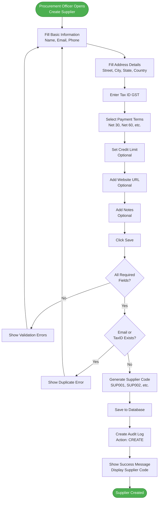
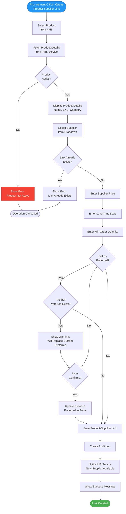
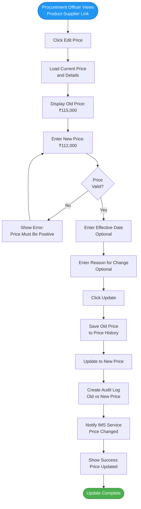
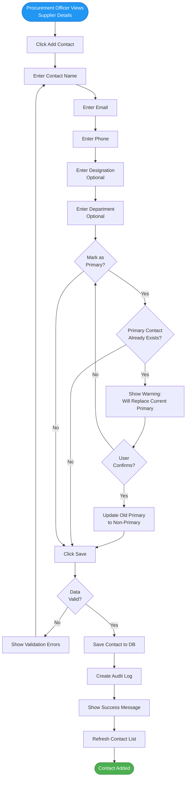
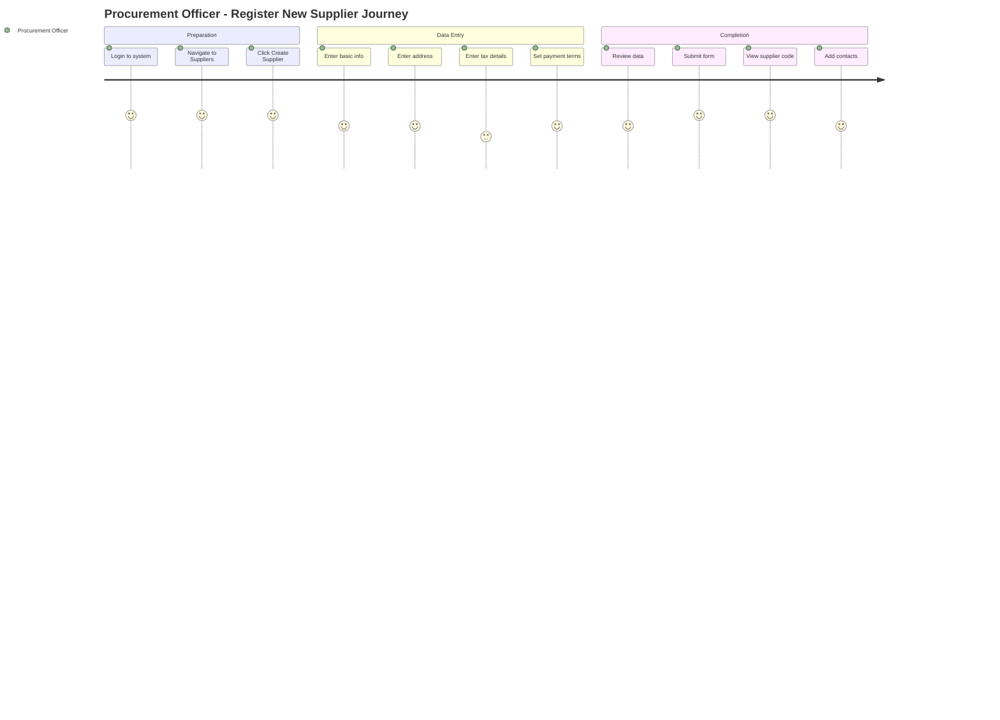
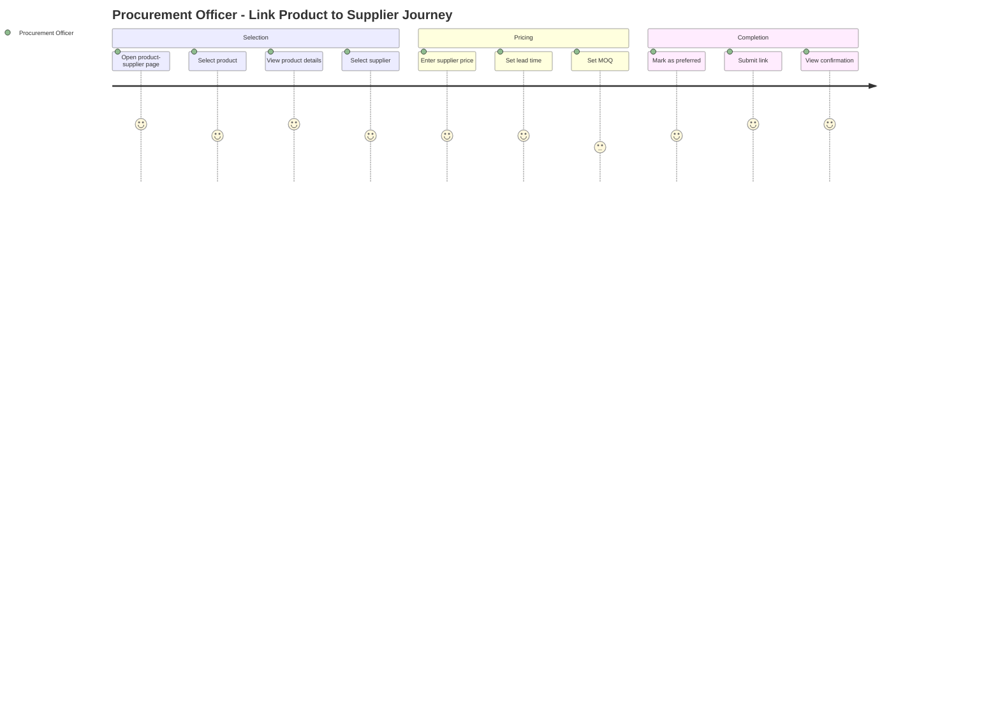

# SMS Service - User Stories & Use Cases

## Document Information
- **Project**: WLAN Corporation - Warehouse & Inventory Management System
- **Module**: Supplier Management System (SMS)
- **Version**: 1.0
- **Date**: January 7, 2026
- **Prepared For**: WLAN Corporation, Bengaluru

---

## 1. Overview

This document outlines user stories and detailed use cases for the Supplier Management System (SMS) service. It covers supplier management, contact management, product-supplier relationships, and supplier performance tracking.

---

## 2. User Roles

| Role | Abbreviation | Primary Responsibilities |
|------|--------------|-------------------------|
| Super Admin | SA | Complete system administration |
| Product Manager | PM | Product-supplier relationship management |
| Procurement Officer | PO | Supplier management, purchasing |
| Warehouse Manager | WM | View supplier information |
| Inventory Manager | IM | View supplier and product information |
| Warehouse Staff | WS | View supplier information |
| Auditor/Viewer | AV | Read-only access |

---

## 3. Epic 1: Supplier Management

### 3.1 User Story: Create Supplier

**As a** Procurement Officer  
**I want to** register new suppliers in the system  
**So that** I can track supplier information and place orders

**Acceptance Criteria**:
- Can enter supplier name, email, phone, address
- Supplier code is auto-generated (SUP001, SUP002, etc.)
- Tax ID (GST) must be unique
- Email must be unique
- Payment terms can be selected from dropdown
- Credit limit can be specified
- Supplier status defaults to "Active"
- Success message shown after creation

**Priority**: HIGH  
**Story Points**: 5

---

### 3.2 User Story: View All Suppliers

**As a** Procurement Officer  
**I want to** view list of all suppliers  
**So that** I can manage supplier relationships

**Acceptance Criteria**:
- Can see paginated list of suppliers
- List shows supplier code, name, email, phone, status
- Can filter by status (Active/Inactive/Blacklisted)
- Can search by supplier name, code, email
- Can sort by name, code, creation date
- Can export list to Excel/CSV

**Priority**: HIGH  
**Story Points**: 3

---

### 3.3 User Story: Update Supplier

**As a** Procurement Officer  
**I want to** update supplier information  
**So that** I can keep supplier data current

**Acceptance Criteria**:
- Can edit supplier details except supplier code
- Changes are validated before saving
- Cannot edit tax ID if supplier has transactions
- Audit trail records who updated
- Success message is shown

**Priority**: MEDIUM  
**Story Points**: 3

---

### 3.4 User Story: Change Supplier Status

**As a** Procurement Officer  
**I want to** change supplier status  
**So that** I can manage supplier lifecycle

**Acceptance Criteria**:
- Can change status to Active, Inactive, or Blacklisted
- Warning shown when blacklisting supplier
- Blacklisted suppliers cannot be used for new orders
- Status change is logged in audit trail
- Reason can be added for status change

**Priority**: MEDIUM  
**Story Points**: 2

---

### 3.5 User Story: Delete Supplier

**As a** Super Admin  
**I want to** delete suppliers  
**So that** I can remove incorrect or duplicate entries

**Acceptance Criteria**:
- Can delete supplier only if no product links exist
- Cannot delete if supplier has contacts
- Confirmation required before deletion
- Soft delete option (mark as deleted but keep data)
- Audit log records deletion

**Priority**: LOW  
**Story Points**: 3

---

## 4. Epic 2: Contact Management

### 4.1 User Story: Add Supplier Contact

**As a** Procurement Officer  
**I want to** add contact persons for suppliers  
**So that** I can communicate with the right people

**Acceptance Criteria**:
- Must select supplier first
- Can enter contact name, email, phone, designation
- Can mark contact as primary
- Only one primary contact per supplier allowed
- Email validation applied
- Success message shown

**Priority**: HIGH  
**Story Points**: 3

---

### 4.2 User Story: View Supplier Contacts

**As a** Procurement Officer  
**I want to** view all contacts for a supplier  
**So that** I can find the right person to contact

**Acceptance Criteria**:
- Can view all contacts for selected supplier
- Primary contact is highlighted
- List shows name, email, phone, designation
- Can filter by active/inactive status
- Can search by contact name or email

**Priority**: HIGH  
**Story Points**: 2

---

### 4.3 User Story: Update Contact

**As a** Procurement Officer  
**I want to** update contact information  
**So that** I can keep contact details current

**Acceptance Criteria**:
- Can edit contact details
- Can change primary contact designation
- If changing primary, previous primary is updated automatically
- Changes are validated
- Success message shown

**Priority**: MEDIUM  
**Story Points**: 2

---

### 4.4 User Story: Deactivate Contact

**As a** Procurement Officer  
**I want to** deactivate contacts  
**So that** inactive contacts don't appear in lists

**Acceptance Criteria**:
- Can deactivate contact
- Cannot deactivate if it's the only active contact
- Warning shown if primary contact is deactivated
- Inactive contacts hidden by default
- Can reactivate later

**Priority**: MEDIUM  
**Story Points**: 2

---

## 5. Epic 3: Product-Supplier Relationship

### 5.1 User Story: Link Product to Supplier

**As a** Procurement Officer  
**I want to** link products to suppliers  
**So that** I can track which suppliers provide which products

**Acceptance Criteria**:
- Can select product from PMS
- Can select supplier from list
- Must enter supplier price
- Must enter lead time in days
- Can set minimum order quantity
- Can mark as preferred supplier
- Success message shown with link details

**Priority**: HIGH  
**Story Points**: 5

---

### 5.2 User Story: View Product Suppliers

**As a** Procurement Officer  
**I want to** view all suppliers for a product  
**So that** I can compare prices and choose best supplier

**Acceptance Criteria**:
- Can view all suppliers providing a product
- List shows supplier name, price, lead time, MOQ
- Preferred supplier is highlighted
- Can sort by price, lead time
- Can filter by active/inactive status

**Priority**: HIGH  
**Story Points**: 3

---

### 5.3 User Story: View Supplier Products

**As a** Procurement Officer  
**I want to** view all products supplied by a supplier  
**So that** I can see complete supplier catalog

**Acceptance Criteria**:
- Can view all products from selected supplier
- List shows product name, SKU, price, MOQ
- Can search products by name or SKU
- Can filter by product category
- Can export to Excel

**Priority**: HIGH  
**Story Points**: 3

---

### 5.4 User Story: Update Supplier Price

**As a** Procurement Officer  
**I want to** update supplier pricing  
**So that** I can keep prices current

**Acceptance Criteria**:
- Can update supplier price for product
- Price history is maintained
- Old price and new price logged in audit
- Effective date can be specified
- Success message shown

**Priority**: HIGH  
**Story Points**: 3

---

### 5.5 User Story: Set Preferred Supplier

**As a** Procurement Officer  
**I want to** mark preferred supplier for products  
**So that** system suggests best supplier for orders

**Acceptance Criteria**:
- Can mark/unmark supplier as preferred
- Only one supplier can be preferred per product
- When marking new preferred, old one is updated automatically
- Preferred status visible in supplier lists
- Audit trail records change

**Priority**: MEDIUM  
**Story Points**: 2

---

### 5.6 User Story: Unlink Product from Supplier

**As a** Procurement Officer  
**I want to** remove product-supplier links  
**So that** I can manage supplier catalog

**Acceptance Criteria**:
- Can unlink product from supplier
- Cannot unlink if pending orders exist
- Warning shown if supplier is preferred
- Confirmation required before unlinking
- Audit log records unlinking

**Priority**: MEDIUM  
**Story Points**: 2

---

## 6. Epic 4: Supplier Search & Filter

### 6.1 User Story: Search Suppliers

**As a** Procurement Officer  
**I want to** search suppliers by various criteria  
**So that** I can quickly find specific suppliers

**Acceptance Criteria**:
- Can search by supplier name, code, email
- Search is case-insensitive
- Results show in real-time as typing
- Can search within filtered results
- Search highlights matching text

**Priority**: HIGH  
**Story Points**: 3

---

### 6.2 User Story: Filter Suppliers

**As a** Procurement Officer  
**I want to** filter suppliers by status and payment terms  
**So that** I can find suppliers meeting specific criteria

**Acceptance Criteria**:
- Can filter by status (Active/Inactive/Blacklisted)
- Can filter by payment terms
- Can filter by credit limit range
- Multiple filters can be applied together
- Filter count shown on each filter option

**Priority**: MEDIUM  
**Story Points**: 2

---

## 7. Detailed Use Cases

### 7.1 Use Case: UC-SMS-001 - Create Supplier

**Actors**: Procurement Officer, Super Admin

**Preconditions**:
- User is logged in as Procurement Officer or Super Admin
- User has permission to create suppliers

**Main Flow**:
1. Procurement Officer navigates to Suppliers page
2. Procurement Officer clicks "Create Supplier" button
3. System displays supplier creation form
4. Procurement Officer enters:
   - Supplier Name
   - Email Address
   - Phone Number
   - Street Address
   - City
   - State
   - Country
   - Postal Code
   - Tax ID (GST)
   - Payment Terms (from dropdown)
   - Credit Limit (optional)
   - Website (optional)
   - Notes (optional)
5. Procurement Officer clicks "Save" button
6. System validates all required fields
7. System checks for duplicate email and tax ID
8. System generates unique supplier code (SUP001, SUP002, etc.)
9. System saves supplier record to database
10. System creates audit log entry
11. System shows success message with supplier code
12. System displays supplier details

**Alternate Flows**:

**A1: Validation Error**
- At step 6, if required fields are missing
- System shows validation errors
- Returns to step 4

**A2: Duplicate Email**
- At step 7, if email already exists
- System shows "Email already registered"
- Returns to step 4

**A3: Duplicate Tax ID**
- At step 7, if tax ID already exists
- System shows "Tax ID already registered"
- Returns to step 4

**Postconditions**:
- Supplier is created in database
- Supplier code is assigned
- Supplier appears in supplier list
- Audit trail records creation

---

### 7.2 Use Case: UC-SMS-002 - Link Product to Supplier

**Actors**: Procurement Officer, Product Manager, Super Admin

**Preconditions**:
- User is logged in with appropriate role
- Product exists in PMS service
- Supplier exists and is active

**Main Flow**:
1. Procurement Officer navigates to Product-Supplier Links page
2. Procurement Officer clicks "Create Link" button
3. System displays link creation form
4. Procurement Officer selects product from dropdown
5. System fetches product details from PMS service
6. System validates product is active
7. System displays product name, SKU, category
8. Procurement Officer selects supplier from dropdown
9. System checks if link already exists
10. Procurement Officer enters supplier price
11. Procurement Officer enters lead time in days
12. Procurement Officer enters minimum order quantity
13. Procurement Officer optionally marks as preferred supplier
14. If marking as preferred, system checks for existing preferred supplier
15. If existing preferred found, system shows warning
16. Procurement Officer confirms replacement
17. System updates previous preferred supplier to not preferred
18. System saves product-supplier link
19. System creates audit log
20. System notifies IMS service
21. System shows success message

**Alternate Flows**:

**A1: Product Not Active**
- At step 6, if product is not active
- System shows "Cannot link inactive product"
- Operation is cancelled

**A2: Link Already Exists**
- At step 9, if supplier-product link exists
- System shows "This supplier is already linked to this product"
- Suggests updating existing link instead

**A3: User Cancels Preferred Replacement**
- At step 16, if user clicks "No"
- Returns to step 13 without marking as preferred

**Postconditions**:
- Product-supplier link is created
- Supplier price is recorded
- Lead time and MOQ are saved
- Preferred status is set
- IMS service is notified

---

### 7.3 Use Case: UC-SMS-003 - Update Supplier Pricing

**Actors**: Procurement Officer, Super Admin

**Preconditions**:
- User is logged in
- Product-supplier link exists
- User has permission to update pricing

**Main Flow**:
1. Procurement Officer views product-supplier link details
2. Procurement Officer clicks "Edit Price" button
3. System displays current price
4. System shows price update form
5. Procurement Officer enters new price
6. System validates price is positive number
7. Procurement Officer optionally enters effective date
8. Procurement Officer optionally enters reason for change
9. Procurement Officer clicks "Update" button
10. System saves old price to price history
11. System updates to new price
12. System creates audit log with old and new values
13. System notifies IMS service of price change
14. System shows success message
15. System refreshes link details view

**Alternate Flows**:

**A1: Invalid Price**
- At step 6, if price is zero or negative
- System shows "Price must be positive"
- Returns to step 5

**A2: Price Unchanged**
- At step 5, if new price equals old price
- System shows "No change in price"
- Returns to step 4

**Postconditions**:
- New price is saved
- Old price is preserved in history
- Audit trail records price change
- IMS service is notified

---

### 7.4 Use Case: UC-SMS-004 - Add Supplier Contact

**Actors**: Procurement Officer, Super Admin

**Preconditions**:
- User is logged in
- Supplier exists
- User has permission to add contacts

**Main Flow**:
1. Procurement Officer views supplier details
2. Procurement Officer clicks "Add Contact" button
3. System displays contact form
4. Procurement Officer enters contact name
5. Procurement Officer enters email address
6. Procurement Officer enters phone number
7. Procurement Officer enters designation (optional)
8. Procurement Officer enters department (optional)
9. Procurement Officer checks "Mark as Primary" checkbox (optional)
10. If marking as primary, system checks for existing primary contact
11. If primary exists, system shows warning
12. Procurement Officer confirms replacement
13. System updates old primary contact to non-primary
14. Procurement Officer clicks "Save" button
15. System validates email format and phone format
16. System saves contact to database
17. System creates audit log
18. System shows success message
19. System refreshes contact list

**Alternate Flows**:

**A1: Validation Error**
- At step 15, if email or phone format is invalid
- System shows validation errors
- Returns to step 4

**A2: User Cancels Primary Replacement**
- At step 12, if user clicks "No"
- Returns to step 9 without marking as primary

**Postconditions**:
- Contact is added to supplier
- Primary status is set correctly
- Contact appears in contact list
- Audit trail records addition

---

## 8. Non-Functional Requirements

### 8.1 Performance Requirements

| ID | Requirement | Priority |
|----|-------------|----------|
| NFR-PERF-001 | Supplier list API response time < 500ms | HIGH |
| NFR-PERF-002 | Supplier search response time < 300ms | HIGH |
| NFR-PERF-003 | Product-supplier link creation < 2 seconds | HIGH |
| NFR-PERF-004 | Support 50 concurrent supplier operations | MEDIUM |
| NFR-PERF-005 | Excel export for 1000 suppliers < 5 seconds | MEDIUM |

---

### 8.2 Usability Requirements

| ID | Requirement | Priority |
|----|-------------|----------|
| NFR-USE-001 | Supplier creation form should be single page | HIGH |
| NFR-USE-002 | Supplier code auto-generated and displayed | HIGH |
| NFR-USE-003 | Contact list shown within supplier details | HIGH |
| NFR-USE-004 | Primary contact highlighted in list | MEDIUM |
| NFR-USE-005 | Inline editing for simple fields | LOW |

---

### 8.3 Data Requirements

| ID | Requirement | Priority |
|----|-------------|----------|
| NFR-DATA-001 | Support minimum 500 suppliers | HIGH |
| NFR-DATA-002 | Supplier code must be unique globally | HIGH |
| NFR-DATA-003 | Email must be unique per supplier | HIGH |
| NFR-DATA-004 | Tax ID must be unique | HIGH |
| NFR-DATA-005 | Audit trail for all supplier changes | MEDIUM |

---

## 9. User Journey Maps

### 9.1 Supplier Registration Journey

---

### 9.2 Product-Supplier Link Journey

---

## 10. Acceptance Testing Scenarios

### 10.1 Supplier Creation Tests

| Test ID | Scenario | Expected Result |
|---------|----------|-----------------|
| TC-SUP-001 | Create supplier with all required fields | Supplier created successfully |
| TC-SUP-002 | Create supplier with duplicate email | Error: Email already exists |
| TC-SUP-003 | Create supplier with duplicate tax ID | Error: Tax ID already exists |
| TC-SUP-004 | Create supplier with invalid email format | Error: Invalid email format |
| TC-SUP-005 | Create supplier without required fields | Error: Required fields missing |
| TC-SUP-006 | Verify auto-generated supplier code | Code follows SUP### format |

### 10.2 Contact Management Tests

| Test ID | Scenario | Expected Result |
|---------|----------|-----------------|
| TC-CON-001 | Add contact with all fields | Contact added successfully |
| TC-CON-002 | Add second primary contact | Warning shown, old primary updated |
| TC-CON-003 | Deactivate only active contact | Error: At least one contact required |
| TC-CON-004 | Add contact with invalid email | Error: Invalid email format |
| TC-CON-005 | Update contact designation | Contact updated successfully |

### 10.3 Product-Supplier Link Tests

| Test ID | Scenario | Expected Result |
|---------|----------|-----------------|
| TC-PSL-001 | Link active product to supplier | Link created successfully |
| TC-PSL-002 | Link inactive product | Error: Product not active |
| TC-PSL-003 | Link duplicate product-supplier | Error: Link already exists |
| TC-PSL-004 | Set preferred supplier | Old preferred updated, new set |
| TC-PSL-005 | Update supplier price | Price updated, history maintained |
| TC-PSL-006 | Unlink with pending orders | Error: Cannot unlink |

---

## Document End

**Previous Document**: [2-ER-Diagram.md](./2-ER-Diagram.md)  
**Next Document**: [4-API-Endpoint-Specifications.md](./4-API-Endpoint-Specifications.md)  
**Module Progress**: SMS Documentation (3/6 documents)  
**Overall Progress**: 15/30 documents (50.0%)
