# SMS Service - Integration Flow Diagrams

## Document Information
- **Project**: WLAN Corporation - Warehouse & Inventory Management System
- **Module**: Supplier Management System (SMS)
- **Version**: 1.0
- **Date**: January 7, 2026
- **Prepared For**: WLAN Corporation, Bengaluru

---

## 1. Overview

This document provides comprehensive integration flow diagrams for the Supplier Management System (SMS) service, illustrating how SMS interacts with other microservices, authentication flows, and deployment patterns.

---

## 2. System Architecture Overview

### 2.1 High-Level Architecture

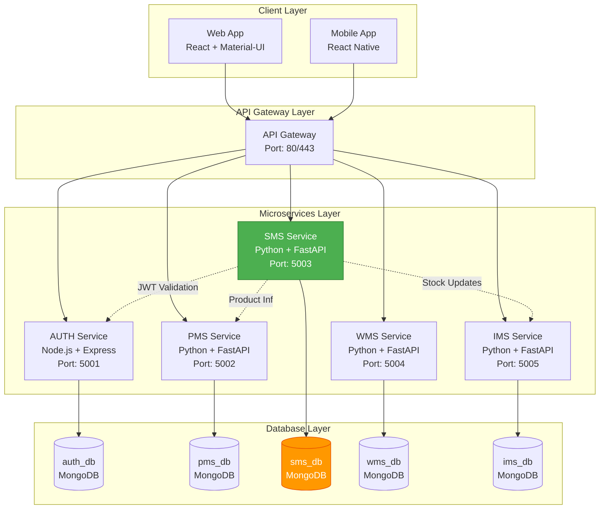
```mermaid
graph TB
    subgraph "Client Layer"
        WEB[Web App<br/>React + Material-UI]
        MOBILE[Mobile App<br/>React Native]
    end
    
    subgraph "API Gateway Layer"
        GATEWAY[API Gateway<br/>Port: 80/443]
    end
    
    subgraph "Microservices Layer"
        AUTH[AUTH Service<br/>Node.js + Express<br/>Port: 5001]
        PMS[PMS Service<br/>Python + FastAPI<br/>Port: 5002]
        SMS[SMS Service<br/>Python + FastAPI<br/>Port: 5003]
        WMS[WMS Service<br/>Python + FastAPI<br/>Port: 5004]
        IMS[IMS Service<br/>Python + FastAPI<br/>Port: 5005]
    end
    
    subgraph "Database Layer"
        AUTHDB[(auth_db<br/>MongoDB)]
        PMSDB[(pms_db<br/>MongoDB)]
        SMSDB[(sms_db<br/>MongoDB)]
        WMSDB[(wms_db<br/>MongoDB)]
        IMSDB[(ims_db<br/>MongoDB)]
    end
    
    WEB --> GATEWAY
    MOBILE --> GATEWAY
    
    GATEWAY --> AUTH
    GATEWAY --> PMS
    GATEWAY --> SMS
    GATEWAY --> WMS
    GATEWAY --> IMS
    
    AUTH --> AUTHDB
    PMS --> PMSDB
    SMS --> SMSDB
    WMS --> WMSDB
    IMS --> IMSDB
    
    SMS -.JWT Validation.-> AUTH
    SMS -.Product Info.-> PMS
    SMS -.Stock Updates.-> IMS
    
    style SMS fill:#4CAF50,stroke:#2E7D32,color:#fff
    style SMSDB fill:#FF9800,stroke:#E65100,color:#fff
```

---

## 3. Authentication & Authorization Flows

### 3.1 JWT Token Validation Flow

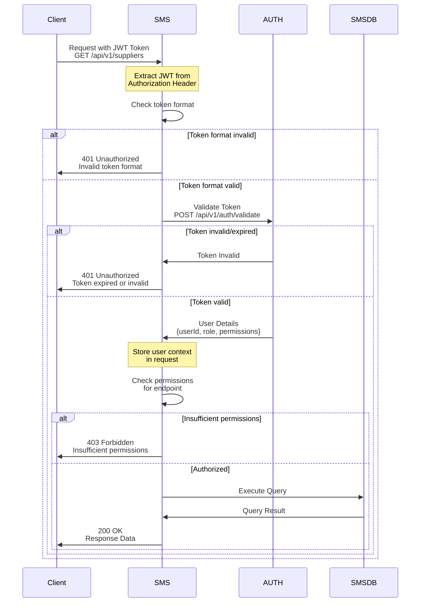
```mermaid
sequenceDiagram
    participant Client
    participant SMS
    participant AUTH
    participant SMSDB
    
    Client->>SMS: Request with JWT Token<br/>GET /api/v1/suppliers
    
    Note over SMS: Extract JWT from<br/>Authorization Header
    
    SMS->>SMS: Check token format
    
    alt Token format invalid
        SMS->>Client: 401 Unauthorized<br/>Invalid token format
    else Token format valid
        SMS->>AUTH: Validate Token<br/>POST /api/v1/auth/validate
        
        alt Token invalid/expired
            AUTH->>SMS: Token Invalid
            SMS->>Client: 401 Unauthorized<br/>Token expired or invalid
        else Token valid
            AUTH->>SMS: User Details<br/>{userId, role, permissions}
            
            Note over SMS: Store user context<br/>in request
            
            SMS->>SMS: Check permissions<br/>for endpoint
            
            alt Insufficient permissions
                SMS->>Client: 403 Forbidden<br/>Insufficient permissions
            else Authorized
                SMS->>SMSDB: Execute Query
                SMSDB->>SMS: Query Result
                SMS->>Client: 200 OK<br/>Response Data
            end
        end
    end
```

### 3.2 Role-Based Access Control Flow

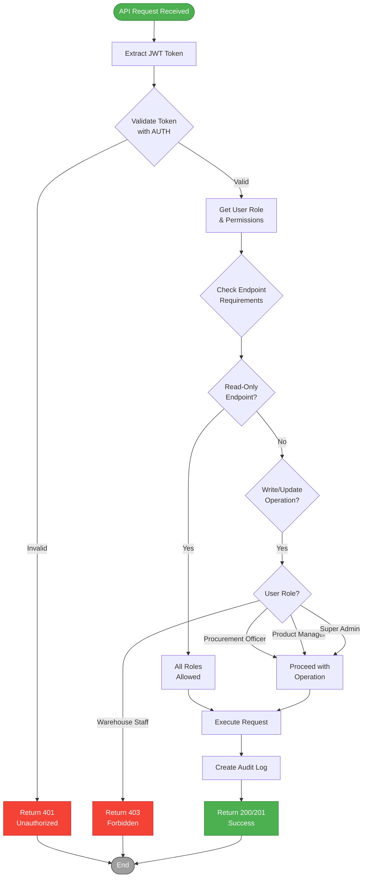
```mermaid
flowchart TD
    Start([API Request Received]) --> ExtractToken[Extract JWT Token]
    ExtractToken --> ValidateToken{Validate Token<br/>with AUTH}
    
    ValidateToken -->|Invalid| Unauthorized[Return 401<br/>Unauthorized]
    ValidateToken -->|Valid| GetUserRole[Get User Role<br/>& Permissions]
    
    GetUserRole --> CheckEndpoint{Check Endpoint<br/>Requirements}
    
    CheckEndpoint --> ReadOnly{Read-Only<br/>Endpoint?}
    ReadOnly -->|Yes| AllRoles[All Roles<br/>Allowed]
    ReadOnly -->|No| WriteOperation{Write/Update<br/>Operation?}
    
    WriteOperation -->|Yes| CheckRole{User Role?}
    
    CheckRole -->|Warehouse Staff| Forbidden[Return 403<br/>Forbidden]
    CheckRole -->|Procurement Officer| Allowed[Proceed with<br/>Operation]
    CheckRole -->|Product Manager| Allowed
    CheckRole -->|Super Admin| Allowed
    
    AllRoles --> Execute[Execute Request]
    Allowed --> Execute
    Execute --> AuditLog[Create Audit Log]
    AuditLog --> Success[Return 200/201<br/>Success]
    
    Unauthorized --> End([End])
    Forbidden --> End
    Success --> End
    
    style Start fill:#4CAF50,stroke:#2E7D32,color:#fff
    style Success fill:#4CAF50,stroke:#2E7D32,color:#fff
    style Unauthorized fill:#f44336,stroke:#c62828,color:#fff
    style Forbidden fill:#f44336,stroke:#c62828,color:#fff
    style End fill:#9E9E9E,stroke:#424242,color:#fff
```

---

## 4. SMS Service Internal Flows

### 4.1 Create Supplier Flow

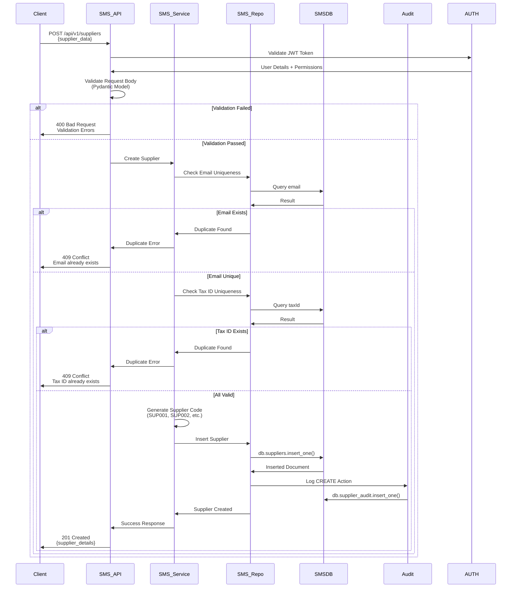
```mermaid
sequenceDiagram
    participant Client
    participant SMS_API
    participant SMS_Service
    participant SMS_Repo
    participant SMSDB
    participant Audit
    participant AUTH
    
    Client->>SMS_API: POST /api/v1/suppliers<br/>{supplier_data}
    
    SMS_API->>AUTH: Validate JWT Token
    AUTH->>SMS_API: User Details + Permissions
    
    SMS_API->>SMS_API: Validate Request Body<br/>(Pydantic Model)
    
    alt Validation Failed
        SMS_API->>Client: 400 Bad Request<br/>Validation Errors
    else Validation Passed
        SMS_API->>SMS_Service: Create Supplier
        
        SMS_Service->>SMS_Repo: Check Email Uniqueness
        SMS_Repo->>SMSDB: Query email
        SMSDB->>SMS_Repo: Result
        
        alt Email Exists
            SMS_Repo->>SMS_Service: Duplicate Found
            SMS_Service->>SMS_API: Duplicate Error
            SMS_API->>Client: 409 Conflict<br/>Email already exists
        else Email Unique
            SMS_Service->>SMS_Repo: Check Tax ID Uniqueness
            SMS_Repo->>SMSDB: Query taxId
            SMSDB->>SMS_Repo: Result
            
            alt Tax ID Exists
                SMS_Repo->>SMS_Service: Duplicate Found
                SMS_Service->>SMS_API: Duplicate Error
                SMS_API->>Client: 409 Conflict<br/>Tax ID already exists
            else All Valid
                SMS_Service->>SMS_Service: Generate Supplier Code<br/>(SUP001, SUP002, etc.)
                
                SMS_Service->>SMS_Repo: Insert Supplier
                SMS_Repo->>SMSDB: db.suppliers.insert_one()
                SMSDB->>SMS_Repo: Inserted Document
                
                SMS_Repo->>Audit: Log CREATE Action
                Audit->>SMSDB: db.supplier_audit.insert_one()
                
                SMS_Repo->>SMS_Service: Supplier Created
                SMS_Service->>SMS_API: Success Response
                SMS_API->>Client: 201 Created<br/>{supplier_details}
            end
        end
    end
```

### 4.2 Update Supplier Pricing Flow

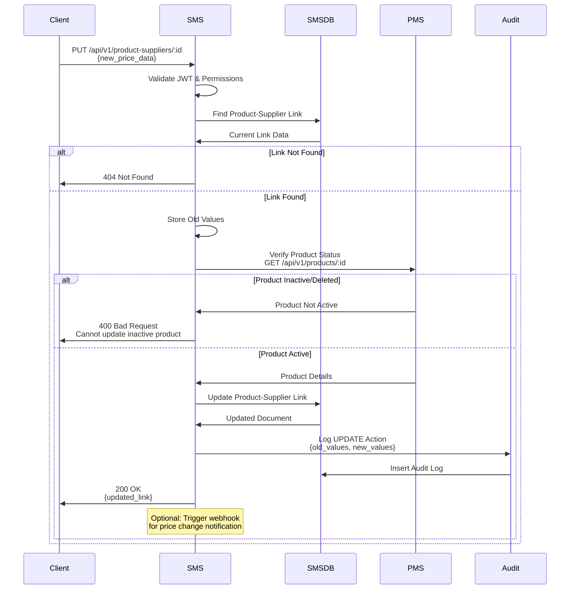
```mermaid
sequenceDiagram
    participant Client
    participant SMS
    participant SMSDB
    participant PMS
    participant Audit
    
    Client->>SMS: PUT /api/v1/product-suppliers/:id<br/>{new_price_data}
    
    SMS->>SMS: Validate JWT & Permissions
    
    SMS->>SMSDB: Find Product-Supplier Link
    SMSDB->>SMS: Current Link Data
    
    alt Link Not Found
        SMS->>Client: 404 Not Found
    else Link Found
        SMS->>SMS: Store Old Values
        
        SMS->>PMS: Verify Product Status<br/>GET /api/v1/products/:id
        
        alt Product Inactive/Deleted
            PMS->>SMS: Product Not Active
            SMS->>Client: 400 Bad Request<br/>Cannot update inactive product
        else Product Active
            PMS->>SMS: Product Details
            
            SMS->>SMSDB: Update Product-Supplier Link
            SMSDB->>SMS: Updated Document
            
            SMS->>Audit: Log UPDATE Action<br/>{old_values, new_values}
            Audit->>SMSDB: Insert Audit Log
            
            SMS->>Client: 200 OK<br/>{updated_link}
            
            Note over SMS: Optional: Trigger webhook<br/>for price change notification
        end
    end
```

---

## 5. Inter-Service Communication

### 5.1 SMS ↔ AUTH Integration

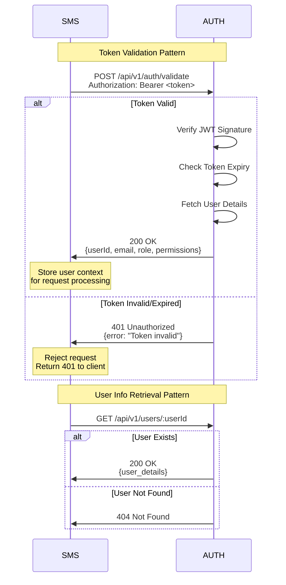
```mermaid
sequenceDiagram
    participant SMS
    participant AUTH
    
    Note over SMS,AUTH: Token Validation Pattern
    
    SMS->>AUTH: POST /api/v1/auth/validate<br/>Authorization: Bearer <token>
    
    alt Token Valid
        AUTH->>AUTH: Verify JWT Signature
        AUTH->>AUTH: Check Token Expiry
        AUTH->>AUTH: Fetch User Details
        
        AUTH->>SMS: 200 OK<br/>{userId, email, role, permissions}
        
        Note over SMS: Store user context<br/>for request processing
        
    else Token Invalid/Expired
        AUTH->>SMS: 401 Unauthorized<br/>{error: "Token invalid"}
        
        Note over SMS: Reject request<br/>Return 401 to client
    end
    
    Note over SMS,AUTH: User Info Retrieval Pattern
    
    SMS->>AUTH: GET /api/v1/users/:userId
    
    alt User Exists
        AUTH->>SMS: 200 OK<br/>{user_details}
    else User Not Found
        AUTH->>SMS: 404 Not Found
    end
```

### 5.2 SMS ↔ PMS Integration

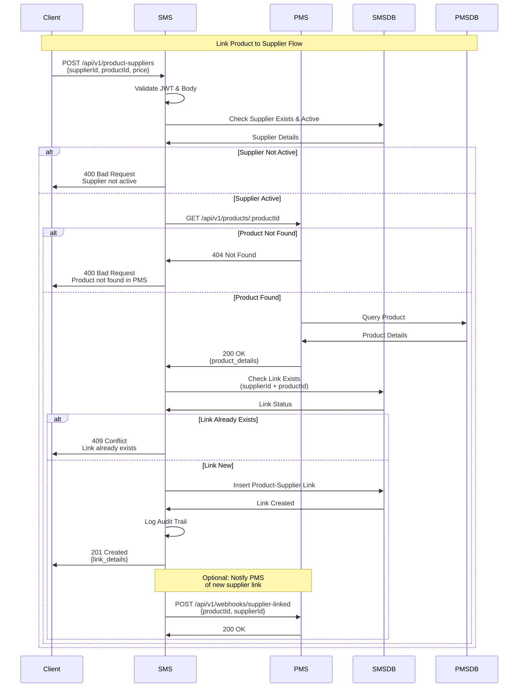
```mermaid
sequenceDiagram
    participant Client
    participant SMS
    participant PMS
    participant SMSDB
    participant PMSDB
    
    Note over Client,PMSDB: Link Product to Supplier Flow
    
    Client->>SMS: POST /api/v1/product-suppliers<br/>{supplierId, productId, price}
    
    SMS->>SMS: Validate JWT & Body
    
    SMS->>SMSDB: Check Supplier Exists & Active
    SMSDB->>SMS: Supplier Details
    
    alt Supplier Not Active
        SMS->>Client: 400 Bad Request<br/>Supplier not active
    else Supplier Active
        SMS->>PMS: GET /api/v1/products/:productId
        
        alt Product Not Found
            PMS->>SMS: 404 Not Found
            SMS->>Client: 400 Bad Request<br/>Product not found in PMS
        else Product Found
            PMS->>PMSDB: Query Product
            PMSDB->>PMS: Product Details
            PMS->>SMS: 200 OK<br/>{product_details}
            
            SMS->>SMSDB: Check Link Exists<br/>(supplierId + productId)
            SMSDB->>SMS: Link Status
            
            alt Link Already Exists
                SMS->>Client: 409 Conflict<br/>Link already exists
            else Link New
                SMS->>SMSDB: Insert Product-Supplier Link
                SMSDB->>SMS: Link Created
                
                SMS->>SMS: Log Audit Trail
                
                SMS->>Client: 201 Created<br/>{link_details}
                
                Note over SMS,PMS: Optional: Notify PMS<br/>of new supplier link
                SMS->>PMS: POST /api/v1/webhooks/supplier-linked<br/>{productId, supplierId}
                PMS->>SMS: 200 OK
            end
        end
    end
```

### 5.3 SMS ↔ IMS Integration (Future)

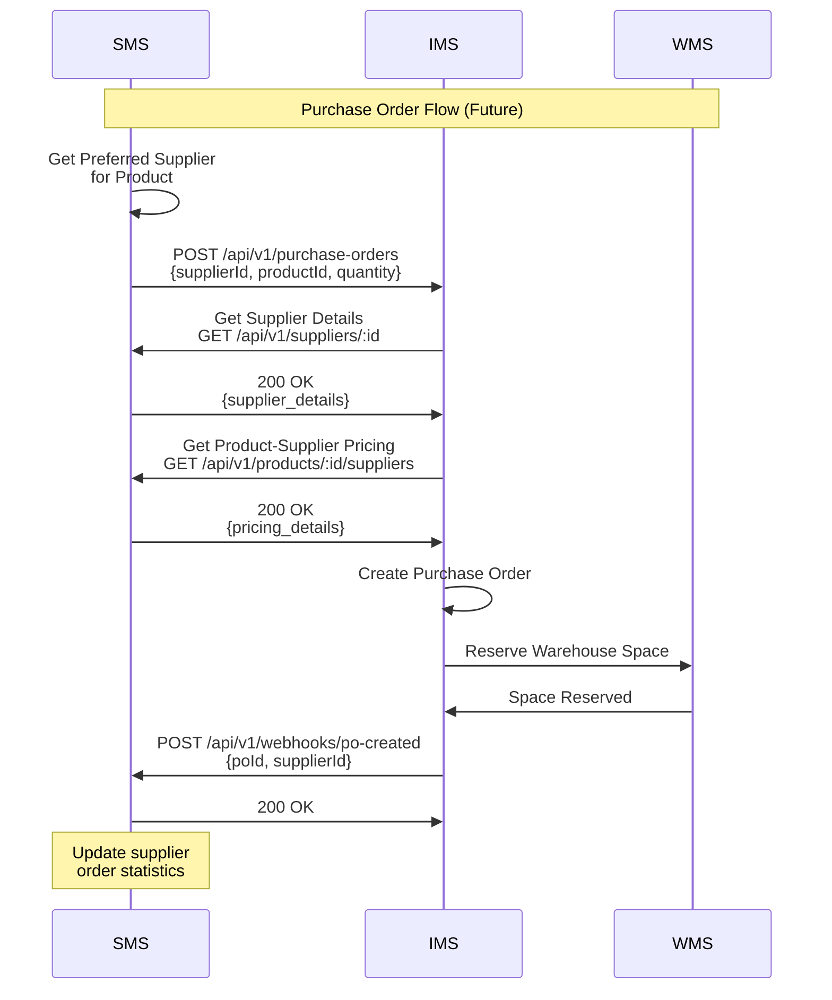
```mermaid
sequenceDiagram
    participant SMS
    participant IMS
    participant WMS
    
    Note over SMS,WMS: Purchase Order Flow (Future)
    
    SMS->>SMS: Get Preferred Supplier<br/>for Product
    
    SMS->>IMS: POST /api/v1/purchase-orders<br/>{supplierId, productId, quantity}
    
    IMS->>SMS: Get Supplier Details<br/>GET /api/v1/suppliers/:id
    SMS->>IMS: 200 OK<br/>{supplier_details}
    
    IMS->>SMS: Get Product-Supplier Pricing<br/>GET /api/v1/products/:id/suppliers
    SMS->>IMS: 200 OK<br/>{pricing_details}
    
    IMS->>IMS: Create Purchase Order
    
    IMS->>WMS: Reserve Warehouse Space
    WMS->>IMS: Space Reserved
    
    IMS->>SMS: POST /api/v1/webhooks/po-created<br/>{poId, supplierId}
    SMS->>IMS: 200 OK
    
    Note over SMS: Update supplier<br/>order statistics
```

---

## 6. Event-Driven Communication

### 6.1 Webhook Event Flow

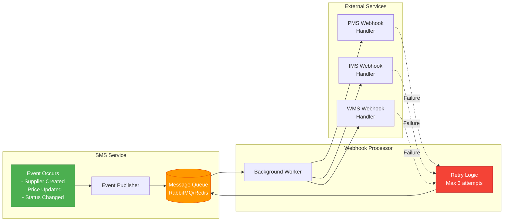
```mermaid
flowchart LR
    subgraph SMS Service
        Event[Event Occurs<br/>- Supplier Created<br/>- Price Updated<br/>- Status Changed]
        Publisher[Event Publisher]
        Queue[(Message Queue<br/>RabbitMQ/Redis)]
    end
    
    subgraph External Services
        PMS_Webhook[PMS Webhook<br/>Handler]
        IMS_Webhook[IMS Webhook<br/>Handler]
        WMS_Webhook[WMS Webhook<br/>Handler]
    end
    
    subgraph Webhook Processor
        Worker[Background Worker]
        Retry[Retry Logic<br/>Max 3 attempts]
    end
    
    Event --> Publisher
    Publisher --> Queue
    Queue --> Worker
    
    Worker --> PMS_Webhook
    Worker --> IMS_Webhook
    Worker --> WMS_Webhook
    
    PMS_Webhook -.Failure.-> Retry
    IMS_Webhook -.Failure.-> Retry
    WMS_Webhook -.Failure.-> Retry
    
    Retry --> Queue
    
    style Event fill:#4CAF50,stroke:#2E7D32,color:#fff
    style Queue fill:#FF9800,stroke:#E65100,color:#fff
    style Retry fill:#f44336,stroke:#c62828,color:#fff
```

### 6.2 Supplier Status Change Event

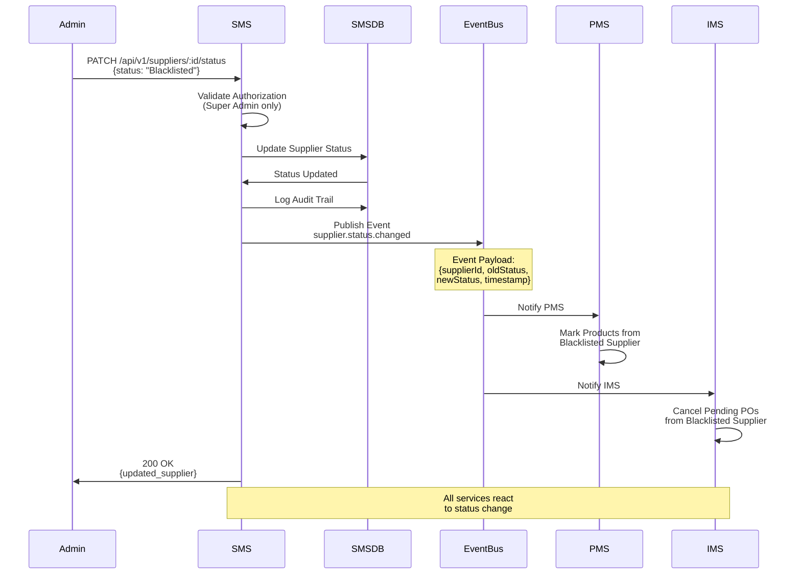
```mermaid
sequenceDiagram
    participant Admin
    participant SMS
    participant SMSDB
    participant EventBus
    participant PMS
    participant IMS
    
    Admin->>SMS: PATCH /api/v1/suppliers/:id/status<br/>{status: "Blacklisted"}
    
    SMS->>SMS: Validate Authorization<br/>(Super Admin only)
    
    SMS->>SMSDB: Update Supplier Status
    SMSDB->>SMS: Status Updated
    
    SMS->>SMSDB: Log Audit Trail
    
    SMS->>EventBus: Publish Event<br/>supplier.status.changed
    
    Note over EventBus: Event Payload:<br/>{supplierId, oldStatus,<br/>newStatus, timestamp}
    
    EventBus->>PMS: Notify PMS
    PMS->>PMS: Mark Products from<br/>Blacklisted Supplier
    
    EventBus->>IMS: Notify IMS
    IMS->>IMS: Cancel Pending POs<br/>from Blacklisted Supplier
    
    SMS->>Admin: 200 OK<br/>{updated_supplier}
    
    Note over SMS,IMS: All services react<br/>to status change
```

---

## 7. Error Handling Flows

### 7.1 External Service Timeout Handling

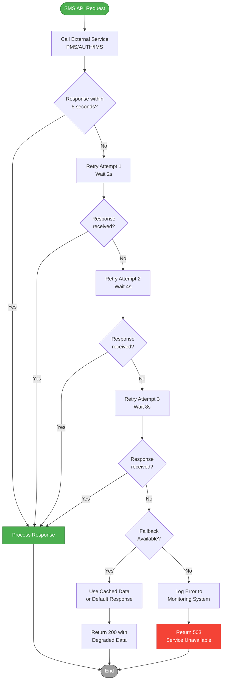
```mermaid
flowchart TD
    Start([SMS API Request]) --> CallExternal[Call External Service<br/>PMS/AUTH/IMS]
    
    CallExternal --> Timeout{Response within<br/>5 seconds?}
    
    Timeout -->|Yes| Success[Process Response]
    Timeout -->|No| FirstRetry[Retry Attempt 1<br/>Wait 2s]
    
    FirstRetry --> Timeout1{Response<br/>received?}
    Timeout1 -->|Yes| Success
    Timeout1 -->|No| SecondRetry[Retry Attempt 2<br/>Wait 4s]
    
    SecondRetry --> Timeout2{Response<br/>received?}
    Timeout2 -->|Yes| Success
    Timeout2 -->|No| ThirdRetry[Retry Attempt 3<br/>Wait 8s]
    
    ThirdRetry --> Timeout3{Response<br/>received?}
    Timeout3 -->|Yes| Success
    Timeout3 -->|No| Fallback{Fallback<br/>Available?}
    
    Fallback -->|Yes| UseFallback[Use Cached Data<br/>or Default Response]
    Fallback -->|No| LogError[Log Error to<br/>Monitoring System]
    
    UseFallback --> PartialSuccess[Return 200 with<br/>Degraded Data]
    LogError --> ReturnError[Return 503<br/>Service Unavailable]
    
    Success --> End([End])
    PartialSuccess --> End
    ReturnError --> End
    
    style Start fill:#4CAF50,stroke:#2E7D32,color:#fff
    style Success fill:#4CAF50,stroke:#2E7D32,color:#fff
    style ReturnError fill:#f44336,stroke:#c62828,color:#fff
    style End fill:#9E9E9E,stroke:#424242,color:#fff
```

### 7.2 Database Connection Failure Flow

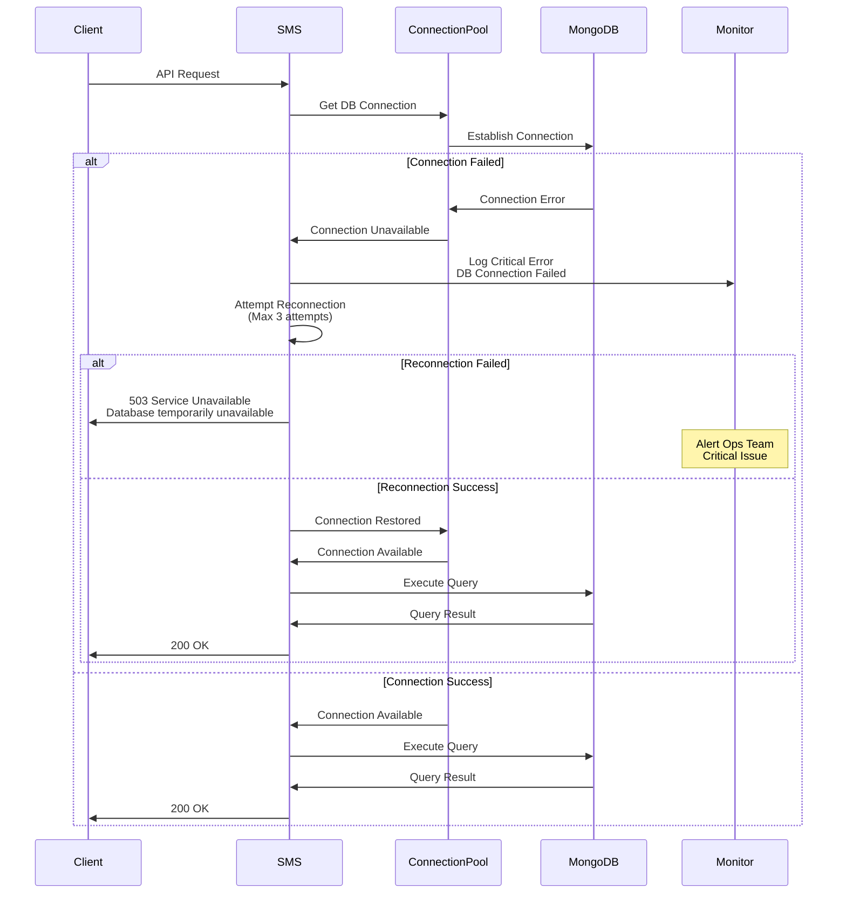
```mermaid
sequenceDiagram
    participant Client
    participant SMS
    participant ConnectionPool
    participant MongoDB
    participant Monitor
    
    Client->>SMS: API Request
    
    SMS->>ConnectionPool: Get DB Connection
    
    ConnectionPool->>MongoDB: Establish Connection
    
    alt Connection Failed
        MongoDB->>ConnectionPool: Connection Error
        ConnectionPool->>SMS: Connection Unavailable
        
        SMS->>Monitor: Log Critical Error<br/>DB Connection Failed
        
        SMS->>SMS: Attempt Reconnection<br/>(Max 3 attempts)
        
        alt Reconnection Failed
            SMS->>Client: 503 Service Unavailable<br/>Database temporarily unavailable
            
            Note over Monitor: Alert Ops Team<br/>Critical Issue
        else Reconnection Success
            SMS->>ConnectionPool: Connection Restored
            ConnectionPool->>SMS: Connection Available
            SMS->>MongoDB: Execute Query
            MongoDB->>SMS: Query Result
            SMS->>Client: 200 OK
        end
    else Connection Success
        ConnectionPool->>SMS: Connection Available
        SMS->>MongoDB: Execute Query
        MongoDB->>SMS: Query Result
        SMS->>Client: 200 OK
    end
```

---

## 8. Data Synchronization Flows

### 8.1 Product Information Sync

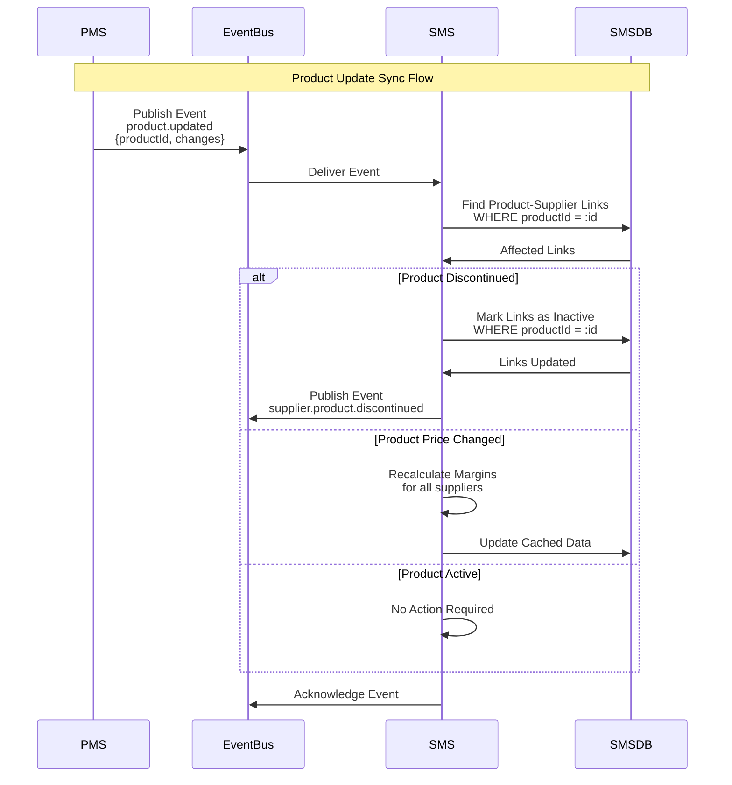
```mermaid
sequenceDiagram
    participant PMS
    participant EventBus
    participant SMS
    participant SMSDB
    
    Note over PMS,SMSDB: Product Update Sync Flow
    
    PMS->>EventBus: Publish Event<br/>product.updated<br/>{productId, changes}
    
    EventBus->>SMS: Deliver Event
    
    SMS->>SMSDB: Find Product-Supplier Links<br/>WHERE productId = :id
    
    SMSDB->>SMS: Affected Links
    
    alt Product Discontinued
        SMS->>SMSDB: Mark Links as Inactive<br/>WHERE productId = :id
        SMSDB->>SMS: Links Updated
        
        SMS->>EventBus: Publish Event<br/>supplier.product.discontinued
        
    else Product Price Changed
        SMS->>SMS: Recalculate Margins<br/>for all suppliers
        
        SMS->>SMSDB: Update Cached Data
        
    else Product Active
        SMS->>SMS: No Action Required
    end
    
    SMS->>EventBus: Acknowledge Event
```

### 8.2 Supplier Contact Cascade Updates

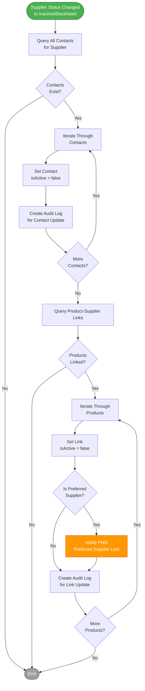
```mermaid
flowchart TD
    Start([Supplier Status Changed<br/>to Inactive/Blacklisted]) --> GetContacts[Query All Contacts<br/>for Supplier]
    
    GetContacts --> HasContacts{Contacts<br/>Exist?}
    
    HasContacts -->|No| End([End])
    HasContacts -->|Yes| IterateContacts[Iterate Through<br/>Contacts]
    
    IterateContacts --> UpdateContact[Set Contact<br/>isActive = false]
    
    UpdateContact --> LogAudit[Create Audit Log<br/>for Contact Update]
    
    LogAudit --> MoreContacts{More<br/>Contacts?}
    
    MoreContacts -->|Yes| IterateContacts
    MoreContacts -->|No| UpdateProducts[Query Product-Supplier Links]
    
    UpdateProducts --> HasProducts{Products<br/>Linked?}
    
    HasProducts -->|No| End
    HasProducts -->|Yes| IterateProducts[Iterate Through<br/>Products]
    
    IterateProducts --> UpdateLink[Set Link<br/>isActive = false]
    
    UpdateLink --> CheckPreferred{Is Preferred<br/>Supplier?}
    
    CheckPreferred -->|Yes| NotifyPMS[Notify PMS<br/>Preferred Supplier Lost]
    CheckPreferred -->|No| LogProductAudit[Create Audit Log<br/>for Link Update]
    
    NotifyPMS --> LogProductAudit
    
    LogProductAudit --> MoreProducts{More<br/>Products?}
    
    MoreProducts -->|Yes| IterateProducts
    MoreProducts -->|No| End
    
    style Start fill:#4CAF50,stroke:#2E7D32,color:#fff
    style End fill:#9E9E9E,stroke:#424242,color:#fff
    style NotifyPMS fill:#FF9800,stroke:#E65100,color:#fff
```

---

## 9. CI/CD Pipeline Flow

### 9.1 SMS Deployment Pipeline

```mermaid
flowchart LR
    subgraph Development
        Dev[Developer<br/>Commits Code]
        Git[Git Repository<br/>GitHub/GitLab]
    end
    
    subgraph CI Pipeline
        Trigger[Pipeline Trigger]
        Lint[Code Linting<br/>Flake8, Black]
        Test[Run Tests<br/>pytest]
        Coverage[Coverage Report<br/>Min 80%]
        Build[Build Docker Image]
        Scan[Security Scan<br/>Trivy]
    end
    
    subgraph Artifact Storage
        Registry[Container Registry<br/>Docker Hub/ECR]
    end
    
    subgraph CD Pipeline
        Deploy_Dev[Deploy to Dev]
        Smoke_Test[Smoke Tests]
        Deploy_Staging[Deploy to Staging]
        Integration_Test[Integration Tests]
        Approval[Manual Approval]
        Deploy_Prod[Deploy to Production]
        Health_Check[Health Checks]
    end
    
    subgraph Monitoring
        Logs[Centralized Logs]
        Metrics[Metrics Dashboard]
        Alerts[Alert System]
    end
    
    Dev --> Git
    Git --> Trigger
    
    Trigger --> Lint
    Lint --> Test
    Test --> Coverage
    Coverage --> Build
    Build --> Scan
    
    Scan --> Registry
    
    Registry --> Deploy_Dev
    Deploy_Dev --> Smoke_Test
    Smoke_Test --> Deploy_Staging
    Deploy_Staging --> Integration_Test
    Integration_Test --> Approval
    Approval --> Deploy_Prod
    Deploy_Prod --> Health_Check
    
    Health_Check --> Logs
    Health_Check --> Metrics
    Health_Check --> Alerts
    
    style Dev fill:#4CAF50,stroke:#2E7D32,color:#fff
    style Deploy_Prod fill:#FF9800,stroke:#E65100,color:#fff
    style Alerts fill:#f44336,stroke:#c62828,color:#fff
```

### 9.2 Database Migration Flow

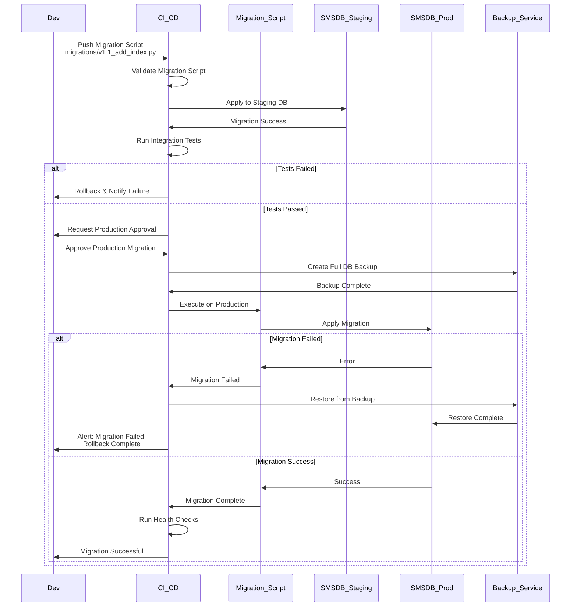
```mermaid
sequenceDiagram
    participant Dev
    participant CI_CD
    participant Migration_Script
    participant SMSDB_Staging
    participant SMSDB_Prod
    participant Backup_Service
    
    Dev->>CI_CD: Push Migration Script<br/>migrations/v1.1_add_index.py
    
    CI_CD->>CI_CD: Validate Migration Script
    
    CI_CD->>SMSDB_Staging: Apply to Staging DB
    SMSDB_Staging->>CI_CD: Migration Success
    
    CI_CD->>CI_CD: Run Integration Tests
    
    alt Tests Failed
        CI_CD->>Dev: Rollback & Notify Failure
    else Tests Passed
        CI_CD->>Dev: Request Production Approval
        
        Dev->>CI_CD: Approve Production Migration
        
        CI_CD->>Backup_Service: Create Full DB Backup
        Backup_Service->>CI_CD: Backup Complete
        
        CI_CD->>Migration_Script: Execute on Production
        
        Migration_Script->>SMSDB_Prod: Apply Migration
        
        alt Migration Failed
            SMSDB_Prod->>Migration_Script: Error
            Migration_Script->>CI_CD: Migration Failed
            
            CI_CD->>Backup_Service: Restore from Backup
            Backup_Service->>SMSDB_Prod: Restore Complete
            
            CI_CD->>Dev: Alert: Migration Failed,<br/>Rollback Complete
        else Migration Success
            SMSDB_Prod->>Migration_Script: Success
            Migration_Script->>CI_CD: Migration Complete
            
            CI_CD->>CI_CD: Run Health Checks
            
            CI_CD->>Dev: Migration Successful
        end
    end
```

---

## 10. Deployment Architectures

### 10.1 Docker Compose Deployment (Development)

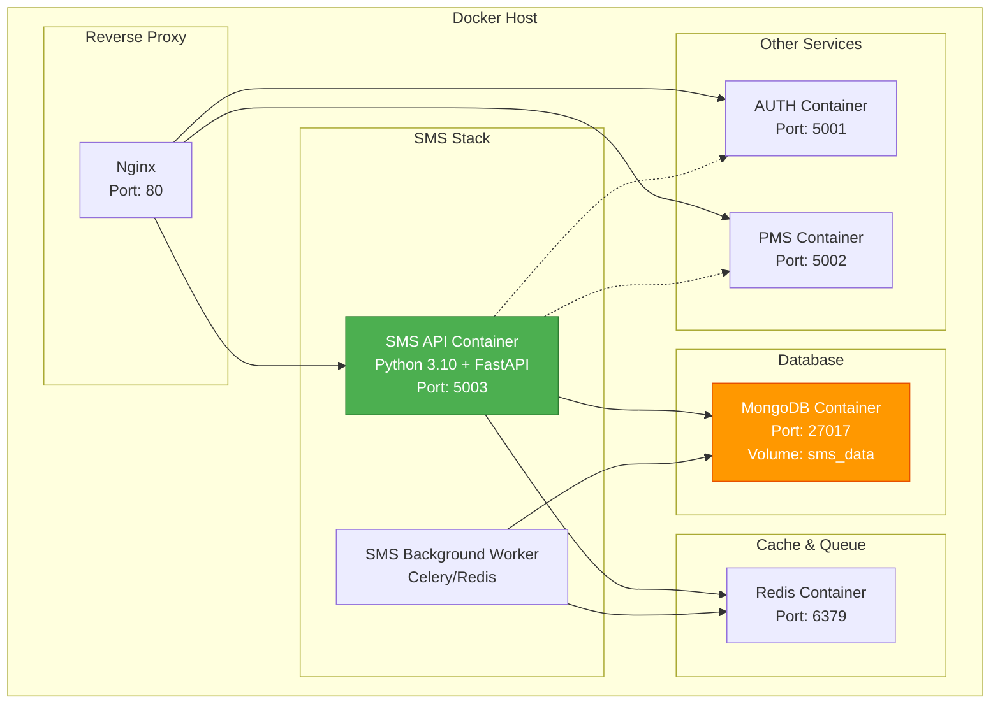
```mermaid
graph TB
    subgraph "Docker Host"
        subgraph "SMS Stack"
            SMS_API[SMS API Container<br/>Python 3.10 + FastAPI<br/>Port: 5003]
            SMS_Worker[SMS Background Worker<br/>Celery/Redis]
        end
        
        subgraph "Database"
            MongoDB[MongoDB Container<br/>Port: 27017<br/>Volume: sms_data]
        end
        
        subgraph "Cache & Queue"
            Redis[Redis Container<br/>Port: 6379]
        end
        
        subgraph "Other Services"
            AUTH_API[AUTH Container<br/>Port: 5001]
            PMS_API[PMS Container<br/>Port: 5002]
        end
        
        subgraph "Reverse Proxy"
            Nginx[Nginx<br/>Port: 80]
        end
    end
    
    Nginx --> SMS_API
    Nginx --> AUTH_API
    Nginx --> PMS_API
    
    SMS_API --> MongoDB
    SMS_API --> Redis
    SMS_API -.-> AUTH_API
    SMS_API -.-> PMS_API
    
    SMS_Worker --> MongoDB
    SMS_Worker --> Redis
    
    style SMS_API fill:#4CAF50,stroke:#2E7D32,color:#fff
    style MongoDB fill:#FF9800,stroke:#E65100,color:#fff
```

### 10.2 AWS Cloud Deployment (Production)

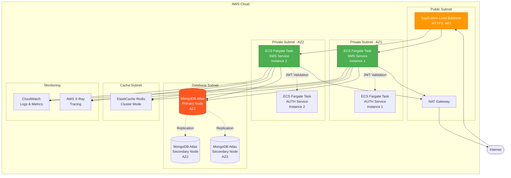
```mermaid
graph TB
    subgraph "AWS Cloud"
        subgraph "Public Subnet"
            ALB[Application Load Balancer<br/>HTTPS: 443]
            NAT[NAT Gateway]
        end
        
        subgraph "Private Subnet - AZ1"
            ECS1[ECS Fargate Task<br/>SMS Service<br/>Instance 1]
            AUTH1[ECS Fargate Task<br/>AUTH Service<br/>Instance 1]
        end
        
        subgraph "Private Subnet - AZ2"
            ECS2[ECS Fargate Task<br/>SMS Service<br/>Instance 2]
            AUTH2[ECS Fargate Task<br/>AUTH Service<br/>Instance 2]
        end
        
        subgraph "Database Subnet"
            MongoDB_Primary[(MongoDB Atlas<br/>Primary Node<br/>AZ1)]
            MongoDB_Secondary1[(MongoDB Atlas<br/>Secondary Node<br/>AZ2)]
            MongoDB_Secondary2[(MongoDB Atlas<br/>Secondary Node<br/>AZ3)]
        end
        
        subgraph "Cache Subnet"
            ElastiCache[ElastiCache Redis<br/>Cluster Mode]
        end
        
        subgraph "Monitoring"
            CloudWatch[CloudWatch<br/>Logs & Metrics]
            XRay[AWS X-Ray<br/>Tracing]
        end
    end
    
    Internet([Internet]) --> ALB
    
    ALB --> ECS1
    ALB --> ECS2
    
    ECS1 --> MongoDB_Primary
    ECS2 --> MongoDB_Primary
    
    MongoDB_Primary -.Replication.-> MongoDB_Secondary1
    MongoDB_Primary -.Replication.-> MongoDB_Secondary2
    
    ECS1 --> ElastiCache
    ECS2 --> ElastiCache
    
    ECS1 -.JWT Validation.-> AUTH1
    ECS2 -.JWT Validation.-> AUTH2
    
    ECS1 --> CloudWatch
    ECS2 --> CloudWatch
    ECS1 --> XRay
    ECS2 --> XRay
    
    ECS1 --> NAT
    ECS2 --> NAT
    NAT --> Internet
    
    style ALB fill:#FF9800,stroke:#E65100,color:#fff
    style ECS1 fill:#4CAF50,stroke:#2E7D32,color:#fff
    style ECS2 fill:#4CAF50,stroke:#2E7D32,color:#fff
    style MongoDB_Primary fill:#FF5722,stroke:#D84315,color:#fff
```

---

## 11. Monitoring & Observability

### 11.1 Logging Flow

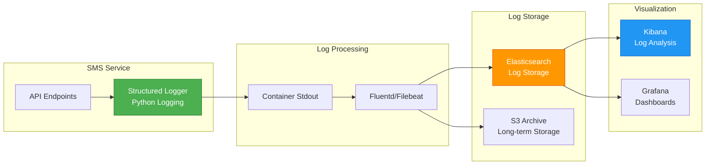
```mermaid
flowchart LR
    subgraph SMS Service
        API[API Endpoints]
        Logger[Structured Logger<br/>Python Logging]
    end
    
    subgraph Log Processing
        Stdout[Container Stdout]
        LogAgent[Fluentd/Filebeat]
    end
    
    subgraph Log Storage
        ES[Elasticsearch<br/>Log Storage]
        S3[S3 Archive<br/>Long-term Storage]
    end
    
    subgraph Visualization
        Kibana[Kibana<br/>Log Analysis]
        Grafana[Grafana<br/>Dashboards]
    end
    
    API --> Logger
    Logger --> Stdout
    Stdout --> LogAgent
    
    LogAgent --> ES
    LogAgent --> S3
    
    ES --> Kibana
    ES --> Grafana
    
    style Logger fill:#4CAF50,stroke:#2E7D32,color:#fff
    style ES fill:#FF9800,stroke:#E65100,color:#fff
    style Kibana fill:#2196F3,stroke:#1565C0,color:#fff
```

### 11.2 Metrics & Alerting Flow

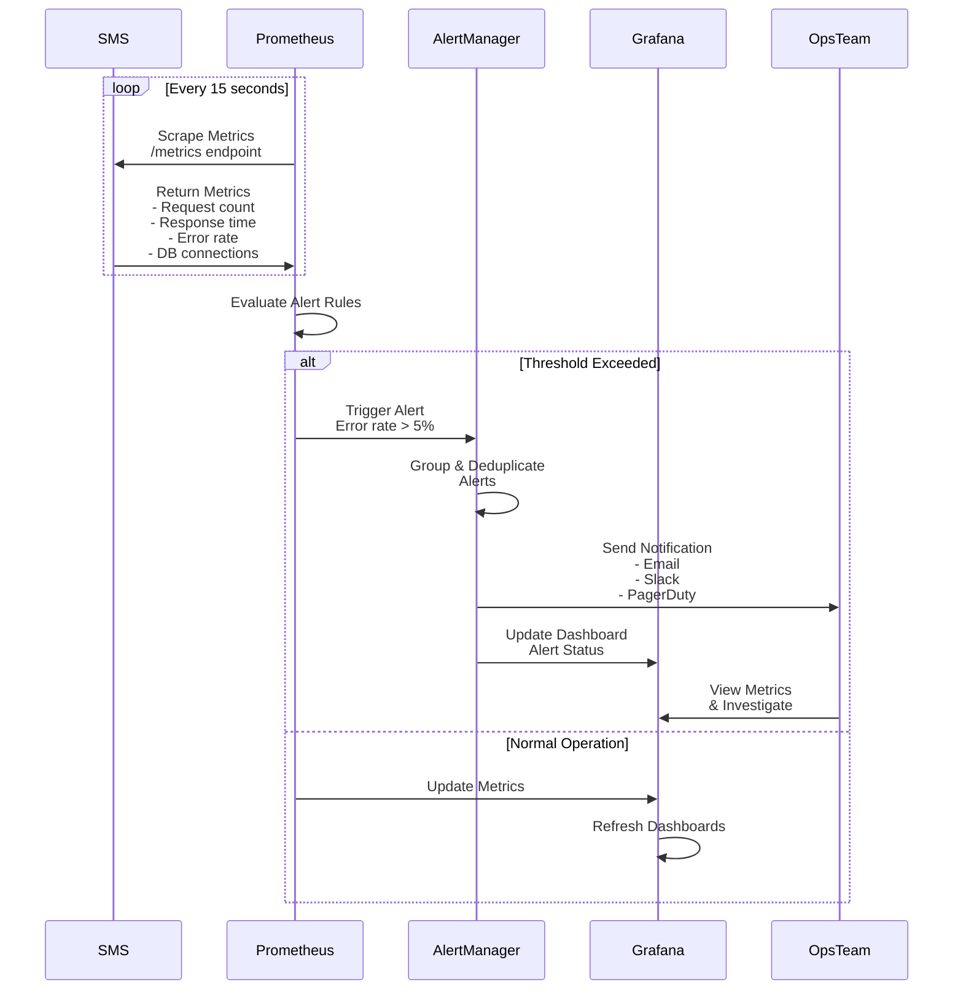
```mermaid
sequenceDiagram
    participant SMS
    participant Prometheus
    participant AlertManager
    participant Grafana
    participant OpsTeam
    
    loop Every 15 seconds
        Prometheus->>SMS: Scrape Metrics<br/>/metrics endpoint
        SMS->>Prometheus: Return Metrics<br/>- Request count<br/>- Response time<br/>- Error rate<br/>- DB connections
    end
    
    Prometheus->>Prometheus: Evaluate Alert Rules
    
    alt Threshold Exceeded
        Prometheus->>AlertManager: Trigger Alert<br/>Error rate > 5%
        
        AlertManager->>AlertManager: Group & Deduplicate<br/>Alerts
        
        AlertManager->>OpsTeam: Send Notification<br/>- Email<br/>- Slack<br/>- PagerDuty
        
        AlertManager->>Grafana: Update Dashboard<br/>Alert Status
        
        OpsTeam->>Grafana: View Metrics<br/>& Investigate
        
    else Normal Operation
        Prometheus->>Grafana: Update Metrics
        Grafana->>Grafana: Refresh Dashboards
    end
```

---

## 12. Performance Optimization Flows

### 12.1 Caching Strategy

```mermaid
flowchart TD
    Start([API Request]) --> CheckCache{Check Redis<br/>Cache}
    
    CheckCache -->|Hit| ReturnCached[Return Cached<br/>Response]
    CheckCache -->|Miss| QueryDB[Query MongoDB]
    
    QueryDB --> ProcessData[Process Data]
    ProcessData --> StoreCache[Store in Redis<br/>TTL: 5 minutes]
    
    StoreCache --> ReturnResponse[Return Response]
    ReturnCached --> End([End])
    ReturnResponse --> End
    
    style Start fill:#4CAF50,stroke:#2E7D32,color:#fff
    style CheckCache fill:#FF9800,stroke:#E65100,color:#fff
    style End fill:#9E9E9E,stroke:#424242,color:#fff
```

### 12.2 Database Query Optimization

```mermaid
flowchart LR
    subgraph Query Planning
        Query[Incoming Query]
        Analyze[Analyze Query<br/>Pattern]
        Index{Index<br/>Available?}
    end
    
    subgraph Execution
        UseIndex[Use Index Scan<br/>Fast Execution]
        FullScan[Collection Scan<br/>Slow Execution]
        Log[Log Slow Query<br/>> 100ms]
    end
    
    subgraph Optimization
        Review[Review Slow Queries]
        CreateIndex[Create New Index]
        Refactor[Refactor Query]
    end
    
    Query --> Analyze
    Analyze --> Index
    
    Index -->|Yes| UseIndex
    Index -->|No| FullScan
    
    FullScan --> Log
    UseIndex --> End([End])
    
    Log --> Review
    Review --> CreateIndex
    Review --> Refactor
    
    CreateIndex --> Index
    Refactor --> Analyze
    
    style UseIndex fill:#4CAF50,stroke:#2E7D32,color:#fff
    style FullScan fill:#f44336,stroke:#c62828,color:#fff
    style CreateIndex fill:#FF9800,stroke:#E65100,color:#fff
```

---

## 13. Security Flows

### 13.1 Data Encryption Flow

```mermaid
flowchart TB
    subgraph Client Side
        Client[Client Application]
        HTTPS[HTTPS/TLS 1.3<br/>Encryption]
    end
    
    subgraph API Layer
        API[SMS API]
        Decrypt[Decrypt Request]
        Encrypt[Encrypt Response]
    end
    
    subgraph Data Layer
        Sensitive[Sensitive Data<br/>Credit Card, Tax ID]
        FieldEncryption[Field-Level<br/>Encryption<br/>AES-256]
        MongoDB[(MongoDB<br/>Encrypted Storage)]
    end
    
    Client --> HTTPS
    HTTPS --> API
    API --> Decrypt
    
    Decrypt --> Sensitive
    Sensitive --> FieldEncryption
    FieldEncryption --> MongoDB
    
    MongoDB --> FieldEncryption
    FieldEncryption --> Encrypt
    Encrypt --> HTTPS
    HTTPS --> Client
    
    style HTTPS fill:#4CAF50,stroke:#2E7D32,color:#fff
    style FieldEncryption fill:#FF9800,stroke:#E65100,color:#fff
    style MongoDB fill:#f44336,stroke:#c62828,color:#fff
```

### 13.2 API Rate Limiting Flow

```mermaid
sequenceDiagram
    participant Client
    participant RateLimiter
    participant SMS
    participant Redis
    
    Client->>RateLimiter: API Request
    
    RateLimiter->>Redis: Get Request Count<br/>Key: user:{userId}:endpoint
    Redis->>RateLimiter: Current Count
    
    alt Limit Exceeded
        RateLimiter->>Client: 429 Too Many Requests<br/>Retry-After: 60s
    else Within Limit
        RateLimiter->>Redis: Increment Counter<br/>Expire: 60s
        RateLimiter->>SMS: Forward Request
        
        SMS->>SMS: Process Request
        SMS->>RateLimiter: Response
        
        RateLimiter->>Client: 200 OK<br/>X-RateLimit-Remaining: 95
    end
```

---

## Document End

**Previous Document**: [5-DB-Schema-Collections.md](./5-DB-Schema-Collections.md)  
**Next Module**: WMS (Warehouse Management System) Documentation  
**Module Progress**: SMS Documentation (6/6 documents)  
**Overall Progress**: 18/30 documents (60.0%)

---

## Summary

The SMS Service integration documentation is now complete with:

1. ✅ System architecture overview with all microservices
2. ✅ Authentication & authorization flows with JWT validation
3. ✅ Internal service flows (create, update, delete operations)
4. ✅ Inter-service communication (AUTH, PMS, IMS integrations)
5. ✅ Event-driven communication with webhooks
6. ✅ Error handling & retry mechanisms
7. ✅ Data synchronization patterns
8. ✅ CI/CD pipeline workflows
9. ✅ Deployment architectures (Docker & AWS)
10. ✅ Monitoring, logging, and observability
11. ✅ Performance optimization strategies
12. ✅ Security flows for encryption & rate limiting

**SMS Module Status**: COMPLETE (6/6 documents)
**Next Module**: WMS (Warehouse Management System)
