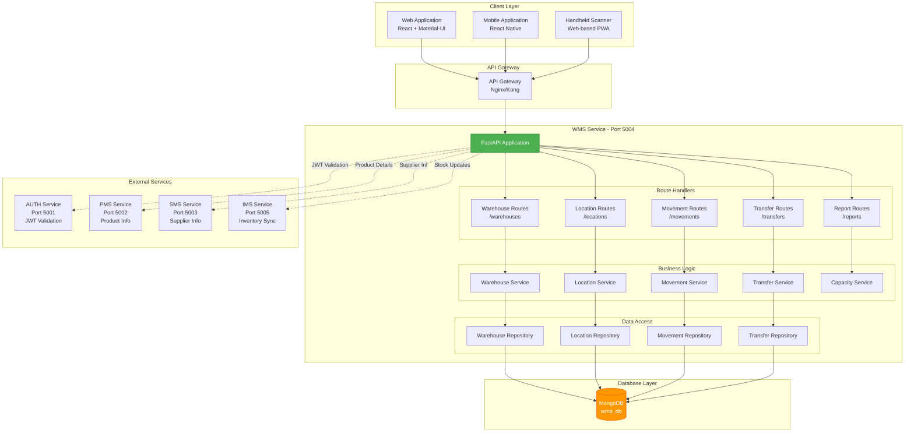
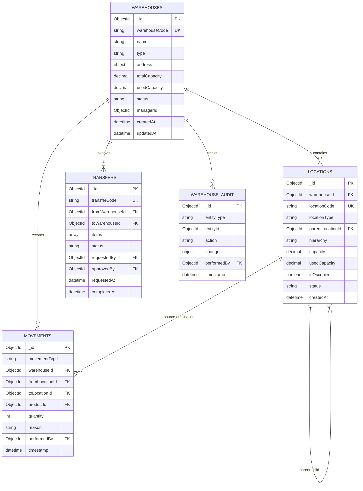
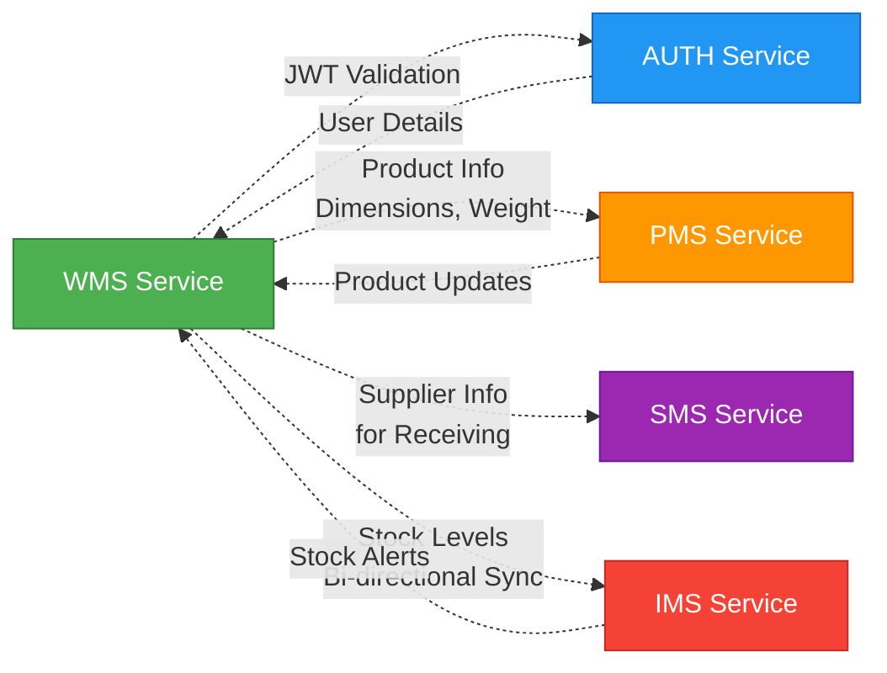
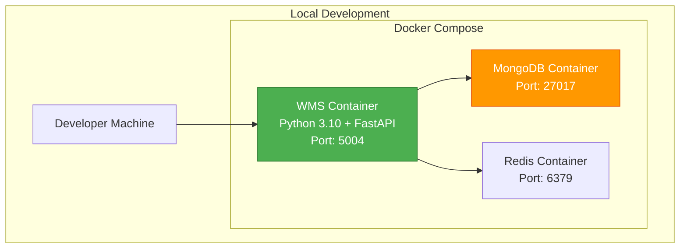
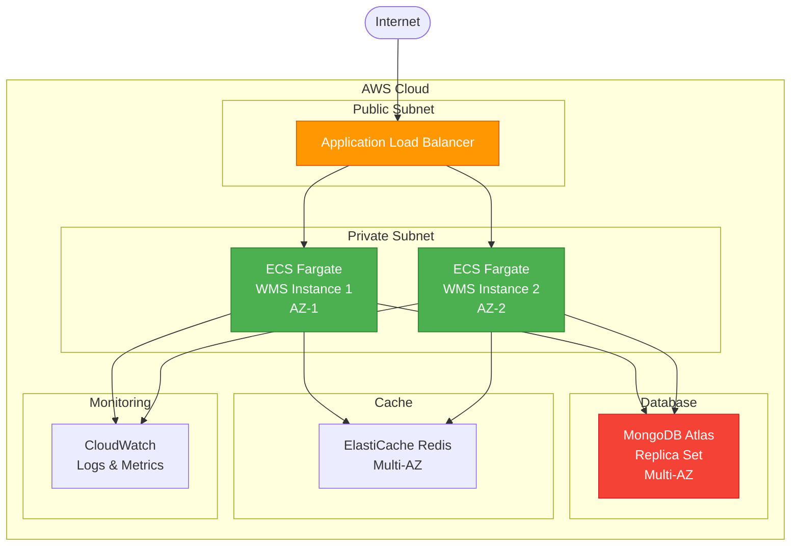

# WMS Service - Architecture Diagram

## Document Information
- **Project**: WLAN Corporation - Warehouse & Inventory Management System
- **Module**: Warehouse Management System (WMS)
- **Version**: 1.0
- **Date**: January 7, 2026
- **Prepared For**: WLAN Corporation, Bengaluru

---

## 1. Overview

The Warehouse Management System (WMS) is a critical microservice responsible for managing warehouse operations, location management, stock movements, and warehouse logistics. It provides comprehensive functionality for organizing physical inventory across multiple warehouse locations and zones.

### Purpose
- Manage multiple warehouses and storage locations
- Track stock movements and transfers
- Optimize warehouse space utilization
- Support picking, packing, and shipping operations
- Maintain location hierarchies (Warehouse → Zone → Rack → Shelf → Bin)
- Generate warehouse reports and analytics

### Technology Stack
- **Runtime**: Python 3.10+
- **Framework**: FastAPI 0.104+
- **ASGI Server**: Uvicorn 0.24+
- **Database**: MongoDB 6.x (async with Motor 3.3+)
- **Validation**: Pydantic 2.x
- **HTTP Client**: httpx 0.25+ (for inter-service communication)
- **Reporting**: openpyxl 3.1+ (Excel exports), reportlab 4.0+ (PDF generation)
- **Port**: 5004

---

## 2. System Architecture

### 2.1 High-Level Architecture



---

## 3. Application Structure

### 3.1 Directory Structure

```
WMS/
├── app/
│   ├── __init__.py
│   ├── main.py                      # FastAPI application entry point
│   ├── config.py                    # Configuration settings
│   │
│   ├── routes/                      # API route handlers
│   │   ├── __init__.py
│   │   ├── warehouse_routes.py      # Warehouse CRUD endpoints
│   │   ├── location_routes.py       # Location management endpoints
│   │   ├── movement_routes.py       # Stock movement endpoints
│   │   ├── transfer_routes.py       # Transfer between warehouses
│   │   ├── report_routes.py         # Report generation endpoints
│   │   └── health_routes.py         # Health check endpoints
│   │
│   ├── services/                    # Business logic layer
│   │   ├── __init__.py
│   │   ├── warehouse_service.py     # Warehouse operations
│   │   ├── location_service.py      # Location hierarchy management
│   │   ├── movement_service.py      # Movement tracking
│   │   ├── transfer_service.py      # Transfer operations
│   │   ├── capacity_service.py      # Capacity calculation
│   │   └── validation_service.py    # Business rules validation
│   │
│   ├── repositories/                # Data access layer
│   │   ├── __init__.py
│   │   ├── warehouse_repository.py
│   │   ├── location_repository.py
│   │   ├── movement_repository.py
│   │   └── transfer_repository.py
│   │
│   ├── models/                      # Pydantic models
│   │   ├── __init__.py
│   │   ├── warehouse_models.py      # Warehouse schemas
│   │   ├── location_models.py       # Location schemas
│   │   ├── movement_models.py       # Movement schemas
│   │   ├── transfer_models.py       # Transfer schemas
│   │   └── response_models.py       # Standard responses
│   │
│   ├── middleware/                  # Custom middleware
│   │   ├── __init__.py
│   │   ├── auth_middleware.py       # JWT validation
│   │   ├── logging_middleware.py    # Request/response logging
│   │   └── error_middleware.py      # Error handling
│   │
│   ├── utils/                       # Utility functions
│   │   ├── __init__.py
│   │   ├── auth_utils.py            # Auth helper functions
│   │   ├── db_utils.py              # Database utilities
│   │   ├── report_generator.py      # Report generation
│   │   ├── barcode_utils.py         # Barcode/QR for locations
│   │   └── validators.py            # Custom validators
│   │
│   └── database/                    # Database configuration
│       ├── __init__.py
│       ├── connection.py            # MongoDB connection
│       └── indexes.py               # Index definitions
│
├── tests/                           # Test suite
│   ├── __init__.py
│   ├── test_warehouses.py
│   ├── test_locations.py
│   ├── test_movements.py
│   └── test_transfers.py
│
├── migrations/                      # Database migrations
│   ├── init_db.py
│   └── seed_data.py
│
├── .env.example                     # Environment variables template
├── .gitignore
├── requirements.txt                 # Python dependencies
├── Dockerfile                       # Docker configuration
├── docker-compose.yml               # Local development setup
└── README.md                        # Service documentation
```

---

## 4. Data Model Overview

### 4.1 Core Collections



### 4.2 Collections Summary

| Collection | Purpose | Key Fields |
|------------|---------|------------|
| **warehouses** | Warehouse master data | warehouseCode, name, type, address, capacity, status |
| **locations** | Storage location hierarchy | locationCode, locationType, parentLocationId, hierarchy, capacity |
| **movements** | Stock movement tracking | movementType, warehouseId, fromLocation, toLocation, productId, quantity |
| **transfers** | Inter-warehouse transfers | transferCode, fromWarehouse, toWarehouse, items, status |
| **warehouse_audit** | Audit trail | entityType, entityId, action, changes, performedBy |

---

## 5. API Endpoint Categories

### 5.1 Warehouse Management Endpoints

| Method | Endpoint | Description | Auth Required |
|--------|----------|-------------|---------------|
| POST | `/api/v1/warehouses` | Create new warehouse | Yes (Admin) |
| GET | `/api/v1/warehouses` | Get all warehouses | Yes |
| GET | `/api/v1/warehouses/:id` | Get warehouse by ID | Yes |
| GET | `/api/v1/warehouses/code/:code` | Get warehouse by code | Yes |
| PUT | `/api/v1/warehouses/:id` | Update warehouse | Yes (Admin) |
| PATCH | `/api/v1/warehouses/:id/status` | Update warehouse status | Yes (Admin) |
| DELETE | `/api/v1/warehouses/:id` | Delete warehouse | Yes (Super Admin) |
| GET | `/api/v1/warehouses/:id/capacity` | Get capacity utilization | Yes |
| GET | `/api/v1/warehouses/:id/statistics` | Get warehouse statistics | Yes |

### 5.2 Location Management Endpoints

| Method | Endpoint | Description | Auth Required |
|--------|----------|-------------|---------------|
| POST | `/api/v1/locations` | Create storage location | Yes (Admin) |
| GET | `/api/v1/locations` | Get all locations | Yes |
| GET | `/api/v1/locations/:id` | Get location by ID | Yes |
| GET | `/api/v1/locations/code/:code` | Get location by code | Yes |
| PUT | `/api/v1/locations/:id` | Update location | Yes (Admin) |
| DELETE | `/api/v1/locations/:id` | Delete location | Yes (Super Admin) |
| GET | `/api/v1/locations/warehouse/:warehouseId` | Get locations by warehouse | Yes |
| GET | `/api/v1/locations/:id/children` | Get child locations | Yes |
| GET | `/api/v1/locations/:id/hierarchy` | Get location hierarchy | Yes |
| GET | `/api/v1/locations/available` | Get available locations | Yes |

### 5.3 Movement Tracking Endpoints

| Method | Endpoint | Description | Auth Required |
|--------|----------|-------------|---------------|
| POST | `/api/v1/movements` | Record stock movement | Yes |
| GET | `/api/v1/movements` | Get all movements | Yes |
| GET | `/api/v1/movements/:id` | Get movement by ID | Yes |
| GET | `/api/v1/movements/warehouse/:warehouseId` | Get movements by warehouse | Yes |
| GET | `/api/v1/movements/location/:locationId` | Get movements by location | Yes |
| GET | `/api/v1/movements/product/:productId` | Get movements by product | Yes |
| GET | `/api/v1/movements/history` | Get movement history | Yes |

### 5.4 Transfer Management Endpoints

| Method | Endpoint | Description | Auth Required |
|--------|----------|-------------|---------------|
| POST | `/api/v1/transfers` | Create transfer request | Yes |
| GET | `/api/v1/transfers` | Get all transfers | Yes |
| GET | `/api/v1/transfers/:id` | Get transfer by ID | Yes |
| GET | `/api/v1/transfers/code/:code` | Get transfer by code | Yes |
| PUT | `/api/v1/transfers/:id` | Update transfer | Yes (Admin) |
| PATCH | `/api/v1/transfers/:id/approve` | Approve transfer | Yes (Admin) |
| PATCH | `/api/v1/transfers/:id/complete` | Complete transfer | Yes |
| PATCH | `/api/v1/transfers/:id/cancel` | Cancel transfer | Yes (Admin) |
| GET | `/api/v1/transfers/warehouse/:warehouseId` | Get transfers by warehouse | Yes |

### 5.5 Reporting Endpoints

| Method | Endpoint | Description | Auth Required |
|--------|----------|-------------|---------------|
| GET | `/api/v1/reports/warehouse-summary` | Warehouse summary report | Yes |
| GET | `/api/v1/reports/location-utilization` | Location utilization report | Yes |
| GET | `/api/v1/reports/movement-analysis` | Movement analysis report | Yes |
| GET | `/api/v1/reports/transfer-summary` | Transfer summary report | Yes |
| GET | `/api/v1/reports/capacity-forecast` | Capacity forecast report | Yes |
| GET | `/api/v1/reports/export` | Export report (Excel/PDF) | Yes (Admin) |

### 5.6 Utility Endpoints

| Method | Endpoint | Description | Auth Required |
|--------|----------|-------------|---------------|
| GET | `/api/v1/health` | Health check | No |
| GET | `/api/v1/statistics` | WMS statistics | Yes |

---

## 6. Integration Points

### 6.1 External Service Dependencies



### 6.2 Integration Descriptions

| Service | Integration Type | Purpose |
|---------|-----------------|---------|
| **AUTH** | Synchronous HTTP | JWT token validation, user role verification |
| **PMS** | Synchronous HTTP | Fetch product dimensions, weight for space calculation |
| **SMS** | Synchronous HTTP | Get supplier info during goods receiving |
| **IMS** | Bidirectional HTTP/Webhooks | Sync stock levels, location assignments |

---

## 7. Deployment Architecture

### 7.1 Development Environment



### 7.2 Production Environment (AWS)



---

## 8. Key Features

### 8.1 Warehouse Management
- Multi-warehouse support
- Warehouse types (Main, Regional, Transit, Returns)
- Capacity tracking and utilization
- Manager assignment
- Operational hours management
- Status management (Active, Inactive, Under Maintenance)

### 8.2 Location Hierarchy
- 5-level hierarchy: Warehouse → Zone → Rack → Shelf → Bin
- Dynamic location creation
- Parent-child relationships
- Location-based capacity calculation
- Barcode/QR code generation for locations
- Location occupancy tracking

### 8.3 Stock Movement
- Movement types: Inbound, Outbound, Internal Transfer, Adjustment, Return
- Real-time movement tracking
- Movement history and audit trail
- Reason tracking for movements
- Integration with IMS for stock updates

### 8.4 Inter-warehouse Transfers
- Transfer request workflow
- Approval mechanism
- Multi-item transfers
- Transfer status tracking (Pending, Approved, In Transit, Completed, Cancelled)
- Transfer history and reporting

### 8.5 Reporting & Analytics
- Warehouse utilization reports
- Location efficiency analysis
- Movement frequency analysis
- Transfer performance metrics
- Capacity forecasting
- Excel and PDF export capabilities

---

## 9. Technology Stack Details

### 9.1 Core Technologies

```python
# requirements.txt

# Web Framework
fastapi==0.104.1
uvicorn[standard]==0.24.0
pydantic==2.5.0
pydantic-settings==2.1.0

# Database
motor==3.3.2                    # Async MongoDB driver
pymongo==4.6.0

# HTTP Client
httpx==0.25.2                   # Inter-service communication

# Authentication
python-jose[cryptography]==3.3.0
python-multipart==0.0.6

# Reporting
openpyxl==3.1.2                 # Excel generation
reportlab==4.0.7                # PDF generation
python-barcode==0.15.1          # Barcode generation
qrcode==7.4.2                   # QR code generation
Pillow==10.1.0                  # Image processing

# Utilities
python-dotenv==1.0.0
pydantic-extra-types==2.2.0

# Testing
pytest==7.4.3
pytest-asyncio==0.21.1
httpx==0.25.2                   # For testing async endpoints

# Code Quality
black==23.12.0
flake8==6.1.0
mypy==1.7.1
```

### 9.2 MongoDB Collections Schema

```javascript
// warehouses collection
{
  _id: ObjectId,
  warehouseCode: String (unique),
  name: String,
  type: String (enum),
  address: Object,
  totalCapacity: Decimal128,
  usedCapacity: Decimal128,
  status: String (enum),
  managerId: ObjectId,
  operationalHours: Object,
  createdAt: ISODate,
  updatedAt: ISODate
}

// locations collection
{
  _id: ObjectId,
  warehouseId: ObjectId,
  locationCode: String (unique),
  locationType: String (enum),
  parentLocationId: ObjectId,
  hierarchy: String,
  dimensions: Object,
  capacity: Decimal128,
  usedCapacity: Decimal128,
  isOccupied: Boolean,
  currentProductId: ObjectId,
  status: String (enum),
  barcodeUrl: String,
  createdAt: ISODate,
  updatedAt: ISODate
}

// movements collection
{
  _id: ObjectId,
  movementType: String (enum),
  warehouseId: ObjectId,
  fromLocationId: ObjectId,
  toLocationId: ObjectId,
  productId: ObjectId,
  quantity: Number,
  reason: String,
  notes: String,
  performedBy: ObjectId,
  timestamp: ISODate
}

// transfers collection
{
  _id: ObjectId,
  transferCode: String (unique),
  fromWarehouseId: ObjectId,
  toWarehouseId: ObjectId,
  items: Array,
  status: String (enum),
  requestedBy: ObjectId,
  approvedBy: ObjectId,
  requestedAt: ISODate,
  approvedAt: ISODate,
  completedAt: ISODate,
  notes: String
}
```

---

## 10. Security & Compliance

### 10.1 Authentication & Authorization

- **JWT Token Validation**: All endpoints require valid JWT from AUTH service
- **Role-Based Access Control (RBAC)**:
  - **Super Admin**: Full access to all operations
  - **Warehouse Manager**: Manage assigned warehouse, approve transfers
  - **Warehouse Staff**: Record movements, view locations
  - **Procurement Officer**: View warehouse data, create transfers
  - **Product Manager**: View-only access

### 10.2 Data Security

- **Field-level encryption** for sensitive data
- **HTTPS/TLS** for all API communications
- **Input validation** using Pydantic models
- **SQL injection prevention** (NoSQL injection prevention for MongoDB)
- **Rate limiting** on all endpoints

### 10.3 Audit Trail

- All warehouse changes logged in `warehouse_audit` collection
- Captures: entity type, entity ID, action, changes, performed by, timestamp
- Immutable audit logs
- Retention policy: 7 years for compliance

---

## 11. Performance Considerations

### 11.1 Database Optimization

- **Indexes** on frequently queried fields (warehouseCode, locationCode, status)
- **Compound indexes** for common query patterns
- **Text indexes** for search functionality
- **TTL indexes** for temporary data cleanup

### 11.2 Caching Strategy

- **Redis caching** for:
  - Warehouse details (TTL: 1 hour)
  - Location hierarchy (TTL: 30 minutes)
  - Frequently accessed locations (TTL: 15 minutes)
- **Cache invalidation** on updates

### 11.3 API Performance

- **Pagination** for list endpoints (default: 10 items, max: 100)
- **Field filtering** to reduce response payload
- **Async/await** for all I/O operations
- **Connection pooling** for MongoDB
- **Request timeout**: 30 seconds

---

## 12. Monitoring & Observability

### 12.1 Logging

- **Structured logging** with JSON format
- **Log levels**: DEBUG, INFO, WARNING, ERROR, CRITICAL
- **Request/Response logging** with correlation IDs
- **Integration with CloudWatch/ELK Stack**

### 12.2 Metrics

- **Custom metrics**:
  - Total warehouses, active/inactive counts
  - Location utilization percentage
  - Movement frequency
  - Transfer success/failure rates
- **Performance metrics**:
  - Request latency
  - Database query time
  - API response times
- **Integration with Prometheus/Grafana**

### 12.3 Health Checks

- **Liveness probe**: `/api/v1/health`
- **Readiness probe**: Database connectivity check
- **Dependency checks**: AUTH, PMS, SMS, IMS availability

---

## Document End

**Next Document**: [2-ER-Diagram.md](./2-ER-Diagram.md)  
**Module Progress**: WMS Documentation (1/6 documents)  
**Overall Progress**: 19/30 documents (63.3%)
