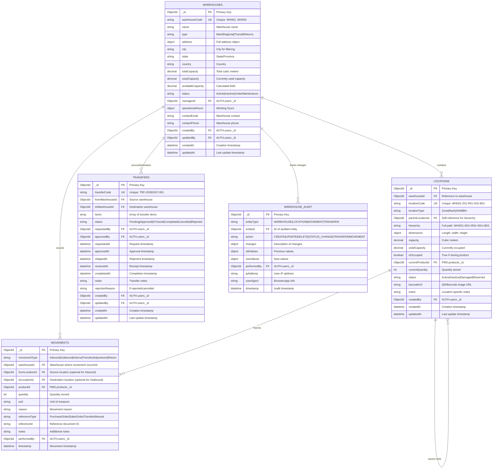
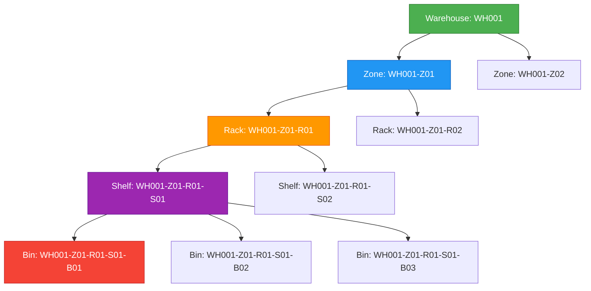
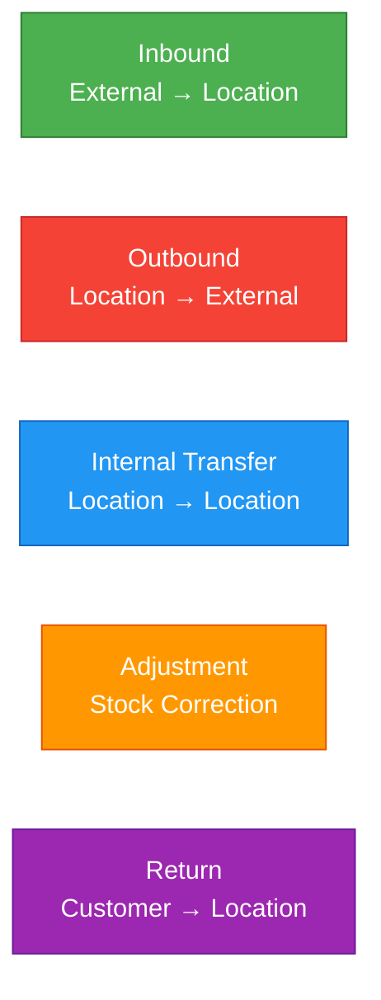
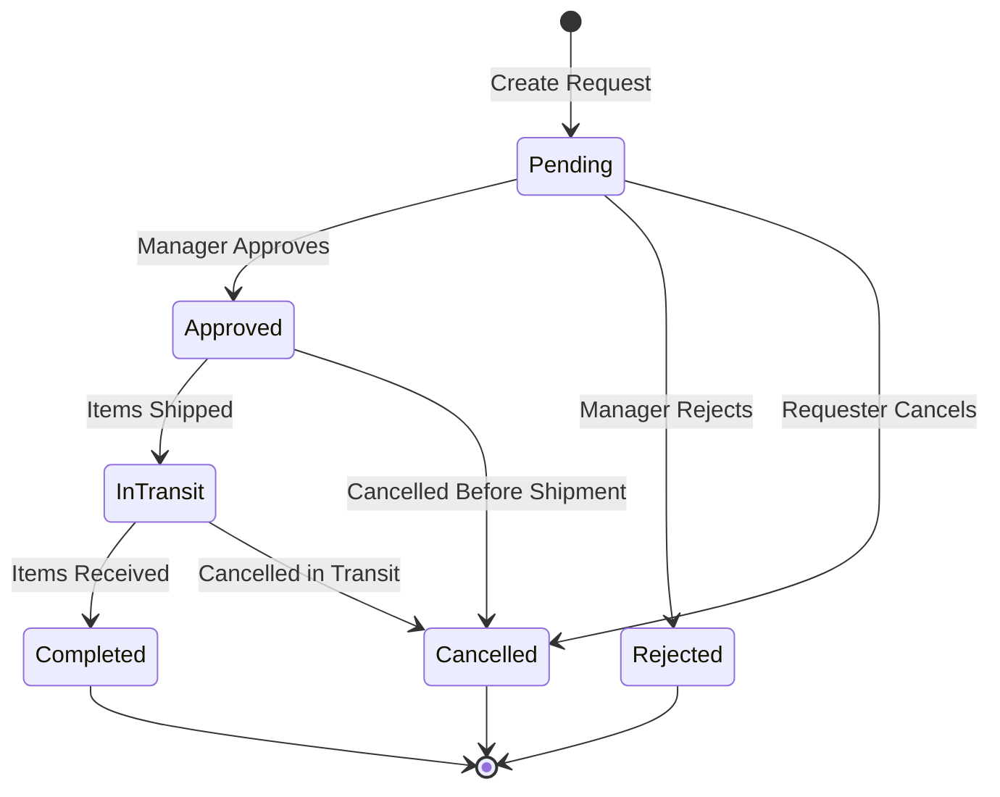

# WMS Service - ER Diagram & Database Schema

## Document Information
- **Project**: WLAN Corporation - Warehouse & Inventory Management System
- **Module**: Warehouse Management System (WMS)
- **Version**: 1.0
- **Date**: January 7, 2026
- **Prepared For**: WLAN Corporation, Bengaluru

---

## 1. Overview

This document provides comprehensive Entity-Relationship diagrams and database schema definitions for the Warehouse Management System (WMS). The WMS uses MongoDB as its primary database with five core collections.

### Database Name
```
wms_db
```

### Collections
1. **warehouses** - Warehouse master data
2. **locations** - Storage location hierarchy
3. **movements** - Stock movement records
4. **transfers** - Inter-warehouse transfer requests
5. **warehouse_audit** - Audit trail for all operations

---

## 2. Complete ER Diagram

### 2.1 Full System ER Diagram



---

## 3. Warehouses Collection

### 3.1 Collection Purpose
Store master data for all warehouses including location information, capacity, operational details, and management assignment.

### 3.2 Field Specifications

| Field | Type | Required | Constraints | Description |
|-------|------|----------|-------------|-------------|
| `_id` | ObjectId | Yes | Auto-generated | Primary key |
| `warehouseCode` | String | Yes | Unique, Pattern: `^WH[0-9]{3,}$` | Auto-generated code (WH001, WH002) |
| `name` | String | Yes | 2-200 chars | Warehouse name |
| `type` | String | Yes | Enum: Main, Regional, Transit, Returns | Warehouse type |
| `address.street` | String | No | Max 200 chars | Street address |
| `address.city` | String | Yes | 2-100 chars | City |
| `address.state` | String | Yes | 2-100 chars | State/Province |
| `address.country` | String | Yes | 2-100 chars | Country |
| `address.postalCode` | String | No | Max 20 chars | Postal/ZIP code |
| `totalCapacity` | Decimal128 | Yes | > 0 | Total capacity in cubic meters |
| `usedCapacity` | Decimal128 | Yes | >= 0 | Currently used capacity |
| `availableCapacity` | Decimal128 | No | Calculated | totalCapacity - usedCapacity |
| `status` | String | Yes | Enum: Active, Inactive, UnderMaintenance | Operational status |
| `managerId` | ObjectId | No | FK to AUTH.users | Assigned warehouse manager |
| `operationalHours` | Object | No | - | Working hours configuration |
| `contactEmail` | String | No | Valid email | Warehouse contact email |
| `contactPhone` | String | No | Valid phone | Warehouse contact phone |
| `createdBy` | ObjectId | Yes | FK to AUTH.users | User who created |
| `updatedBy` | ObjectId | No | FK to AUTH.users | User who last updated |
| `createdAt` | ISODate | Yes | Auto | Creation timestamp |
| `updatedAt` | ISODate | Yes | Auto | Last update timestamp |

### 3.3 Sample Document

```json
{
  "_id": ObjectId("6789abcd1234567890150001"),
  "warehouseCode": "WH001",
  "name": "Bengaluru Main Warehouse",
  "type": "Main",
  "address": {
    "street": "Plot No. 45, Electronic City Phase 1",
    "city": "Bengaluru",
    "state": "Karnataka",
    "country": "India",
    "postalCode": "560100"
  },
  "totalCapacity": NumberDecimal("50000.00"),
  "usedCapacity": NumberDecimal("32450.50"),
  "availableCapacity": NumberDecimal("17549.50"),
  "status": "Active",
  "managerId": ObjectId("6789abcd1234567890123450"),
  "operationalHours": {
    "monday": {"open": "08:00", "close": "20:00"},
    "tuesday": {"open": "08:00", "close": "20:00"},
    "wednesday": {"open": "08:00", "close": "20:00"},
    "thursday": {"open": "08:00", "close": "20:00"},
    "friday": {"open": "08:00", "close": "20:00"},
    "saturday": {"open": "09:00", "close": "18:00"},
    "sunday": {"closed": true}
  },
  "contactEmail": "bengaluru.wh@wlancorp.com",
  "contactPhone": "+91-80-44556677",
  "createdBy": ObjectId("6789abcd1234567890123450"),
  "updatedBy": ObjectId("6789abcd1234567890123450"),
  "createdAt": ISODate("2026-01-01T08:00:00Z"),
  "updatedAt": ISODate("2026-01-07T10:30:00Z")
}
```

### 3.4 Indexes

```javascript
// Unique indexes
db.warehouses.createIndex({"warehouseCode": 1}, {unique: true, name: "idx_warehouseCode_unique"})

// Regular indexes
db.warehouses.createIndex({"name": 1}, {name: "idx_name"})
db.warehouses.createIndex({"type": 1}, {name: "idx_type"})
db.warehouses.createIndex({"status": 1}, {name: "idx_status"})
db.warehouses.createIndex({"address.city": 1}, {name: "idx_city"})
db.warehouses.createIndex({"managerId": 1}, {name: "idx_managerId"})
db.warehouses.createIndex({"createdAt": -1}, {name: "idx_createdAt_desc"})

// Text index for search
db.warehouses.createIndex(
  {"name": "text", "warehouseCode": "text", "address.city": "text"},
  {name: "idx_text_search"}
)

// Compound indexes
db.warehouses.createIndex({"status": 1, "type": 1}, {name: "idx_status_type"})
db.warehouses.createIndex({"address.city": 1, "status": 1}, {name: "idx_city_status"})
```

### 3.5 Business Rules

1. **Unique warehouse codes** auto-generated sequentially (WH001, WH002, etc.)
2. **Total capacity** must be greater than zero
3. **Used capacity** cannot exceed total capacity
4. **Available capacity** is automatically calculated
5. **Warehouse manager** must exist in AUTH service and have "Warehouse Manager" role
6. **Status changes** to "Inactive" or "UnderMaintenance" require all pending transfers to be completed
7. **Deletion** only allowed if no active locations or pending transfers exist

---

## 4. Locations Collection

### 4.1 Collection Purpose
Manage hierarchical storage locations within warehouses using a 5-level structure: Warehouse → Zone → Rack → Shelf → Bin.

### 4.2 Location Hierarchy Structure



### 4.3 Field Specifications

| Field | Type | Required | Constraints | Description |
|-------|------|----------|-------------|-------------|
| `_id` | ObjectId | Yes | Auto-generated | Primary key |
| `warehouseId` | ObjectId | Yes | FK to warehouses | Parent warehouse |
| `locationCode` | String | Yes | Unique, Hierarchical format | WH001-Z01-R01-S01-B01 |
| `locationType` | String | Yes | Enum: Zone, Rack, Shelf, Bin | Location level in hierarchy |
| `parentLocationId` | ObjectId | No | FK to locations (self) | Parent location (null for Zone) |
| `hierarchy` | String | Yes | Path format | Full path: WH001>Z01>R01>S01>B01 |
| `dimensions.length` | Decimal128 | No | > 0 | Length in meters |
| `dimensions.width` | Decimal128 | No | > 0 | Width in meters |
| `dimensions.height` | Decimal128 | No | > 0 | Height in meters |
| `capacity` | Decimal128 | Yes | > 0 | Cubic meters |
| `usedCapacity` | Decimal128 | Yes | >= 0 | Currently occupied capacity |
| `isOccupied` | Boolean | Yes | - | True if storing product |
| `currentProductId` | ObjectId | No | FK to PMS.products | Current product stored |
| `currentQuantity` | Number | No | >= 0 | Quantity of current product |
| `status` | String | Yes | Enum: Active, Inactive, Damaged, Reserved | Location status |
| `barcodeUrl` | String | No | Valid URL | QR/Barcode image URL |
| `notes` | String | No | Max 500 chars | Location notes |
| `createdBy` | ObjectId | Yes | FK to AUTH.users | User who created |
| `createdAt` | ISODate | Yes | Auto | Creation timestamp |
| `updatedAt` | ISODate | Yes | Auto | Last update timestamp |

### 4.4 Sample Documents

#### Zone Level
```json
{
  "_id": ObjectId("6789abcd1234567890160001"),
  "warehouseId": ObjectId("6789abcd1234567890150001"),
  "locationCode": "WH001-Z01",
  "locationType": "Zone",
  "parentLocationId": null,
  "hierarchy": "WH001>Z01",
  "dimensions": {
    "length": NumberDecimal("50.00"),
    "width": NumberDecimal("40.00"),
    "height": NumberDecimal("10.00")
  },
  "capacity": NumberDecimal("20000.00"),
  "usedCapacity": NumberDecimal("12500.00"),
  "isOccupied": true,
  "currentProductId": null,
  "currentQuantity": 0,
  "status": "Active",
  "barcodeUrl": "https://storage.wlancorp.com/qr/WH001-Z01.png",
  "notes": "Electronics zone - temperature controlled",
  "createdBy": ObjectId("6789abcd1234567890123450"),
  "createdAt": ISODate("2026-01-01T08:00:00Z"),
  "updatedAt": ISODate("2026-01-07T10:30:00Z")
}
```

#### Bin Level (Final Level)
```json
{
  "_id": ObjectId("6789abcd1234567890160005"),
  "warehouseId": ObjectId("6789abcd1234567890150001"),
  "locationCode": "WH001-Z01-R01-S01-B01",
  "locationType": "Bin",
  "parentLocationId": ObjectId("6789abcd1234567890160004"),
  "hierarchy": "WH001>Z01>R01>S01>B01",
  "dimensions": {
    "length": NumberDecimal("1.00"),
    "width": NumberDecimal("0.80"),
    "height": NumberDecimal("0.50")
  },
  "capacity": NumberDecimal("0.40"),
  "usedCapacity": NumberDecimal("0.35"),
  "isOccupied": true,
  "currentProductId": ObjectId("6789abcd1234567890123458"),
  "currentQuantity": 25,
  "status": "Active",
  "barcodeUrl": "https://storage.wlancorp.com/qr/WH001-Z01-R01-S01-B01.png",
  "notes": "Small electronics items",
  "createdBy": ObjectId("6789abcd1234567890123450"),
  "createdAt": ISODate("2026-01-01T09:30:00Z"),
  "updatedAt": ISODate("2026-01-07T11:45:00Z")
}
```

### 4.5 Indexes

```javascript
// Unique indexes
db.locations.createIndex({"locationCode": 1}, {unique: true, name: "idx_locationCode_unique"})

// Regular indexes
db.locations.createIndex({"warehouseId": 1}, {name: "idx_warehouseId"})
db.locations.createIndex({"locationType": 1}, {name: "idx_locationType"})
db.locations.createIndex({"parentLocationId": 1}, {name: "idx_parentLocationId"})
db.locations.createIndex({"status": 1}, {name: "idx_status"})
db.locations.createIndex({"isOccupied": 1}, {name: "idx_isOccupied"})
db.locations.createIndex({"currentProductId": 1}, {name: "idx_currentProductId"})
db.locations.createIndex({"createdAt": -1}, {name: "idx_createdAt_desc"})

// Compound indexes
db.locations.createIndex({"warehouseId": 1, "locationType": 1}, {name: "idx_warehouse_type"})
db.locations.createIndex({"warehouseId": 1, "status": 1, "isOccupied": 1}, {name: "idx_warehouse_status_occupied"})
db.locations.createIndex({"parentLocationId": 1, "locationType": 1}, {name: "idx_parent_type"})
db.locations.createIndex({"currentProductId": 1, "warehouseId": 1}, {name: "idx_product_warehouse"})

// Text index for search
db.locations.createIndex({"locationCode": "text", "notes": "text"}, {name: "idx_text_search"})
```

### 4.6 Business Rules

1. **Location codes** follow hierarchical naming: `WH{code}-Z{zone}-R{rack}-S{shelf}-B{bin}`
2. **Zone** is the top level (no parent), **Bin** is the leaf level
3. **Parent-child relationships** must be consistent with hierarchy
4. **Capacity** automatically rolls up to parent locations
5. **Only Bin-level locations** can store products directly
6. **isOccupied** is true when currentProductId is set
7. **Barcode/QR codes** generated automatically on creation
8. **Status "Damaged"** prevents new product assignments
9. **Deletion** only allowed if no child locations and not occupied

---

## 5. Movements Collection

### 5.1 Collection Purpose
Track all stock movements within and between locations, maintaining complete audit trail for inventory changes.

### 5.2 Movement Types



### 5.3 Field Specifications

| Field | Type | Required | Constraints | Description |
|-------|------|----------|-------------|-------------|
| `_id` | ObjectId | Yes | Auto-generated | Primary key |
| `movementType` | String | Yes | Enum: Inbound, Outbound, InternalTransfer, Adjustment, Return | Movement category |
| `warehouseId` | ObjectId | Yes | FK to warehouses | Warehouse where movement occurred |
| `fromLocationId` | ObjectId | Conditional | FK to locations | Source (null for Inbound) |
| `toLocationId` | ObjectId | Conditional | FK to locations | Destination (null for Outbound) |
| `productId` | ObjectId | Yes | FK to PMS.products | Product moved |
| `quantity` | Number | Yes | > 0 | Quantity moved |
| `unit` | String | Yes | UOM | Unit of measure (pcs, kg, etc.) |
| `reason` | String | Yes | Max 200 chars | Reason for movement |
| `referenceType` | String | No | Enum: PurchaseOrder, SalesOrder, Transfer, Manual | Reference document type |
| `referenceId` | String | No | Max 50 chars | Reference document ID |
| `notes` | String | No | Max 500 chars | Additional notes |
| `performedBy` | ObjectId | Yes | FK to AUTH.users | User who performed |
| `timestamp` | ISODate | Yes | Auto | Movement timestamp |

### 5.4 Sample Documents

#### Inbound Movement
```json
{
  "_id": ObjectId("6789abcd1234567890170001"),
  "movementType": "Inbound",
  "warehouseId": ObjectId("6789abcd1234567890150001"),
  "fromLocationId": null,
  "toLocationId": ObjectId("6789abcd1234567890160005"),
  "productId": ObjectId("6789abcd1234567890123458"),
  "quantity": 25,
  "unit": "pcs",
  "reason": "Purchase order received",
  "referenceType": "PurchaseOrder",
  "referenceId": "PO-2026-001",
  "notes": "Shipment from Tech Solutions Pvt Ltd",
  "performedBy": ObjectId("6789abcd1234567890123450"),
  "timestamp": ISODate("2026-01-07T11:45:00Z")
}
```

#### Internal Transfer Movement
```json
{
  "_id": ObjectId("6789abcd1234567890170002"),
  "movementType": "InternalTransfer",
  "warehouseId": ObjectId("6789abcd1234567890150001"),
  "fromLocationId": ObjectId("6789abcd1234567890160005"),
  "toLocationId": ObjectId("6789abcd1234567890160008"),
  "productId": ObjectId("6789abcd1234567890123458"),
  "quantity": 10,
  "unit": "pcs",
  "reason": "Stock relocation",
  "referenceType": "Manual",
  "referenceId": null,
  "notes": "Moving to picking zone",
  "performedBy": ObjectId("6789abcd1234567890123451"),
  "timestamp": ISODate("2026-01-07T12:30:00Z")
}
```

#### Outbound Movement
```json
{
  "_id": ObjectId("6789abcd1234567890170003"),
  "movementType": "Outbound",
  "warehouseId": ObjectId("6789abcd1234567890150001"),
  "fromLocationId": ObjectId("6789abcd1234567890160008"),
  "toLocationId": null,
  "productId": ObjectId("6789abcd1234567890123458"),
  "quantity": 5,
  "unit": "pcs",
  "reason": "Sales order fulfillment",
  "referenceType": "SalesOrder",
  "referenceId": "SO-2026-045",
  "notes": "Shipped to customer ABC Corp",
  "performedBy": ObjectId("6789abcd1234567890123452"),
  "timestamp": ISODate("2026-01-07T14:20:00Z")
}
```

### 5.5 Indexes

```javascript
// Regular indexes
db.movements.createIndex({"movementType": 1}, {name: "idx_movementType"})
db.movements.createIndex({"warehouseId": 1}, {name: "idx_warehouseId"})
db.movements.createIndex({"fromLocationId": 1}, {name: "idx_fromLocationId"})
db.movements.createIndex({"toLocationId": 1}, {name: "idx_toLocationId"})
db.movements.createIndex({"productId": 1}, {name: "idx_productId"})
db.movements.createIndex({"performedBy": 1}, {name: "idx_performedBy"})
db.movements.createIndex({"timestamp": -1}, {name: "idx_timestamp_desc"})
db.movements.createIndex({"referenceType": 1, "referenceId": 1}, {name: "idx_reference"})

// Compound indexes
db.movements.createIndex({"warehouseId": 1, "timestamp": -1}, {name: "idx_warehouse_timeline"})
db.movements.createIndex({"productId": 1, "timestamp": -1}, {name: "idx_product_timeline"})
db.movements.createIndex({"fromLocationId": 1, "timestamp": -1}, {name: "idx_from_timeline"})
db.movements.createIndex({"toLocationId": 1, "timestamp": -1}, {name: "idx_to_timeline"})
db.movements.createIndex({"movementType": 1, "timestamp": -1}, {name: "idx_type_timeline"})
```

### 5.6 Business Rules

1. **Inbound movements** must have `toLocationId` (no `fromLocationId`)
2. **Outbound movements** must have `fromLocationId` (no `toLocationId`)
3. **Internal transfers** must have both `fromLocationId` and `toLocationId`
4. **Quantity** must be positive integer or decimal
5. **Product** must exist in PMS and be active
6. **Location capacity** updated automatically on movement
7. **Movements are immutable** - no updates allowed, only new records
8. **Timestamp** defaults to current UTC time

---

## 6. Transfers Collection

### 6.1 Collection Purpose
Manage transfer requests between different warehouses with approval workflow and status tracking.

### 6.2 Transfer Status Flow



### 6.3 Field Specifications

| Field | Type | Required | Constraints | Description |
|-------|------|----------|-------------|-------------|
| `_id` | ObjectId | Yes | Auto-generated | Primary key |
| `transferCode` | String | Yes | Unique, Format: TRF-YYYYMMDD-NNN | Auto-generated code |
| `fromWarehouseId` | ObjectId | Yes | FK to warehouses | Source warehouse |
| `toWarehouseId` | ObjectId | Yes | FK to warehouses | Destination warehouse |
| `items` | Array | Yes | Min 1 item | Transfer items array |
| `items[].productId` | ObjectId | Yes | FK to PMS.products | Product to transfer |
| `items[].fromLocationId` | ObjectId | Yes | FK to locations | Source location |
| `items[].toLocationId` | ObjectId | No | FK to locations | Destination (set on receive) |
| `items[].quantity` | Number | Yes | > 0 | Quantity to transfer |
| `items[].unit` | String | Yes | UOM | Unit of measure |
| `status` | String | Yes | Enum (see flow) | Transfer status |
| `requestedBy` | ObjectId | Yes | FK to AUTH.users | Requester |
| `approvedBy` | ObjectId | No | FK to AUTH.users | Approver |
| `requestedAt` | ISODate | Yes | Auto | Request timestamp |
| `approvedAt` | ISODate | No | - | Approval timestamp |
| `shippedAt` | ISODate | No | - | Shipment timestamp |
| `receivedAt` | ISODate | No | - | Receipt timestamp |
| `completedAt` | ISODate | No | - | Completion timestamp |
| `notes` | String | No | Max 500 chars | Transfer notes |
| `rejectionReason` | String | No | Max 200 chars | If rejected/cancelled |
| `createdBy` | ObjectId | Yes | FK to AUTH.users | Creator |
| `updatedBy` | ObjectId | No | FK to AUTH.users | Last updater |
| `createdAt` | ISODate | Yes | Auto | Creation timestamp |
| `updatedAt` | ISODate | Yes | Auto | Last update timestamp |

### 6.4 Sample Document

```json
{
  "_id": ObjectId("6789abcd1234567890180001"),
  "transferCode": "TRF-20260107-001",
  "fromWarehouseId": ObjectId("6789abcd1234567890150001"),
  "toWarehouseId": ObjectId("6789abcd1234567890150002"),
  "items": [
    {
      "productId": ObjectId("6789abcd1234567890123458"),
      "fromLocationId": ObjectId("6789abcd1234567890160005"),
      "toLocationId": ObjectId("6789abcd1234567890160025"),
      "quantity": 50,
      "unit": "pcs",
      "notes": "Urgent requirement"
    },
    {
      "productId": ObjectId("6789abcd1234567890123459"),
      "fromLocationId": ObjectId("6789abcd1234567890160006"),
      "toLocationId": ObjectId("6789abcd1234567890160026"),
      "quantity": 30,
      "unit": "pcs",
      "notes": ""
    }
  ],
  "status": "Completed",
  "requestedBy": ObjectId("6789abcd1234567890123450"),
  "approvedBy": ObjectId("6789abcd1234567890123451"),
  "requestedAt": ISODate("2026-01-07T09:00:00Z"),
  "approvedAt": ISODate("2026-01-07T09:30:00Z"),
  "shippedAt": ISODate("2026-01-07T10:00:00Z"),
  "receivedAt": ISODate("2026-01-07T15:30:00Z"),
  "completedAt": ISODate("2026-01-07T16:00:00Z"),
  "notes": "Stock balancing between warehouses",
  "rejectionReason": null,
  "createdBy": ObjectId("6789abcd1234567890123450"),
  "updatedBy": ObjectId("6789abcd1234567890123451"),
  "createdAt": ISODate("2026-01-07T09:00:00Z"),
  "updatedAt": ISODate("2026-01-07T16:00:00Z")
}
```

### 6.5 Indexes

```javascript
// Unique indexes
db.transfers.createIndex({"transferCode": 1}, {unique: true, name: "idx_transferCode_unique"})

// Regular indexes
db.transfers.createIndex({"fromWarehouseId": 1}, {name: "idx_fromWarehouseId"})
db.transfers.createIndex({"toWarehouseId": 1}, {name: "idx_toWarehouseId"})
db.transfers.createIndex({"status": 1}, {name: "idx_status"})
db.transfers.createIndex({"requestedBy": 1}, {name: "idx_requestedBy"})
db.transfers.createIndex({"approvedBy": 1}, {name: "idx_approvedBy"})
db.transfers.createIndex({"requestedAt": -1}, {name: "idx_requestedAt_desc"})

// Compound indexes
db.transfers.createIndex({"fromWarehouseId": 1, "status": 1}, {name: "idx_from_status"})
db.transfers.createIndex({"toWarehouseId": 1, "status": 1}, {name: "idx_to_status"})
db.transfers.createIndex({"status": 1, "requestedAt": -1}, {name: "idx_status_timeline"})
db.transfers.createIndex({"items.productId": 1}, {name: "idx_items_productId"})
```

### 6.6 Business Rules

1. **Transfer codes** auto-generated: `TRF-YYYYMMDD-001` (sequential per day)
2. **Source and destination warehouses** must be different and active
3. **All products** in items must exist in PMS and be active
4. **Source locations** must have sufficient quantity
5. **Approval required** by warehouse manager or higher role
6. **Status transitions** must follow defined flow
7. **Completion** requires all items received and locations assigned
8. **Cancellation** allowed only in Pending or Approved status
9. **Inventory movements** created automatically on shipment and receipt

---

## 7. Warehouse Audit Collection

### 7.1 Collection Purpose
Maintain comprehensive audit trail for all warehouse operations for compliance and tracking.

### 7.2 Field Specifications

| Field | Type | Required | Constraints | Description |
|-------|------|----------|-------------|-------------|
| `_id` | ObjectId | Yes | Auto-generated | Primary key |
| `entityType` | String | Yes | Enum: WAREHOUSE, LOCATION, MOVEMENT, TRANSFER | Entity being audited |
| `entityId` | ObjectId | Yes | FK to respective collection | ID of audited entity |
| `action` | String | Yes | Enum: CREATE, UPDATE, DELETE, STATUS_CHANGE, TRANSFER, MOVEMENT | Action performed |
| `changes` | Object | Yes | - | Description of changes |
| `oldValues` | Object | No | - | Previous values |
| `newValues` | Object | No | - | New values |
| `performedBy` | ObjectId | Yes | FK to AUTH.users | User who performed action |
| `ipAddress` | String | No | Valid IP | User's IP address |
| `userAgent` | String | No | Max 500 chars | Browser/app info |
| `timestamp` | ISODate | Yes | Auto | Audit timestamp |

### 7.3 Sample Document

```json
{
  "_id": ObjectId("6789abcd1234567890190001"),
  "entityType": "WAREHOUSE",
  "entityId": ObjectId("6789abcd1234567890150001"),
  "action": "UPDATE",
  "changes": {
    "totalCapacity": "Increased from 40000 to 50000 cubic meters",
    "contactPhone": "Updated contact phone number"
  },
  "oldValues": {
    "totalCapacity": NumberDecimal("40000.00"),
    "contactPhone": "+91-80-11223344"
  },
  "newValues": {
    "totalCapacity": NumberDecimal("50000.00"),
    "contactPhone": "+91-80-44556677"
  },
  "performedBy": ObjectId("6789abcd1234567890123450"),
  "ipAddress": "192.168.1.100",
  "userAgent": "Mozilla/5.0 (Windows NT 10.0; Win64; x64) AppleWebKit/537.36",
  "timestamp": ISODate("2026-01-07T10:30:00Z")
}
```

### 7.4 Indexes

```javascript
// Regular indexes
db.warehouse_audit.createIndex({"entityType": 1}, {name: "idx_entityType"})
db.warehouse_audit.createIndex({"entityId": 1}, {name: "idx_entityId"})
db.warehouse_audit.createIndex({"action": 1}, {name: "idx_action"})
db.warehouse_audit.createIndex({"performedBy": 1}, {name: "idx_performedBy"})
db.warehouse_audit.createIndex({"timestamp": -1}, {name: "idx_timestamp_desc"})

// Compound indexes
db.warehouse_audit.createIndex(
  {"entityType": 1, "entityId": 1, "timestamp": -1},
  {name: "idx_entity_timeline"}
)
db.warehouse_audit.createIndex(
  {"performedBy": 1, "timestamp": -1},
  {name: "idx_user_timeline"}
)

// TTL index (optional - keep logs for 7 years)
db.warehouse_audit.createIndex(
  {"timestamp": 1},
  {expireAfterSeconds: 220752000, name: "idx_ttl_7years"}
)
```

---

## Document End

**Previous Document**: [1-Architecture-Diagram.md](./1-Architecture-Diagram.md)  
**Next Document**: [3-User-Stories-Use-Cases.md](./3-User-Stories-Use-Cases.md)  
**Module Progress**: WMS Documentation (2/6 documents)  
**Overall Progress**: 20/30 documents (66.7%)
