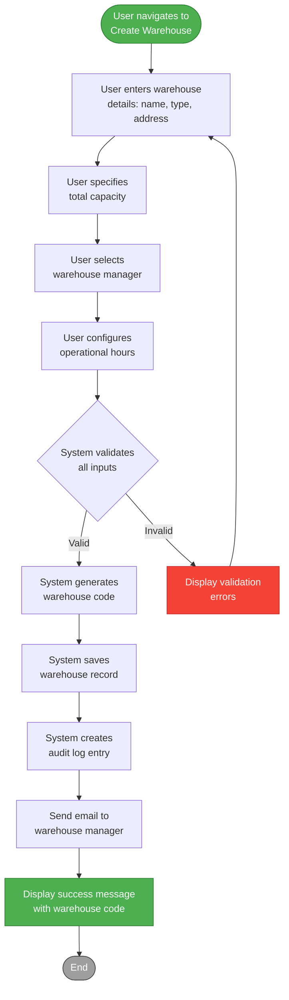
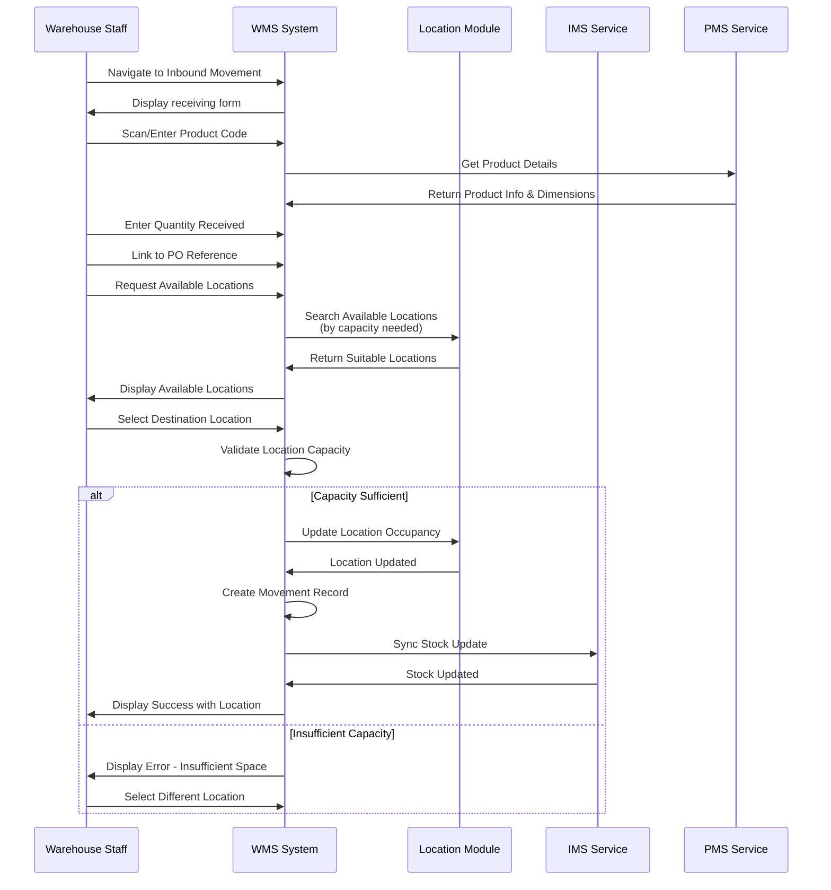
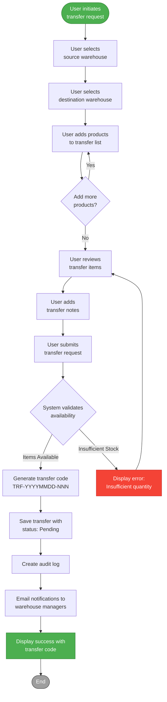
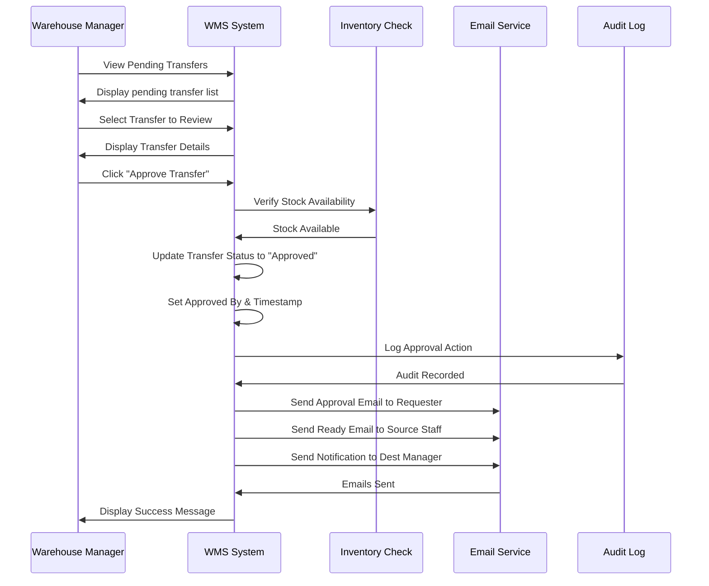
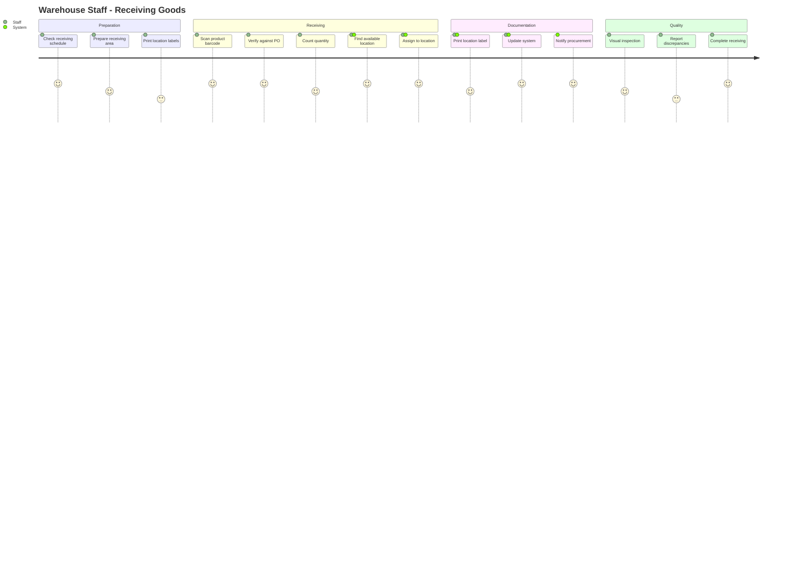
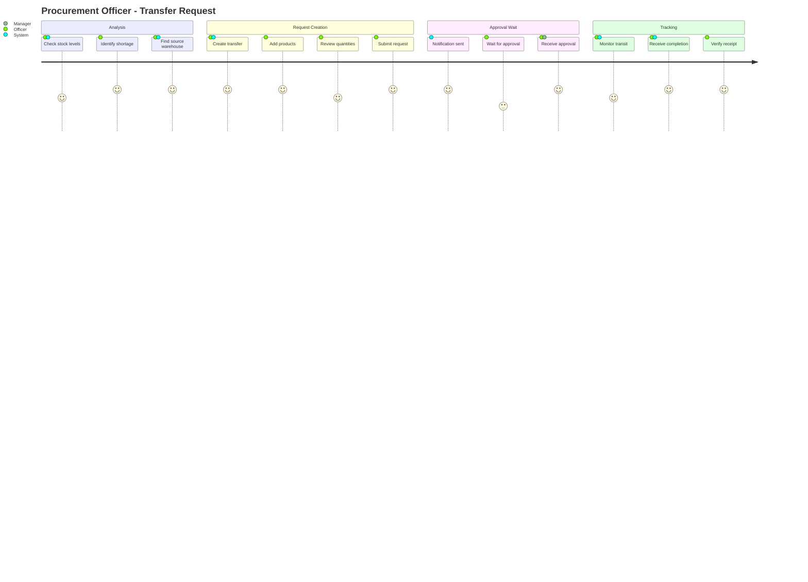

# WMS Service - User Stories & Use Cases

## Document Information
- **Project**: WLAN Corporation - Warehouse & Inventory Management System
- **Module**: Warehouse Management System (WMS)
- **Version**: 1.0
- **Date**: January 7, 2026
- **Prepared For**: WLAN Corporation, Bengaluru

---

## 1. Overview

This document provides comprehensive user stories and detailed use cases for the Warehouse Management System (WMS). The stories are organized by functional epics and include acceptance criteria, priority levels, and detailed use case scenarios.

### User Personas

| Persona | Role | Responsibilities |
|---------|------|------------------|
| **Rajesh Kumar** | Warehouse Manager | Oversee warehouse operations, approve transfers, manage staff, capacity planning |
| **Priya Sharma** | Warehouse Staff | Record stock movements, perform picking/packing, update locations |
| **Amit Patel** | Procurement Officer | Create transfer requests, monitor stock levels across warehouses |
| **Sneha Reddy** | Super Admin | System configuration, warehouse setup, user management |

---

## 2. Epic 1: Warehouse Management

### Epic Description
As a warehouse administrator, I need to manage multiple warehouse facilities including their setup, configuration, and operational details.

### User Stories

#### US-WMS-001: Create Warehouse
**As a** Super Admin  
**I want to** create a new warehouse in the system  
**So that** I can start managing inventory at that location

**Acceptance Criteria:**
- Can input warehouse name, type, and complete address
- Can set total capacity in cubic meters
- Can assign a warehouse manager from existing users
- Can configure operational hours for each day of the week
- System auto-generates unique warehouse code (WH001, WH002, etc.)
- Warehouse is created with "Active" status by default
- Validation ensures all required fields are provided
- Success message displays generated warehouse code

**Priority:** High  
**Story Points:** 5  
**Dependencies:** AUTH service for user validation

---

#### US-WMS-002: View All Warehouses
**As a** Warehouse Manager  
**I want to** view a list of all warehouses  
**So that** I can see available facilities and their status

**Acceptance Criteria:**
- Display warehouse code, name, type, city, and status
- Show capacity utilization percentage for each warehouse
- Can filter by type (Main, Regional, Transit, Returns)
- Can filter by status (Active, Inactive, Under Maintenance)
- Can search by warehouse name or code
- Can sort by name, code, capacity utilization
- Pagination supports 10, 25, 50, or 100 items per page
- Shows warehouse manager name for each facility

**Priority:** High  
**Story Points:** 3  
**Dependencies:** None

---

#### US-WMS-003: Update Warehouse Details
**As a** Warehouse Manager  
**I want to** update warehouse information  
**So that** I can keep facility details current

**Acceptance Criteria:**
- Can update name, address, contact information
- Can modify total capacity and operational hours
- Can change assigned manager
- Cannot modify warehouse code (immutable)
- System recalculates available capacity automatically
- Validation prevents used capacity from exceeding total capacity
- Audit log records all changes with user and timestamp
- Success notification confirms update

**Priority:** Medium  
**Story Points:** 3  
**Dependencies:** None

---

#### US-WMS-004: Change Warehouse Status
**As a** Super Admin  
**I want to** change warehouse status  
**So that** I can manage warehouse availability

**Acceptance Criteria:**
- Can change status to Active, Inactive, or Under Maintenance
- System validates no pending transfers exist before deactivation
- Status change requires reason/notes
- Email notification sent to warehouse manager
- All affected users notified of status change
- Audit trail records status change with reason
- Cannot change to Inactive if active transfers exist

**Priority:** Medium  
**Story Points:** 3  
**Dependencies:** Transfer validation

---

#### US-WMS-005: View Warehouse Capacity Utilization
**As a** Warehouse Manager  
**I want to** see detailed capacity utilization  
**So that** I can plan for space optimization

**Acceptance Criteria:**
- Display total capacity, used capacity, and available capacity
- Show utilization percentage with visual indicator
- List top 5 zones by utilization
- Show trend over last 30 days (graph)
- Display number of occupied vs available locations
- Export capacity report to Excel/PDF
- Alert when utilization exceeds 85%
- Update in real-time on movements

**Priority:** High  
**Story Points:** 5  
**Dependencies:** Location and movement data

---

#### US-WMS-006: Delete Warehouse
**As a** Super Admin  
**I want to** delete a warehouse  
**So that** I can remove obsolete facilities

**Acceptance Criteria:**
- Deletion only allowed if no locations exist
- Deletion only allowed if no pending/active transfers
- Deletion only allowed if warehouse is Inactive status
- Confirmation dialog with warning message
- Soft delete - record marked as deleted but retained
- Audit log records deletion with user and reason
- Cannot be undone (requires support intervention)

**Priority:** Low  
**Story Points:** 2  
**Dependencies:** Location and transfer validation

---

## 3. Epic 2: Location Hierarchy Management

### Epic Description
As a warehouse staff member, I need to manage storage locations within warehouses using a hierarchical structure for efficient inventory organization.

### User Stories

#### US-WMS-007: Create Storage Location
**As a** Warehouse Manager  
**I want to** create storage locations in hierarchical levels  
**So that** I can organize warehouse space efficiently

**Acceptance Criteria:**
- Can create locations at 5 levels: Zone, Rack, Shelf, Bin
- System enforces parent-child relationships
- Auto-generates location codes hierarchically (WH001-Z01-R01-S01-B01)
- Can input dimensions (length, width, height)
- System calculates capacity based on dimensions
- Can add location-specific notes
- System generates QR/Barcode for each location
- Cannot create location without parent (except Zone level)

**Priority:** High  
**Story Points:** 8  
**Dependencies:** Warehouse must exist

---

#### US-WMS-008: View Location Hierarchy
**As a** Warehouse Staff  
**I want to** view the location hierarchy  
**So that** I can navigate warehouse structure

**Acceptance Criteria:**
- Display as expandable tree view
- Show location code, type, and occupancy status
- Visual indicators for occupied/available/damaged locations
- Can expand/collapse any level
- Show capacity utilization at each level
- Filter by location type or status
- Search by location code
- Click to view location details

**Priority:** High  
**Story Points:** 5  
**Dependencies:** Locations must exist

---

#### US-WMS-009: Update Location Details
**As a** Warehouse Manager  
**I want to** update location information  
**So that** I can maintain accurate location data

**Acceptance Criteria:**
- Can update dimensions and capacity
- Can modify location notes
- Can change status (Active, Inactive, Damaged, Reserved)
- Cannot change location code or type
- Cannot change parent location
- System recalculates parent capacity on update
- Validation prevents capacity reduction below current usage
- Audit trail records changes

**Priority:** Medium  
**Story Points:** 3  
**Dependencies:** None

---

#### US-WMS-010: Search Available Locations
**As a** Warehouse Staff  
**I want to** find available storage locations  
**So that** I can assign incoming stock

**Acceptance Criteria:**
- Filter by warehouse, zone, or location type
- Filter by minimum required capacity
- Show only available (not occupied) locations
- Sort by capacity (smallest/largest fit)
- Display location code, capacity, and current status
- Show physical location path (hierarchy)
- Can reserve location temporarily (15 minutes)
- Integration with product dimensions from PMS

**Priority:** High  
**Story Points:** 5  
**Dependencies:** PMS for product dimensions

---

#### US-WMS-011: View Location Details
**As a** Warehouse Staff  
**I want to** view detailed location information  
**So that** I can understand location usage and history

**Acceptance Criteria:**
- Display location code, type, hierarchy path
- Show dimensions, capacity, and utilization
- Display current product stored (if occupied)
- Show QR/Barcode for scanning
- List recent movements (last 10)
- Show parent and child locations
- Display creation date and last update
- Option to download QR code image

**Priority:** Medium  
**Story Points:** 3  
**Dependencies:** Movement history

---

#### US-WMS-012: Generate Location Barcodes
**As a** Warehouse Manager  
**I want to** generate and print location barcodes  
**So that** I can enable barcode scanning for operations

**Acceptance Criteria:**
- Generate QR code for each location
- Generate standard barcode (Code 128)
- Include location code in barcode
- Can download individual barcode as PNG
- Can batch generate for all locations in a zone
- Option to generate printable labels (PDF)
- Labels include location code and hierarchy
- Standard label size compatible with common printers

**Priority:** Medium  
**Story Points:** 5  
**Dependencies:** Barcode generation library

---

## 4. Epic 3: Stock Movement Tracking

### Epic Description
As a warehouse operator, I need to track all stock movements to maintain accurate inventory records and ensure traceability.

### User Stories

#### US-WMS-013: Record Inbound Movement
**As a** Warehouse Staff  
**I want to** record incoming stock  
**So that** inventory is updated and product is assigned to location

**Acceptance Criteria:**
- Can select warehouse and destination location
- Can scan or enter product code/barcode
- Can input quantity received
- Can link to purchase order reference
- System validates location has sufficient capacity
- System updates location occupancy status
- Product assigned to location automatically
- Movement record created with timestamp
- Integration with IMS to update stock levels
- Success notification with location assignment

**Priority:** Critical  
**Story Points:** 8  
**Dependencies:** PMS (product info), IMS (inventory sync)

---

#### US-WMS-014: Record Outbound Movement
**As a** Warehouse Staff  
**I want to** record outgoing stock  
**So that** inventory is updated when products leave warehouse

**Acceptance Criteria:**
- Can scan or enter product location
- System displays current quantity at location
- Can input quantity to be removed
- Can link to sales order reference
- System validates sufficient quantity exists
- System updates location occupancy if emptied
- Movement record created with timestamp
- Integration with IMS to update stock levels
- Can print picking list
- Success notification confirms removal

**Priority:** Critical  
**Story Points:** 8  
**Dependencies:** IMS (inventory sync)

---

#### US-WMS-015: Perform Internal Transfer
**As a** Warehouse Staff  
**I want to** move stock between locations within same warehouse  
**So that** I can optimize space utilization

**Acceptance Criteria:**
- Can scan or enter source location
- System displays products at source location
- Can select product and quantity to move
- Can scan or select destination location
- System validates destination has capacity
- System validates quantity available at source
- Both locations updated automatically
- Movement record created for audit
- Reason required for transfer
- Success message shows new location

**Priority:** High  
**Story Points:** 5  
**Dependencies:** None

---

#### US-WMS-016: Record Stock Adjustment
**As a** Warehouse Manager  
**I want to** adjust stock quantities  
**So that** I can correct discrepancies from physical counts

**Acceptance Criteria:**
- Can select location and product
- Display current system quantity
- Can input actual counted quantity
- System calculates difference (positive/negative)
- Requires manager approval for adjustments > 10%
- Reason required for adjustment
- Movement type "Adjustment" created
- Integration with IMS for stock sync
- Audit trail with approver details
- Email notification to procurement for significant variances

**Priority:** High  
**Story Points:** 5  
**Dependencies:** IMS, AUTH (approval workflow)

---

#### US-WMS-017: View Movement History
**As a** Warehouse Manager  
**I want to** view movement history  
**So that** I can track stock activities and investigate issues

**Acceptance Criteria:**
- Filter by date range (default: last 7 days)
- Filter by warehouse, location, product
- Filter by movement type
- Filter by user who performed movement
- Display chronological list with all details
- Show movement type with color coding
- Can export to Excel for analysis
- Pagination for large datasets
- Search by reference ID
- Click movement to view full details

**Priority:** High  
**Story Points:** 5  
**Dependencies:** None

---

#### US-WMS-018: View Product Location History
**As a** Warehouse Staff  
**I want to** see where a product has been stored  
**So that** I can track product journey through warehouse

**Acceptance Criteria:**
- Enter product code or scan barcode
- Display timeline of all locations
- Show date/time of each movement
- Display current location highlighted
- Show quantity at each movement
- Filter by warehouse
- Export location history to PDF
- Visual timeline representation

**Priority:** Medium  
**Story Points:** 3  
**Dependencies:** Movement records

---

## 5. Epic 4: Inter-Warehouse Transfers

### Epic Description
As a procurement officer, I need to transfer stock between warehouses to balance inventory levels across multiple facilities.

### User Stories

#### US-WMS-019: Create Transfer Request
**As a** Procurement Officer  
**I want to** create a transfer request between warehouses  
**So that** I can balance stock across locations

**Acceptance Criteria:**
- Can select source and destination warehouses
- Can add multiple products to transfer
- For each product: select source location and quantity
- System validates sufficient quantity at source
- System auto-generates transfer code (TRF-YYYYMMDD-NNN)
- Can add notes for transfer
- Transfer created with "Pending" status
- Email notification sent to warehouse managers
- Displays estimated timeline
- Can save as draft and complete later

**Priority:** High  
**Story Points:** 8  
**Dependencies:** Multiple warehouses exist

---

#### US-WMS-020: View Transfer Requests
**As a** Warehouse Manager  
**I want to** view all transfer requests  
**So that** I can manage pending approvals and track progress

**Acceptance Criteria:**
- Display all transfers with status indicators
- Filter by status (Pending, Approved, In Transit, Completed, Cancelled)
- Filter by source or destination warehouse
- Filter by date range
- Search by transfer code
- Sort by request date, status, or priority
- Show requester and approver names
- Click to view transfer details
- Badge count for pending approvals
- Can bulk view multiple transfers

**Priority:** High  
**Story Points:** 5  
**Dependencies:** None

---

#### US-WMS-021: Approve/Reject Transfer
**As a** Warehouse Manager  
**I want to** approve or reject transfer requests  
**So that** I can control outbound stock from my warehouse

**Acceptance Criteria:**
- Can view full transfer details
- Can verify stock availability
- Can approve transfer with one click
- Can reject transfer with reason
- Rejection reason required (min 10 characters)
- Email notification sent to requester
- Status updated to "Approved" or "Rejected"
- Approved transfers ready for shipment
- Only source warehouse manager can approve
- Audit trail records approval/rejection

**Priority:** High  
**Story Points:** 5  
**Dependencies:** AUTH (role validation)

---

#### US-WMS-022: Ship Transfer Items
**As a** Warehouse Staff  
**I want to** mark transfer as shipped  
**So that** destination warehouse knows items are in transit

**Acceptance Criteria:**
- Can view approved transfers ready to ship
- Can scan or select items to ship
- System creates outbound movements for all items
- System updates source location quantities
- Transfer status changed to "In Transit"
- System captures shipment date/time
- Can input carrier and tracking information
- Email notification sent to destination warehouse
- Can print packing slip with transfer code
- Items reserved at destination warehouse

**Priority:** High  
**Story Points:** 5  
**Dependencies:** Movement creation

---

#### US-WMS-023: Receive Transfer Items
**As a** Warehouse Staff  
**I want to** receive transferred items  
**So that** stock is added to destination warehouse

**Acceptance Criteria:**
- Can view in-transit transfers to my warehouse
- Can scan transfer code to begin receiving
- Display list of expected items
- Can scan/enter received quantity for each item
- Can specify destination location for each product
- System creates inbound movements
- System updates destination location quantities
- Can mark entire transfer as received
- Can partially receive and note discrepancies
- Transfer status changed to "Completed"
- Email notification sent to requester
- Discrepancy report generated if quantities don't match

**Priority:** High  
**Story Points:** 8  
**Dependencies:** Movement creation, IMS sync

---

#### US-WMS-024: Cancel Transfer
**As a** Procurement Officer  
**I want to** cancel a transfer request  
**So that** I can stop unnecessary transfers

**Acceptance Criteria:**
- Can cancel transfers in "Pending" or "Approved" status
- Cannot cancel "In Transit" or "Completed" transfers
- Cancellation reason required
- Confirmation dialog with warning
- Status changed to "Cancelled"
- Email notifications sent to all stakeholders
- Reserved items/locations released
- Audit trail records cancellation
- Can view cancellation history

**Priority:** Medium  
**Story Points:** 3  
**Dependencies:** None

---

#### US-WMS-025: View Transfer Details
**As a** Warehouse Staff  
**I want to** view complete transfer information  
**So that** I can understand transfer status and history

**Acceptance Criteria:**
- Display transfer code, status, and dates
- Show source and destination warehouses
- List all items with quantities
- Display requester and approver details
- Show complete timeline of status changes
- Display notes and any discrepancies
- Show related movements (outbound/inbound)
- Can download transfer summary as PDF
- Links to source and destination locations

**Priority:** Medium  
**Story Points:** 3  
**Dependencies:** None

---

## 6. Epic 5: Reporting & Analytics

### Epic Description
As a warehouse manager, I need comprehensive reports and analytics to make data-driven decisions about warehouse operations.

### User Stories

#### US-WMS-026: Generate Warehouse Summary Report
**As a** Warehouse Manager  
**I want to** generate a comprehensive warehouse summary  
**So that** I can understand overall warehouse performance

**Acceptance Criteria:**
- Select warehouse and date range
- Display total capacity vs used capacity
- Show number of active locations by type
- Display movement statistics (inbound/outbound)
- Show top 10 products by movement frequency
- Display transfer summary (sent/received)
- Show staff productivity metrics
- Export report to Excel or PDF
- Schedule automatic weekly reports
- Email delivery option

**Priority:** High  
**Story Points:** 8  
**Dependencies:** Historical data

---

#### US-WMS-027: View Location Utilization Report
**As a** Warehouse Manager  
**I want to** analyze location utilization  
**So that** I can optimize warehouse layout

**Acceptance Criteria:**
- Display utilization by zone, rack, shelf
- Show empty vs occupied locations
- Identify underutilized areas
- Show average occupancy duration
- Display location turnover rate
- Highlight damaged or inactive locations
- Visual heat map of warehouse
- Recommendations for reorganization
- Export to Excel/PDF

**Priority:** Medium  
**Story Points:** 8  
**Dependencies:** Location and movement data

---

#### US-WMS-028: Generate Movement Analysis Report
**As a** Procurement Officer  
**I want to** analyze movement patterns  
**So that** I can identify trends and inefficiencies

**Acceptance Criteria:**
- Select date range and warehouse
- Display movement count by type
- Show daily/weekly/monthly trends (graph)
- Identify peak activity hours
- Show top users by movement count
- Display average handling time
- Compare inbound vs outbound volumes
- Identify slow-moving products
- Export to Excel with charts

**Priority:** Medium  
**Story Points:** 8  
**Dependencies:** Movement history

---

## 7. Detailed Use Cases

### 7.1 Use Case: UC-WMS-001 - Create New Warehouse

**Primary Actor:** Super Admin  
**Stakeholders:** Warehouse Managers, System Administrators  
**Preconditions:**
- User is logged in with Super Admin role
- User has necessary permissions

**Main Success Scenario:**



**Steps:**
1. User clicks "Create New Warehouse" button
2. System displays warehouse creation form
3. User enters warehouse name (e.g., "Bengaluru Main Warehouse")
4. User selects warehouse type from dropdown (Main/Regional/Transit/Returns)
5. User enters complete address (street, city, state, country, postal code)
6. User inputs total capacity in cubic meters
7. User selects warehouse manager from user dropdown (filtered by role)
8. User configures operational hours for each day of the week
9. User enters contact email and phone number
10. User adds optional notes
11. User clicks "Create Warehouse" button
12. System validates all inputs
13. System generates unique warehouse code (e.g., WH001)
14. System saves warehouse with status "Active"
15. System creates audit log entry
16. System sends email notification to warehouse manager
17. System displays success message with generated code
18. System redirects to warehouse details page

**Alternative Flows:**

**A1: Validation Errors**
- 3a. Name is empty or too short → Display error "Name must be 2-200 characters"
- 5a. Required address fields missing → Display error "City, state, and country are required"
- 6a. Capacity is zero or negative → Display error "Capacity must be greater than zero"
- 7a. Selected manager doesn't have manager role → Display error "Selected user is not a warehouse manager"

**A2: Manager Not Available**
- 7a. No warehouse managers exist in system
- 7b. System allows creation without manager
- 7c. Warning displayed to assign manager later

**Postconditions:**
- New warehouse created in database
- Warehouse code generated and assigned
- Audit log entry created
- Email notification sent
- Available capacity equals total capacity (no stock yet)

**Business Rules:**
- Warehouse codes are sequential and unique
- Default status is "Active"
- Used capacity starts at 0
- Operational hours default to 8AM-8PM weekdays if not specified

---

### 7.2 Use Case: UC-WMS-002 - Record Inbound Stock Movement

**Primary Actor:** Warehouse Staff  
**Stakeholders:** Warehouse Manager, Inventory Manager, Procurement Officer  
**Preconditions:**
- User is logged in with appropriate role
- Warehouse and locations exist
- Product exists in PMS system
- Purchase order or receiving document exists

**Main Success Scenario:**



**Steps:**
1. User navigates to "Inbound Movement" section
2. System displays receiving form
3. User scans product barcode or enters product code
4. System fetches product details from PMS (name, dimensions, weight)
5. System displays product information
6. User enters quantity received
7. User selects unit of measure
8. User enters/scans purchase order reference
9. User clicks "Find Available Locations"
10. System calculates required capacity (product dimensions × quantity)
11. System searches for available locations with sufficient capacity
12. System displays list of suitable locations sorted by best fit
13. User selects destination location
14. System validates location has sufficient capacity
15. System creates inbound movement record
16. System updates location occupancy status to "Occupied"
17. System assigns product to location
18. System updates location used capacity
19. System updates warehouse used capacity
20. System syncs with IMS to update inventory levels
21. System displays success message with assigned location
22. System prints location label (optional)

**Alternative Flows:**

**A1: Product Not Found**
- 4a. Product code doesn't exist in PMS
- 4b. System displays error "Product not found"
- 4c. User verifies product code
- 4d. Return to step 3

**A2: No Available Locations**
- 12a. No locations have sufficient capacity
- 12b. System displays message "No available locations with required capacity"
- 12c. System suggests splitting quantity across multiple locations
- 12d. User can create emergency overflow location
- 12e. Or user contacts warehouse manager

**A3: Location Already Occupied**
- 13a. Selected location is already occupied
- 13b. System displays current occupant details
- 13c. User selects different location
- 13d. Return to step 13

**A4: Quantity Exceeds PO**
- 6a. Received quantity exceeds PO quantity
- 6b. System displays warning
- 6c. User confirms over-receipt or corrects quantity
- 6d. If confirmed, manager approval required

**Postconditions:**
- Movement record created with type "Inbound"
- Location marked as occupied
- Product assigned to location
- Location and warehouse capacities updated
- IMS inventory levels synchronized
- Audit trail created

**Business Rules:**
- Only Bin-level locations can store products
- Location capacity cannot be exceeded
- Movement timestamp is server UTC time
- All movements are immutable after creation

---

### 7.3 Use Case: UC-WMS-003 - Create Inter-Warehouse Transfer

**Primary Actor:** Procurement Officer  
**Stakeholders:** Warehouse Managers (source & destination), Warehouse Staff  
**Preconditions:**
- User is logged in as Procurement Officer
- Multiple warehouses exist and are active
- Products exist at source warehouse

**Main Success Scenario:**



**Steps:**
1. User clicks "Create Transfer Request"
2. System displays transfer creation form
3. User selects source warehouse from dropdown
4. User selects destination warehouse from dropdown
5. System validates warehouses are different and active
6. User clicks "Add Products"
7. System displays product selection dialog
8. User searches for product by code or name
9. User selects product
10. System displays available locations at source warehouse
11. User selects source location
12. System displays available quantity at location
13. User enters quantity to transfer
14. User clicks "Add to Transfer"
15. System adds item to transfer list
16. User repeats steps 7-15 for additional products
17. User reviews transfer items list
18. User can edit quantities or remove items
19. User enters transfer notes (optional)
20. User clicks "Submit Transfer Request"
21. System validates all quantities are available
22. System generates transfer code (e.g., TRF-20260107-001)
23. System creates transfer record with status "Pending"
24. System creates audit log entry
25. System sends email to source warehouse manager for approval
26. System sends email to destination warehouse manager for notification
27. System displays success message with transfer code
28. System redirects to transfer details page

**Alternative Flows:**

**A1: Same Warehouse Selected**
- 5a. User selects same warehouse for source and destination
- 5b. System displays error "Source and destination must be different"
- 5c. Return to step 4

**A2: Warehouse Inactive**
- 5a. Selected warehouse has status "Inactive" or "Under Maintenance"
- 5b. System displays error "Selected warehouse is not active"
- 5c. Return to step 3 or 4

**A3: Insufficient Quantity**
- 21a. Requested quantity exceeds available stock
- 21b. System displays error with available quantity
- 21c. User adjusts quantity
- 21d. Return to step 20

**A4: Save as Draft**
- 20a. User clicks "Save as Draft" instead of submit
- 20b. System saves transfer without generating code
- 20c. Status set to "Draft"
- 20d. No notifications sent
- 20e. User can complete later

**Postconditions:**
- Transfer request created in database
- Transfer code generated
- Status set to "Pending"
- Email notifications sent to warehouse managers
- Audit trail created
- Items not yet reserved (pending approval)

**Business Rules:**
- Transfer code format: TRF-YYYYMMDD-XXX (sequential per day)
- Minimum 1 item required per transfer
- Source and destination warehouses must be different
- All products must exist in PMS
- Transfer created by is tracked for accountability

---

### 7.4 Use Case: UC-WMS-004 - Approve Transfer Request

**Primary Actor:** Warehouse Manager (Source Warehouse)  
**Stakeholders:** Procurement Officer, Destination Warehouse Manager, Warehouse Staff  
**Preconditions:**
- User is logged in as Warehouse Manager
- User manages the source warehouse
- Transfer request exists with "Pending" status

**Main Success Scenario:**



**Steps:**
1. Manager navigates to "Pending Transfers" section
2. System displays list of transfers awaiting approval
3. System filters to show only transfers from manager's warehouse
4. Manager clicks on transfer to review
5. System displays complete transfer details
6. System shows all items, quantities, and requester information
7. Manager reviews stock availability
8. System displays current stock levels for each item
9. Manager verifies sufficient quantity at source locations
10. Manager clicks "Approve Transfer" button
11. System displays confirmation dialog
12. Manager confirms approval
13. System validates all items still have sufficient stock
14. System updates transfer status to "Approved"
15. System records manager's user ID as approver
16. System records approval timestamp
17. System creates audit log entry
18. System sends email to requester (procurement officer)
19. System sends email to source warehouse staff
20. System sends email to destination warehouse manager
21. System displays success message
22. System returns to pending transfers list

**Alternative Flows:**

**A1: Stock No Longer Available**
- 13a. Stock quantity reduced since request creation
- 13b. System displays error with current availability
- 13c. Manager can reject transfer or contact requester
- 13d. If rejected, go to Alternative Flow A2

**A2: Reject Transfer**
- 10a. Manager clicks "Reject Transfer" instead
- 10b. System prompts for rejection reason
- 10c. Manager enters reason (minimum 10 characters)
- 10d. System updates status to "Rejected"
- 10e. System sends rejection email to requester with reason
- 10f. System creates audit log with rejection
- 10g. Transfer cannot be reopened

**A3: Partial Approval**
- 9a. Some items unavailable
- 9b. Manager can modify quantities
- 9c. System creates note about partial approval
- 9d. Requester notified of changes
- 9e. Continue with approval for available items

**A4: Request More Information**
- 10a. Manager needs clarification
- 10b. Manager clicks "Request Information"
- 10c. System sends email to requester
- 10d. Transfer remains in "Pending" status
- 10e. Manager can approve/reject later

**Postconditions:**
- Transfer status changed to "Approved"
- Approver and approval timestamp recorded
- Email notifications sent to all stakeholders
- Transfer ready for shipping
- Audit trail updated
- Stock reserved for transfer (optional business rule)

**Business Rules:**
- Only source warehouse manager can approve
- All items must be available at approval time
- Approval cannot be undone (must cancel transfer)
- Rejection requires reason
- Approved transfers expire after 7 days if not shipped

---

## 8. Non-Functional Requirements

### 8.1 Performance Requirements
- **Response Time**: All API endpoints respond within 2 seconds
- **Movement Recording**: Complete within 3 seconds including IMS sync
- **Search Results**: Return within 1 second for up to 10,000 records
- **Report Generation**: Complete within 10 seconds for standard reports
- **Barcode Generation**: Complete within 2 seconds

### 8.2 Usability Requirements
- **Barcode Scanning**: Support standard handheld scanners
- **Mobile Responsive**: All screens usable on tablets (10" minimum)
- **Accessibility**: WCAG 2.1 Level AA compliance
- **Language**: English interface (expandable to other languages)
- **Help System**: Context-sensitive help on all forms

### 8.3 Data Requirements
- **Audit Retention**: 7 years for compliance
- **Movement History**: Unlimited retention
- **Transfer Records**: Permanent retention
- **Barcode Images**: 5 years retention
- **Reports**: 2 years retention

### 8.4 Security Requirements
- **Authentication**: JWT token required for all endpoints
- **Authorization**: Role-based access control (RBAC)
- **Audit Trail**: All create/update/delete operations logged
- **Data Encryption**: Sensitive data encrypted at rest
- **Session Timeout**: 30 minutes of inactivity

---

## 9. User Journey Maps

### 9.1 Receiving Goods Journey



### 9.2 Transfer Request Journey



---

## 10. Acceptance Testing Scenarios

### Scenario 1: Create and Populate Warehouse
```gherkin
Feature: Warehouse Setup
  As a Super Admin
  I want to set up a new warehouse
  So that we can start operations at new location

  Scenario: Successfully create warehouse with locations
    Given I am logged in as Super Admin
    When I create warehouse "Mumbai Regional WH"
    And I set type as "Regional"
    And I set capacity as "30000" cubic meters
    And I assign "Rajesh Kumar" as manager
    And I save the warehouse
    Then warehouse code "WH002" should be generated
    And warehouse status should be "Active"
    And manager should receive email notification
    When I create zone "WH002-Z01"
    And I create rack "WH002-Z01-R01" under zone
    And I create shelf "WH002-Z01-R01-S01" under rack
    And I create bin "WH002-Z01-R01-S01-B01" under shelf
    Then location hierarchy should be complete
    And barcode should be generated for each location
```

### Scenario 2: Complete Stock Receiving Flow
```gherkin
Feature: Stock Receiving
  As Warehouse Staff
  I want to receive incoming stock
  So that inventory is updated accurately

  Scenario: Receive product and assign to location
    Given I am logged in as Warehouse Staff
    And purchase order "PO-2026-100" exists
    And product "ELEC-SMART-APL-001" exists in PMS
    And location "WH001-Z01-R01-S01-B01" is available
    When I navigate to Inbound Movement
    And I scan product barcode "ELEC-SMART-APL-001"
    And I enter quantity "50" pieces
    And I link to PO "PO-2026-100"
    And I search for available locations
    Then system should show suitable locations
    When I select location "WH001-Z01-R01-S01-B01"
    And I confirm the movement
    Then movement should be recorded
    And location should be marked as "Occupied"
    And IMS inventory should be updated
    And success message should show assigned location
```

### Scenario 3: Inter-Warehouse Transfer Complete Flow
```gherkin
Feature: Inter-Warehouse Transfer
  As a Procurement Officer
  I want to transfer stock between warehouses
  So that inventory is balanced

  Scenario: Complete transfer from request to receipt
    Given I am logged in as Procurement Officer
    And warehouse "WH001" has product "PROD-001" quantity 100
    And warehouse "WH002" needs product "PROD-001"
    When I create transfer from "WH001" to "WH002"
    And I add product "PROD-001" quantity 50
    And I submit transfer request
    Then transfer code should be generated
    And status should be "Pending"
    And WH001 manager should receive approval email
    
    Given I am logged in as WH001 Manager
    When I view pending transfers
    And I approve transfer "TRF-20260107-001"
    Then status should change to "Approved"
    And requester should receive approval email
    
    Given I am logged in as WH001 Staff
    When I ship transfer "TRF-20260107-001"
    Then status should change to "In Transit"
    And outbound movements should be created
    And WH002 should receive notification
    
    Given I am logged in as WH002 Staff
    When I receive transfer "TRF-20260107-001"
    And I assign locations for all items
    And I confirm receipt
    Then status should change to "Completed"
    And inbound movements should be created
    And IMS should be synchronized
    And requester should receive completion email
```

---

## Document End

**Previous Document**: [2-ER-Diagram.md](./2-ER-Diagram.md)  
**Next Document**: [4-API-Endpoint-Specifications.md](./4-API-Endpoint-Specifications.md)  
**Module Progress**: WMS Documentation (3/6 documents)  
**Overall Progress**: 21/30 documents (70.0%)
