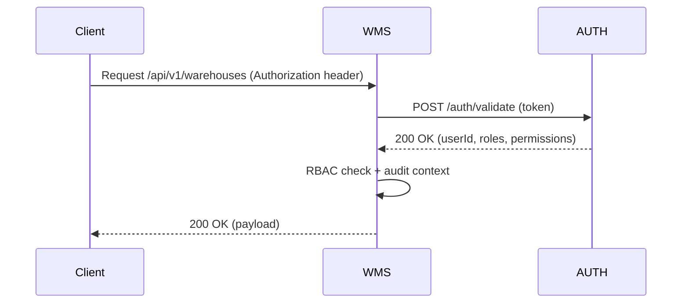
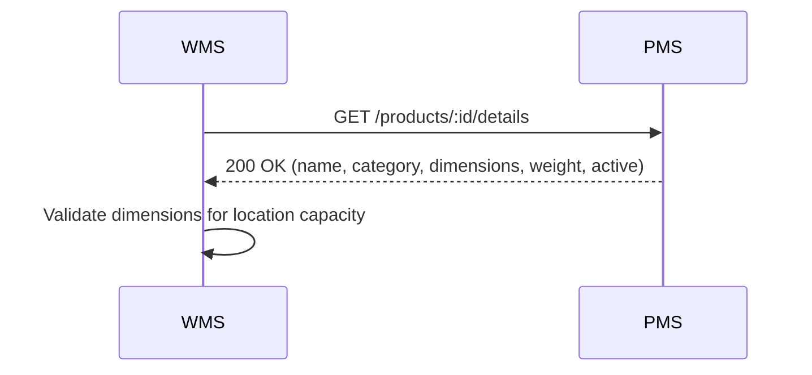
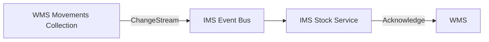
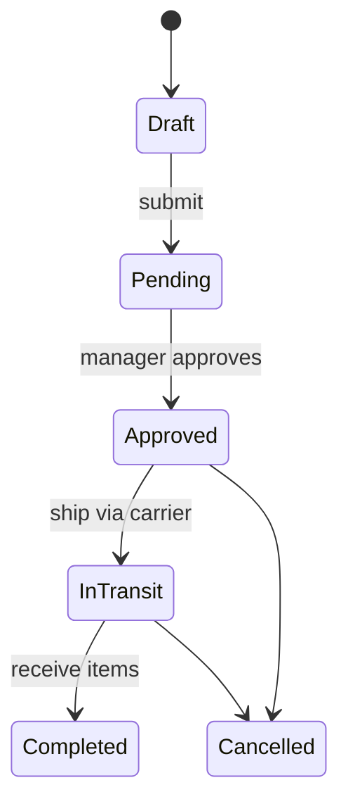
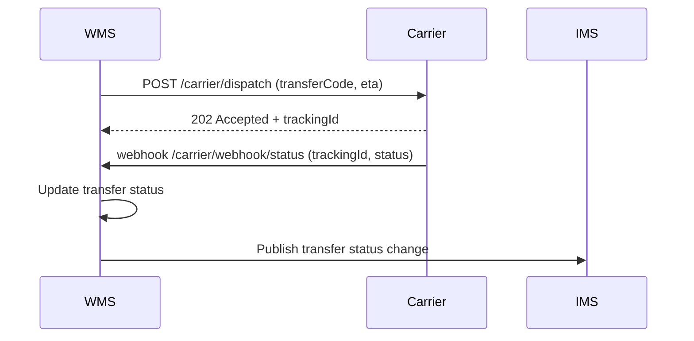

# WMS Service - Integration Flow Diagrams

## Document Information
- **Project**: WLAN Corporation - Warehouse & Inventory Management System
- **Module**: Warehouse Management System (WMS)
- **Version**: 1.0
- **Date**: January 7, 2026
- **Prepared For**: WLAN Corporation, Bengaluru

---

## 1. Overview

This document captures the WMS service’s integration flows with internal WLAN services (AUTH, IMS, PMS, SMS) and external carriers/clients. It illustrates request/response chains, async events, retry policies, and deployment-level observability.

### Key Integrations
1. **AUTH Service** – JWT validation, role resolution, approvals, and audit context.
2. **PMS (Product Management System)** – Product metadata lookup and dimension data.
3. **IMS (Inventory Management System)** – Global stock synchronization, stock reservations, and audit.
4. **SMS (Supplier Management System)** – Supplier contact lookup for receiving transfers.
5. **External Partners** – Carrier tracking APIs for transfer updates and reporting exports sent to BI/Finance BU.
6. **Infrastructure Services** – MongoDB Atlas, Redis cache, AWS SQS, ElasticSearch, Grafana, Datadog.

---

## 2. Authentication Flow

- JWT tokens issued by AUTH service (FastAPI + PostgreSQL) with 15-minute access windows and refresh via `/auth/refresh`.
- WMS caches tokens/role claims in Redis for 1 minute to reduce repeated Auth calls.
- RBAC enforcement is centralized in `security/permissions.py`.

---

## 3. Core Sync Flows

### 3.1 Product Metadata Lookup

- Used when recording movements/transfers to verify product existence, unit of measure, and hazardous flags.
- PMS is accessed synchronously via HTTP with 500ms timeout; fallback to cached product summary stored in Redis for 5 minutes.

### 3.2 Inventory Sync (IMS)

- Change streams push immutable movement records to AWS SQS via an adapter service (`events/movement_publisher.py`).
- IMS polls SQS with visibility timeout 60s; retries 3 times with exponential backoff on transient failures.
- IMS updates global stock ledger and publishes `inventory.updated` event consumed by WMS for capacity alerts.

### 3.3 Transfer Lifecycle (WMS ⇄ IMS ⇄ External Carriers)

- `transfers` collection state transitions trigger async notifications:
  - On `Approved`, WMS reserves stock (updates `locations`) and publishes `transfer.approved` event.
  - Carrier integration service listens for `transfer.shipped` events to push tracking using Carrier APIs (REST). Carrier responses update `transfers` status to `InTransit`.
  - On `Completed`, WMS logs inbound movements and publishes `transfer.completed` for IMS and BI exports.

---

## 4. Event & Webhook Patterns

### 4.1 WMS → IMS / BI Events

- **Topics**: `movement.recorded`, `transfer.shipped`, `transfer.completed`, `capacity.alert`
- **Transport**: AWS SNS→SQS fan-out; each topic has multiple subscribers (IMS, BI data lake, Reporting service).
- **Retries**: AWS Lambda subscriber handles exponential backoff (1m, 5m, 15m) and dead-letter queue (DLQ) for failed events.
- **Schema**: All events include `eventId`, `entity`, `timestamp`, `payload`, `traceId` (for distributed tracing).

### 4.2 External Carriers

- Webhook security: HMAC signature (`x-wlan-signature`) verified using shared secret.
- Carrier statuses mapped to `InTransit`, `Delayed`, `Delivered`, `Exception` inside WMS.

---

## 5. Reporting & Export Integrations

- Reporting service queries WMS via GraphQL endpoint `/graphql/reports` to compose dashboards (capacity, utilization, transfer lead times).
- Export tasks (`/reports/export`) push payloads to AWS S3 via async worker; completion triggers notification to reporting Slack channel via webhook.
- Data lake ingestion occurs nightly: WMS runs ETL job (Python/Prefect) that dumps sanitized collections (warehouses, movements, transfers) into S3, and Athena/Redshift schedules queries for BI.

---

## 6. Monitoring, Observability & Alerting

| Concern | Tooling | Flow |
|---------|---------|------|
| Logs | Datadog via structured JSON logs | FastAPI logs enriched with `traceId` and shipped via `datadog-agent` sidecar |
| Metrics | Prometheus + Grafana | Exported via `prometheus_client`; dashboards cover API latencies and queue depths |
| Tracing | AWS X-Ray | Incoming HTTP -> X-Ray segment; downstream HTTP/DB calls instrumented via `aws_xray_sdk` |
| Alerts | PagerDuty | Grafana alert rules (5xx spikes, queue backlog, capacity > 85%) trigger PagerDuty incidents |
| Health | `/health` endpoint | Returns `{database: ok, cache: ok, queue: ok}`; synthetic Canary hits every 5m via AWS CloudWatch Synthetics |

---

## 7. Security Envelope

1. **Transport** – TLS 1.3 enforces mutual TLS between WMS and IMS/PMS/SMS internal endpoints via AWS PrivateLink.
2. **Secrets** – Stored in AWS Secrets Manager; rotated every 30 days; retrieved at startup via IAM role `wms-service-role`.
3. **Network** – Service runs inside private ECS subnet; NAT gateway for outbound calls; DB access restricted to ECS security groups.
4. **Auditing** – Every change emits audit record into `warehouse_audit` collection and forwarded to Splunk for retention.

---

## Document End
**Previous Document**: [5-DB-Schema-Collections.md](./5-DB-Schema-Collections.md)  
**Module Progress**: WMS Documentation (6/6 documents)  
**Overall Progress**: 24/30 documents (80.0%)
