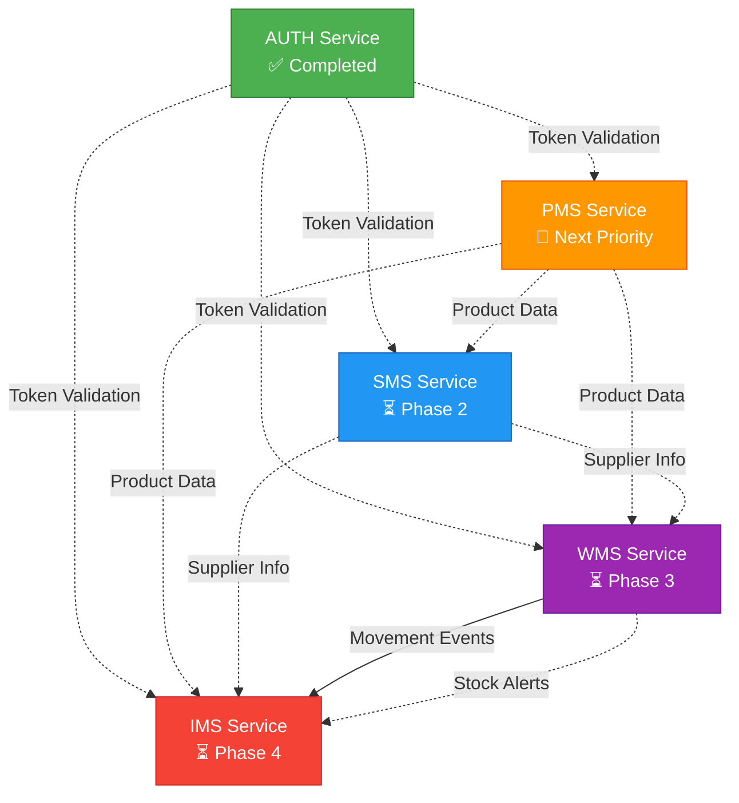

# WLAN Corporation - Service Implementation Dependencies

## Document Information
- **Project**: WLAN Corporation - Warehouse & Inventory Management System
- **Version**: 1.0
- **Date**: January 10, 2026
- **Status**: Implementation Roadmap

---

## 1. Implementation Status

| Service | Status | Progress | Documentation |
|---------|--------|----------|---------------|
| **AUTH** | ✅ Completed | 100% | 6/6 documents |
| **PMS** | 🔄 Next Priority | 0% | 6/6 documents |
| **SMS** | ⏳ Pending | 0% | 6/6 documents |
| **WMS** | ⏳ Pending | 0% | 6/6 documents |
| **IMS** | ⏳ Pending | 0% | 6/6 documents |

**Overall Documentation**: 30/30 documents (100%)  
**Overall Implementation**: 1/5 services (20%)

---

## 2. Service Dependency Graph



**Legend**:
- Solid arrows (→): Hard dependency (required data flow)
- Dashed arrows (-.->): Soft dependency (optional/validation only)

---

## 3. Recommended Implementation Order

### Phase 1: PMS (Product Management System) - **CURRENT PRIORITY**

**Why First?**
- Foundation service for product catalog
- Minimal dependencies (only AUTH for validation)
- Required by all downstream services

**Key Features**:
- Product catalog management (categories, sub-categories, products)
- SKU generation and management
- QR code and barcode generation
- Product lifecycle management (active/inactive)

**Dependencies**:
- ✅ AUTH service (for JWT validation)

**Blocks**:
- SMS (supplier-product linking)
- WMS (product validation in movements)
- IMS (stock levels tied to products)

**Estimated Effort**: 2-3 weeks

---

### Phase 2: SMS (Supplier Management System)

**Why Second?**
- Manages supplier-product relationships
- Extends PMS functionality
- Independent of warehouse operations

**Key Features**:
- Supplier registration and management
- Supplier contact management
- Supplier-product relationship tracking
- Supplier performance metrics

**Dependencies**:
- ✅ AUTH service (for JWT validation)
- 🔄 PMS service (for product validation)

**Blocks**:
- None (optional for WMS/IMS)

**Estimated Effort**: 2 weeks

---

### Phase 3: WMS (Warehouse Management System)

**Why Third?**
- Manages physical warehouse operations
- Generates movement events for IMS
- Requires product data from PMS

**Key Features**:
- Warehouse and location management
- Stock movement tracking
- Transfer workflows
- Capacity management

**Dependencies**:
- ✅ AUTH service (for JWT validation)
- 🔄 PMS service (for product validation)
- ⏳ SMS service (optional, for supplier info)

**Blocks**:
- IMS (movement events required)

**Estimated Effort**: 3-4 weeks

---

### Phase 4: IMS (Inventory Management System)

**Why Last?**
- Aggregates data from WMS and PMS
- Central ledger for stock levels
- Most complex integration requirements

**Key Features**:
- Global stock level management
- Stock reservations
- Movement reconciliation
- Audit trail and reporting

**Dependencies**:
- ✅ AUTH service (for JWT validation)
- 🔄 PMS service (for product metadata)
- ⏳ WMS service (for movement events)
- ⏳ SMS service (optional, for supplier context)

**Blocks**:
- None (final service in chain)

**Estimated Effort**: 3-4 weeks

---

## 4. Integration Checkpoints

### After PMS Implementation
- [ ] Verify product CRUD operations
- [ ] Test category/sub-category hierarchy
- [ ] Validate SKU generation
- [ ] Test QR/Barcode generation
- [ ] Integration test with AUTH (token validation)
- [ ] API documentation complete

### After SMS Implementation
- [ ] Verify supplier CRUD operations
- [ ] Test supplier-product linking
- [ ] Validate contact management
- [ ] Integration test with PMS (product validation)
- [ ] API documentation complete

### After WMS Implementation
- [ ] Verify warehouse/location management
- [ ] Test movement recording
- [ ] Validate transfer workflows
- [ ] Integration test with PMS (product validation)
- [ ] Test capacity calculations
- [ ] API documentation complete

### After IMS Implementation
- [ ] Verify stock level aggregation
- [ ] Test reservation system
- [ ] Validate movement reconciliation
- [ ] Integration test with WMS (event processing)
- [ ] Integration test with PMS (product metadata)
- [ ] Test audit trail
- [ ] API documentation complete
- [ ] **End-to-End System Test**

---

## 5. Documentation Reference

### AUTH Service (✅ Completed)
| # | Document | Location |
|---|----------|----------|
| 1 | Architecture Diagram | `Back-End/Docs/AUTH/1-Architecture-Diagram.md` |
| 2 | ER Diagram | `Back-End/Docs/AUTH/2-ER-Diagram.md` |
| 3 | User Stories & Use Cases | `Back-End/Docs/AUTH/3-User-Stories-Use-Cases.md` |
| 4 | API Endpoint Specifications | `Back-End/Docs/AUTH/4-API-Endpoint-Specifications.md` |
| 5 | DB Schema & Collections | `Back-End/Docs/AUTH/5-DB-Schema-Collections.md` |
| 6 | Authentication Flow Diagrams | `Back-End/Docs/AUTH/6-Authentication-Flow-Diagrams.md` |

### PMS Service (🔄 Next Priority)
| # | Document | Location |
|---|----------|----------|
| 1 | Architecture Diagram | `Back-End/Docs/PMS/1-Architecture-Diagram.md` |
| 2 | ER Diagram | `Back-End/Docs/PMS/2-ER-Diagram.md` |
| 3 | User Stories & Use Cases | `Back-End/Docs/PMS/3-User-Stories-Use-Cases.md` |
| 4 | API Endpoint Specifications | `Back-End/Docs/PMS/4-API-Endpoint-Specifications.md` |
| 5 | DB Schema & Collections | `Back-End/Docs/PMS/5-DB-Schema-Collections.md` |
| 6 | Integration Flow Diagrams | `Back-End/Docs/PMS/6-Integration-Flow-Diagrams.md` |

### SMS Service (⏳ Phase 2)
| # | Document | Location |
|---|----------|----------|
| 1 | Architecture Diagram | `Back-End/Docs/SMS/1-Architecture-Diagram.md` |
| 2 | ER Diagram | `Back-End/Docs/SMS/2-ER-Diagram.md` |
| 3 | User Stories & Use Cases | `Back-End/Docs/SMS/3-User-Stories-Use-Cases.md` |
| 4 | API Endpoint Specifications | `Back-End/Docs/SMS/4-API-Endpoint-Specifications.md` |
| 5 | DB Schema & Collections | `Back-End/Docs/SMS/5-DB-Schema-Collections.md` |
| 6 | Integration Flow Diagrams | `Back-End/Docs/SMS/6-Integration-Flow-Diagrams.md` |

### WMS Service (⏳ Phase 3)
| # | Document | Location |
|---|----------|----------|
| 1 | Architecture Diagram | `Back-End/Docs/WMS/1-Architecture-Diagram.md` |
| 2 | ER Diagram | `Back-End/Docs/WMS/2-ER-Diagram.md` |
| 3 | User Stories & Use Cases | `Back-End/Docs/WMS/3-User-Stories-Use-Cases.md` |
| 4 | API Endpoint Specifications | `Back-End/Docs/WMS/4-API-Endpoint-Specifications.md` |
| 5 | DB Schema & Collections | `Back-End/Docs/WMS/5-DB-Schema-Collections.md` |
| 6 | Integration Flow Diagrams | `Back-End/Docs/WMS/6-Integration-Flow-Diagrams.md` |

### IMS Service (⏳ Phase 4)
| # | Document | Location |
|---|----------|----------|
| 1 | Architecture Diagram | `Back-End/Docs/IMS/1-Architecture-Diagram.md` |
| 2 | ER Diagram | `Back-End/Docs/IMS/2-ER-Diagram.md` |
| 3 | User Stories & Use Cases | `Back-End/Docs/IMS/3-User-Stories-Use-Cases.md` |
| 4 | API Endpoint Specifications | `Back-End/Docs/IMS/4-API-Endpoint-Specifications.md` |
| 5 | DB Schema & Collections | `Back-End/Docs/IMS/5-DB-Schema-Collections.md` |
| 6 | Integration Flow Diagrams | `Back-End/Docs/IMS/6-Integration-Flow-Diagrams.md` |

---

## 6. Technology Stack (Consistent Across Services)

### PMS, SMS, WMS, IMS
- **Runtime**: Python 3.10+
- **Framework**: FastAPI 0.104+
- **Server**: Uvicorn 0.24+ with Gunicorn
- **Database**: MongoDB 6.x
- **ODM**: Motor 3.3+ (async)
- **Cache**: Redis 7+
- **Validation**: Pydantic 2.5+

### AUTH (Already Implemented)
- **Runtime**: Node.js 18+ LTS
- **Framework**: Express.js 4.x
- **Database**: MongoDB 6.x
- **ODM**: Mongoose 8.x
- **Authentication**: jsonwebtoken 9.x
- **Password**: bcryptjs 2.x

---

## 7. Deployment Ports

| Service | Port | Status |
|---------|------|--------|
| AUTH | 5001 | ✅ Running |
| PMS | 5002 | ⏳ Next |
| SMS | 5003 | ⏳ Pending |
| WMS | 5004 | ⏳ Pending |
| IMS | 5005 | ⏳ Pending |

---

## 8. Database Organization

| Service | Database Name | Status |
|---------|---------------|--------|
| AUTH | `auth_db` | ✅ Active |
| PMS | `pms_db` | ⏳ To Create |
| SMS | `sms_db` | ⏳ To Create |
| WMS | `wms_db` | ⏳ To Create |
| IMS | `ims_db` | ⏳ To Create |

---

## 9. Next Steps (Immediate)

### 1. Review PMS Documentation
- Read all 6 PMS documents in `Back-End/Docs/PMS/`
- Understand data models and API contracts
- Review integration points with AUTH

### 2. Set Up PMS Project Structure
```
Back-End/PMS/
├── app/
│   ├── main.py
│   ├── config.py
│   ├── routes/
│   ├── services/
│   ├── repositories/
│   ├── models/
│   └── utils/
├── tests/
├── .env.example
├── requirements.txt
└── README.md
```

### 3. Initialize Development Environment
- Create `pms_db` MongoDB database
- Set up Redis instance
- Configure environment variables
- Install Python dependencies

### 4. Implement Core Features (Priority Order)
1. Category management
2. Sub-category management
3. Product management
4. SKU generation
5. QR/Barcode generation
6. AUTH integration (token validation)

### 5. Testing Strategy
- Unit tests for business logic
- Integration tests with AUTH
- API endpoint tests
- Database schema validation

---

## Document End
**Created**: January 10, 2026  
**Last Updated**: January 10, 2026  
**Next Review**: After PMS implementation completion
